# 第七章：数据共享的合作

> 数据共享是加速数字转型的业务必需品。
> 
> [Gartner](https://oreil.ly/wmkIV)

*数据共享*是为内部和外部利益相关者提供信息访问的能力，他们无法在自己的数据系统中访问。数据共享允许利益相关者访问生产者领域中产生或收集并存储的数据，并共同合作实现共享的业务目标和优先事项。数据组织正在从单一的大型单体部门转变为小型分布式团队，这通常导致数据平台运行缓慢，以创建模块化快速移动的数据产品。

通过构建强大的数据共享架构，数据和分析领导者将能够在适当的时间访问正确的数据，以实现有意义的业务成果。像国家卫生研究院（NIH）这样的组织已经实施了[数据管理和共享政策](https://oreil.ly/KWuJI)，以确立数据共享是研究过程的基本组成部分，以最大化公众对研究结果的访问。

数据共享鼓励我们利用当前信息和资源，并根据这些信息采取行动。公司越早开始共享数据并将其用于决策，就越有时间交付业务成果。

“数据是新石油”的说法最初由英国数学家和数据科学企业家 Clive Humby 创造，这在过去二十年中被证明是正确的。数据驱动业务决策，支持研究并推动技术发展。组织正在比以往任何时候都更多地收集和存储数据。但随着数据的丰富，如何有效地共享和协作成为了挑战。

在本章中，您将学习如何使用 Amazon Redshift 共享和协作大量数据。我们将从提供“Amazon Redshift 数据共享概述”开始，并描述不同的“数据共享使用案例”。接下来，我们将深入探讨使用 Amazon Redshift 的“数据共享关键概念”，并逐步介绍如何“使用数据共享”。我们将探讨使用跨账户数据共享的“跨账户和跨区域共享数据”的选项，并展示在“使用多租户存储模式进行分析服务用例”中使用 Amazon Redshift 数据共享的不同选项。接下来，我们将讨论如何启用“AWS ADX 集成的外部数据共享”以从您的数据中赚钱，并使用其 Amazon Redshift 计算为客户提供即时数据访问。最后，我们将简要介绍如何通过“从数据湖查询和卸载到数据湖”作为数据共享的机制。最后，我们将介绍如何使用“Amazon DataZone 来发现和共享数据”来对数据分享进行目录化和管理访问权限。

# Amazon Redshift 数据共享概述

Amazon Redshift 数据共享无需复制或移动数据即可实现跨数据仓库的即时、细粒度和实时数据访问。这使您能够创建多仓库架构，并为各种工作负载的每个数据仓库进行扩展。Amazon Redshift 数据共享包含在您的无服务器或 RA3 预配的数据仓库中，并提供以下功能：

+   所有消费者之间的数据的实时和事务一致视图

+   安全和受管制的组织内及组织间协作

+   与外部方共享数据以从中获利

数据仓库中的实时访问和事务一致视图确保用户始终看到最新和一致的信息，因为数据仓库中的更新信息已更新。您可以安全地与同一区域或跨区域的同一 AWS 帐户或不同 AWS 帐户的 Amazon Redshift 数据仓库共享数据。在构建用于分析的可扩展架构时，您需要考虑查询和摄入工作负载的性能、弹性和性能价格比，以满足动态工作负载的要求。Amazon Redshift 数据共享功能提供了另一种机制来扩展并满足各种工作负载的需求。

Amazon Redshift RA3 架构支持数据共享功能。在 RA3 架构中，存储在 Amazon RMS 中的数据提交到 Amazon S3，但也可在固态驱动器（SSD）本地缓存中供计算节点快速处理最近使用的数据。来自消费者数据仓库的查询直接从 Amazon RMS 层读取数据。因此，生产者数据仓库的性能不受影响，访问共享数据的工作负载彼此隔离。该架构显示在图 7-1 中，它使您能够设置一个多仓库架构，具有为不同类型的工作负载分别设置的消费者数据仓库。您可以按需自助方式提供符合工作负载特定价格性能要求的灵活计算资源，并进行独立扩展。

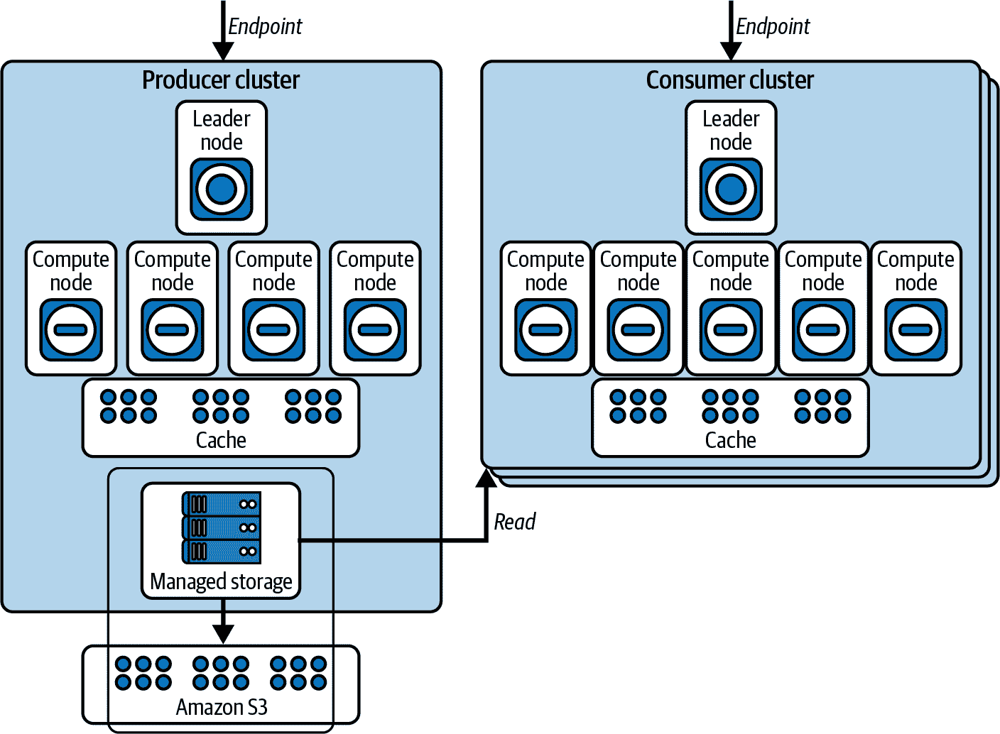

###### 图 7-1\. Amazon Redshift 数据共享架构

由于 DC2 节点不利用 Redshift Managed Storage（RMS），因此 Amazon Redshift 数据共享在 DC2 节点类型上不可用。有关如何利用数据共享的详细信息，请参阅[升级到 RA3 节点类型文档](https://oreil.ly/rc-ms)或[迁移到 Amazon Redshift 无服务器文档](https://oreil.ly/9eZSf)。

# 数据共享用例

根据[Gartner](https://oreil.ly/1WsD6)的数据，“与不共享数据的数据和分析领导者相比，外部共享数据的领导者产生的经济效益是后者的三倍。” 数据共享已被证明具有可衡量的经济效益，有数据共享战略的组织表现优于同行。数据共享的用例范围从帮助增强可伸缩性（通过工作负载分离），增加协作，构建 Analytics as a Service（AaaS）解决方案，改善操作效率，数据质量，以及普遍提高数据访问。让我们更详细地看看这些用例：

工作负载分离

当你有大量的 ETL 工作负载时，可以通过多仓库架构将 ETL 工作负载与查询工作负载分离，通过使用一个数据仓库用于数据摄入，另一个数据仓库用于查询来进行扩展。每个仓库可以针对其预期工作负载进行调优和优化。

跨团队协作

公司内不同部门可以共享和访问数据，从而实现更高效和更有效的决策。例如，市场团队可以使用存储在 Amazon Redshift 中的数据更好地定位他们的活动，而财务团队可以使用相同的数据来预测收入。即使跨部门共享数据，但仍然隔离工作负载以使用自己的计算资源，以确保每个团队的处理需求不会相互冲突。参见图 7-2 作为示例。

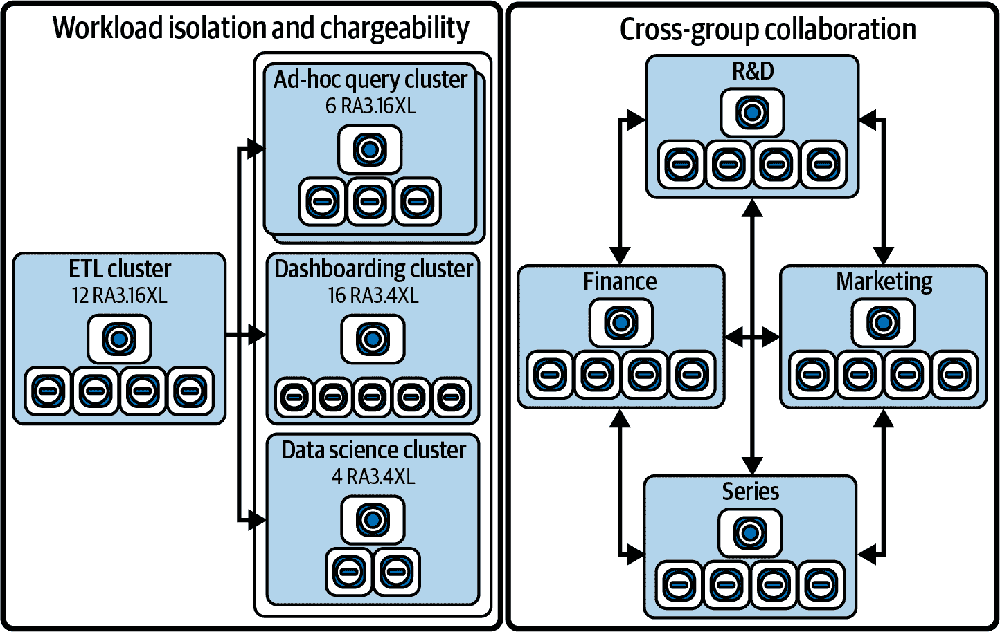

###### 图 7-2\. 数据共享用例工作负载分离和协作

分析即服务

AaaS 提供商可以从各种来源（如社交媒体、网络分析和 ERP 系统）收集和聚合数据到数据仓库，并在与订阅者分享之前添加业务洞察转换。例如，使用在第三章，“设置您的数据模型和数据摄入”中定义的学生数据模型，教育技术 AaaS 提供商可以收集有关学生出勤和成绩的数据，并派生出如何改善学生成绩的见解。然后，他们可以使用订阅模型使用[AWS 数据交换（ADX）集成](https://oreil.ly/_FDWr)与教育机构分享这些见解，并通过他们的事务系统已经收集的数据进行货币化。数据的生产者还可以使用[AWS Clean Rooms](https://aws.amazon.com/clean-rooms)与合作伙伴或其他 AWS 用户协作，而不必共享原始数据。

改进软件开发生命周期（SDLC）的灵活性

在应用程序开发生命周期中，大多数组织在 DevOps 领域中没有足够的测试数据而感到困惑。通过数据共享，您可以将生产系统的数据分享到开发系统，通过验证所有测试用例来提高测试质量，并加快应用程序的交付速度。如果您在将生产数据分享到其他环境时有特定的安全策略，您还可以使用[动态数据脱敏（DDM）](https://oreil.ly/h9mGq)功能在 Amazon Redshift 中屏蔽特定的个人身份信息（PII）数据。有关示例，请参见图 7-3。

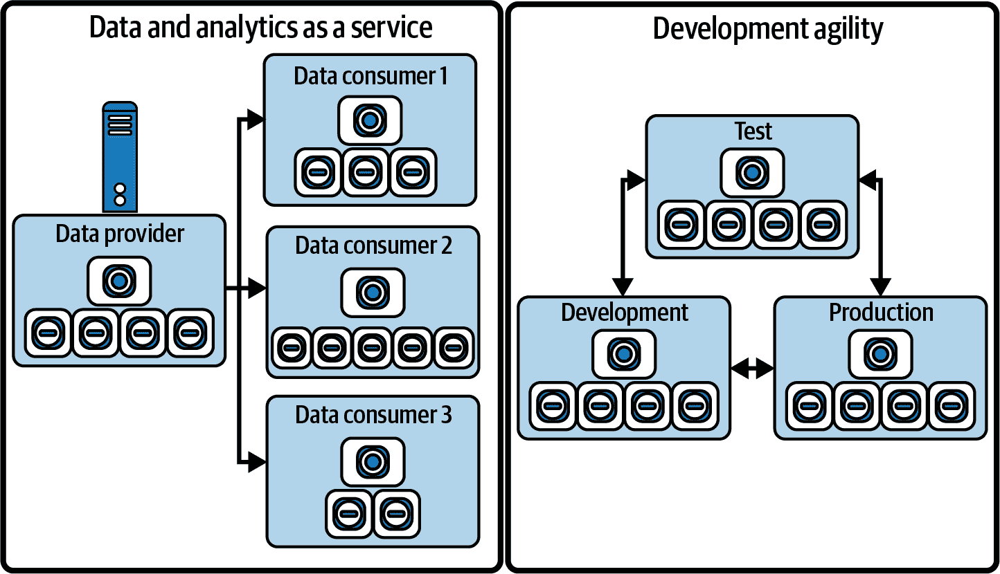

###### 图 7-3\. 数据共享用例分析即服务和开发灵活性

# 数据共享的关键概念

*数据共享*是在 Amazon Redshift 中共享数据的单位（请参见图 7-5）。数据所有者可以将数据库对象添加到数据共享中以与订阅者共享。数据共享充当容器，用于保存对其他数据库对象的引用。生成和共享数据的数据所有者称为*生产者*，订阅者称为*消费者*。Amazon Redshift 允许您设置访问控制和权限，确保敏感数据仅与授权人员共享。在与外部合作伙伴或其他具有严格数据治理和安全要求的 AWS 用户分享数据时，这一点尤为重要。每个数据共享都与您 Amazon Redshift 数据仓库中特定的数据库相关联。

数据生产者是拥有数据并从中共享数据的亚马逊 Redshift 数据仓库。生产者数据仓库管理员和数据库所有者可以使用 `CREATE DATASHARE` 命令创建数据共享。您可以向生产者的数据共享添加数据库对象，例如模式、表、视图和 SQL UDFs，以便与消费者共享。共享数据的亚马逊 Redshift 数据仓库可以位于相同的 AWS 账户中，也可以位于不同的 AWS 账户或 AWS 区域中，因此您可以跨组织共享数据并与其他方进行协作。

数据消费者是接收来自生产者数据仓库的数据共享的亚马逊 Redshift 数据仓库。当生产者授予数据共享访问权限给消费者时，消费者数据仓库管理员可以创建一个引用数据共享的数据库。请注意，这个数据库是对数据共享的引用，而不是消费者端的物理持久存储。然后管理员为数据库中的用户和组分配权限。授予权限后，用户和组可以使用三部分标记 `database.schema.object` 查询数据共享对象。授权用户还可以使用标准元数据查询列出共享对象并跟踪使用情况。对于跨账户数据共享，生产者需要额外的步骤来授权数据共享，而消费者需要将一个或多个亚马逊 Redshift 数据仓库与数据共享关联起来。

命名空间是标识亚马逊 Redshift 预配置或无服务器数据仓库的标识符。命名空间的全局唯一标识符（GUID）会自动创建并分配给您的亚马逊 Redshift 数据仓库。预配置的命名空间 Amazon 资源名称（ARN）格式为 `arn:{partition}:redshift:{region}:{account-id}:namespace:{namespace-guid}`，无服务器的为 `arn:{partition}:redshift-serverless:{region}:{account-id}:namespace:{namespace-guid}`。您可以在亚马逊 Redshift 控制台的一般信息页面上查看数据仓库的命名空间详细信息（参见 图 7-4）。

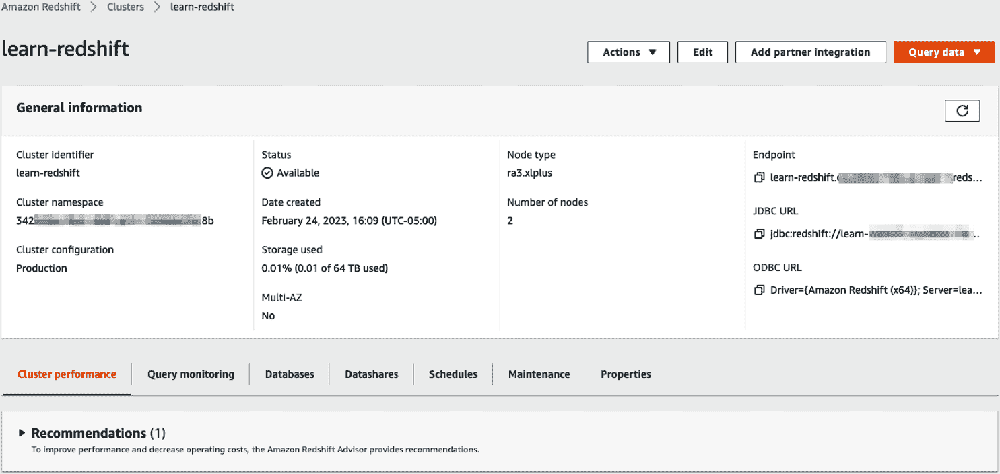

###### 图 7-4\. 数据共享命名空间

在数据共享工作流程中，命名空间 GUID 值和命名空间 ARN 用于与 AWS 账户中的其他亚马逊 Redshift 数据仓库共享数据。您还可以使用 `current_namespace` 函数查找当前数据仓库的命名空间。对于跨账户数据共享，AWS 账户可以作为数据共享的消费者，并分别由 12 位 AWS 账户 ID 表示。消费者账户可以将一个或多个亚马逊 Redshift 数据仓库与数据共享关联，以读取该数据。

使用 Amazon Redshift，您可以通过不同级别的数据库对象共享数据，并且您可以为给定数据库创建多个数据共享。数据共享可以包含创建共享的数据库中多个模式的对象。但是，您只能向消费者共享数据共享对象，而不能共享单个对象。通过这种数据共享的灵活性，您可以获得细粒度的访问控制。您可以为需要访问 Amazon Redshift 数据的不同用户和企业定制此控制。例如，您可能希望仅向学校管理员共享特定学校的学生详细信息。在企业中，您可能希望控制向供应商共享对应供应的销售详细信息（图 7-5）。


###### 图 7-5\. 数据共享的关键概念及其工作原理

# 如何使用数据共享

要使用数据共享，首先确定要共享的数据以及具有相关数据的相应模式、表和视图。要共享数据，请创建 `DATASHARE` 元数据对象，并将数据库对象（包括模式、表和视图）添加到此数据共享中。然后，向同一账户内的其他命名空间或另一个 AWS 账户授予访问权限。让我们看一个具体的例子，并走过整个过程。

## 在同一账户内共享数据

让我们使用来自 示例 3-1 的学生学习数据集来理解如何共享数据。本节展示了如何在同一账户内向组织内的消费者共享学生学习数据集。您可以使用控制台或 SQL 脚本来创建和共享数据共享。示例 7-1 和 7-2 中的以下脚本为您提供了操作步骤。

##### 示例 7-1\. 创建数据共享

```
-- Creating a datashare (producer)
CREATE DATASHARE learnshare SET PUBLICACCESSIBLE TRUE;
```

在上述语句中，`learnshare` 是数据共享的名称。数据共享名称在命名空间中必须是唯一的。`SET PUBLICACCESSIBLE` 是一个子句，用于指定数据共享是否可以共享给公共访问的数据仓库。`SET PUBLICACCESSIBLE` 的默认值为 `FALSE`。

##### 示例 7-2\. 向数据共享添加对象

```
-- Add schema to datashare
ALTER DATASHARE learnshare
  ADD SCHEMA openlearn;

-- Add openlearn materialized view to datshares.
ALTER DATASHARE learnshare
  ADD TABLE openlearnm.mv_student_lmsactivities_and_score;

-- View shared objects
SHOW DATASHARES;
SELECT * FROM SVV_DATASHARE_OBJECTS;
```

| share_name | share_owner | source_database | consumer_database | share_type | createdate |
| --- | --- | --- | --- | --- | --- |
| learnshare_adx | 100 | dev | null | OUTBOUND | 2023-03-18 19:51:28 |
| learnshare | 100 | dev | null | OUTBOUND | 2023-02-24 18:32:28 |
| is_publicaccessible | share_acl | producer_account | producer_namespace |
| --- | --- | --- | --- |
| true | null | <awsaccount> | xxxxc8ee-f6a5-xxxx-xxxx-yyyy66d7zzzz |
| true | null | <awsaccount> | xxxxc7ee-xxxx-468f-xxxx-yyyy77d7zzzz |

要添加模式中的所有表，请使用以下语法：

```
ALTER DATASHARE learnshare ADD ALL TABLES IN SCHEMA openlearn;
```

要获取消费者的命名空间，您可以登录到消费者的 Amazon Redshift 数据仓库，并运行 示例 7-3 中的 SQL 来选择 `current_namespace`，或者您可以从控制台获取。

##### 示例 7-3\. 查看当前用户和命名空间。

```
SELECT user, current_namespace;
```

现在，通过您的数据仓库的命名空间 `<<consumer namespace>>`，您可以使用 `GRANT` 命令向消费者授予从生产者到消费者的数据共享权限，如 示例 7-4 所示。

##### 示例 7-4\. 授予对数据共享的访问权限。

```
GRANT USAGE ON DATASHARE learnshare TO NAMESPACE '<<consumer namespace>>';
```

在消费者端，创建一个数据库，引用生产者或无服务器数据仓库上的数据共享。请注意，这个数据库只是指向数据共享的指针，并不保存任何数据。创建数据库后，您可以像在 示例 7-5 中展示的那样，使用 `db_name.schema.view` 的三部分表示法实时查询数据。

##### 示例 7-5\. 从远程数据共享创建本地数据库。

```
CREATE DATABASE openlearn_db
FROM DATASHARE learnshare
OF NAMESPACE '<producer_namespace>';

SELECT school_id, code_module, code_presentation,
  final_result, sum(sum_of_clicks)
FROM  openlearn_db.openlearnm.mv_student_lmsactivities_and_score
GROUP BY 1,2,3,4
ORDER BY 1,2,3,4;
```

可选地，您可以在消费者数据仓库中创建一个外部模式，指向生产者数据仓库中的模式。在消费者数据仓库中创建本地外部模式允许在消费者数据仓库内进行模式级访问控制，并允许您在引用共享数据对象时使用两部分表示法（`localschema.table` 与 `external_db.producerschema.table`），如 示例 7-6 所示。

##### 示例 7-6\. 从本地数据库创建外部模式。

```
CREATE EXTERNAL SCHEMA openlearn_schema
FROM REDSHIFT DATABASE 'openlearn_db' SCHEMA 'openlearn';

SELECT school_id, code_module, code_presentation,
  final_result, sum(sum_of_clicks)
FROM  openlearn_schema.mv_student_lmsactivities_and_score
GROUP BY 1,2,3,4
ORDER BY 1,2,3,4;
```

## 使用跨账户数据共享跨账户共享数据。

除了内部数据共享以打破组织内的数据孤岛外，您还可以使用跨账户数据共享功能安全地向外部组织共享数据。以下是一些常见的使用案例：

+   子公司向其母公司报告财务报表。

+   企业组织或政府机构与另一组织或相关机构共享数据。

+   AaaS（作为服务提供者）向其订阅者共享数据。

+   医疗组织与政府机构共享数据。

当您跨账户共享数据时，您将创建一个 `datashare` 对象，并添加您想要共享的数据库对象，类似于在账户内共享。但是在这里，您将授予消费者 AWS 账户访问该数据共享的权限，如 示例 7-7 所示。在消费者端，管理员可以关联一个或多个数据仓库以能够读取数据共享。

Amazon Redshift 支持具有同质加密配置的数据仓库数据共享。换句话说，您可以在两个或多个加密的 Amazon Redshift 数据仓库之间共享数据。或者，您可以在相同 AWS 账户内的两个或多个未加密的 Amazon Redshift 数据仓库之间共享数据。在加密数据仓库之间共享数据时，您可以为每个数据仓库使用不同的加密密钥。对于跨账户和跨区域的数据共享，生产者和消费者数据仓库必须都加密。

##### 示例 7-7\. 授权 AWS 账户访问数据共享

```
-- Granting access to consumer AWS Account
GRANT USAGE ON DATASHARE learnshare TO ACCOUNT <AWS_Account>;
```

对于跨账户共享，还需要额外的授权步骤，以便消费者账户能够看到数据共享。此过程允许管理者或数据所有者批准数据共享，如图 7-6 所示。一旦授权完成，数据共享将对消费者账户可见。

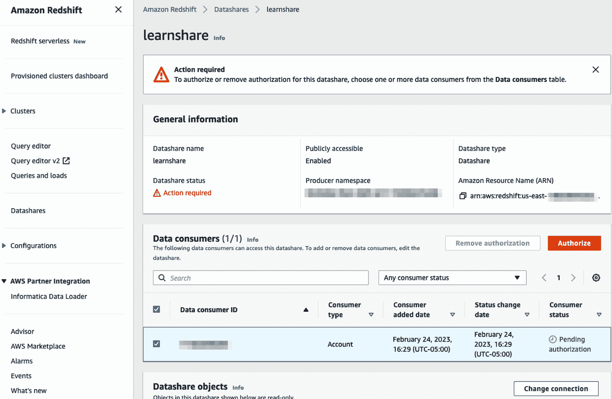

###### 图 7-6\. 跨账户数据共享的授权步骤

用户可以在不同账户和区域的多个 Amazon Redshift 数据仓库中管理多个数据共享。要集中管理所有账户中的所有数据共享，可以建立一个自定义的 Web 界面，并指定所有者或管理员来授权或关联数据共享。要自动化授权和关联过程，还可以使用 CLI 命令[`authorize-data-share`](https://oreil.ly/pduVL)和[`associate-data-share-consumer`](https://oreil.ly/TDvF8)。

在消费者端，您可以将一个或多个 Amazon Redshift 数据仓库与数据共享关联起来。请注意，当您选择数据共享菜单选项时，数据共享将显示在“来自其他账户”选项卡中。您可以选择数据共享，然后点击“关联”按钮将消费者关联到数据共享，如图 7-7 所示。

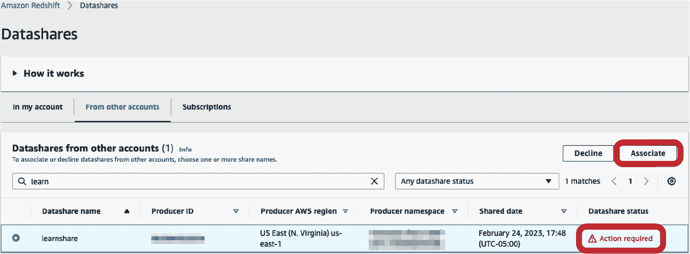

###### 图 7-7\. 将消费者数据仓库关联到生产者数据共享

一旦您将消费者数据仓库关联到数据共享，您可以登录到关联的消费者数据仓库，并只需几个步骤即可查询数据共享中对象的数据。首先，创建到数据共享的数据库引用，然后使用`db_name.schema.table`的三部分表示法，如示例 7-8 中的 SQL 脚本所示。

##### 示例 7-8\. 从远程数据共享创建本地数据库

```
CREATE DATABASE openlearn_db
FROM DATASHARE learnshare
OF ACCOUNT '<<producer_account>>' NAMESPACE '<<producer_namespace>>';

SELECT * FROM learn_db.learnshare. mv_student_lmsactivities_and_score;
```

当此查询从消费者传递给生产者时，`current_namespace`变量将具有此消费者的命名空间。因此，材料化视图将根据学校表的连接条件仅从此消费者过滤记录。正如前面讨论的，您可以创建一个外部模式来使用两部分符号表示法引用共享数据对象（例如`external_schema.table`），而不是三部分符号表示法（`external_db.producer_schema.table`）。

有关设置跨 AWS 账户数据共享的详细步骤，请参阅[跨 AWS 账户共享数据](https://oreil.ly/Uk_sp)的文档。

# 多租户存储模式的分析即服务用例

AaaS 提供商在云中为用户提供基于订阅的分析能力。这些服务提供商通常需要存储多个用户的数据，并安全地为其提供分析服务的订阅者访问权限。采用多租户存储策略可以帮助它们构建成本效益高且能够根据需求进行扩展的架构。多租户意味着一个软件实例及其支持基础设施被共享以服务多个用户。例如，软件服务提供商可以生成存储在单个数据仓库中的数据，但可以安全地被多个用户访问。这种存储策略提供了集中管理数据、简化 ETL 流程和优化成本的机会。没有数据共享，服务提供商很难在多租户环境中找到平衡，因为他们需要在成本和提供更好的用户体验之间权衡。

## 使用数据共享来扩展您的多租户架构

以前，实施多租户架构的 AaaS 提供商受限于单个数据仓库的资源，以满足所有租户跨计算和并发需求。随着租户数量的增加，您可以选择开启并发缩放或创建额外的数据仓库。然而，增加新的数据仓库意味着额外的数据摄取管道和增加的运营开销。

通过[Amazon Redshift 中的数据共享](https://oreil.ly/5SXnv)，您可以在简化存储和 ETL 管道的同时满足成本管理和提供一致性性能的双重目标。您可以将数据摄取到指定为生产者的数据仓库，并与一个或多个消费者共享这些实时数据。生产者中摄取的数据与一个或多个消费者共享，从而允许 ETL 和 BI 工作负载的完全分离。访问此共享数据的集群彼此隔离，因此生产者的性能不会受到消费者工作负载的影响。这使得消费者可以根据其各自的计算能力获得一致的性能。

几个消费者可以从生产者的托管存储中读取数据。这使得可以即时、细粒度和高性能地访问数据，无需复制或移动。访问共享数据的工作负载彼此隔离，也与生产者隔离。您可以将工作负载分布在多个数据仓库中，同时简化和整合 ETL 摄取管道到一个主要的生产者数据仓库，提供最佳的性价比。

消费者数据仓库可以反过来成为其拥有的数据集的生产者。您可以通过在同一个消费者上共享多个租户来进一步优化成本。例如，您可以将低容量第三层租户组合到一个单一的消费者中，以提供更低成本的服务，而高容量第一层租户则有他们自己独立的计算数据仓库。消费者数据仓库可以在与生产者相同的账户中创建，也可以在不同的 AWS 账户中创建。通过这种方式，您可以对消费者进行[单独计费](https://oreil.ly/kY718)，可以向使用消费者的业务组收费，甚至允许用户在其账户中使用自己的 Amazon Redshift 数据仓库，这样他们就可以为使用消费者数据仓库的费用付费。图 7-8 展示了在使用数据共享的多租户架构中 ETL 和消费者访问模式与不使用数据共享的单一数据仓库方法之间的差异。

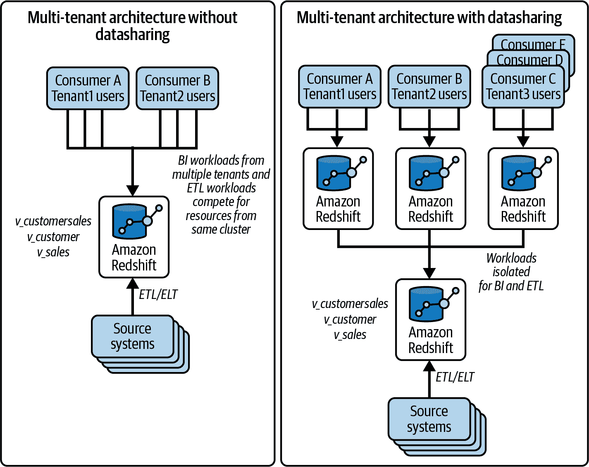

###### 图 7-8\. 使用数据共享的多租户架构与单一数据仓库方法的比较

## 使用数据共享的多租户存储模式

在*多租户*策略中，数据存储在所有租户共享的位置，从而简化 ETL 摄取管道和数据管理。有几种存储策略支持这种多租户访问模式，如图 7-9 所示。

池模型

数据存储在所有租户的单个数据库模式中，新列（tenant_id）用于限定和控制对各个租户数据的访问。对多租户数据的访问是通过建立在表上的视图进行控制的。

桥接模型

对于每个租户的数据的存储和访问是在同一数据库中的单独模式中维护的。

独立模型

对于每个租户的数据的存储和访问控制是在单独的数据库中维护的。

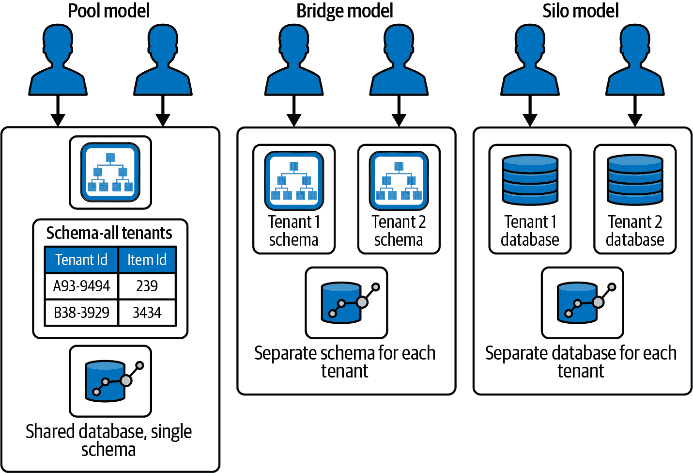

###### 图 7-9\. 多租户存储模式

我们将使用学生分析数据模型来演示利用数据共享实施可扩展的多租户架构的多种策略。我们将详细介绍每种策略涉及的步骤，使用我们在第三章，“设置数据模型和导入数据”中创建的数据模型。在此用例中，生产者是 AaaS 提供商，负责在一个 Amazon Redshift 数据仓库中加载和处理数据。消费者（租户）是订阅了学生洞察数据集的学校，在一个或多个 Amazon Redshift 数据仓库中。

实施跨数据仓库启用数据共享的高级步骤如下：

1.  在生产者中创建数据共享并将数据库对象分配给数据共享。

1.  从生产者那里，授予消费者对数据共享的使用权，通过命名空间或 AWS 账户来识别。

1.  从消费者端，使用生产者的数据共享创建外部数据库。

1.  通过消费者中的外部共享数据库查询数据共享中的表。授予其他用户访问此共享数据库和对象的权限。

在接下来的示例中，我们将使用学校表来识别我们的消费者（租户）。由于所有表都有`school_id`列，您可以使用此列来区分并安全共享仅授权给相应消费者的数据。

在开始之前，请获取生产者和消费者数据仓库的命名空间。您可以通过使用 AWS 控制台或登录到每个数据仓库并执行`SELECT CURRENT_NAMESPACE`语句来执行此操作。

在下面的代码示例中，用您环境中的相应命名空间替换`producer_namespace`和`consumer_namespace`占位符。

为了演示多租户架构模式，我们将使用 Open University Learning Analytics 数据集的修改版本，并在所有表中包含`school_id`以存储多个学校的数据。添加了`school_id`的多租户版本数据集可在[Amazon S3](https://oreil.ly/aQaBC)中找到。您可以使用这个数据集，在使用示例 7-9 中的脚本创建表后，将其导入到 Amazon Redshift 中。请注意，有一个新的 school 表，用于存储各个学校的详细信息，并在每个表中添加了`school_id`列。示例数据包括两所不同学校的数据，我们将使用这些数据来演示如何利用 Amazon Redshift 数据共享功能构建多租户存储策略。

##### 示例 7-9\. 为学生信息数据创建模式和表

```
/* We will use a modified version of the Open University Learning Analytics */
/* dataset to demonstrate multi-tenant architecture by storing data */
/* for multiple schools https://analyse.kmi.open.ac.uk/open_dataset */
/* https://analyse.kmi.open.ac.uk/open_dataset#rights */
/* Kuzilek J., Hlosta M., Zdrahal Z. Open University Learning Analytics dataset */
/* Sci. Data 4:170171 doi: 10.1038/sdata.2017.171 (2017). */

CREATE SCHEMA openlearnm;

CREATE TABLE "openlearnm"."school"(
school_id       integer,
school_name     varchar(50),
address         varchar(100),
city            varchar(80),
website_url     varchar(100),
consumer_namespace varchar(100))
DISTSTYLE AUTO
SORTKEY AUTO
ENCODE AUTO;

CREATE TABLE "openlearnm"."assessments"
(
    school_id integer,
    code_module varchar(5),
    code_presentation varchar(5),
    id_assessment integer,
    assessment_type varchar(5),
    assessment_date bigint,
    weight decimal(10,2)
    )
diststyle AUTO
SORTKEY AUTO
ENCODE AUTO;

CREATE TABLE "openlearnm"."courses"
(
    school_id   integer,
    code_module                varchar(5),
    code_presentation          varchar(5),
    module_presentation_length integer
    )
DISTSTYLE AUTO
SORTKEY AUTO
ENCODE AUTO;

CREATE TABLE "openlearnm"."student_assessment"
(
    school_id   integer,
    id_assessment  integer,
    id_student     integer,
    date_submitted bigint,
    is_banked      smallint,
    score          smallint
    )
DISTSTYLE AUTO
SORTKEY AUTO
ENCODE AUTO;

CREATE TABLE "openlearnm"."student_info"
(
    school_id   integer,
    code_module           varchar(5),
    code_presentation     varchar(5),
    id_student            integer,
    gender                CHAR(1),
    region                varchar(50),
    highest_education     varchar(50),
    imd_band              varchar(10),
    age_band              varchar(10),
    num_of_prev_atteempts smallint,
    studied_credits       smallint,
    disability            char(1),
    final_result          varchar(20)
    )
DISTSTYLE AUTO
SORTKEY AUTO
ENCODE AUTO;

CREATE TABLE "openlearnm"."student_registration"
(
    school_id   integer,
    code_module         varchar(5),
    code_presendation   varchar(5),
    id_student          integer,
    date_registration   bigint ,
    date_unregistration bigint
    )
DISTSTYLE AUTO
SORTKEY AUTO
ENCODE AUTO;

CREATE TABLE "openlearnm"."student_lms"
(
    school_id   integer,
    code_module       varchar(5),
    code_presentation varchar(5),
    id_student        integer,
    id_site           integer,
    date              bigint,
    sum_click         integer
    )
DISTSTYLE AUTO
SORTKEY AUTO
ENCODE AUTO;

CREATE TABLE "openlearnm"."lms"
(
    school_id   integer,
    id_site           integer,
    code_module       varchar(5),
    code_presentation varchar(5),
    activity_type     varchar(20),
    week_from         smallint,
    week_to           smallint
    )
DISTSTYLE AUTO
SORTKEY AUTO
ENCODE AUTO;
```

要导入样本学生信息数据集的多租户版本，请使用如下命令，如示例 7-10 所示。

##### 示例 7-10\. 为学生信息数据创建模式和表

```
COPY "openlearnm"."assessments"
FROM 's3://openlearnm-redshift/assessments'
iam_role default
delimiter ',' region 'us-east-1'
REMOVEQUOTES IGNOREHEADER 1;

COPY "openlearnm"."courses"
FROM 's3://openlearnm-redshift/courses'
iam_role default
delimiter ',' region 'us-east-1'
REMOVEQUOTES IGNOREHEADER 1;

COPY "openlearnm"."student_assessment"
FROM 's3://openlearnm-redshift/studentAssessment'
iam_role default
delimiter ',' region 'us-east-1'
REMOVEQUOTES IGNOREHEADER 1;

COPY "openlearnm"."student_info"
FROM 's3://openlearnm-redshift/studentInfo'
iam_role default
delimiter ',' region 'us-east-1'
REMOVEQUOTES IGNOREHEADER 1;

COPY "openlearnm"."student_registration"
FROM 's3://openlearnm-redshift/studentRegistration'
iam_role default
delimiter ',' region 'us-east-1'
REMOVEQUOTES IGNOREHEADER 1;

COPY "openlearnm"."student_lms"
FROM 's3://openlearnm-redshift/studentlms'
iam_role default
delimiter ',' region 'us-east-1'
REMOVEQUOTES IGNOREHEADER 1;

COPY "openlearnm"."lms"
FROM 's3://openlearnm-redshift/lms'
iam_role default
delimiter ',' region 'us-east-1'
REMOVEQUOTES IGNOREHEADER 1;
```

### 池模型

*池模型*代表了一个全面、多租户的模型，其中所有租户共享相同的存储结构，并且在简化 AaaS 解决方案方面提供了最大的好处。通过这种模型，数据存储集中在一个数据库中，所有租户的数据存储在相同的数据模型中。数据安全是使用池模型需要解决的主要方面之一，以防止跨租户访问。您可以实现基于行级过滤，并使用数据库视图提供对数据的安全访问，并根据通过使用`current_namespace`变量查询数据的租户应用动态过滤。为了限定和控制对租户数据的访问，添加一个列(`consumer_namespace`)作为每个租户的唯一标识符。

让我们继续通过用例并向学校表添加`consumer_namespace`来控制从各学校的订阅者通过他们的 Amazon Redshift 数据仓库访问的情况。当您运行示例 7-11 中的查询时，您可以看到`consumer_namespace`对每所学校都有唯一的值。

##### 示例 7-11\. 学校映射到`consumer_namespace`

```
SELECT * FROM openlearnm.school;
```

| school_id | school_name | address | city | website_url | consumer_namespace |
| --- | --- | --- | --- | --- | --- |
| 101 | 纽约公立学校 | null | New York | www.nyps.edu | xxxxc8ee-f6a5-xxxx-xxxx-yyyy66d7zzzz |
| 102 | 加利福尼亚公立学校 | null | Sacramento | www.caps.edu | xxxxc7ee-xxxx-468f-xxxx-yyyy77d7zzzz |

图 7-10 说明了池模型架构。

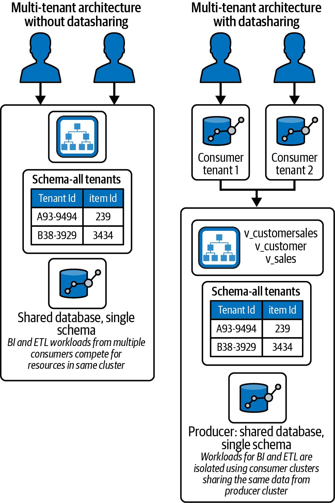

###### 图 7-10\. 使用数据共享的池模型多租户架构与单个数据仓库方法进行比较

#### 在生产者中创建数据库视图

对于多租户架构，您可以像我们之前在“构建星型模式”中所做的那样创建一个物化视图。但是在这里，您包括学校表，并在`where`子句中使用`school_id`来管理行级安全性。您可以使用示例 7-12 中的脚本为多租户池模型创建物化视图。请注意，我们使用了一个不同的模式`openlearnm`来存储与多租户模型相关的数据库对象。

##### 示例 7-12\. 学生活动：`total_score`和`mean_score`

```
CREATE materialized view openlearnm.mv_student_lmsactivites_and_score AS
SELECT st.school_id, st.id_student, st.code_module,st.code_presentation, st.gender,
  st.region, st.highest_education, st.imd_band,st.age_band,st.num_of_prev_attempts,
  st.studied_credits, st.disability, st.final_result, st_lms_clicks.sum_of_clicks,
  scores.total_score, scores.mean_score
FROM openlearnm.student_info st
  LEFT JOIN
    (SELECT school_id, code_module, code_presentation,
      id_student, sum(sum_click) AS sum_of_clicks
    FROM openlearnm.student_lms
      GROUP BY school_id, code_module,code_presentation,id_student) st_lms_clicks
    ON st.school_id = st_lms_clicks.school_id
    AND st.code_module = st_lms_clicks.code_module
    AND st.code_presentation = st_lms_clicks.code_presentation
    AND st.id_student = st_lms_clicks.id_student
    LEFT JOIN
      (SELECT school_id, id_student, sum(score) AS total_score,
        avg(score) AS mean_score
        FROM openlearnm.STUDENT_ASSESSMENT
        GROUP BY school_id, id_student)  scores
        ON st.school_id = scores.school_id
        AND st.id_student = scores.id_student;
```

要控制和限制行级访问权限，仅允许学生从其所在学校访问的数据，您可以创建一个视图 `v_student_lmsactivites_and_score`，并根据查询数据的消费者命名空间过滤记录。示例 7-13 中的视图是 *mv_student_lmsactivities_and_score* 和表 *school* 的连接，并且有一个基于 [`current_namespace`](https://oreil.ly/OfJWE) 进行值过滤的 where 条件。系统变量 `current_namespace` 包含了发起查询的消费者数据仓库的命名空间值。

##### 示例 7-13\. 创建用于计算学生分数的视图

```
/* create view to calculate student activities total_score mean_score  */
/* use current_namespace system variable to use the consumer namespace */
/* from where the query is run to filter the selected records for the school */

CREATE VIEW openlearnm.v_student_lmsactivites_and_score AS
SELECT mvs.school_id, mvs.id_student, mvs.code_module,
  mvs.code_presentation, mvs.gender, mvs.region, mvs.highest_education,
  mvs.imd_band, mvs.age_band, mvs.num_of_prev_atteempts,
  mvs.studied_credits, mvs.disability,mvs.final_result,
  mvs.sum_of_clicks, mvs.total_score, mvs.mean_score
FROM openlearnm.mv_student_lmsactivites_and_score mvs
  LEFT JOIN openlearnm.school s
    ON mvs.school_id = s.school_id
WHERE s.consumer_namespace = current_namespace;
```

#### 生产者中创建数据共享并授予消费者使用权限

现在您可以创建一个数据共享并与消费者共享视图了。连接到您的生产者数据仓库，创建数据共享 `learnsharem`，添加 `openlearn` 模式，并添加您创建的视图以与消费者共享，如示例 7-14 中所示。在 `GRANT USAGE` 语句中，用消费者数据仓库的命名空间替换 *`consumer namespace`*。

##### 示例 7-14\. 设置生产者数据共享

```
CREATE DATASHARE learnsharem;

ALTER DATASHARE learnsharem
  ADD SCHEMA openlearnm;

ALTER DATASHARE learnsharem
  ADD TABLE openlearnm.v_student_lmsactivities_and_score;

Grant USAGE ON DATASHARE learnsharem
  TO NAMESPACE '<<consumer namespace>>'
```

注意数据共享的名称以 *m* 结尾，这是一个命名约定，用于区分您之前创建的 `learnshare` 数据共享的多租户模式模式。

现在连接到您的消费者，创建一个引用生产者上数据共享的数据库，如示例 7-15 所示。再次注意，这个数据库只是指向数据共享的指针，并不存储任何数据。

##### 示例 7-15\. 从远程数据共享创建本地数据库

```
CREATE DATABASE openlearnm_db
FROM DATASHARE learnsharem
OF NAMESPACE '<producer_namespace>';
```

创建数据库后，您可以使用 `db_name.schema.view` 的三部分表示法实时查询数据，如示例 7-16 所示。当从消费者查询时，请注意，即使没有 `where` 子句来过滤特定记录，返回的数据也只会是与发起查询的消费者集群对应的学生的数据。这在视图级别进行控制，根据连接到学校表的 `consumer namespace` 限制数据。  

##### 示例 7-16\. 查询视图

```
SELECT *
FROM openlearnm_db.learnsharem.v_student_lmsactivities_and_score;
```

当您从视图 `v_student_lmsactivities_and_score` 中选择时，您将只看到与用于查询数据的消费者命名空间相关联的数据。当此查询从消费者传递到生产者时，`current_namespace` 变量将具有此消费者的命名空间。因此，物化视图将根据与学校表的连接条件仅过滤来自此消费者的记录。

要详细了解如何设置和测试多个消费者，请参考博客 [“在 Amazon Redshift 中使用数据共享实现多租户模式”](https://oreil.ly/YXYbF)。

#### 使用角色级安全性

而不是使用在生产者上定义的数据库视图，你可以使用建立在 [基于角色的访问控制（RBAC）](https://oreil.ly/dNIsy) 基础上的*行级安全*（RLS），以限制每个消费者的行。RLS 允许你控制哪些用户或角色可以根据在数据库对象级别定义的安全策略访问特定记录的数据。Amazon Redshift 中的这种 RLS 能力使你能够动态过滤表格中现有的数据行。

使用之前的示例，假设 school 表仍然具有 `consumer_namespace` 字段，但所有表格都与所有消费者共享。可以定义如 Example 7-17 中所示的以下 RLS 策略，并强制在与 school 表进行连接时仅返回 `consumer_namespace` = `current_namespace` 的学校。

##### Example 7-17\. 创建行级安全策略

```
CREATE RLS POLICY consumer
WITH (school_id int)
USING (school_id = (
  SELECT school_id
  FROM school
  WHERE consumer_namespace = current_namespace));

GRANT SELECT ON
  student,
  course_outcome,
  course_registration,
  degree_plan
TO RLS POLICY consumer;
```

接下来，你可以像在 Example 7-18 中展示的那样，将此策略附加到包含 `school_id` 字段的任何表格，并且任何关联到数据库角色 school 的用户都将应用此策略，并且只能看到他们自己的数据。

##### Example 7-18\. 将策略关联到对象角色

```
ATTACH RLS POLICY consumer ON student TO ROLE school;
ATTACH RLS POLICY consumer ON course_outcome TO ROLE school;
ATTACH RLS POLICY consumer ON course_registration TO ROLE school;
ATTACH RLS POLICY consumer ON degree_plan TO ROLE school;
```

### 桥接模型

在*桥接模型*中，你可以将每个租户的数据存储在其自己的架构中，这些架构与具有类似表格集合的数据库相似。你为每个架构创建数据共享，并将其与相应的消费者共享，以便将每个架构的查询工作负载路由到消费者。这是在独立模型和池模型之间寻求平衡的一种吸引人方法，既提供了数据隔离，又在不同架构之间复用了 ETL 代码。在 Amazon Redshift 中，你可以创建高达 9,900 个架构，因此，如果你的使用情况需要超过此限制，可以考虑创建更多数据库。有关更多信息，请参阅 [Amazon Redshift 中的配额和限制](https://oreil.ly/_qd3j)。Figure 7-11 说明了桥接模型。

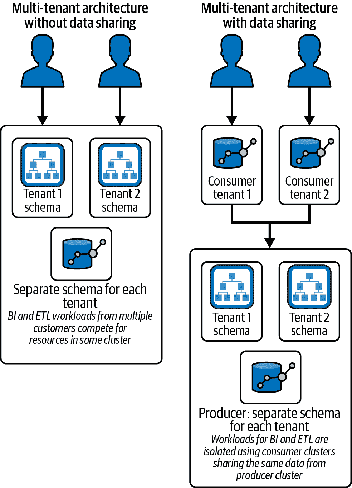

###### Figure 7-11\. 桥接模型多租户架构与数据共享相比单一数据仓库方法

#### 创建生产者中的数据库架构和表格

让我们继续使用之前的用例。就像在池模型中所做的那样，第一步是在生产者中创建数据库架构和表格。登录到生产者并为每个租户创建单独的架构。例如，你可以创建两个架构，`learnschema_school1` 和 `learnschema_school2`，用于存储来自两所不同学校的学生数据，并在每个架构下创建与 Example 3-1 中相同的表格。为了最大化 ETL 代码的复用性，请确保所有架构中的数据模型保持一致。

#### 在生产者中创建数据共享并授予消费者使用权限

要在桥接模型中创建数据共享，创建两个数据共享，`learnshare-school1`和`learnshare-school2`，并将学校 1 和学校 2 的各自模式中的所有表添加到各自的数据共享中。然后，为消费者授予访问相同帐户或不同帐户中相应消费者数据的访问权限。

创建两个数据共享，`learnshare-school1`和`learnshare-school2`，以共享两个模式下的数据库对象给各自的消费者，如示例 7-19 所示。

##### 示例 7-19。创建数据共享

```
CREATE DATASHARE learnshare-school1;
CREATE DATASHARE learnshare-school2;
```

修改数据共享并添加各租户的模式及相应要共享的表，使用示例 7-20 中的脚本。

##### 示例 7-20。向数据共享添加对象

```
ALTER DATASHARE learnshare-school1
  ADD SCHEMA learnschema_school1;

ALTER DATASHARE learnshare-school2
  ADD SCHEMA learnschema_school2;

ALTER DATASHARE learnshare-school1
  ADD ALL TABLES IN SCHEMA learnschema_school1;

ALTER DATASHARE learnshare-school2
  ADD ALL TABLES IN SCHEMA learnschema_school2;
```

现在，授予第一个学校`learnshare-school1`的数据共享使用权限，使其能够访问学校 1 的消费者数据仓库的命名空间，如示例 7-21 所示。

##### 示例 7-21。允许访问数据共享

```
GRANT USAGE ON DATASHARE learnshare-school1
  TO NAMESPACE '<consumer1_namespace>';
```

要访问学校 1 的消费者数据，请登录第一个学校的数据仓库，并使用示例 7-22 中的脚本引用数据共享创建数据库。您还可以从`SVV_DATASHARES`系统视图查看数据共享，或使用`SHOW DATASHARES`命令。如果要查看每个数据共享中的对象列表，可以通过查询`SVV_DATASHARE_OBJECTS`系统视图查看详细信息。

##### 示例 7-22。从远程数据共享创建本地数据库

```
CREATE DATABASE learndb_school1
  FROM DATASHARE learnshare-school1
  OF NAMESPACE '<producer_namespace>';

SELECT *
  FROM learndb_school1.learnschema_school1.v_student_lmsactivities_and_score;

SHOW DATASHARES;

SELECT * FROM SVV_DATASHARES;

SELECT * FROM SVV_DATASHARE_OBJECTS;
```

在桥接模型中，由于各学校的数据库对象都组织在各自的模式下，并且数据共享只包含各学校的相应模式，因此消费者只能访问与该学校相关的数据库对象。在此示例中，学校 1 将限制仅从`learnschema_school1`查询数据。

### 筒仓模型

第三个选项是在数据仓库中为每个租户存储数据于单独的数据库中，如果您希望具有不同的数据模型和单独的监控、管理和安全足迹——*筒仓模型*。Amazon Redshift 支持跨数据库查询，允许您简化数据组织。您可以将所有租户使用的通用或粒度数据集存储在集中式数据库中，并使用跨数据库查询功能来连接每个租户的相关数据。

创建筒仓模型中的数据共享的步骤与桥接模型类似；但与桥接模型不同（其中数据共享是为每个模式），筒仓模型为每个数据库创建一个数据共享。图 7-12 展示了筒仓模型的架构。

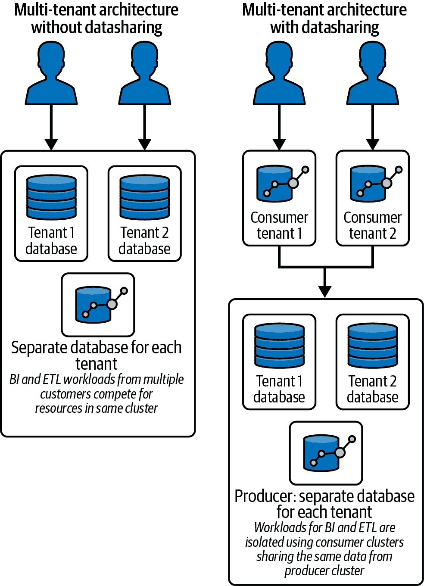

###### 图 7-12。与单一数据仓库方法相比的筒仓模型多租户架构

#### 在生产者中创建数据库和数据共享

继续使用之前的用例。为生产者的 silo 模型创建 datashare，请完成以下步骤：

作为管理员用户登录到生产者并为每个租户创建单独的数据库，如示例 7-23。

##### 示例 7-23\. 创建数据库

```
CREATE DATABASE learndb_school1;
CREATE DATABASE learndb_school2;
```

再次登录到生产者数据库`learndb_school1`，使用第一所学校的用户 ID 创建模式`learnschema`，如示例 7-24。类似地，您可以使用第二所学校的用户 ID 登录到生产者数据库`learndb_school2`并创建模式`learnschema`。

##### 示例 7-24\. 创建模式

```
CREATE SCHEMA learnschema;
```

然后，使用示例 3-1 中的脚本，在每个数据库中为学生信息数据模型创建表，存储各自学校的学生数据。这种策略的一个好处是，因为架构和表名相同，ETL 过程可以仅通过更改数据库名称的连接参数进行重用。

#### 在生产者中创建 datashare 并授予消费者使用权

接下来，创建 datashare，就像在“桥模型”中所做的那样，这次连接到每个数据库单独。对于第一所学校，您可以在示例 7-25 中执行脚本。

##### 示例 7-25\. 为第一所学校设置 datashare

```
CREATE DATASHARE learnshare-school1;
ALTER DATASHARE learnshare-school1 ADD SCHEMA learnschema;
ALTER DATASHARE learnshare-school1 ADD ALL TABLES IN SCHEMA learnschema;
GRANT USAGE ON DATASHARE learnshare-school1 TO NAMESPACE '<consumer1_namespace>';
```

对于第二所学校，您可以在示例 7-26 中执行此脚本。

##### 示例 7-26\. 为第二所学校设置 datashare

```
CREATE DATASHARE learnshare-school2;
ALTER DATASHARE learnshare-school2 ADD SCHEMA learnschema;
ALTER DATASHARE learnshare-school2 ADD ALL TABLES IN SCHEMA learnschema;
GRANT USAGE ON DATASHARE learnshare-school2 TO NAMESPACE '<consumer2_namespace>';
```

# 与 AWS ADX 集成的外部数据共享

对于某些用户来说，在账户内或账户之间共享数据已足够进行组织内协作，但对于跨组织协作和货币化用例，您可以使用 ADX。通过 ADX，您可以通过 datashare 从 Amazon S3 共享数据或直接从 Amazon Redshift 数据仓库查询数据。

*AWS 数据交换* (ADX) 是一个数据市场，数据提供者可以在订阅基础上托管其数据产品，供订阅者访问。ADX 托管来自三百多个提供者的数据产品，并为数据提供文件、API 或 Amazon Redshift datashare 的订阅式访问。订阅者可以通过数据湖、应用程序、分析和使用数据的机器学习模型直接访问数据。作为 AWS 服务，ADX 安全合规，与 AWS 和第三方工具和服务集成，提供统一的计费和订阅管理。

通过其与 Amazon Redshift 的集成，您可以通过 ADX 许可访问 Amazon Redshift 数据。当您订阅带有 ADX datashare 的产品时，ADX 会自动将您添加为该产品中包含的所有 datashare 的数据消费者。您可以自动生成发票，并通过 AWS Marketplace Entitlement Service 集中和自动收取支付。

提供者可以在 Amazon Redshift 上以细粒度的级别许可数据，如模式、表、视图和 UDF。您可以在多个 ADX 产品中使用同一 ADX 数据共享。添加到 ADX 数据共享的任何对象都可供消费者使用。生产者可以使用 Amazon Redshift API 操作、SQL 命令和 Amazon Redshift 控制台查看由 ADX 代表其管理的所有 AWS Data Exchange 数据共享。订阅具有 ADX 数据共享产品的消费者对数据共享中的对象具有只读访问权限。

*AWS Data Exchange 数据共享* 是通过 ADX 分享数据的许可单位。AWS 负责管理与 ADX 订阅和使用 Amazon Redshift 数据共享相关的计费和付款。批准的数据提供者可以将 ADX 数据共享添加到 ADX 产品中。当您订阅具有 ADX 数据共享的产品时，您可以访问产品中的数据共享。我们将更详细地介绍 ADX 与 Amazon Redshift 集成的工作方式在“通过 AWS ADX 集成进行外部数据共享”中。获得批准的 ADX 数据共享提供者可以通过 ADX 将 ADX 数据共享添加并许可为产品。

当您订阅具有 AWS Data Exchange 数据共享的产品时，ADX 会自动将您添加为该产品中包含的所有 ADX 数据共享的数据消费者。当您的订阅结束时，ADX 也会将您从 ADX 数据共享中移除。ADX 与 AWS 计费集成，为具有 ADX 数据共享的付费产品提供统一的计费、发票、付款收集和付款分发。要注册为 ADX 数据提供者，请参阅[作为提供者入门](https://oreil.ly/iokOZ)。

如果您是具有活动 ADX 订阅（也称为 ADX 订户）的消费者，则无需提取、转换和加载数据即可在 Amazon Redshift 中查找、订阅和查询细粒度、最新的数据。

如果您想使用第三方生产者数据，您可以浏览 AWS Data Exchange 目录，发现并订阅 Amazon Redshift 中的数据集。在您的 ADX 订阅激活后，您可以在他们的数据仓库中从数据共享创建数据库，并在 Amazon Redshift 中查询数据。

作为订阅者，您可以直接使用来自提供者的数据，无需进一步处理，无需 ETL 过程。因为您无需进行任何处理，数据始终是当前的，并可以直接用于您的 Amazon Redshift 查询中。ADX 为 Amazon Redshift 管理所有授权和付款，所有费用都计入您的 AWS 账户。

## 发布数据产品

要在 Amazon Redshift 中使用 ADX 发布数据产品，您可以创建连接到您的 Amazon Redshift 数据仓库的 ADX 数据共享。要将 ADX 数据共享添加到 ADX 产品中，您必须是注册的 ADX 提供者。

一旦注册为提供者，您可以创建 AWS Data Exchange 数据共享以将 Amazon Redshift 发布为数据交换中的数据产品。当您订阅包含数据共享的产品时，您将被授予只读访问权限，以访问数据提供者添加到数据共享的表、视图、模式和用户定义函数。

让我们来看看如何通过数据交换将学生的材料化视图作为数据产品共享。第一步是创建一个数据交换数据共享，你可以按照图 7-13 中所示使用控制台或脚本创建此数据共享。


###### 图 7-13\. 创建数据交换数据共享

然后添加数据共享的数据库对象；在这种情况下，选择`mv_student_lmsactivities_and_score`（参见图 7-14）。

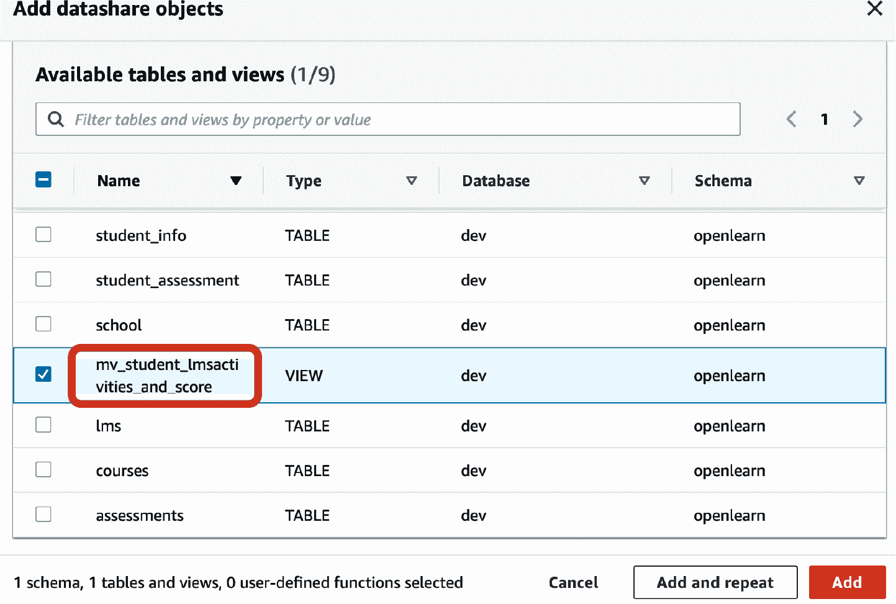

###### 图 7-14\. 添加数据交换数据共享对象

一旦创建了数据共享并添加了数据库对象，你可以选择数据共享`learnshare_adx`并在 AWS Data Exchange 上创建一个数据集（参见图 7-15）。这个数据共享将在 AWS Data Exchange 上列出，供消费者订阅数据集。

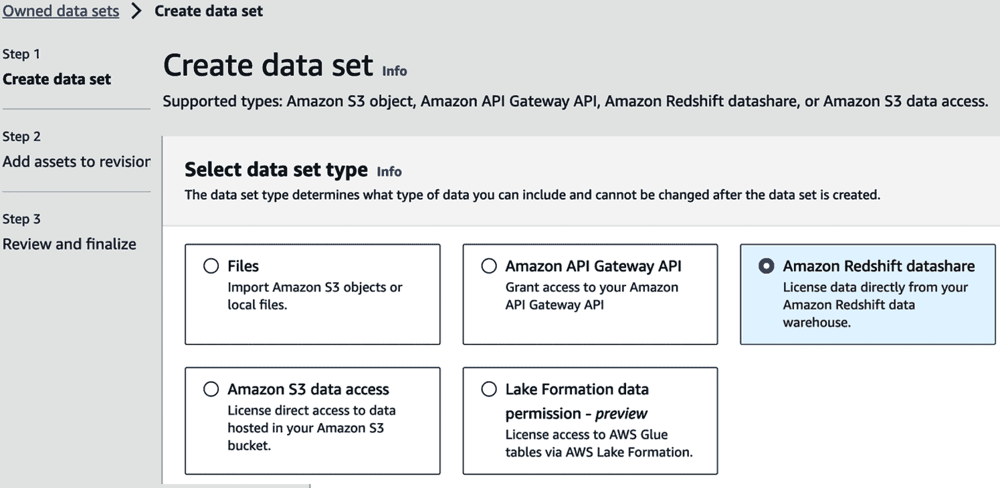

###### 图 7-15\. 从 Redshift 数据共享创建 ADX 数据集

按照步骤创建数据集，并完成数据共享版本。现在你可以从数据集创建数据产品（参见图 7-16）。

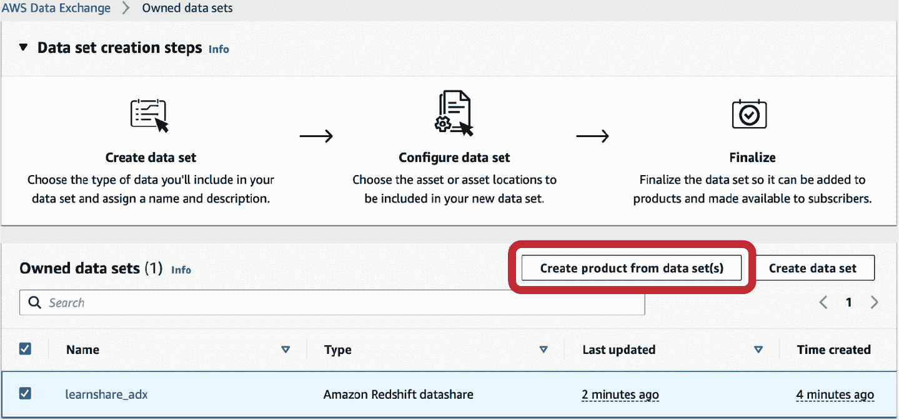

###### 图 7-16\. 从数据集创建产品

欲了解详细步骤，请参阅有关如何[发布包含 Amazon Redshift 数据集的数据产品](https://oreil.ly/QyO4p)的在线文档。

请注意，您需要注册成为市场销售商才能发布数据产品。如果您希望提供付费产品并且符合条件，必须提交税务和银行信息。

## 订阅已发布的数据产品

如果你想从第三方生产商那里获取数据产品，可以使用 AWS Data Exchange 订阅来访问数据。如果你是一个有着活跃 ADX 订阅的订阅者，可以在 ADX 控制台上浏览 ADX 目录，发现包含 ADX 数据共享的产品（参见图 7-17）。在 ADX 订阅激活后，可以在他们的数据仓库中从数据共享创建数据库，并在 Amazon Redshift 中查询数据。

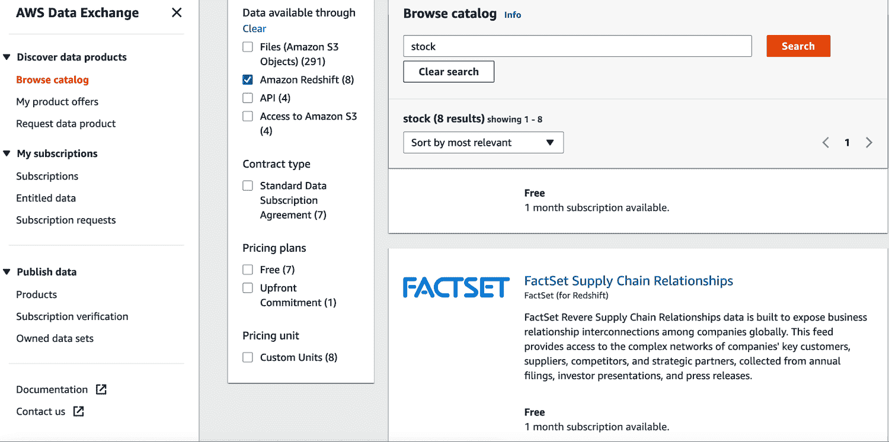

###### 图 7-17\. 在 ADX 上浏览数据产品

订阅包含 AWS 数据交换数据共享的产品后，在您的数据仓库中创建来自数据共享的数据库。然后，您可以直接在 Amazon Redshift 中查询数据，无需提取、转换和加载数据。将 ADX 数据共享添加到 ADX 产品后，消费者在订阅开始时自动获得对产品数据共享的访问，并在其订阅有效期内保持访问权限。

欲了解更多信息，请参阅关于 [作为消费者使用 AWS 数据交换数据共享](https://oreil.ly/-Gtit) 的在线文档。

## 使用 AWS 数据交换服务（AWS Data Exchange）用于 Amazon Redshift 时的注意事项

使用 AWS 数据交换服务（AWS Data Exchange）用于 Amazon Redshift 时，请考虑以下内容：

+   生产者和消费者必须使用 RA3 节点类型才能使用 Amazon Redshift 数据共享（datashares）。生产者必须使用 RA3 节点类型或者使用无服务器方式，同时生产者和消费者数据仓库必须加密。

+   您必须注册为 ADX 提供者才能在 ADX 上列出产品，包括包含 ADX 数据共享的产品。欲了解更多信息，请参阅 [作为提供者入门](https://oreil.ly/vFwMO)。

+   您不需要注册为 ADX 提供者即可查找、订阅和查询通过 ADX 访问的 Amazon Redshift 数据。

+   要控制通过 ADX 数据共享访问您的数据，必须打开“公开访问”设置。这并不意味着您的数据共享是公开的，或者消费者的数据仓库是公开的，但这意味着他们被允许将其公开。要更改 ADX 数据共享，请使用 `ALTER DATASHARE SET PUBLICACCESSIBLE FALSE` 命令关闭“公开访问”设置。

+   生产者不能手动添加或移除 ADX 数据共享的消费者，因为对数据共享的访问是基于订阅包含 ADX 数据共享的 ADX 产品而授予的。

+   生产者无法查看消费者运行的 SQL 查询。他们只能通过只有生产者可以访问的 Amazon Redshift 表查看元数据，例如查询的数量或消费者查询的对象。生产者可以利用这些信息了解订阅者如何使用其产品，并根据数据使用模式做出决策。

+   我们建议您不要使用 `DROP DATASHARE` 语句删除共享给其他 AWS 帐户的 ADX 数据共享（datashare）。如果这样做，可以访问该数据共享的 AWS 帐户将失去访问权限。此操作是不可逆转的。执行此类更改可能违反 ADX 数据产品条款。

+   要进行跨区域数据共享，您可以创建 ADX 数据共享以共享许可的数据。

我们建议您将您的数据共享（datashares）设置为公开访问。如果不这样做，AWS 数据交换的订阅者无法使用您的数据共享，即使他们的消费者数据仓库是公开访问的。

# 从数据湖（Data Lake）查询并卸载到数据湖

你可能有使用情况，想要将在数据仓库中策划的数据与外部应用程序共享。因为 Amazon Redshift 与数据湖集成，你可以采取数据仓库优先的方法，先将数据存储在你的数据仓库中，根据需要将数据卸载到数据湖中。由于 Amazon Redshift 支持存储和计算的解耦，它可以在数据仓库中每个节点最多存储 128TB 的大容量数据。因此，对于 OLAP 工作负载，你可以将所有数据存储在你的数据仓库中。当你想要与 Amazon Redshift 数据仓库中的其他服务（如 Amazon SageMaker）共享数据时，可以使用`UNLOAD`选项，将数据从 Amazon Redshift 本地表卸载到 Amazon S3 中。在卸载到 Amazon S3 时，可以直接转换为推荐的格式如 Parquet 或 ORC，并与其他服务共享。

对于`UNLOAD`命令的一般语法，请参考[UNLOAD 命令文档](https://oreil.ly/N9z_r)。使用运行示例，如果你想要与使用其他服务访问数据的合作伙伴或用户共享学生学习管理参与情况，那么你可以使用`UNLOAD`命令卸载学生活动数据，如示例 7-27 所示。

##### 示例 7-27\. `UNLOAD`示例

```
UNLOAD ('select * from mv_student_lmsactivities_and_score')
TO 's3://openlearn/studentactivities'
IAM_ROLE default
PARQUET
PARTITION BY (school_id);
```

你还可以使用`INSERT INTO SELECT`查询将结果加载到现有的外部表中，这些表位于外部目录，如示例 7-28 所示，适用于 AWS Glue、AWS Lake Formation 或 Apache Hive 元存储。使用与`CREATE EXTERNAL SCHEMA`命令相同的 AWS IAM 角色与外部目录和 Amazon S3 交互。有关使用插入到外部表命令的详细步骤，可以参考[将`SELECT`查询结果插入到外部表中的文档](https://oreil.ly/cGyyl)。

##### 示例 7-28\. 将数据写入外部表

```
INSERT INTO external_schema.table_name
{ select_statement }
```

# Amazon DataZone 用于发现和共享数据

数据仓库通常指通过将来自多个来源系统的详细事务数据转移并将数据合并到一个单一的真实数据源来构建集中式数据存储。详细数据通过应用业务规则进行转换，并以聚合的格式存储，以实现快速查询性能。围绕去中心化数据管理和治理，数据管理的相对较新架构已经发展。这就是数据网格架构，你可以在“数据网格”中了解更多。数据网格采纳了数据的去中心化所有权，旨在实现无需移动或复制数据即可轻松访问数据的目标。

数据生产者是专业领域专家，创建数据资产并定义数据目录，为便于使用添加业务定义，并按数据领域组织。然后在数据目录中注册数据产品，以便消费者搜索和访问与其业务需求相关的数据。作为提醒，数据网格架构的四个关键概念是：

+   面向域的数据所有权

+   联合数据治理

+   自助数据基础设施

+   数据作为产品思维

在接下来的部分，您将看到 Amazon DataZone 组件如何实现构成数据网格架构的关键能力。

## 使用 Amazon DataZone 的数据网格架构用例

数据网格架构有许多用例，特别适用于具有多条业务线或需要跨业务部门共享数据的组织。以下是一些示例。

作为现代化战略的一部分，一家大型金融组织着手将其遗留的本地工作负载迁移到 AWS 云上，包括 Amazon Redshift 和 Amazon S3 等托管服务。他们选择在 AWS 云上构建现代数据平台，作为分析、研究和数据科学的中央数据存储。此外，该平台还用于治理、监管和财务报告。最初设计是将所有业务数据存储在中央数据存储和中央 AWS 账户中，但在使数据可访问方面遇到了限制和复杂性。

为了解决大型数据存储的成长痛点和需求，他们将数据存储和相关管理功能的所有权分散并委托给各自的业务部门。数据网格架构使他们能够在各自的账户中保留各业务部门的数据，同时以安全的方式实现跨业务部门账户的无缝访问。他们重新组织了 AWS 账户结构，为每个业务部门设置了单独的账户，在亚马逊 Redshift 和亚马逊 S3 中的相应 AWS 账户中共同定位了业务数据和依赖应用程序。通过这种分散化模型，业务部门独立管理其数据的水合、策展和安全责任。

一家投资银行组织拥有多个业务部门和公司职能，需要一种架构来在企业内自由共享数据，同时管理未经授权访问的风险。他们采取了双管齐下的方法来解决这一需求。首先，通过定义数据产品，由了解数据及其管理需求、允许使用和限制的人员策展。其次，通过实施数据网格架构，使他们能够将其数据技术与这些数据产品对齐。

医疗机构可以创建一个数据产品，提供实时患者监控数据，各部门如急诊服务、患者护理和研究都可以使用。在学校系统中，学生数据存储在学生信息系统中，IT 部门可以是数据的生产者，各个学校将订阅与其学生相关的数据。您可以构建数据网格架构，使教师、学生和管理员能够安全地协作和共享数据，采用生产者-消费者模型。零售公司可能为销售、库存、客户数据和营销设立单独的领域。每个领域可以有自己的数据团队负责收集、存储和分析特定领域的数据。采用数据网格架构将使每个领域能够拥有和管理自己的数据，从而能够独立做出数据驱动的决策。

这些只是数据网格架构实际应用的几个例子。主要目标是分散数据管理，赋予领域团队权力，并在组织内创建可伸缩和可持续的数据生态系统。

## 亚马逊数据区的关键能力和使用案例

[亚马逊数据区](https://aws.amazon.com/datazone)是一项数据管理服务，采用数据网格架构，使数据生产者能够发布数据产品，并通过 Web 界面将其提供给业务数据目录。一旦数据产品发布，用户可以通过简化的方式搜索数据。使用亚马逊数据区目录，您可以使数据在业务背景下可见，快速找到并理解数据。您可以基于团队、分析工具和数据资产的分组创建业务用例，以简化访问 AWS 分析工具。通过自动化的发布/订阅工作流，您可以调整数据所有权以保护生产者和消费者之间的数据。

您可以设置安全策略，确保具有正确权限的人员可以访问您的数据。使用亚马逊数据区，您可以实现联合数据治理，数据集的数据所有者和主题专家可以对其相关数据资产实施安全和访问控制。您可以扩展在 AWS Glue 数据目录、IAM 和 Lake Formation 中设置的治理控制。亚马逊数据区支持通过 Amazon Redshift、Amazon Athena、AWS Glue、AWS Lake Formation 和 Amazon QuickSight 等 AWS 服务进行数据访问和数据共享。

## 亚马逊数据区与亚马逊 Redshift 及其他 AWS 服务的集成

[亚马逊数据区](https://aws.amazon.com/datazone)本身不存储任何数据，它作为元数据中心，实现跨数据集的数据访问便利化。为了数据访问，亚马逊数据区必须与存储、访问和控制数据的现有 AWS 服务集成。在编写本书时，它支持与其他 AWS 服务的三种集成类型：

生产者数据源

从生产者的角度看，亚马逊数据区集成了存储在亚马逊 S3 数据湖或亚马逊 Redshift 中的数据。您可以将数据资产发布到亚马逊数据区目录，从存储在亚马逊 S3 和亚马逊 Redshift 表格和视图中的数据。您还可以手动将 AWS Glue 数据目录中的对象发布到亚马逊数据区目录中。

消费者工具

您可以通过亚马逊 Redshift 查询编辑器或亚马逊 Athena 访问数据资产，通过亚马逊 Redshift 中的外部表格。

访问控制和履行

使用亚马逊数据区，您可以授予对由 AWS Lake Formation 管理的 AWS Glue 表格和亚马逊 Redshift 表格和视图的访问权限。此外，亚马逊数据区将与您的操作相关的标准事件连接到亚马逊 EventBridge。您可以使用这些标准事件与其他 AWS 服务或第三方解决方案进行自定义集成。

## 亚马逊数据区的组件和能力

AWS 引入了“`domain`”的概念，用于帮助组织与这些资产相关的数据资产和资源。亚马逊数据区域域提供了灵活性，以反映您组织的业务领域和实体，包括数据资产、数据来源、元数据、业务术语表以及关联的 AWS 账户。亚马逊数据区的四个关键组件使得通过发布到中央目录的数据产品来跨业务领域安全访问数据变得可能：

+   商业数据目录

+   项目

+   治理和访问控制

+   数据门户

我们接下来讨论这些组件，它们是您创建的域的一部分，如图 7-18 所示。

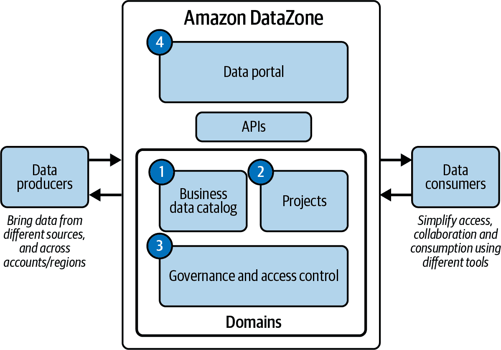

###### 图 7-18\. 亚马逊数据区组件

要最初设置亚马逊数据区（Amazon DataZone）及其数据门户，您将创建一个作为根域的域。在数据门户内，域管理员可以创建额外的域。这些组件共同工作，提供功能，使您能够构建和操作具有分散数据治理的数据网格架构；这些将在接下来的章节中讨论。

### 商业数据目录

亚马逊数据区的核心组件是一个带有商业友好描述的元数据目录。当数据生产者发布数据产品时，该目录会被构建，并且随着新产品准备就绪而增长。该目录可以来自不同数据源的数据。数据集发布到目录后，消费者可以通过亚马逊数据区门户（如图 7-24 所示）搜索所需数据。

亚马逊数据区使用机器学习自动在编目数据资产时建议商业术语。此自动化减少了添加可搜索业务术语到技术数据所需的手动工作。

### 项目

Amazon DataZone 为团队引入数据项目，以便协作并获取访问数据资产。通过项目，组织内的一组用户可以在 Amazon DataZone 目录中发布、发现、订阅和使用涉及的各种业务用例。您使用项目作为身份主体来接收对底层资源的访问授予，而不是依赖于个人用户凭据。每个项目都有一组应用于其的访问控制，以便只有经授权的个人、组和角色可以访问该项目及该项目订阅的数据资产，并且只能使用项目权限定义的工具。项目与具有特定能力的项目配置文件相关联，可作为消费者或生产者或两者行为。您可以使用数据项目通过使用审计能力来管理和监控跨项目的数据资产。

使用数据项目，您可以创建和访问数据、人员和工具的业务用例分组，团队可以使用这些分组协作。项目视图中可用的一些组件包括：

已订阅数据

这包括所有已批准、待处理和已授予的订阅请求。

发布

这包括所有已发布的数据、订阅请求、发布作业和所有协议。

成员

包括此项目的成员及其各自的角色。

设置

提供项目的详细信息，如 ID、账户、VPC 和项目的能力。

项目成员可以安全地协作、交换数据和共享工件，只有明确添加到项目中的人员才能访问其中的数据和分析工具。项目通过数据监管人员施加的策略管理生成的数据资产的所有权，通过联邦治理去中心化数据所有权。

### 数据治理和访问控制

自动化工作流程允许消费者请求访问他们在业务目录中找到的数据产品。此请求将路由到数据生产者或数据所有者以进行批准。当生产者批准请求时，消费者将收到通知，并可以在无需任何手动干预的情况下访问数据。数据生产者可以简化审计以监控谁正在使用每个数据集，并跨项目和 LOB（业务线）监控使用和成本。您可以在下一节中找到发布和订阅的示例步骤。

### 数据门户

门户是控制台之外的个性化主页，提供自助服务功能，消费者可以在目录中搜索数据。数据门户是用户访问 Amazon DataZone 的主要方式，是一个基于浏览器的 Web 应用程序，您可以在其中编目、发现、管理、共享和分析数据。这使得用户能够在使用现有身份提供者的凭据时，使用数据和分析工具进行跨部门协作。

使用该门户，你可以访问数据资产的个性化视图。在图 7-19 中，你可以看到工作流程中请求的各种订阅状态。你可以分析数据，无需登录 AWS 管理控制台或了解底层 AWS 分析服务。

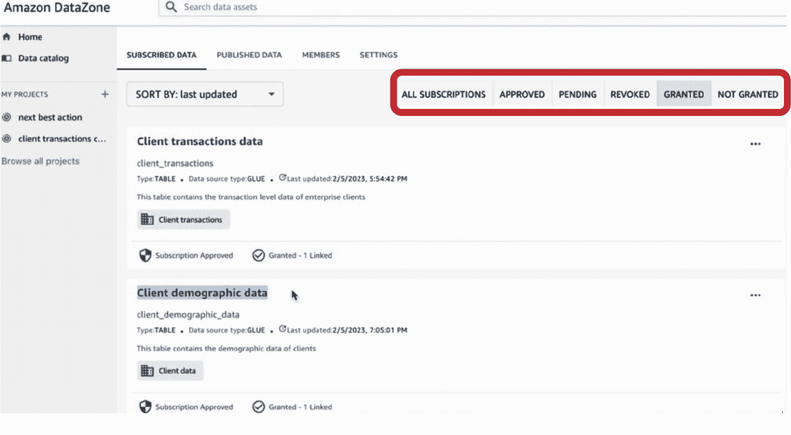

###### 图 7-19\. 不同订阅状态下的数据产品个性化视图

## Amazon DataZone 入门

采用数据网格架构不仅仅是技术问题；它需要一种心态的转变。你必须组织你的团队，并在你的组织中实施流程，向生产者-消费者模型迈进。域通过提供一种机制来为在业务数据目录中产生和编目数据的团队灌输组织纪律，从而实现更简单的过渡。任何数据生产者都可以将数据资产发布到管理数据的特定域的目录中，并控制可以访问该域的消费者的访问权限。一个域可以与每个业务用例相关联，其中人们可以协作和访问数据。

本节将带你创建 Amazon DataZone 的根域，并获取数据门户的 URL。然后，将带你通过数据生产者和数据消费者的基本工作流程。详细设置 Amazon DataZone 的步骤，请参阅[“入门文档”](https://oreil.ly/QzAOG)。具体步骤如下。

### 步骤 1: 创建域和数据门户

要开始使用 Amazon DataZone，第一步是创建一个域。域是 Amazon DataZone 对象的集合，如数据资产、项目、相关的 AWS 账户和数据源。域是你和你的团队可以创建所有相关 Amazon DataZone 实体的容器，包括元数据资产。你可以使用特定的域将数据资产发布到目录，并控制可以访问该域的相关 AWS 账户和资源的访问权限。

### 步骤 2: 创建生产者项目

要作为生产者创建和发布数据产品，你需要创建一个项目，该项目将组织数据产品和相关资产。创建项目时，你需要指定项目配置文件和数据源连接详细信息。项目配置文件确定项目的能力，以及项目是作为生产者、消费者还是两者兼而有之；连接详细信息用于数据源。因此，在创建项目之前，你需要创建一个项目配置文件和一个 AWS Glue 连接。你可以通过选择“目录管理”菜单并选择“项目和账户”选项卡来创建项目配置文件。

对于数据仓库生产者，您需要输入额外的信息，如亚马逊 Redshift 集群名称和 AWS Glue 连接详细信息。如果您还没有 AWS Glue 连接，您可以创建一个 Glue 连接到数据源，并在项目中指定连接详细信息。您将从项目发布您生成的数据到目录，并且消费者也将通过项目访问数据。

要创建项目，请使用数据门户网址导航至亚马逊数据区（Amazon DataZone）数据门户，并使用您的单一登录（SSO）或 AWS 凭据登录。在这里，您可以转到“我的项目”菜单，并点击+号以创建新项目，如图 7-20 所示。如果您是亚马逊数据区管理员，您可以通过访问亚马逊数据区控制台（位于创建亚马逊数据区根域的 AWS 账户中）获取数据门户网址。

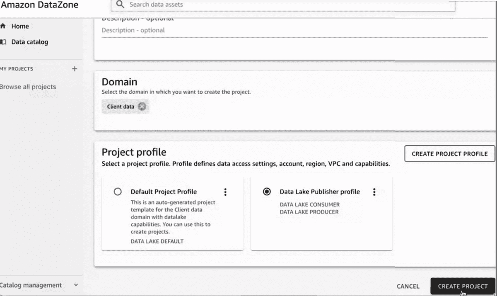

###### 图 7-20\. 使用特定数据域创建项目

您还可以通过选择“浏览所有项目”查看所有数据项目。项目列表如图 7-21 所示。

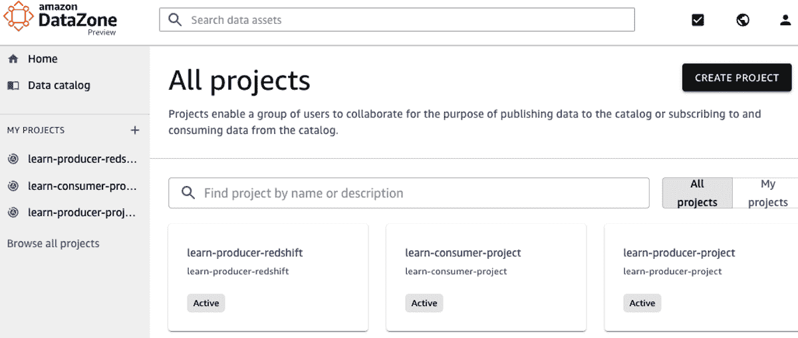

###### 图 7-21\. 在特定数据域下列出项目

### 第 3 步：为在亚马逊数据区发布数据而生成数据

在将数据资产发布到数据目录之前，您需要创建要与消费者共享的数据对象和数据。从您在上一步创建的生产者项目中，您点击“分析工具”下的“查询数据 - 亚马逊 Redshift”，如图 7-22 所示，并登录到亚马逊 Redshift 集群以创建数据表并设置数据。这将带您进入亚马逊 Redshift 查询编辑器 V2，并使用“联合用户”选项登录数据仓库。在这里，您可以创建数据库对象和数据。如果已经有表格，您可以选择在发布数据产品时包含这些表格。

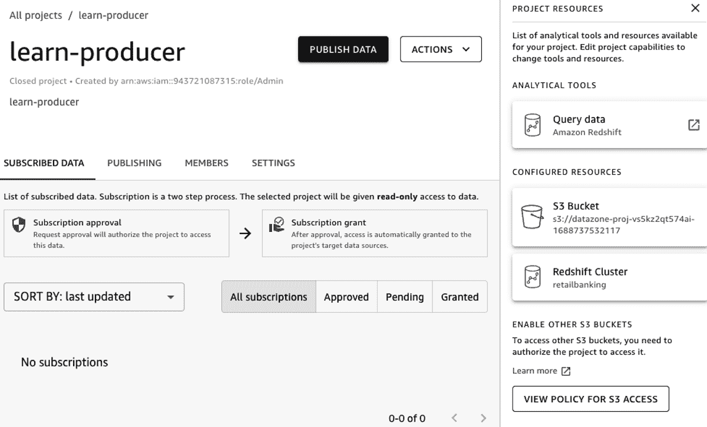

###### 图 7-22\. 在生产者中创建数据产品

### 第 4 步：向目录发布数据产品

当生产者准备好数据产品后，他们可以发布到业务数据目录，供消费者搜索和订阅。要发布，您将选择生产者项目并选择“发布数据”。发布通过具有发布协议的作业完成。您可以通过选择发布选项卡并在其中选择发布协议来从希望发布数据产品的项目创建发布协议。发布过程通过作业触发，并且您也可以监控该作业。在我们的学生示例中，当学生绩效数据产品的生产者准备好后，他们可以发布到目录中，如图 7-23 所示。有关发布数据的详细步骤，请参阅[在 Amazon DataZone 发布数据](https://oreil.ly/ykTGV)的文档。

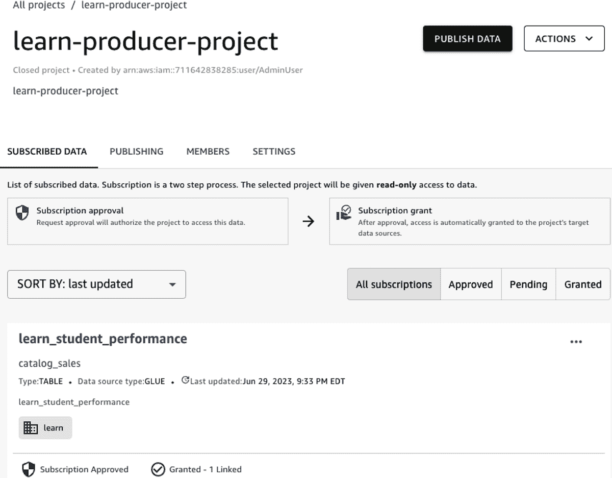

###### 图 7-23\. 发布学生绩效数据产品

### 步骤 5：创建消费者项目

为了让消费者订阅底层数据产品，项目再次作为一个身份主体，接收对底层资源的访问授权，而不依赖于个人用户凭据。要让消费者订阅生产者生成的数据，您需要创建一个带有消费者配置文件的消费者项目。在消费者配置文件中，您将在创建消费者配置文件时添加数据仓库消费者能力。当用户通过门户在目录中识别数据集时，用户需要在请求数据集访问之前选择消费者项目。Amazon DataZone 将根据访问控制集验证请求，并仅授权能够访问项目和数据资产的个人、组和角色。

### 步骤 6：在 Amazon DataZone 中发现和消费数据

一旦您将数据资产发布到一个领域，订阅者可以使用 Amazon DataZone 门户发现并请求订阅此数据资产。当消费者想订阅数据产品时，他们首先需要在目录中搜索并浏览他们想要的资产，如图 7-24 所示。消费者选择消费者项目并在搜索框中输入关键词以搜索数据产品。Amazon DataZone 将搜索所有已发布的目录，并返回与关键词匹配的数据产品列表。搜索列表根据编目的数据返回结果。消费者可以选择他们想要的数据集，并在业务词汇表中了解更多信息。确认所选数据集后，您可以请求访问并开始分析。


###### 图 7-24\. 在业务数据目录中搜索数据

您可以选择通过提交订阅请求订阅数据资产：按照图 7-25 中显示的订阅按钮，并包括请求的理由和原因。根据发布协议定义的订阅批准人员随后审查访问请求。他们可以批准或拒绝请求。有关详细步骤，请参阅[发现和使用数据](https://oreil.ly/7EF48)中的文档。

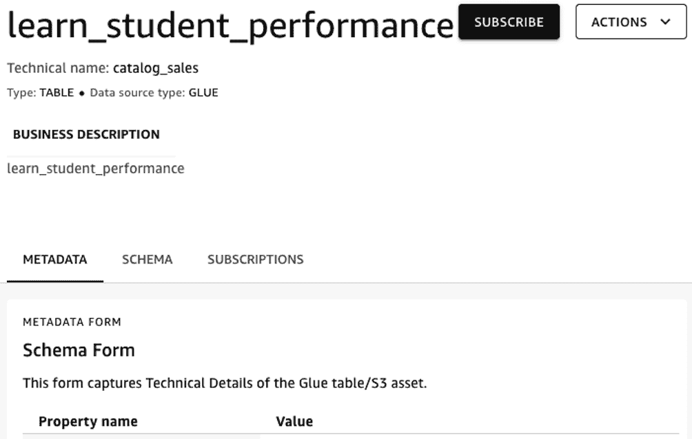

###### 图 7-25\. 订阅学生表现数据产品

### 步骤 7：作为生产者批准对发布数据资产的访问

生产者可以通过生产者项目批准消费者的请求访问。生产者可以通过导航到生产者项目并在发布选项卡下选择订阅请求选项卡，查看所有待批准的订阅请求。在这里，生产者可以批准并指定批准原因。这些信息将记录下来，以便将来跟踪授予批准的人员和批准请求的详细信息。

### 步骤 8：作为消费者分析发布的数据资产

一旦获得批准，订阅者可以使用消费者项目查看批准状态，并根据数据源类型和数据所在位置，使用 Amazon Athena 或 Amazon Redshift 查询编辑器查看数据。

在开始设置 Amazon DataZone 用于您的数据网格之前，请完成[文档中的设置部分](https://oreil.ly/4Z4vm)中描述的步骤。如果您使用全新的 AWS 账户，则必须[配置 Amazon DataZone 管理控制台的权限](https://oreil.ly/5hOJb)。如果您使用具有现有 AWS Glue Data Catalog 对象的 AWS 账户，您还必须[将数据湖权限配置为 Amazon DataZone](https://oreil.ly/bnllj)。

## Amazon DataZone 中的安全性

与其他 AWS 服务一样，AWS 的责任共享模型适用于 Amazon DataZone 中的数据保护。Amazon DataZone 提供了安全功能，您在制定和实施自己的安全策略时需要考虑这些功能。您可以使用这些最佳实践指南作为您的安全解决方案，但我们鼓励根据您的环境和安全需求采用这些实践。有关详细的安全配置，请参阅[Amazon DataZone 安全用户指南](https://oreil.ly/rIDBL)中的文档。

### 使用基于 Lake Formation 的授权

Amazon DataZone 使用 Lake Formation 权限模型来授予访问权限。一旦项目订阅了资产，该资产需要由 Lake Formation 进行管理。将存储数据的 Amazon S3 存储桶添加到 Lake Formation 位置是切换权限模型的一部分。

Amazon DataZone 通过 AWS Lake Formation 抽象化数据生产者和消费者之间的数据共享过程，并自动化这一过程，通常需要手动完成。对于由 Amazon DataZone 管理的资产，根据数据发布者应用的策略来履行对底层表的数据访问，无需管理员或数据迁移即可完成。

### 加密

Amazon DataZone 默认使用 AWS KMS 密钥对服务元数据进行加密，由 AWS 拥有和管理。您还可以使用 AWS KMS 管理的密钥对存储在 Amazon DataZone 数据目录中的元数据进行加密。Amazon DataZone 在传输中使用传输层安全性（TLS）和客户端端到端加密进行加密。与 Amazon DataZone 的通信始终通过 HTTPS 进行，因此您的数据始终在传输过程中得到加密保护。

### 实施最小特权访问

Amazon DataZone 的典型用例是在您的组织内跨业务组共享数据。由于 Amazon DataZone 数据网格架构的基本假设是分散治理，因此在授予权限时保持最小特权访问原则更为重要。您需分析数据的生产者和消费者是谁，以及他们对 Amazon DataZone 资源需要哪些权限，并通过管理员相应地分配权限。您应该仅授予执行任务所需的权限。实施最小特权访问是降低安全风险和由错误或恶意意图可能导致的影响的基础。

### 使用 IAM 角色

Amazon DataZone 中生产者和消费者之间的通信通过 IAM 角色进行，类似于 AWS 服务之间的访问。生产者和客户端应用程序都必须具有有效的凭证，建议使用 IAM 角色来管理您的生产者和客户端应用程序访问 Amazon DataZone 资源的临时凭证。

不建议将 AWS 凭证直接存储在客户端应用程序中或 Amazon S3 存储桶中。这些是长期凭证，不会自动轮换，如果被泄露可能会对业务产生重大影响。

关于安全性的更多细节，请参阅[Amazon DataZone 中的数据保护](https://oreil.ly/tPE-E)。

# 总结

本章讨论了如何通过 Amazon Redshift 数据共享在组织边界内和跨组织边界内实现无缝数据共享，并具备内置治理和访问控制。您学习了如何利用数据共享安全地向业务用户提供数据，让他们使用自己选择的工具分析数据以做出及时决策。通过数据共享而无需移动数据，消除了在 ETL 过程中可能出现的错误，保持了源数据的数据完整性，这些数据是您的用户用来做出关键业务决策的基础。

您学习了数据共享的各种用例，包括工作负载隔离、跨部门协作以及作为服务的分析，以及提高开发灵活性。您创建了三种多租户模型，用于学生信息数据集的不同隔离级别。最后，您了解了亚马逊数据区（Amazon DataZone）及如何使用该服务来实现去中心化数据治理模型。

在接下来的章节中，我们将介绍如何在您的分析环境中保护和治理数据。我们将详细讨论您可以应用于 Amazon Redshift 组件的各种访问控制，为您提供广泛和细粒度的控制。最后，我们将介绍如何设置对 Amazon Redshift 中可能使用的外部服务的访问控制，例如数据湖中的数据、运营数据库、流数据，以及 AWS Lambda 和 Amazon SageMaker 等其他 AWS 服务。
