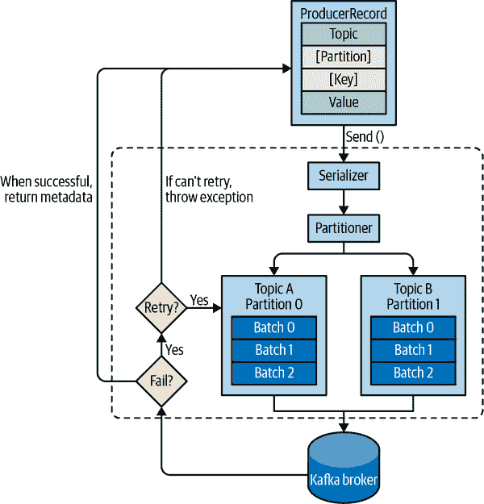
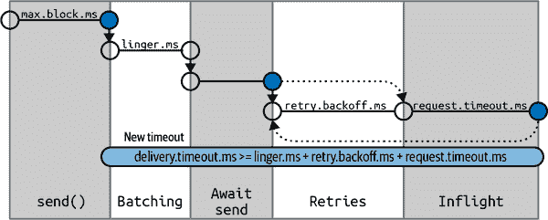
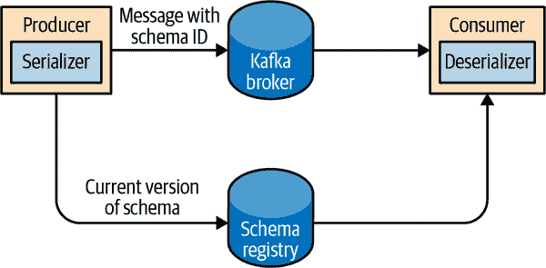

# 第三章：Kafka 生产者：向 Kafka 写入消息

无论您将 Kafka 用作队列、消息总线还是数据存储平台，您始终会通过创建一个将数据写入 Kafka 的生产者、一个从 Kafka 读取数据的消费者或一个同时扮演这两个角色的应用程序来使用 Kafka。

例如，在信用卡交易处理系统中，可能会有一个客户端应用程序，例如在线商店，负责在付款时立即将每笔交易发送到 Kafka。另一个应用程序负责立即将此交易与规则引擎进行检查，并确定交易是否被批准或拒绝。批准/拒绝响应然后可以写回 Kafka，并且响应可以传播回发起交易的在线商店。第三个应用程序可以从 Kafka 中读取交易和批准状态，并将它们存储在分析师稍后可以审查决策并可能改进规则引擎的数据库中。

Apache Kafka 附带了内置的客户端 API，开发人员在开发与 Kafka 交互的应用程序时可以使用这些 API。

在本章中，我们将学习如何使用 Kafka 生产者，首先概述其设计和组件。我们将展示如何创建`KafkaProducer`和`ProducerRecord`对象，如何将记录发送到 Kafka，以及如何处理 Kafka 可能返回的错误。然后，我们将回顾用于控制生产者行为的最重要的配置选项。最后，我们将深入了解如何使用不同的分区方法和序列化程序，以及如何编写自己的序列化程序和分区器。

在第四章中，我们将看一下 Kafka 的消费者客户端和从 Kafka 读取数据。

# 第三方客户端

除了内置的客户端，Kafka 还具有二进制的传输协议。这意味着应用程序可以通过向 Kafka 的网络端口发送正确的字节序列来从 Kafka 读取消息或向 Kafka 写入消息。有多个客户端在不同的编程语言中实现了 Kafka 的传输协议，为使用 Kafka 提供了简单的方式，不仅可以在 Java 应用程序中使用 Kafka，还可以在 C++、Python、Go 等语言中使用。这些客户端不是 Apache Kafka 项目的一部分，但非 Java 客户端的列表在[项目维基](https://oreil.ly/9SbJr)中进行了维护。传输协议和外部客户端不在本章的范围内。

# 生产者概述

应用程序可能需要将消息写入 Kafka 的原因有很多：记录用户活动以进行审计或分析，记录指标，存储日志消息，记录智能设备的信息，与其他应用程序异步通信，在写入数据库之前缓冲信息等等。

这些不同的用例也意味着不同的要求：每条消息都很重要吗，还是我们可以容忍消息的丢失？我们可以意外复制消息吗？我们需要支持任何严格的延迟或吞吐量要求吗？

在我们之前介绍的信用卡交易处理示例中，我们可以看到绝对不能丢失任何一条消息或重复任何消息是至关重要的。延迟应该很低，但可以容忍高达 500 毫秒的延迟，吞吐量应该非常高-我们预计每秒处理高达一百万条消息。

不同的用例可能是存储来自网站的点击信息。在这种情况下，可以容忍一些消息丢失或少量重复；延迟可以很高，只要不影响用户体验。换句话说，如果消息需要几秒钟才能到达 Kafka，只要用户点击链接后下一页立即加载即可。吞吐量将取决于我们预期在网站上的活动水平。

不同的要求将影响您使用生产者 API 向 Kafka 写入消息的方式以及您使用的配置。

虽然生产者 API 非常简单，但在发送数据时，在生产者的幕后会发生更多事情。图 3-1 显示了发送数据到 Kafka 涉及的主要步骤。



###### 图 3-1：Kafka 生产者组件的高级概述

我们通过创建`ProducerRecord`开始向 Kafka 生产消息，其中必须包括我们要将记录发送到的主题和一个值。可选地，我们还可以指定一个键、一个分区、一个时间戳和/或一组标头。一旦我们发送`ProducerRecord`，生产者将首先将键和值对象序列化为字节数组，以便可以通过网络发送。

接下来，如果我们没有明确指定分区，数据将被发送到分区器。分区器将为我们选择一个分区，通常基于`ProducerRecord`键。一旦选择了分区，生产者就知道记录将要发送到哪个主题和分区。然后，它将记录添加到一批记录中，这些记录也将发送到相同的主题和分区。一个单独的线程负责将这些记录批次发送到适当的 Kafka 代理。

当代理接收到消息时，它会发送回一个响应。如果消息成功写入 Kafka，它将返回一个带有记录所在主题、分区和偏移量的`RecordMetadata`对象。如果代理未能写入消息，它将返回一个错误。当生产者收到错误时，它可能会在放弃并返回错误之前尝试重新发送消息几次。

# 构建 Kafka 生产者

向 Kafka 写入消息的第一步是创建一个具有要传递给生产者的属性的生产者对象。Kafka 生产者有三个必填属性：

`bootstrap.servers`

代理将用于建立与 Kafka 集群的初始连接的`host:port`对列表。此列表不需要包括所有代理，因为生产者在初始连接后会获取更多信息。但建议至少包括两个，这样如果一个代理宕机，生产者仍然能够连接到集群。

`key.serializer`

将用于将我们将要生产到 Kafka 的记录的键序列化的类的名称。Kafka 代理期望消息的键和值为字节数组。但是，生产者接口允许使用参数化类型，将任何 Java 对象作为键和值发送。这使得代码非常易读，但也意味着生产者必须知道如何将这些对象转换为字节数组。`key.serializer`应设置为实现`org.apache.kafka.common.serialization.Serializer`接口的类的名称。生产者将使用此类将键对象序列化为字节数组。Kafka 客户端包括`ByteArraySerializer`（几乎不做任何事情）、`String​Serial⁠izer`、`IntegerSerializer`等等，因此如果使用常见类型，则无需实现自己的序列化程序。即使您只打算发送值，也需要设置`key.serializer`，但是您可以使用`Void`类型作为键和`VoidSerializer`。

`value.serializer`

将用于将我们将要生产到 Kafka 的记录的值序列化的类的名称。与设置`key.serializer`的方式相同，将`value.serializer`设置为将序列化消息值对象的类的名称。

以下代码片段显示了如何通过仅设置必填参数并对其他所有内容使用默认值来创建新的生产者：

```java
Properties kafkaProps = new Properties(); ①
kafkaProps.put("bootstrap.servers", "broker1:9092,broker2:9092");

kafkaProps.put("key.serializer",
    "org.apache.kafka.common.serialization.StringSerializer"); ②
kafkaProps.put("value.serializer",
    "org.apache.kafka.common.serialization.StringSerializer");

producer = new KafkaProducer<String, String>(kafkaProps); ③
```

①

我们从一个`Properties`对象开始。

②

由于我们打算使用字符串作为消息的键和值，我们使用内置的`StringSerializer`。

③

在这里，我们通过设置适当的键和值类型并传递`Properties`对象来创建一个新的生产者。

通过这样一个简单的接口，很明显大部分对生产者行为的控制是通过设置正确的配置属性来完成的。Apache Kafka 文档涵盖了所有的[配置选项](http://bit.ly/2sMu1c8)，我们稍后会在本章中讨论重要的选项。

一旦我们实例化了一个生产者，就是发送消息的时候了。有三种主要的发送消息的方法：

发送并忘

我们向服务器发送一条消息，实际上并不在乎它是否成功到达。大多数情况下，它会成功到达，因为 Kafka 是高度可用的，生产者会自动重试发送消息。然而，在不可重试的错误或超时的情况下，消息将丢失，应用程序将不会得到任何关于此的信息或异常。

同步发送

从技术上讲，Kafka 生产者总是异步的——我们发送一条消息，`send()`方法返回一个`Future`对象。然而，我们使用`get()`来等待`Future`，看看`send()`是否成功发送了下一条记录。

异步发送

我们调用`send()`方法并陦用一个回调函数，当它从 Kafka 代理接收到响应时会触发。

在接下来的示例中，我们将看到如何使用这些方法发送消息以及如何处理可能发生的不同类型的错误。

虽然本章中的所有示例都是单线程的，但生产者对象可以被多个线程使用来发送消息。

# 发送消息到 Kafka

发送消息的最简单方法如下：

```java
ProducerRecord<String, String> record =
    new ProducerRecord<>("CustomerCountry", "Precision Products",
        "France"); ①
try {
    producer.send(record); ②
} catch (Exception e) {
    e.printStackTrace(); ③
}
```

①

生产者接受`ProducerRecord`对象，因此我们首先创建一个。`ProducerRecord`有多个构造函数，我们稍后会讨论。这里我们使用一个需要发送数据的主题名称（始终为字符串）以及我们要发送到 Kafka 的键和值的构造函数，这些键和值在这种情况下也是字符串。键和值的类型必须与我们的`key serializer`和`value serializer`对象匹配。

②

我们使用生产者对象的`send()`方法来发送`ProducerRecord`。正如我们在图 3-1 中看到的生产者架构图中一样，消息将被放入缓冲区，并将在单独的线程中发送到代理。`send()`方法返回一个带有`RecordMetadata`的[Java `Future`对象](http://bit.ly/2rG7Cg6)，但由于我们简单地忽略了返回值，我们无法知道消息是否成功发送。这种发送消息的方法可以在默默丢弃消息时使用。这在生产应用中通常不是这种情况。

③

虽然我们忽略了发送消息到 Kafka 代理或代理本身可能发生的错误，但如果生产者在发送消息到 Kafka 之前遇到错误，我们仍然可能会得到异常。例如，当无法序列化消息时会出现`SerializationException`，如果缓冲区已满会出现`Buffer​ExhaustedException`或`TimeoutException`，或者如果发送线程被中断会出现`InterruptException`。

## 同步发送消息

同步发送消息很简单，但仍允许生产者在 Kafka 响应生产请求时出现错误或发送重试次数耗尽时捕获异常。涉及的主要权衡是性能。根据 Kafka 集群的繁忙程度，代理可能需要 2 毫秒到几秒钟的时间来响应生产请求。如果您同步发送消息，发送线程将花费这段时间等待，不做其他任何事情，甚至不发送其他消息。这会导致性能非常差，因此通常不会在生产应用程序中使用同步发送（但在代码示例中非常常见）。

同步发送消息的最简单方法如下：

```java
ProducerRecord<String, String> record =
    new ProducerRecord<>("CustomerCountry", "Precision Products", "France");
try {
    producer.send(record).get(); ①
} catch (Exception e) {
    e.printStackTrace(); ②
}
```

①

在这里，我们使用`Future.get()`来等待 Kafka 的回复。如果记录未成功发送到 Kafka，此方法将抛出异常。如果没有错误，我们将获得一个`RecordMetadata`对象，可以用它来检索消息写入的偏移量和其他元数据。

②

如果在发送记录到 Kafka 之前或期间出现任何错误，我们将遇到异常。在这种情况下，我们只需打印我们遇到的任何异常。

`KafkaProducer`有两种类型的错误。*可重试*错误是可以通过重新发送消息来解决的错误。例如，连接错误可以解决，因为连接可能会重新建立。当为分区选举新领导者并刷新客户端元数据时，“非分区领导者”错误可以解决。`KafkaProducer`可以配置为自动重试这些错误，因此应用程序代码只有在重试次数耗尽且错误未解决时才会收到可重试的异常。有些错误不会通过重试解决，例如“消息大小过大”。在这些情况下，`KafkaProducer`不会尝试重试，并将立即返回异常。

## 异步发送消息

假设我们的应用程序与 Kafka 集群之间的网络往返时间为 10 毫秒。如果我们在发送每条消息后等待回复，发送 100 条消息将花费大约 1 秒钟。另一方面，如果我们只发送所有消息而不等待任何回复，那么发送 100 条消息几乎不需要任何时间。在大多数情况下，我们确实不需要回复，Kafka 在写入记录后会发送主题、分区和偏移量，通常发送应用程序不需要。另一方面，我们确实需要知道何时无法完全发送消息，以便我们可以抛出异常、记录错误，或者将消息写入“错误”文件以供以后分析。

要异步发送消息并仍然处理错误情况，生产者支持在发送记录时添加回调。以下是我们如何使用回调的示例：

```java
private class DemoProducerCallback implements Callback { ①
    @Override
    public void onCompletion(RecordMetadata recordMetadata, Exception e) {
        if (e != null) {
            e.printStackTrace(); ②
        }
    }
}

ProducerRecord<String, String> record =
    new ProducerRecord<>("CustomerCountry", "Biomedical Materials", "USA"); ③
producer.send(record, new DemoProducerCallback()); ④
```

①

要使用回调，您需要一个实现`org.apache.kafka.clients.producer.Callback`接口的类，该接口具有一个函数`on​Com⁠ple⁠tion()`。

②

如果 Kafka 返回错误，`onCompletion()`将有一个非空异常。在这里，我们通过打印来“处理”它，但生产代码可能会有更健壮的错误处理函数。

③

记录与以前相同。

④

并在发送记录时传递一个`Callback`对象。

###### 警告

回调在生产者的主线程中执行。这保证了当我们连续向同一分区发送两条消息时，它们的回调将按照我们发送它们的顺序执行。但这也意味着回调应该相当快，以避免延迟生产者并阻止其他消息的发送。不建议在回调中执行阻塞操作。相反，您应该使用另一个线程并发执行任何阻塞操作。

# 配置生产者

到目前为止，我们对生产者的配置参数很少——只有强制的`bootstrap.servers` URI 和序列化器。

生产者有大量的配置参数，这些参数在[Apache Kafka 文档](https://oreil.ly/RkxSS)中有记录，许多参数都有合理的默认值，因此没有理由去调整每个参数。然而，一些参数对生产者的内存使用、性能和可靠性有重大影响。我们将在这里进行审查。

## client.id

`client.id`是客户端和所使用的应用程序的逻辑标识符。这可以是任何字符串，并将被经纪人用于识别从客户端发送的消息。它用于日志记录和指标以及配额。选择一个好的客户端名称将使故障排除变得更容易——这是“我们看到 IP 104.27.155.134 的身份验证失败率很高”和“看起来订单验证服务无法进行身份验证——你能让劳拉来看一下吗？”之间的区别。

## acks

`acks`参数控制生产者在可以考虑写入成功之前必须接收记录的分区副本数量。默认情况下，Kafka 将在领导者接收记录后回复记录已成功写入（预计 Apache Kafka 的 3.0 版本将更改此默认值）。此选项对写入消息的持久性有重大影响，根据您的用例，可能默认值不是最佳选择。第七章深入讨论了 Kafka 的可靠性保证，但现在让我们回顾一下`acks`参数的三个允许值：

`acks=0`

生产者在假定消息成功发送之前不会等待经纪人的回复。这意味着如果出现问题，经纪人没有收到消息，生产者将不会知道，消息将丢失。然而，由于生产者不等待服务器的任何响应，它可以以网络支持的速度发送消息，因此可以使用此设置来实现非常高的吞吐量。

`acks=1`

生产者将在领导者副本接收到消息时从经纪人那里收到成功响应。如果消息无法写入领导者（例如，如果领导者崩溃并且尚未选举出新的领导者），生产者将收到错误响应，并可以重试发送消息，避免数据的潜在丢失。如果领导者崩溃并且最新的消息尚未复制到新的领导者，消息仍可能丢失。

`acks=all`

一旦所有同步副本接收到消息，生产者将从经纪人那里收到成功响应。这是最安全的模式，因为您可以确保不止一个经纪人收到了消息，并且即使发生崩溃，消息也会存活下来（有关此信息的更多信息，请参见第六章）。然而，我们在`acks=1`情况下讨论的延迟将更高，因为我们将等待不止一个经纪人接收消息。

###### 提示

您会发现，使用较低且不太可靠的`acks`配置，生产者将能够更快地发送记录。这意味着您在可靠性和*生产者延迟*之间进行权衡。但是，*端到端延迟*是从记录生成到可供消费者读取的时间，并且对于所有三个选项都是相同的。原因是，为了保持一致性，Kafka 不会允许消费者读取记录，直到它们被写入所有同步副本。因此，如果您关心端到端延迟，而不仅仅是生产者延迟，那么就没有权衡可做：如果选择最可靠的选项，您将获得相同的端到端延迟。

## 消息传递时间

生产者具有多个配置参数，这些参数相互作用以控制开发人员最感兴趣的行为之一：直到`send()`调用成功或失败需要多长时间。这是我们愿意花费的时间，直到 Kafka 成功响应，或者我们愿意放弃并承认失败。

多年来，配置及其行为已经多次修改。我们将在这里描述最新的实现，即 Apache Kafka 2.1 中引入的实现。

自 Apache Kafka 2.1 以来，我们将发送`ProduceRecord`的时间分为两个分别处理的时间间隔：

+   从调用`send()`的异步调用返回的时间。在此期间，调用`send()`的线程将被阻塞。

+   从异步调用`send()`成功返回直到触发回调（成功或失败）的时间。这与从将`Produce​Re⁠cord`放入批处理以进行发送直到 Kafka 以成功、不可重试的失败或我们用于发送的时间用完为止是相同的。

###### 注意

如果您同步使用`send()`，发送线程将连续阻塞两个时间间隔，并且您将无法知道每个时间间隔花费了多少时间。我们将讨论常见和推荐的情况，即异步使用`send()`，并带有回调。

生产者内部数据流以及不同配置参数如何相互影响的流程可以在图 3-2 中总结。¹



###### 图 3-2：Kafka 生产者内传递时间分解的序列图

我们将介绍用于控制在这两个时间间隔中等待的时间以及它们如何相互作用的不同配置参数。

### max.block.ms

此参数控制在调用`send()`时和通过`partitionsFor()`显式请求元数据时，生产者可能阻塞的时间。当生产者的发送缓冲区已满或元数据不可用时，这些方法可能会阻塞。当达到`max.block.ms`时，将抛出超时异常。

### delivery.timeout.ms

此配置将限制从记录准备发送（`send()`成功返回并将记录放入批处理）的时间，直到经纪人响应或客户端放弃，包括重试所花费的时间。如您在图 3-2 中所见，此时间应大于`linger.ms`和`request.timeout.ms`。如果尝试使用不一致的超时配置创建生产者，将会收到异常。消息可以成功发送的速度远快于`delivery.timeout.ms`，通常会更快。

如果生产者在重试时超过`delivery.timeout.ms`，则回调将使用与重试前经纪人返回的错误对应的异常进行调用。如果在记录批次仍在等待发送时超过`delivery.timeout.ms`，则回调将使用超时异常进行调用。

###### 提示

您可以将交付超时配置为您希望等待消息发送的最长时间，通常是几分钟，然后保持默认的重试次数（几乎是无限的）。使用这个配置，只要有时间继续尝试（或者直到成功），生产者将一直重试。这是一个更合理的重试方式。我们通常调整重试的过程是：“在发生代理崩溃的情况下，通常需要 30 秒才能完成领导者选举，所以让我们保持重试 120 秒，以防万一。”而不是将这种心理对话转化为重试次数和重试之间的时间，您只需将“deliver.timeout.ms”配置为 120。

### request.timeout.ms

这个参数控制生产者在发送数据时等待服务器回复的时间。请注意，这是在每个生产者请求等待回复的时间，而不包括重试、发送前的等待等。如果超时而没有回复，生产者将要么重试发送，要么用“TimeoutException”完成回调。

### 重试和 retry.backoff.ms

当生产者从服务器收到错误消息时，错误可能是暂时的（例如，分区没有领导者）。在这种情况下，“重试”参数的值将控制生产者在放弃并通知客户端出现问题之前重试发送消息的次数。默认情况下，生产者在重试之间会等待 100 毫秒，但您可以使用“retry.backoff.ms”参数来控制这一点。

我们建议不要在当前版本的 Kafka 中使用这些参数。相反，测试从崩溃的代理中恢复需要多长时间（即直到所有分区获得新领导者），并设置“delivery.timeout.ms”，使得重试的总时间长于 Kafka 集群从崩溃中恢复所需的时间——否则，生产者会放弃得太早。

并非所有的错误都会被生产者重试。一些错误不是暂时的，不会导致重试（例如，“消息过大”错误）。一般来说，因为生产者为您处理重试，所以在您自己的应用逻辑中处理重试是没有意义的。您将希望将精力集中在处理不可重试的错误或重试尝试耗尽的情况上。

###### 提示

如果您想完全禁用重试，将“retries=0”设置为唯一的方法。

## linger.ms

“linger.ms”控制在发送当前批次之前等待额外消息的时间。默认情况下，生产者会在当前批次已满或达到“linger.ms”限制时发送消息。默认情况下，只要有发送线程可用来发送消息，生产者就会立即发送消息，即使批次中只有一条消息。通过将“linger.ms”设置为大于 0，我们指示生产者在将批次发送到代理之前等待几毫秒以添加额外的消息到批次中。这会稍微增加延迟，并显著增加吞吐量——每条消息的开销要低得多，如果启用了压缩，压缩效果会更好。

## buffer.memory

这个配置设置了生产者用来缓冲等待发送到代理的消息的内存量。如果应用程序发送消息的速度比它们被传递到服务器的速度快，生产者可能会用完空间，而额外的“send（）”调用将会阻塞“max.block.ms”并等待空间释放，然后才会抛出异常。请注意，与大多数生产者异常不同，这个超时是由“send（）”而不是由结果“Future”抛出的。

## compression.type

默认情况下，消息是未压缩的。此参数可以设置为`snappy`、`gzip`、`lz4`或`zstd`，在这种情况下，将使用相应的压缩算法对数据进行压缩，然后将其发送到经纪人。Snappy 压缩是由 Google 发明的，以提供良好的压缩比和低 CPU 开销以及良好的性能，因此在性能和带宽都受到关注的情况下建议使用。Gzip 压缩通常会使用更多的 CPU 和时间，但会产生更好的压缩比，因此在网络带宽更受限制的情况下建议使用。通过启用压缩，可以减少网络利用率和存储，这在向 Kafka 发送消息时通常是瓶颈。

## batch.size

当多条记录发送到同一分区时，生产者将它们批量处理在一起。此参数控制每个批次将用于的字节内存量（而不是消息！）。当批次满了，批次中的所有消息将被发送。但是，这并不意味着生产者会等待批次变满。生产者将发送半满的批次，甚至只有一条消息的批次。因此，将批次大小设置得太大不会导致发送消息的延迟；它只会使用更多的内存用于批次。将批次大小设置得太小会增加一些开销，因为生产者需要更频繁地发送消息。

## max.in.flight.requests.per.connection

这控制生产者在未收到响应的情况下向服务器发送多少消息批次。较高的设置可以增加内存使用量，同时提高吞吐量。[Apache 的维基实验显示](https://oreil.ly/NZmJ0)，在单个 DC 环境中，通过只有 2 个飞行请求可以实现最大吞吐量；然而，默认值为 5 并显示类似的性能。

# 顺序保证

Apache Kafka 保留分区内消息的顺序。这意味着如果消息按特定顺序从生产者发送，经纪人将按照该顺序将它们写入分区，并且所有消费者将按照该顺序读取它们。对于某些用例，顺序非常重要。在账户中存入 100 美元并稍后取款，与相反的顺序之间存在很大的区别！然而，某些用例则不太敏感。

将“重试”参数设置为非零，并将“每个连接的最大飞行请求数”设置为大于 1 意味着可能会发生经纪人无法写入第一批消息，成功写入第二批（已经在飞行中），然后重试第一批并成功，从而颠倒顺序。

由于出于性能原因，我们希望至少有两个飞行请求，并出于可靠性原因，希望有较高数量的重试，因此最佳解决方案是设置`enable.idempotence=true`。这可以保证最多有五个飞行请求的消息排序，并且保证重试不会引入重复。第八章深入讨论了幂等生产者。

## max.request.size

此设置控制生产者发送的生产请求的大小。它限制了可以发送的最大消息的大小以及生产者可以在一个请求中发送的消息数量。例如，默认的最大请求大小为 1 MB，您可以发送的最大消息为 1 MB，或者生产者可以将 1,024 条大小为 1 KB 的消息批量处理成一个请求。此外，经纪人对其将接受的最大消息大小也有限制（`message.max.bytes`）。通常最好将这些配置匹配起来，这样生产者就不会尝试发送经纪人拒绝的大小的消息。

## receive.buffer.bytes 和 send.buffer.bytes

这些是在写入和读取数据时套接字使用的 TCP 发送和接收缓冲区的大小。如果将它们设置为-1，将使用操作系统的默认值。当生产者或消费者与不同数据中心的代理进行通信时，建议增加这些值，因为这些网络链接通常具有更高的延迟和较低的带宽。

## enable.idempotence

从 0.11 版本开始，Kafka 支持*仅一次*语义。仅一次是一个相当大的主题，我们将专门为此撰写一整章，但幂等生产者是其中一个简单且非常有益的部分。

假设您配置生产者以最大化可靠性：`acks=all`和一个相当大的`delivery.timeout.ms`以允许足够的重试。这样可以确保每条消息至少会被写入 Kafka 一次。在某些情况下，这意味着消息将被写入 Kafka 多次。例如，假设代理从生产者接收到一条记录，将其写入本地磁盘，并成功地复制到其他代理，但然后第一个代理在发送响应给生产者之前崩溃了。生产者将等待直到达到`request.​time⁠out.ms`然后重试。重试将发送到已经成功复制了此记录的新领导者。现在您有了一个重复的记录。

为了避免这种情况，您可以设置`enable.idempotence=true`。启用幂等生产者后，生产者将为发送的每条记录附加一个序列号。如果代理接收到具有相同序列号的记录，它将拒绝第二份副本，生产者将收到无害的`DuplicateSequenceException`。

###### 注意

启用幂等性要求`max.in.flight.requests.per.​con⁠nection`小于或等于 5，`retries`大于 0，`acks=all`。如果设置了不兼容的值，将抛出`ConfigException`。

# 序列化程序

正如在之前的例子中所看到的，生产者配置包括强制性的序列化程序。我们已经看到了如何使用默认的`String`序列化程序。Kafka 还包括整数、`ByteArrays`等许多序列化程序，但这并不能涵盖大多数用例。最终，您将希望能够序列化更通用的记录。

我们将首先展示如何编写自己的序列化程序，然后介绍 Avro 序列化程序作为一个推荐的替代方案。

## 自定义序列化程序

当您需要发送到 Kafka 的对象不是简单的字符串或整数时，您可以选择使用通用序列化库（如 Avro、Thrift 或 Protobuf）创建记录，或者为您已经使用的对象创建自定义序列化。我们强烈建议使用通用序列化库。为了理解序列化程序的工作原理以及为什么使用序列化库是一个好主意，让我们看看编写自己的自定义序列化程序需要做些什么。

假设我们不仅仅记录客户的姓名，而是创建一个简单的类来表示客户：

```java
public class Customer {
    private int customerID;
    private String customerName;

    public Customer(int ID, String name) {
        this.customerID = ID;
        this.customerName = name;
    }

    public int getID() {
        return customerID;
    }

    public String getName() {
        return customerName;
    }
}
```

现在假设我们想为这个类创建一个自定义的序列化程序。它看起来会像这样：

```java
import org.apache.kafka.common.errors.SerializationException;

import java.nio.ByteBuffer;
import java.util.Map;

public class CustomerSerializer implements Serializer<Customer> {

    @Override
    public void configure(Map configs, boolean isKey) {
        // nothing to configure
    }

    @Override
    /**
    We are serializing Customer as:
    4 byte int representing customerId
    4 byte int representing length of customerName in UTF-8 bytes (0 if
        name is Null)
    N bytes representing customerName in UTF-8
    **/
    public byte[] serialize(String topic, Customer data) {
        try {
            byte[] serializedName;
            int stringSize;
            if (data == null)
                return null;
            else {
                if (data.getName() != null) {
                    serializedName = data.getName().getBytes("UTF-8");
                    stringSize = serializedName.length;
                } else {
                    serializedName = new byte[0];
                    stringSize = 0;
                }
            }

            ByteBuffer buffer = ByteBuffer.allocate(4 + 4 + stringSize);
            buffer.putInt(data.getID());
            buffer.putInt(stringSize);
            buffer.put(serializedName);

            return buffer.array();
        } catch (Exception e) {
            throw new SerializationException(
                "Error when serializing Customer to byte[] " + e);
        }
    }

    @Override
    public void close() {
        // nothing to close
    }
}
```

使用这个`CustomerSerializer`配置生产者将允许您定义`ProducerRecord<String, Customer>`，并发送`Customer`数据并直接将`Customer`对象传递给生产者。这个例子很简单，但您可以看到代码是多么脆弱。例如，如果我们有太多的客户，并且需要将`customerID`更改为`Long`，或者如果我们决定向`Customer`添加一个`startDate`字段，那么在维护旧消息和新消息之间的兼容性方面将会出现严重问题。在不同版本的序列化程序和反序列化程序之间调试兼容性问题是相当具有挑战性的：您需要比较原始字节数组。更糟糕的是，如果同一家公司的多个团队最终都向 Kafka 写入`Customer`数据，他们都需要使用相同的序列化程序并同时修改代码。

因此，我们建议使用现有的序列化器和反序列化器，如 JSON、Apache Avro、Thrift 或 Protobuf。在接下来的部分中，我们将描述 Apache Avro，然后展示如何序列化 Avro 记录并将其发送到 Kafka。

## 使用 Apache Avro 进行序列化

Apache Avro 是一种语言中立的数据序列化格式。该项目由 Doug Cutting 创建，旨在为大众提供一种共享数据文件的方式。

Avro 数据是用语言无关的模式描述的。模式通常用 JSON 描述，序列化通常是到二进制文件，尽管也支持序列化到 JSON。Avro 假定在读取和写入文件时存在模式，通常是通过将模式嵌入文件本身来实现。

Avro 最有趣的特性之一，也是使其适合在 Kafka 等消息系统中使用的原因之一，是当编写消息的应用程序切换到新的但兼容的模式时，读取数据的应用程序可以继续处理消息而无需任何更改或更新。

假设原始模式是：

```java
{"namespace": "customerManagement.avro",
 "type": "record",
 "name": "Customer",
 "fields": [
     {"name": "id", "type": "int"},
     {"name": "name",  "type": "string"},
     {"name": "faxNumber", "type": ["null", "string"], "default": "null"} ①
 ]
}
```

①

`id`和`name`字段是必需的，而`faxNumber`是可选的，默认为`null`。

我们在这个模式下使用了几个月，并以这种格式生成了几 TB 的数据。现在假设我们决定在新版本中，我们将升级到 21 世纪，不再包含传真号码字段，而是使用电子邮件字段。

新模式将是：

```java
{"namespace": "customerManagement.avro",
 "type": "record",
 "name": "Customer",
 "fields": [
     {"name": "id", "type": "int"},
     {"name": "name",  "type": "string"},
     {"name": "email", "type": ["null", "string"], "default": "null"}
 ]
}
```

现在，在升级到新版本后，旧记录将包含`faxNumber`，新记录将包含`email`。在许多组织中，升级是缓慢进行的，需要花费很多个月的时间。因此，我们需要考虑如何处理仍然使用传真号码的升级前应用程序和使用电子邮件的升级后应用程序在 Kafka 中的所有事件。

读取应用程序将包含类似于`getName()`、`getId()`和`getFaxNumber()`的方法调用。如果遇到使用新模式编写的消息，`getName()`和`getId()`将继续工作而无需修改，但`getFaxNumber()`将返回`null`，因为消息不包含传真号码。

现在假设我们升级了我们的读取应用程序，它不再具有`getFaxNumber()`方法，而是`getEmail()`。如果遇到使用旧模式编写的消息，`getEmail()`将返回`null`，因为旧消息不包含电子邮件地址。

这个例子说明了使用 Avro 的好处：即使我们在消息中改变了模式，而不改变所有读取数据的应用程序，也不会出现异常或破坏错误，也不需要昂贵的现有数据更新。

然而，这种情况有两个注意事项：

+   写入数据使用的模式和读取应用程序期望的模式必须是兼容的。Avro 文档包括[兼容性规则](http://bit.ly/2t9FmEb)。

+   反序列化器将需要访问写入数据时使用的模式，即使它与应用程序期望的模式不同。在 Avro 文件中，写入模式包含在文件本身中，但对于 Kafka 消息，有一种更好的处理方式。我们将在下面看到这一点。

## 使用 Avro 记录与 Kafka

与 Avro 文件不同，将整个模式存储在数据文件中与相当合理的开销相关联，将整个模式存储在每个记录中通常会使记录大小增加一倍以上。但是，Avro 仍然要求在读取记录时整个模式都存在，因此我们需要在其他地方定位模式。为了实现这一点，我们遵循一个常见的架构模式，并使用 *模式注册表*。模式注册表不是 Apache Kafka 的一部分，但有几个开源选项可供选择。我们将在此示例中使用 Confluent Schema Registry。您可以在 [GitHub](https://oreil.ly/htoZK) 上找到模式注册表代码，或者您可以将其作为 [Confluent Platform](https://oreil.ly/n2V71) 的一部分安装。如果决定使用模式注册表，我们建议查看 [Confluent 上的文档](https://oreil.ly/yFkTX)。

将所有用于将数据写入 Kafka 的模式存储在注册表中。然后我们只需在我们产生到 Kafka 的记录中存储模式的标识符。消费者随后可以使用标识符从模式注册表中提取记录并反序列化数据。关键在于所有这些工作——将模式存储在注册表中并在需要时提取模式——都是在序列化器和反序列化器中完成的。将数据生成到 Kafka 的代码就像使用任何其他序列化器一样使用 Avro 序列化器。图 3-3 展示了这个过程。



###### 图 3-3\. Avro 记录的序列化和反序列化流程

以下是如何将生成的 Avro 对象发送到 Kafka 的示例（请参阅 [Avro 文档](https://oreil.ly/klcjK) 了解如何从 Avro 模式生成对象）：

```java
Properties props = new Properties();

props.put("bootstrap.servers", "localhost:9092");
props.put("key.serializer",
   "io.confluent.kafka.serializers.KafkaAvroSerializer");
props.put("value.serializer",
   "io.confluent.kafka.serializers.KafkaAvroSerializer"); ①
props.put("schema.registry.url", schemaUrl); ②

String topic = "customerContacts";

Producer<String, Customer> producer = new KafkaProducer<>(props); ③

// We keep producing new events until someone ctrl-c
while (true) {
    Customer customer = CustomerGenerator.getNext(); ④
    System.out.println("Generated customer " +
        customer.toString());
    ProducerRecord<String, Customer> record =
        new ProducerRecord<>(topic, customer.getName(), customer); ⑤
    producer.send(record); 
}
```

①

我们使用 `KafkaAvroSerializer` 来使用 Avro 序列化我们的对象。请注意，`KafkaAvroSerializer` 也可以处理原始类型，这就是为什么我们后来可以使用 `String` 作为记录键，而我们的 `Customer` 对象作为值。

②

`schema.registry.url` 是 Avro 序列化器的配置，将被生产者传递给序列化器。它简单地指向我们存储模式的位置。

③

`Customer` 是我们生成的对象。我们告诉生产者我们的记录将包含 `Customer` 作为值。

④

`Customer` 类不是常规的 Java 类（普通的旧的 Java 对象，或 POJO），而是一个专门的 Avro 对象，使用 Avro 代码生成从模式生成。Avro 序列化器只能序列化 Avro 对象，而不是 POJO。生成 Avro 类可以使用 *avro-tools.jar* 或 Avro Maven 插件来完成，这两者都是 Apache Avro 的一部分。有关如何生成 Avro 类的详细信息，请参阅 [Apache Avro 入门（Java）指南](https://oreil.ly/sHGEe)。

⑤

我们还使用 `Customer` 作为值类型来实例化 `ProducerRecord`，并在创建新记录时传递一个 `Customer` 对象。


就是这样。我们发送包含我们的 `Customer` 对象的记录，`KafkaAvro​Serial⁠izer` 将处理其余部分。

Avro 还允许您使用通用 Avro 对象，这些对象用作键值映射，而不是具有与用于生成它们的模式匹配的 getter 和 setter 的生成的 Avro 对象。要使用通用 Avro 对象，您只需要提供模式：

```java
Properties props = new Properties();
props.put("bootstrap.servers", "localhost:9092");
props.put("key.serializer",
   "io.confluent.kafka.serializers.KafkaAvroSerializer"); ①
props.put("value.serializer",
   "io.confluent.kafka.serializers.KafkaAvroSerializer");
props.put("schema.registry.url", url); ②

String schemaString =
    "{\"namespace\": \"customerManagement.avro\",
     "\"type\": \"record\", " + ③
     "\"name\": \"Customer\"," +
     "\"fields\": [" +
      "{\"name\": \"id\", \"type\": \"int\"}," +
      "{\"name\": \"name\", \"type\": \"string\"}," +
      "{\"name\": \"email\", \"type\": " + "[\"null\",\"string\"], " +
       "\"default\":\"null\" }" +
    "]}";
Producer<String, GenericRecord> producer =
   new KafkaProducer<String, GenericRecord>(props); ④

Schema.Parser parser = new Schema.Parser();
Schema schema = parser.parse(schemaString);

for (int nCustomers = 0; nCustomers < customers; nCustomers++) {
    String name = "exampleCustomer" + nCustomers;
    String email = "example " + nCustomers + "@example.com";

    GenericRecord customer = new GenericData.Record(schema); ⑤
    customer.put("id", nCustomers);
    customer.put("name", name);
    customer.put("email", email);

    ProducerRecord<String, GenericRecord> data =
        new ProducerRecord<>("customerContacts", name, customer);
    producer.send(data);
}
```

①

我们仍然使用相同的`KafkaAvroSerializer`。

②

我们提供相同模式注册表的 URI。

③

但现在我们还需要提供 Avro 模式，因为它不是由 Avro 生成的对象提供的。

④

我们的对象类型是 Avro `GenericRecord`，我们使用我们的模式和我们想要写入的数据初始化它。

⑤

然后，`ProducerRecord`的值只是包含我们的模式和数据的`GenericRecord`。序列化程序将知道如何从此记录中获取模式，将其存储在模式注册表中，并对对象数据进行序列化。

# 分区

在先前的示例中，我们创建的`ProducerRecord`对象包括主题名称、键和值。Kafka 消息是键值对，虽然可以只使用主题和值创建`ProducerRecord`，并且默认情况下将键设置为`null`，但大多数应用程序都会生成带有键的记录。键有两个目标：它们是存储在消息中的附加信息，通常也用于决定消息将写入哪个主题分区（键在压缩主题中也起着重要作用，我们将在第六章中讨论这些内容）。具有相同键的所有消息将进入同一分区。这意味着如果进程只读取主题中的一部分分区（有关详细信息，请参阅第四章），则单个键的所有记录将由同一进程读取。要创建键值记录，只需创建`ProducerRecord`如下所示：

```java
ProducerRecord<String, String> record =
    new ProducerRecord<>("CustomerCountry", "Laboratory Equipment", "USA");
```

在创建具有空键的消息时，可以简单地将键省略：

```java
ProducerRecord<String, String> record =
    new ProducerRecord<>("CustomerCountry", "USA"); ①
```

①

在这里，键将简单地设置为`null`。

当键为`null`且使用默认分区器时，记录将随机发送到主题的可用分区之一。循环算法将用于在分区之间平衡消息。从 Apache Kafka 2.4 生产者开始，默认分区器在处理空键时使用的循环算法是粘性的。这意味着它将在切换到下一个分区之前填充发送到单个分区的一批消息。这允许以更少的请求将相同数量的消息发送到 Kafka，从而降低延迟并减少代理上的 CPU 利用率。

如果存在键并且使用默认分区器，则 Kafka 将对键进行哈希处理（使用自己的哈希算法，因此当 Java 升级时哈希值不会更改），并使用结果将消息映射到特定分区。由于关键始终映射到同一分区很重要，因此我们使用主题中的所有分区来计算映射，而不仅仅是可用分区。这意味着如果在写入数据时特定分区不可用，则可能会出现错误。这是相当罕见的，正如您将在第七章中看到的，当我们讨论 Kafka 的复制和可用性时。

除了默认的分区器，Apache Kafka 客户端还提供了`RoundRobinPartitioner`和`UniformStickyPartitioner`。即使消息具有键，这些分配随机分区和粘性随机分区分配。当键对于消费应用程序很重要时（例如，有一些 ETL 应用程序使用 Kafka 记录的键作为从 Kafka 加载数据到关系数据库时的主键），但工作负载可能会倾斜，因此单个键可能具有不成比例的大工作负载。使用`UniformStickyPartitioner`将导致工作负载均匀分布在所有分区上。

当使用默认分区器时，键到分区的映射仅在主题中的分区数量不变时才是一致的。因此，只要分区数量保持不变，您可以确保，例如，关于用户 045189 的记录将始终被写入分区 34。这允许在从分区读取数据时进行各种优化。然而，一旦您向主题添加新的分区，这就不再保证——旧记录将保留在分区 34，而新记录可能会被写入不同的分区。当分区键很重要时，最简单的解决方案是创建具有足够分区的主题（Confluent 博客包含有关如何[选择分区数量](https://oreil.ly/ortRk)的建议），并且永远不要添加分区。

### 实施自定义分区策略

到目前为止，我们已经讨论了默认分区器的特性，这是最常用的分区器。然而，Kafka 并不限制您只能使用哈希分区，有时分区数据的原因也是很好的。例如，假设您是一家 B2B 供应商，您最大的客户是一家制造名为 Bananas 的手持设备的公司。假设您与客户“Banana”的业务量如此之大，以至于您每天超过 10%的交易都与该客户进行。如果您使用默认的哈希分区，Banana 记录将被分配到与其他帐户相同的分区，导致一个分区比其他分区大得多。这可能导致服务器空间不足，处理速度变慢等问题。我们真正想要的是给 Banana 分配自己的分区，然后使用哈希分区将其余的帐户映射到所有其他分区。

以下是一个自定义分区器的示例：

```java
import org.apache.kafka.clients.producer.Partitioner;
import org.apache.kafka.common.Cluster;
import org.apache.kafka.common.PartitionInfo;
import org.apache.kafka.common.record.InvalidRecordException;
import org.apache.kafka.common.utils.Utils;

public class BananaPartitioner implements Partitioner {

    public void configure(Map<String, ?> configs) {} ①

    public int partition(String topic, Object key, byte[] keyBytes,
                         Object value, byte[] valueBytes,
                         Cluster cluster) {
        List<PartitionInfo> partitions = cluster.partitionsForTopic(topic);
        int numPartitions = partitions.size();

        if ((keyBytes == null) || (!(key instanceOf String))) ②
            throw new InvalidRecordException("We expect all messages " +
                "to have customer name as key");

        if (((String) key).equals("Banana"))
            return numPartitions - 1; // Banana will always go to last partition

        // Other records will get hashed to the rest of the partitions
        return Math.abs(Utils.murmur2(keyBytes)) % (numPartitions - 1);
    }

    public void close() {}
}
```

①

分区器接口包括`configure`、`partition`和`close`方法。在这里，我们只实现了`partition`，尽管我们真的应该通过`configure`传递特殊的客户名称，而不是在`partition`中硬编码它。

②

我们只期望`String`键，因此如果不是这种情况，我们会抛出异常。

# 标题

记录除了键和值之外，还可以包括头。记录头使您能够向 Kafka 记录添加一些关于元数据的信息，而不向记录本身的键/值对添加任何额外信息。头通常用于表示记录中数据的来源的谱系，并根据头信息路由或跟踪消息，而无需解析消息本身（也许消息是加密的，路由器没有权限访问数据）。

头被实现为键/值对的有序集合。键始终是`String`，值可以是任何序列化对象，就像消息值一样。

以下是一个小例子，展示了如何向`ProduceRecord`添加头：

```java
ProducerRecord<String, String> record =
    new ProducerRecord<>("CustomerCountry", "Precision Products", "France");

record.headers().add("privacy-level","YOLO".getBytes(StandardCharsets.UTF_8));
```

# 拦截器

有时，您希望修改 Kafka 客户端应用程序的行为，而无需修改其代码，也许是因为您希望向组织中的所有应用程序添加相同的行为。或者您可能无法访问原始代码。

Kafka 的`ProducerInterceptor`拦截器包括两个关键方法：

`ProducerRecord<K, V> onSend(ProducerRecord<K, V> record)`

在将生成的记录发送到 Kafka 之前，甚至在序列化之前，将调用此方法。重写此方法时，您可以捕获有关发送记录的信息，甚至修改它。只需确保从此方法返回有效的`ProducerRecord`。此方法返回的记录将被序列化并发送到 Kafka。

`void onAcknowledgement(RecordMetadata metadata, Exception exception)`

如果 Kafka 响应发送的消息，则将调用此方法。该方法不允许修改来自 Kafka 的响应，但可以捕获有关响应的信息。

生产者拦截器的常见用例包括捕获监视和跟踪信息；增强消息的标准头，特别是用于血统跟踪目的；以及删除敏感信息。

这是一个非常简单的生产者拦截器示例。这个示例只是在特定时间窗口内计算发送的消息和接收的确认：

```java
public class CountingProducerInterceptor implements ProducerInterceptor {

  ScheduledExecutorService executorService =
          Executors.newSingleThreadScheduledExecutor();
  static AtomicLong numSent = new AtomicLong(0);
  static AtomicLong numAcked = new AtomicLong(0);

  public void configure(Map<String, ?> map) {
      Long windowSize = Long.valueOf(
              (String) map.get("counting.interceptor.window.size.ms")); ①
      executorService.scheduleAtFixedRate(CountingProducerInterceptor::run,
              windowSize, windowSize, TimeUnit.MILLISECONDS);
  }

  public ProducerRecord onSend(ProducerRecord producerRecord) {
      numSent.incrementAndGet();
      return producerRecord; ②
  }

  public void onAcknowledgement(RecordMetadata recordMetadata, Exception e) {
      numAcked.incrementAndGet(); ③
  }

  public void close() {
      executorService.shutdownNow(); ④
  }

  public static void run() {
      System.out.println(numSent.getAndSet(0));
      System.out.println(numAcked.getAndSet(0));
  }

}
```

①

`ProducerInterceptor`是一个`Configurable`接口。您可以重写`configure`方法并在调用任何其他方法之前进行设置。此方法接收整个生产者配置，您可以访问任何配置参数。在这种情况下，我们添加了自己的配置，并在此引用。

②

发送记录时，我们增加记录计数并返回记录而不修改它。

③

当 Kafka 响应确认时，我们增加确认计数，不需要返回任何内容。

④

当生产者关闭时，将调用此方法，让我们有机会清理拦截器状态。在这种情况下，我们关闭了创建的线程。如果您打开了文件句柄、连接到远程数据存储或类似的内容，这是关闭所有内容并避免泄漏的地方。

正如我们之前提到的，生产者拦截器可以在不更改客户端代码的情况下应用。要在`kafka-console-producer`中使用前面的拦截器，这是一个随 Apache Kafka 一起提供的示例应用程序，请按照以下三个简单步骤操作：

1.  将您的 jar 添加到类路径：

`export CLASSPATH=$CLASSPATH:~./target/CountProducerInterceptor-1.0-SNAPSHOT.jar`

1.  创建包含以下内容的配置文件：

`interceptor.classes=com.shapira.examples.interceptors.CountProducerInterceptor` `counting.interceptor.window.size.ms=10000`

1.  像通常一样运行应用程序，但确保包含在上一步中创建的配置：

`bin/kafka-console-producer.sh --broker-list localhost:9092 --topic interceptor-test --producer.config producer.config`

# 配额和限流

Kafka 代理有能力限制消息的生产和消费速率。这是通过配额机制完成的。Kafka 有三种配额类型：生产、消费和请求。生产和消费配额限制客户端发送和接收数据的速率，以每秒字节数为单位。请求配额限制代理处理客户端请求的时间百分比。

可以通过设置默认配额、特定客户端 ID、特定用户或两者来应用配额到所有客户端。用户特定的配额只在配置了安全性并且客户端进行身份验证的集群中才有意义。

应用于所有客户端的默认生产和消费配额是 Kafka 代理配置文件的一部分。例如，要限制每个生产者平均发送不超过 2 MBps，将以下配置添加到代理配置文件中：`quota.producer.default=2M`。

虽然不建议，但您也可以为某些客户端配置特定的配额，这些配额会覆盖代理配置文件中的默认配额。要允许 clientA 产生 4 MBps 和 clientB 10 MBps，您可以使用以下命令：`quota.producer.override="clientA:4M,clientB:10M"`

在 Kafka 的配置文件中指定的配额是静态的，您只能通过更改配置然后重新启动所有代理来修改它们。由于新客户端可以随时到达，这非常不方便。因此，将配额应用于特定客户端的常规方法是通过可以使用`kafka-config.sh`或 AdminClient API 设置的动态配置。

让我们看几个例子：

```java
bin/kafka-configs  --bootstrap-server localhost:9092 --alter --add-config 'producer_byte_rate=1024' --entity-name clientC --entity-type clients ①

bin/kafka-configs  --bootstrap-server localhost:9092 --alter --add-config 'producer_byte_rate=1024,consumer_byte_rate=2048' --entity-name user1 --entity-type users ②

bin/kafka-configs  --bootstrap-server localhost:9092 --alter --add-config 'consumer_byte_rate=2048' --entity-type users ③
```

①

将 clientC（通过客户端 ID 标识）限制为每秒只能产生 1024 字节

②

将 user1（通过经过身份验证的主体标识）限制为每秒只能产生 1024 字节和每秒只能消耗 2048 字节。

③

将所有用户限制为每秒只能消耗 2048 字节，除了具有更具体覆盖的用户。这是动态修改默认配额的方法。

当客户端达到配额时，代理将开始限制客户端的请求，以防止其超出配额。这意味着代理将延迟响应客户端的请求；在大多数客户端中，这将自动降低请求速率（因为在飞行请求的数量受限），并将客户端流量降至配额允许的水平。为了保护代理免受在被限制时发送额外请求的不良客户端，代理还将在所需时间内静音与客户端的通信通道，以达到符合配额的目的。

通过`produce-throttle-time-avg`、`produce-throttle-time-max`、`fetch-throttle-time-avg`和`fetch-throttle-time-max`向客户端公开了限流行为，这是由于限流而延迟生产请求和获取请求的平均和最大时间量。请注意，此时间可以代表由于生产和消费吞吐量配额、请求时间配额或两者而导致的限流。其他类型的客户端请求只能由于请求时间配额而被限流，这些请求也将通过类似的指标公开。

###### 警告

如果您使用异步`Producer.send()`并继续以高于代理可以接受的速率发送消息（无论是因为配额还是容量不足），消息将首先排队在客户端内存中。如果发送速率继续高于接受消息的速率，客户端最终将耗尽用于存储多余消息的缓冲空间，并阻塞下一个`Producer.send()`调用。如果超时延迟不足以让代理赶上生产者并在缓冲区中清理一些空间，最终`Producer.send()`将抛出`TimeoutException`。或者，一些已经放入批处理中的记录将等待的时间超过`delivery.timeout.ms`并过期，导致使用`TimeoutException`调用`send()`回调。因此，重要的是要计划和监视，以确保代理的容量随时间匹配生产者发送数据的速率。

# 摘要

我们从一个简单的生产者示例开始，只有 10 行代码将事件发送到 Kafka。我们通过添加错误处理和尝试同步和异步生产来扩展了简单示例。然后，我们探讨了最重要的生产者配置参数，并看到它们如何修改生产者的行为。我们讨论了序列化器，它让我们控制写入 Kafka 的事件的格式。我们深入研究了 Avro，这是序列化事件的许多方式之一，但在 Kafka 中非常常用。我们在本章中讨论了 Kafka 中的分区以及高级自定义分区技术的示例。

现在我们知道如何将事件写入 Kafka，在第四章中，我们将学习有关从 Kafka 消费事件的所有内容。

¹ 图像由 Sumant Tambe 根据 ASLv2 许可条款为 Apache Kafka 项目做出贡献。
