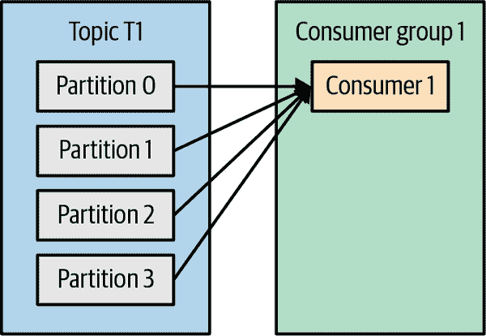
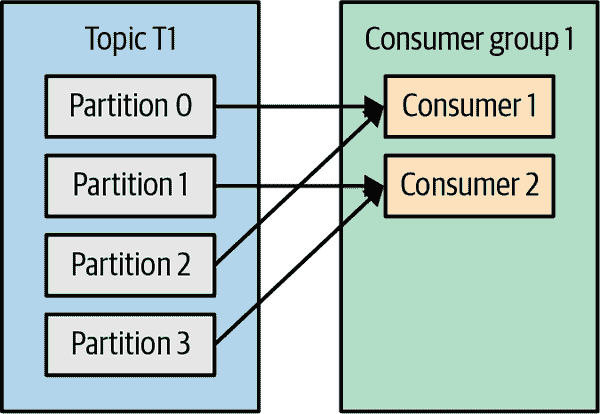
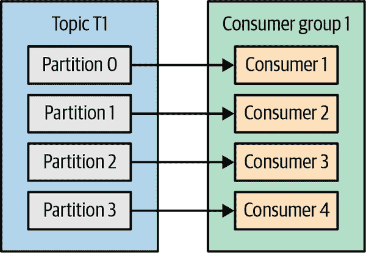
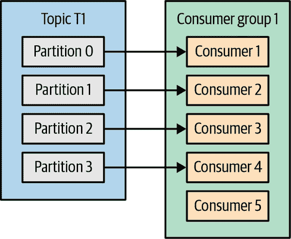
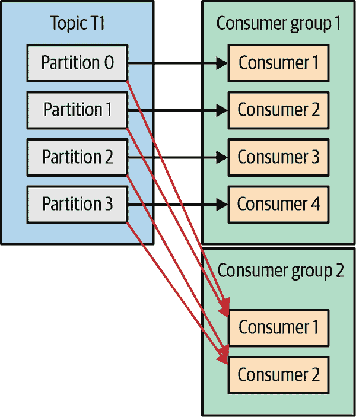
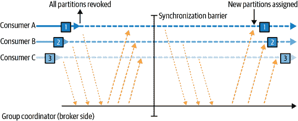
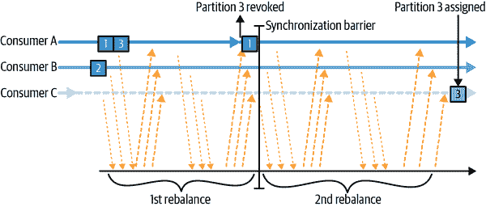
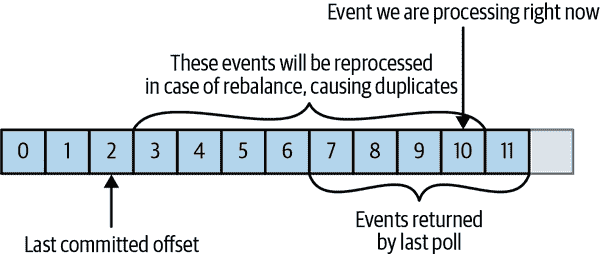
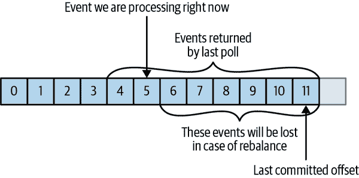

# 第四章：Kafka 消费者：从 Kafka 读取数据

需要从 Kafka 读取数据的应用程序使用`KafkaConsumer`订阅 Kafka 主题，并从这些主题接收消息。从 Kafka 读取数据与从其他消息系统读取数据有些不同，并涉及一些独特的概念和想法。如果不先了解这些概念，就很难理解如何使用消费者 API。我们将首先解释一些重要的概念，然后通过一些示例来展示不同的消费者 API 可以用于实现具有不同要求的应用程序的方式。

# Kafka 消费者概念

要理解如何从 Kafka 读取数据，首先需要了解其消费者和消费者组。以下部分涵盖了这些概念。

## 消费者和消费者组

假设您有一个应用程序需要从 Kafka 主题中读取消息，对其进行一些验证，并将结果写入另一个数据存储。在这种情况下，您的应用程序将创建一个消费者对象，订阅适当的主题，并开始接收消息，验证它们，并写入结果。这可能在一段时间内运行良好，但是如果生产者写入主题的速率超过了您的应用程序验证消息的速率，会怎么样呢？如果您只能使用一个消费者读取和处理数据，您的应用程序可能会越来越落后，无法跟上消息的到达速率。显然，有必要从主题中扩展消费。就像多个生产者可以写入同一个主题一样，我们需要允许多个消费者从同一个主题中读取数据，并将数据分割给它们。

Kafka 消费者通常是*消费者组*的一部分。当多个消费者订阅一个主题并属于同一个消费者组时，组中的每个消费者将从主题的不同子集中接收消息。

假设有一个具有四个分区的主题 T1。现在假设我们创建了一个新的消费者 C1，它是组 G1 中唯一的消费者，并使用它订阅主题 T1。消费者 C1 将从 T1 的所有四个分区接收所有消息。参见图 4-1。



###### 图 4-1：一个消费者组有四个分区

如果我们将另一个消费者 C2 添加到组 G1 中，每个消费者将只收到来自两个分区的消息。也许分区 0 和 2 的消息会发送给 C1，分区 1 和 3 的消息会发送给消费者 C2。参见图 4-2。



###### 图 4-2：四个分区分配给一个组中的两个消费者

如果 G1 有四个消费者，那么每个消费者将从单个分区读取消息。参见图 4-3。



###### 图 4-3：一个组中有四个消费者，每个消区一个

如果我们向单个主题的单个组中添加更多的消费者，超过分区数量，一些消费者将处于空闲状态，根本收不到任何消息。参见图 4-4。



###### 图 4-4：组中的消费者多于分区意味着有空闲的消费者

我们扩展 Kafka 主题的数据消费的主要方法是向消费者组添加更多的消费者。Kafka 消费者通常执行高延迟操作，例如向数据库写入或对数据进行耗时计算。在这些情况下，单个消费者不可能跟上数据流入主题的速度，通过添加更多的消费者来共享负载，使每个消费者仅拥有分区和消息的子集是我们扩展的主要方法。这是创建具有大量分区的主题的一个很好的理由——它允许在负载增加时添加更多的消费者。请记住，在主题中添加更多的消费者是没有意义的——一些消费者将处于空闲状态。第二章包括一些建议，关于如何选择主题中的分区数量。

除了添加消费者以扩展单个应用程序之外，非常常见的是有多个应用程序需要从同一个主题中读取数据。事实上，Kafka 的主要设计目标之一是使生产到 Kafka 主题的数据对组织中的许多用例都可用。在这些情况下，我们希望每个应用程序获取主题中的所有消息，而不仅仅是一个子集。为了确保应用程序获取主题中的所有消息，请确保应用程序有自己的消费者组。与许多传统的消息系统不同，Kafka 可以扩展到大量的消费者和消费者组，而不会降低性能。

在前面的例子中，如果我们添加一个新的消费者组（G2）并有一个单独的消费者，这个消费者将独立于 G1 的操作获取主题 T1 中的所有消息。G2 可以有多个消费者，这样它们将分别获取分区的子集，就像我们为 G1 所示的那样，但是 G2 作为一个整体仍将获取所有消息，而不受其他消费者组的影响。参见图 4-5。



###### 图 4-5：添加一个新的消费者组，两个组都接收所有消息

总之，为每个需要从一个或多个主题中获取所有消息的应用程序创建一个新的消费者组。向现有的消费者组添加消费者以扩展对主题中消息的读取和处理，因此组中的每个额外的消费者将只获取消息的子集。

## 消费者组和分区重新平衡

正如我们在前一节中看到的，消费者组中的消费者共享他们订阅的主题中分区的所有权。当我们向组中添加新的消费者时，它开始消费先前由另一个消费者消费的分区的消息。当消费者关闭或崩溃时也会发生同样的情况；它离开了组，它以前消费的分区将被剩下的消费者之一消费。当消费者组正在消费的主题被修改时（例如，如果管理员添加了新的分区），分区也会重新分配给消费者。

将分区所有权从一个消费者转移到另一个消费者称为*重新平衡*。重新平衡很重要，因为它为消费者组提供了高可用性和可伸缩性（允许我们轻松安全地添加和删除消费者），但在正常情况下，它们可能是相当不受欢迎的。

有两种重新平衡的类型，取决于消费者组使用的分区分配策略：¹

急切的重新平衡

在急切重新平衡期间，所有消费者停止消费，放弃它们对所有分区的所有权，重新加入消费者组，并获得全新的分区分配。这实质上是整个消费者组的短暂不可用窗口。这个窗口的长度取决于消费者组的大小以及几个配置参数。图 4-6 显示了急切重新平衡有两个明显的阶段：首先，所有消费者放弃它们的分区分配，然后，在它们都完成这一步并重新加入组后，它们获得新的分区分配并可以继续消费。



###### 图 4-6\. 急切重新平衡会撤销所有分区，暂停消费，并重新分配它们

合作重新平衡

合作重新平衡（也称为*增量重新平衡*）通常涉及将一小部分分区从一个消费者重新分配给另一个消费者，并允许消费者继续处理未被重新分配的所有分区的记录。这是通过分两个或更多阶段进行重新平衡来实现的。最初，消费者组领导者通知所有消费者它们将失去对一部分分区的所有权，然后消费者停止从这些分区消费并放弃它们的所有权。在第二阶段，消费者组领导者将这些现在被遗弃的分区分配给它们的新所有者。这种增量方法可能需要几次迭代，直到实现稳定的分区分配，但它避免了急切方法中发生的完全“停止世界”不可用性。这在大型消费者组中尤为重要，因为重新平衡可能需要大量时间。图 4-7 显示了合作重新平衡是增量的，只涉及部分消费者和分区。



###### 图 4-7\. 合作重新平衡只暂停将被重新分配的分区的消费

消费者通过向被指定为*组协调者*的 Kafka 代理发送*心跳*来维护消费者组的成员资格和分配给它们的分区的所有权（对于不同的消费者组，这个代理可能是不同的）。消费者通过后台线程发送心跳，只要消费者以固定的间隔发送心跳，就假定它是活动的。

如果消费者停止发送心跳足够长的时间，它的会话将超时，组协调者将认为它已经死亡并触发重新平衡。如果消费者崩溃并停止处理消息，组协调者将需要几秒钟没有心跳来判断它已经死亡并触发重新平衡。在这几秒钟内，来自已死亡消费者所拥有的分区的消息将不会被处理。当消费者正常关闭时，消费者将通知组协调者它正在离开，组协调者将立即触发重新平衡，减少处理的间隙。在本章的后面，我们将讨论控制心跳频率、会话超时和其他配置参数的配置选项，这些配置选项可以用来微调消费者的行为。

# 如何将分区分配给消费者的过程是如何工作的？

当消费者想要加入一个组时，它会向组协调者发送一个“JoinGroup”请求。第一个加入组的消费者成为组的*领导者*。领导者从组协调者那里接收到组中所有消费者的列表（这将包括最近发送心跳并因此被认为是活动的所有消费者），并负责将一部分分区分配给每个消费者。它使用`PartitionAssignor`的实现来决定哪些分区应该由哪些消费者处理。

Kafka 有一些内置的分区分配策略，我们将在配置部分更深入地讨论。在决定分区分配之后，消费者组领导者将分配的列表发送给`GroupCoordinator`，后者将此信息发送给所有消费者。每个消费者只能看到自己的分配 - 领导者是唯一拥有完整消费者列表及其分配的客户端进程。每次发生重新平衡时，这个过程都会重复。

## 静态组成员资格

默认情况下，消费者作为其消费者组的成员的身份是瞬时的。当消费者离开消费者组时，分配给消费者的分区将被撤销，当它重新加入时，通过重新平衡协议，它将被分配一个新的成员 ID 和一组新的分区。

除非您配置具有唯一`group.instance.id`的消费者，否则所有这些都是真实的，这使得消费者成为组的*静态*成员。当消费者首次以组的静态成员身份加入消费者组时，它将根据组使用的分区分配策略被分配一组分区，就像正常情况下一样。然而，当此消费者关闭时，它不会自动离开组 - 直到其会话超时之前，它仍然是组的成员。当消费者重新加入组时，它将以其静态身份被识别，并且重新分配之前持有的相同分区，而不会触发重新平衡。缓存组的协调者不需要触发重新平衡，而只需将缓存分配发送给重新加入的静态成员。

如果两个消费者以相同的`group.instance.id`加入同一组，第二个消费者将收到一个错误，指出已经存在具有此 ID 的消费者。

静态组成员资格在您的应用程序维护由分配给每个消费者的分区填充的本地状态或缓存时非常有用。当重新创建此缓存需要耗费时间时，您不希望每次消费者重新启动时都发生这个过程。另一方面，重要的是要记住，当消费者重新启动时，每个消费者拥有的分区将不会重新分配。在一定的时间内，没有消费者会从这些分区中消费消息，当消费者最终重新启动时，它将落后于这些分区中的最新消息。您应该确信，拥有这些分区的消费者将能够在重新启动后赶上滞后。

重要的是要注意，消费者组的静态成员在关闭时不会主动离开组，而是依赖于`session.timeout.ms`配置来检测它们何时“真正离开”。您需要将其设置得足够高，以避免在简单应用程序重新启动时触发重新平衡，但又要足够低，以允许在有更长时间停机时自动重新分配它们的分区，以避免处理这些分区时出现较大的间隙。

# 创建 Kafka 消费者

开始消费记录的第一步是创建一个`KafkaConsumer`实例。创建`KafkaConsumer`与创建`KafkaProducer`非常相似 - 您需要创建一个带有要传递给消费者的属性的 Java `Properties`实例。我们将在本章后面详细讨论所有属性。首先，我们只需要使用三个必需的属性：`bootstrap.servers`，`key.deserializer`和`value.deserializer`。

第一个属性`bootstrap.servers`是连接到 Kafka 集群的连接字符串。它的使用方式与`KafkaProducer`中的完全相同（有关其定义的详细信息，请参阅第三章）。另外两个属性`key.deserializer`和`value.deserializer`与生产者定义的`serializers`类似，但不是指定将 Java 对象转换为字节数组的类，而是需要指定能够将字节数组转换为 Java 对象的类。

还有第四个属性，虽然不是严格必需的，但非常常用。该属性是`group.id`，它指定`Kafka``Consumer`实例所属的消费者组。虽然可以创建不属于任何消费者组的消费者，但这是不常见的，因此在本章的大部分内容中，我们将假设消费者是消费者组的一部分。

以下代码片段显示了如何创建`KafkaConsumer`：

```java
Properties props = new Properties();
props.put("bootstrap.servers", "broker1:9092,broker2:9092");
props.put("group.id", "CountryCounter");
props.put("key.deserializer",
    "org.apache.kafka.common.serialization.StringDeserializer");
props.put("value.deserializer",
    "org.apache.kafka.common.serialization.StringDeserializer");

KafkaConsumer<String, String> consumer =
    new KafkaConsumer<String, String>(props);
```

如果您阅读过第三章中关于创建生产者的内容，那么您在这里看到的大部分内容应该是熟悉的。我们假设我们消费的记录将作为记录的键和值都是`String`对象。这里唯一的新属性是`group.id`，它是这个消费者所属的消费者组的名称。

# 订阅主题

创建消费者后，下一步是订阅一个或多个主题。`subscribe()`方法接受一个主题列表作为参数，所以使用起来非常简单：

```java
consumer.subscribe(Collections.singletonList("customerCountries")); ①
```

①

在这里，我们只是创建了一个包含单个元素的列表：主题名称`customerCountries`。

还可以使用正则表达式调用`subscribe`。表达式可以匹配多个主题名称，如果有人创建了一个与名称匹配的新主题，重新平衡将几乎立即发生，消费者将开始从新主题中消费。这对需要从多个主题中消费并且可以处理主题将包含的不同类型数据的应用程序非常有用。使用正则表达式订阅多个主题最常用于在 Kafka 和另一个系统之间复制数据或流处理应用程序的应用程序。

例如，要订阅所有测试主题，我们可以调用：

```java
consumer.subscribe(Pattern.compile("test.*"));
```

###### 警告

如果您的 Kafka 集群有大量分区，可能是 30,000 个或更多，您应该知道订阅主题的过滤是在客户端上完成的。这意味着当您通过正则表达式订阅主题的子集而不是通过显式列表时，消费者将定期请求来自代理的所有主题及其分区的列表。然后客户端将使用此列表来检测应该包括在其订阅中的新主题并订阅它们。当主题列表很大且有许多消费者时，主题和分区列表的大小是显著的，并且正则表达式订阅对代理、客户端和网络有显著的开销。有些情况下，主题元数据使用的带宽大于发送数据使用的带宽。这也意味着为了使用正则表达式订阅，客户端需要有权限描述集群中的所有主题——也就是说，对整个集群的完整`describe`授权。

# 轮询循环

消费者 API 的核心是一个简单的循环，用于从服务器轮询更多数据。消费者的主体将如下所示：

```java
Duration timeout = Duration.ofMillis(100);

while (true) { ①
    ConsumerRecords<String, String> records = consumer.poll(timeout); ②

    for (ConsumerRecord<String, String> record : records) { ③
        System.out.printf("topic = %s, partition = %d, offset = %d, " +
                        "customer = %s, country = %s\n",
        record.topic(), record.partition(), record.offset(),
                record.key(), record.value());
        int updatedCount = 1;
        if (custCountryMap.containsKey(record.value())) {
            updatedCount = custCountryMap.get(record.value()) + 1;
        }
        custCountryMap.put(record.value(), updatedCount);

        JSONObject json = new JSONObject(custCountryMap);
        System.out.println(json.toString()); ④
    }
}
```

①

这确实是一个无限循环。消费者通常是长时间运行的应用程序，不断地轮询 Kafka 以获取更多数据。我们将在本章后面展示如何清洁地退出循环并关闭消费者。

②

这是本章中最重要的一行。就像鲨鱼必须不断移动，否则它们就会死一样，消费者必须不断轮询 Kafka，否则它们将被视为死亡，并且它们正在消费的分区将被交给组中的另一个消费者继续消费。我们传递给`poll()`的参数是超时间隔，控制如果消费者缓冲区中没有数据，`poll()`将阻塞多长时间。如果设置为 0 或者已经有记录可用，`poll()`将立即返回；否则，它将等待指定的毫秒数。

③

`poll()`返回一个记录列表。每个记录包含记录来自的主题和分区，记录在分区内的偏移量，当然还有记录的键和值。通常，我们希望遍历列表并逐个处理记录。

④

处理通常以在数据存储中写入结果或更新存储的记录结束。在这里，目标是保持每个国家客户的运行计数，因此我们更新哈希表并将结果打印为 JSON。一个更现实的例子会将更新的结果存储在数据存储中。

`poll`循环做的远不止获取数据。第一次使用新的消费者调用`poll()`时，它负责找到`GroupCoordinator`，加入消费者组，并接收分区分配。如果触发了重新平衡，它也将在`poll`循环中处理，包括相关的回调。这意味着几乎所有可能出错的消费者或其监听器中使用的回调都可能显示为`poll()`抛出的异常。

请记住，如果`poll()`的调用时间超过`max.poll.interval.ms`，则消费者将被视为死亡并从消费者组中驱逐，因此避免在`poll`循环内部阻塞不可预测的时间。

## 线程安全

您不能在一个线程中拥有属于同一组的多个消费者，也不能安全地让多个线程使用同一个消费者。每个线程一个消费者是规则。要在同一应用程序中运行同一组中的多个消费者，您需要在每个消费者中运行各自的线程。将消费者逻辑封装在自己的对象中，然后使用 Java 的`ExecutorService`启动多个线程，每个线程都有自己的消费者是很有用的。Confluent 博客有一个[教程](https://oreil.ly/8YOVe)展示了如何做到这一点。

###### 警告

在较旧版本的 Kafka 中，完整的方法签名是`poll(long)`；这个签名现在已经被弃用，新的 API 是`poll(Duration)`。除了参数类型的更改，方法阻塞的语义也略有变化。原始方法`poll(long)`将阻塞，直到从 Kafka 获取所需的元数据，即使这比超时持续时间更长。新方法`poll(Duration)`将遵守超时限制，不会等待元数据。如果您有现有的消费者代码，使用`poll(0)`作为一种强制 Kafka 获取元数据而不消耗任何记录的方法（这是一种相当常见的黑客行为），您不能只是将其更改为`poll(Duration.ofMillis(0))`并期望相同的行为。您需要找出一种新的方法来实现您的目标。通常的解决方案是将逻辑放在`rebalanceListener.onPartitionAssignment()`方法中，在分配分区的元数据后但记录开始到达之前，这个方法保证会被调用。Jesse Anderson 在他的博客文章[“Kafka’s Got a Brand-New Poll”](https://oreil.ly/zN6ek)中也记录了另一种解决方案。

另一种方法是让一个消费者填充一个事件队列，并让多个工作线程从这个队列中执行工作。您可以在[Igor Buzatović的博客文章](https://oreil.ly/uMzj1)中看到这种模式的示例。

# 配置消费者

到目前为止，我们已经专注于学习消费者 API，但我们只看了一些配置属性——只是强制性的`bootstrap.servers`、`group.id`、`key.deserializer`和`value.deserializer`。所有的消费者配置都在[Apache Kafka 文档](https://oreil.ly/Y00Gl)中有记录。大多数参数都有合理的默认值，不需要修改，但有些对消费者的性能和可用性有影响。让我们来看看一些更重要的属性。

## fetch.min.bytes

这个属性允许消费者指定从代理获取记录时要接收的最小数据量，默认为一个字节。如果代理收到来自消费者的记录请求，但新的记录量少于`fetch.min.bytes`，代理将等待更多消息可用后再将记录发送回消费者。这减少了在主题没有太多新活动（或者在一天中活动较少的时间）的情况下，消费者和代理处理来回消息的负载。如果消费者在没有太多数据可用时使用了太多 CPU，或者在有大量消费者时减少了对代理的负载，您将希望将此参数设置得比默认值更高——尽管请记住，增加此值可能会增加低吞吐量情况下的延迟。

## fetch.max.wait.ms

通过设置`fetch.min.bytes`，您告诉 Kafka 在响应消费者之前等待足够的数据。`fetch.max.wait.ms`允许您控制等待的时间。默认情况下，Kafka 将等待最多 500 毫秒。如果 Kafka 主题中没有足够的数据流动以满足返回的最小数据量，这将导致最多 500 毫秒的额外延迟。如果要限制潜在的延迟（通常是由 SLA 控制应用程序的最大延迟引起的），可以将`fetch.max.wait.ms`设置为较低的值。如果将`fetch.max.wait.ms`设置为 100 毫秒，并将`fetch.min.bytes`设置为 1 MB，Kafka 将从消费者接收获取请求，并在有 1 MB 数据要返回或者在 100 毫秒后，以先到者为准，响应数据。

## fetch.max.bytes

这个属性允许您指定 Kafka 在消费者轮询代理时将返回的最大字节数（默认为 50 MB）。它用于限制消费者用于存储从服务器返回的数据的内存大小，而不管返回了多少个分区或消息。请注意，记录是以批量形式发送到客户端的，如果代理必须发送的第一个记录批次超过了这个大小，批次将被发送并且限制将被忽略。这保证了消费者可以继续取得进展。值得注意的是，还有一个匹配的代理配置，允许 Kafka 管理员限制最大获取大小。代理配置可能很有用，因为对大量数据的请求可能导致从磁盘读取大量数据，并且在网络上传输时间较长，这可能会导致争用并增加代理的负载。

## max.poll.records

这个属性控制了单次`poll()`调用将返回的最大记录数。使用它来控制应用程序在一次轮询循环中需要处理的数据量（但不是数据大小）。

## max.partition.fetch.bytes

这个属性控制服务器每个分区返回的最大字节数（默认为 1 MB）。当 `KafkaConsumer.poll()` 返回 `ConsumerRecords` 时，记录对象将使用分配给消费者的每个分区的最多 `max.partition.fetch.bytes`。请注意，使用这个配置来控制内存使用可能非常复杂，因为您无法控制经纪人响应中将包括多少分区。因此，我们强烈建议使用 `fetch.max.bytes`，除非您有特殊原因要尝试从每个分区处理类似数量的数据。

## 会话超时时间和心跳间隔时间

消费者在与经纪人失去联系时被认为仍然存活的时间默认为 10 秒。如果消费者在没有向组协调器发送心跳的情况下经过了超过 `session.timeout.ms` 的时间，那么它被认为已经死亡，组协调器将触发消费者组的重新平衡，将死亡消费者的分区分配给组中的其他消费者。这个属性与 `heartbeat.interval.ms` 密切相关，它控制 Kafka 消费者向组协调器发送心跳的频率，而 `session.timeout.ms` 控制消费者可以多久不发送心跳。因此，这两个属性通常一起修改——`heartbeat.​interval.ms` 必须低于 `session.timeout.ms`，通常设置为超时值的三分之一。因此，如果 `session.timeout.ms` 是 3 秒，`heartbeat.​inter⁠val.ms` 应该是 1 秒。将 `session.timeout.ms` 设置得比默认值低将允许消费者组更快地检测和从故障中恢复，但也可能导致不必要的重新平衡。将 `session.timeout.ms` 设置得更高将减少意外重新平衡的机会，但也意味着检测真正故障的时间会更长。

## 最大轮询间隔时间

这个属性允许您设置消费者在轮询之前可以多久不进行轮询被认为已经死亡的时间。正如前面提到的，心跳和会话超时是 Kafka 检测死亡消费者并夺走它们分区的主要机制。然而，我们也提到了心跳是由后台线程发送的。主线程从 Kafka 消费可能被死锁，但后台线程仍在发送心跳。这意味着由该消费者拥有的分区的记录没有被处理。了解消费者是否仍在处理记录的最简单方法是检查它是否正在请求更多记录。然而，请求更多记录之间的间隔很难预测，取决于可用数据的数量，消费者所做的处理类型，有时还取决于其他服务的延迟。在需要对返回的每条记录进行耗时处理的应用程序中，`max.poll.records` 用于限制返回的数据量，从而限制应用程序在再次可用于 `poll()` 之前的持续时间。即使定义了 `max.poll.records`，`poll()` 调用之间的间隔也很难预测，`max.poll.interval.ms` 用作故障安全或后备。它必须是足够大的间隔，以至于健康的消费者很少会达到，但又足够低，以避免悬挂消费者的重大影响。默认值为 5 分钟。当超时时，后台线程将发送“离开组”请求，让经纪人知道消费者已经死亡，组必须重新平衡，然后停止发送心跳。

## 默认 API 超时时间

这是一个超时时间，适用于消费者在调用 API 时没有指定显式超时的情况下（几乎）所有 API 调用。默认值为 1 分钟，由于它高于请求超时的默认值，因此在需要时会包括重试。使用此默认值的 API 的一个显着例外是始终需要显式超时的`poll()`方法。

## request.timeout.ms

这是消费者等待来自代理的响应的最长时间。如果代理在此时间内没有响应，客户端将假定代理根本不会响应，关闭连接并尝试重新连接。此配置默认为 30 秒，建议不要降低它。在放弃之前，留给代理足够的时间来处理请求非常重要——重新发送请求到已经过载的代理并没有太多好处，而断开连接和重新连接会增加更多的开销。

## auto.offset.reset

此属性控制消费者在开始读取没有提交偏移量的分区时的行为，或者如果其已提交的偏移量无效（通常是因为消费者停机时间太长，以至于该偏移量的记录已经从代理中删除）。默认值为“latest”，这意味着在缺少有效偏移量时，消费者将从最新的记录开始读取（在消费者开始运行后编写的记录）。另一种选择是“earliest”，这意味着在缺少有效偏移量时，消费者将从分区中读取所有数据，从最开始开始。将`auto.offset.reset`设置为`none`将导致在尝试从无效偏移量处消费时抛出异常。

## enable.auto.commit

此参数控制消费者是否会自动提交偏移量，默认为`true`。如果您希望控制何时提交偏移量，以最小化重复数据和避免丢失数据，则将其设置为`false`是必要的。如果将`enable.auto.commit`设置为`true`，则可能还希望使用`auto.commit.interval.ms`控制偏移量的提交频率。我们将在本章后面更深入地讨论提交偏移量的不同选项。

## partition.assignment.strategy

我们了解到分区是分配给消费者组中的消费者的。`PartitionAssignor`是一个类，它根据消费者和它们订阅的主题决定将哪些分区分配给哪些消费者。默认情况下，Kafka 具有以下分配策略：

Range

为每个消费者分配其订阅主题的连续子集的分区。因此，如果消费者 C1 和 C2 订阅了两个主题 T1 和 T2，并且每个主题都有三个分区，那么 C1 将从主题 T1 和 T2 分配分区 0 和 1，而 C2 将从这些主题分配分区 2。由于每个主题的分区数量不均匀，并且分配是针对每个主题独立进行的，第一个消费者最终会比第二个消费者拥有更多的分区。当使用 Range 分配并且消费者的数量不能完全整除每个主题的分区数量时，就会发生这种情况。

RoundRobin

从所有订阅的主题中获取所有分区，并将它们依次分配给消费者。如果先前描述的 C1 和 C2 使用了 RoundRobin 分配，C1 将从主题 T1 获取分区 0 和 2，从主题 T2 获取分区 1。C2 将从主题 T1 获取分区 1，从主题 T2 获取分区 0 和 2。通常情况下，如果所有消费者都订阅了相同的主题（这是一个非常常见的场景），RoundRobin 分配将导致所有消费者拥有相同数量的分区（或者最多有一个分区的差异）。

Sticky

粘性分配器有两个目标：第一个是尽可能平衡的分配，第二个是在重新平衡的情况下，尽可能保留尽可能多的分配，最小化将分区分配从一个消费者移动到另一个消费者所带来的开销。在所有消费者都订阅相同主题的常见情况下，粘性分配器的初始分配将与 RoundRobin 分配器一样平衡。后续的分配将同样平衡，但会减少分区移动的数量。在同一组中的消费者订阅不同主题的情况下，粘性分配器实现的分配比 RoundRobin 分配器更加平衡。

合作粘性

这种分配策略与粘性分配器相同，但支持合作重新平衡，消费者可以继续从未重新分配的分区中消费。请参阅“消费者组和分区重新平衡”以了解更多关于合作重新平衡的信息，并注意，如果您正在从早于 2.3 版本升级，您需要按照特定的升级路径来启用合作粘性分配策略，因此请特别注意升级指南。

`partition.assignment.strategy`允许您选择分区分配策略。默认值为`org.apache.kafka.clients.consumer.RangeAssignor`，它实现了前面描述的 Range 策略。您可以将其替换为`org.apache.kafka.clients.consumer.RoundRobinAssignor`、`org.apache.kafka.​clients.consumer.StickyAssignor`或`org.apache.kafka.clients.consumer.​CooperativeStickyAssignor`。更高级的选项是实现自己的分配策略，在这种情况下，`partition.assignment.strategy`应指向您的类的名称。

## client.id

这可以是任何字符串，并将被代理用于识别从客户端发送的请求，例如获取请求。它用于记录和度量，以及配额。

## client.rack

默认情况下，消费者将从每个分区的领导副本获取消息。但是，当集群跨越多个数据中心或多个云可用区时，从与消费者位于同一区域的副本获取消息在性能和成本上都有优势。要启用从最近的副本获取消息，您需要设置`client.rack`配置，并标识客户端所在的区域。然后，您可以配置代理将默认的`replica.selector.class`替换为`org.apache.kafka.common.replica.RackAwareReplicaSelector`。

您还可以使用自己的`replica.selector.class`实现自定义逻辑，根据客户端元数据和分区元数据选择最佳副本进行消费。

## group.instance.id

这可以是任何唯一的字符串，用于提供消费者静态组成员身份。

## receive.buffer.bytes 和 send.buffer.bytes

这些是在写入和读取数据时套接字使用的 TCP 发送和接收缓冲区的大小。如果将它们设置为-1，则将使用操作系统默认值。当生产者或消费者与不同数据中心的代理进行通信时，增加这些值可能是个好主意，因为这些网络链接通常具有更高的延迟和较低的带宽。

## offsets.retention.minutes

这是一个代理配置，但由于对消费者行为的影响，了解这一点很重要。只要消费者组有活跃成员（即通过发送心跳来积极维护组成员资格的成员），组对每个分区提交的最后偏移量将被 Kafka 保留，以便在重新分配或重新启动时检索。然而，一旦组变为空，Kafka 只会保留其提交的偏移量到此配置设置的持续时间——默认为 7 天。一旦偏移量被删除，如果组再次变为活跃，它将表现得像一个全新的消费者组，对其过去消费的任何内容一无所知。请注意，这种行为已经多次更改，因此如果您使用的是早于 2.1.0 版本的版本，请查看您版本的文档以了解预期的行为。

# 提交和偏移量

每当我们调用`poll()`时，它会返回写入 Kafka 的记录，这些记录消费者组中的消费者尚未读取。这意味着我们有一种跟踪消费者组中哪些记录被消费者读取的方法。正如前面讨论的，Kafka 的一个独特特性是它不像许多 JMS 队列那样跟踪消费者的确认。相反，它允许消费者使用 Kafka 来跟踪它们在每个分区中的位置（偏移量）。

我们称更新分区中的当前位置为`偏移量提交`。与传统的消息队列不同，Kafka 不会逐个提交记录。相反，消费者提交他们从分区中成功处理的最后一条消息，并隐含地假设在最后一条消息之前的每条消息也都被成功处理。

消费者如何提交偏移量？它向 Kafka 发送一条消息，更新一个特殊的`__consumer_offsets`主题，其中包含每个分区的提交偏移量。只要您的所有消费者都在运行并不断工作，这不会产生影响。但是，如果一个消费者崩溃或新的消费者加入消费者组，这将*触发重新平衡*。重新平衡后，每个消费者可能被分配一个新的分区集，而不是之前处理的分区集。为了知道从哪里开始工作，消费者将读取每个分区的最新提交偏移量，并从那里继续。

如果提交的偏移量小于客户端处理的最后一条消息的偏移量，那么在最后处理的偏移量和提交的偏移量之间的所有消息将被处理两次。参见图 4-8。



###### 图 4-8：重新处理的消息

如果提交的偏移量大于客户端实际处理的最后一条消息的偏移量，那么在最后处理的偏移量和提交的偏移量之间的所有消息都将被消费者组错过。参见图 4-9。



###### 图 4-9：偏移量之间的遗漏消息

显然，管理偏移量对客户端应用程序有很大影响。`KafkaConsumer` API 提供了多种提交偏移量的方式。

# 提交的是哪个偏移量？

当自动提交偏移量或者没有指定预期偏移量时，默认行为是在`poll()`返回的最后一个偏移量之后提交偏移量。在尝试手动提交特定偏移量或寻求提交特定偏移量时，这一点很重要。然而，反复阅读“提交比客户端从`poll()`接收到的最后一个偏移量大一”的说明也很繁琐，而且 99%的情况下并不重要。因此，当我们提到默认行为时，我们将写“提交最后一个偏移量”，如果您需要手动操作偏移量，请记住这一点。

## 自动提交

提交偏移量的最简单方法是允许消费者为您执行。如果配置了`enable.auto.commit=true`，那么每五秒消费者将提交客户端从`poll()`接收到的最新偏移量。五秒的间隔是默认值，并通过设置`auto.commit.interval.ms`来控制。就像消费者中的其他所有内容一样，自动提交是由轮询循环驱动的。每次轮询时，消费者都会检查是否是提交的时间，如果是，它将提交上次轮询返回的偏移量。

然而，在使用这个方便的选项之前，了解后果是很重要的。

默认情况下，自动提交每五秒发生一次。假设我们在最近一次提交后三秒钟消费者崩溃了。重新平衡后，幸存的消费者将开始消费之前由崩溃的代理拥有的分区。但他们将从最后提交的偏移量开始。在这种情况下，偏移量已经过去了三秒，所以在这三秒内到达的所有事件将被处理两次。可以配置提交间隔以更频繁地提交并减少记录重复的时间窗口，但无法完全消除它们。

启用自动提交时，当需要提交偏移量时，下一次轮询将提交上一次轮询返回的最后偏移量。它不知道哪些事件实际上已经被处理，因此在再次调用`poll()`之前，始终要处理`poll()`返回的所有事件是至关重要的。（就像`poll()`一样，`close()`也会自动提交偏移量。）通常情况下这不是问题，但在处理异常或过早退出轮询循环时要注意。

自动提交很方便，但它们不给开发人员足够的控制来避免重复的消息。

## 提交当前偏移量

大多数开发人员对提交偏移量的时间有更多的控制——既可以消除错过消息的可能性，也可以减少重新平衡期间重复消息的数量。消费者 API 有一个选项，可以在应用程序开发人员认为合适的时间点提交当前偏移量，而不是基于定时器。

通过设置`enable.auto.commit=false`，偏移量只有在应用程序明确选择时才会被提交。最简单和最可靠的提交 API 是`commitSync()`。这个 API 将提交`poll()`返回的最新偏移量，并在偏移量提交后返回，如果由于某种原因提交失败，则抛出异常。

重要的是要记住`commitSync()`将提交`poll()`返回的最新偏移量，因此如果在处理集合中的所有记录之前调用`commitSync()`，则有可能错过已提交但未处理的消息，如果应用程序崩溃。如果应用程序在仍在处理集合中的记录时崩溃，从最近一批开始直到重新平衡的时间，所有消息将被处理两次——这可能是可取的，也可能不是。

以下是我们如何使用`commitSync`在完成处理最新一批消息后提交偏移量的方式：

```java
Duration timeout = Duration.ofMillis(100);

while (true) {
    ConsumerRecords<String, String> records = consumer.poll(timeout);
    for (ConsumerRecord<String, String> record : records) {
        System.out.printf("topic = %s, partition = %d, offset =
            %d, customer = %s, country = %s\n",
            record.topic(), record.partition(),
            record.offset(), record.key(), record.value()); ①
    }
    try {
        consumer.commitSync(); ②
    } catch (CommitFailedException e) {
        log.error("commit failed", e) ③
    }
}
```

①

假设通过打印记录的内容，我们已经完成了对其的处理。您的应用程序可能会对记录进行更多的操作——修改它们，丰富它们，聚合它们，在仪表板上显示它们，或者通知用户重要事件。您应该根据您的用例确定何时对记录进行“完成”处理。

②

一旦我们完成了当前批次中所有记录的“处理”，我们调用`commitSync`来提交批次中的最后一个偏移量，然后再轮询获取额外的消息。

③

`commitSync`在没有无法恢复的错误时重试提交。如果发生这种情况，除了记录错误外，我们无能为力。

## 异步提交

手动提交的一个缺点是应用程序会被阻塞，直到代理响应提交请求。这将限制应用程序的吞吐量。通过减少提交的频率可以提高吞吐量，但这样会增加重新平衡可能创建的潜在重复数量。

另一个选择是异步提交 API。我们不等待代理响应提交，只是发送请求并继续进行：

```java
Duration timeout = Duration.ofMillis(100);

while (true) {
    ConsumerRecords<String, String> records = consumer.poll(timeout);
    for (ConsumerRecord<String, String> record : records) {
        System.out.printf("topic = %s, partition = %s,
            offset = %d, customer = %s, country = %s\n",
            record.topic(), record.partition(), record.offset(),
            record.key(), record.value());
    }
    consumer.commitAsync(); ①
}
```

①

提交最后的偏移量并继续进行。

缺点是，虽然`commitSync()`会重试提交，直到成功或遇到不可重试的失败，但`commitAsync()`不会重试。它不重试的原因是，当`commitAsync()`从服务器接收到响应时，可能已经有一个后续的提交成功了。假设我们发送了一个提交偏移量 2000 的请求。出现了临时通信问题，因此代理从未收到请求，也从未响应。与此同时，我们处理了另一个批次，并成功提交了偏移量 3000。如果`commitAsync()`现在重试之前失败的提交，它可能会在处理和提交偏移量 3000 之后成功提交偏移量 2000。在重新平衡的情况下，这将导致更多的重复。

我们提到这个复杂性和正确的提交顺序的重要性，因为`commitAsync()`还提供了一个选项，可以传递一个回调，当代理响应时将触发该回调。通常使用回调来记录提交错误或在指标中计数，但如果要使用回调进行重试，就需要注意提交顺序的问题。

```java
Duration timeout = Duration.ofMillis(100);

while (true) {
    ConsumerRecords<String, String> records = consumer.poll(timeout);
    for (ConsumerRecord<String, String> record : records) {
        System.out.printf("topic = %s, partition = %s,
        offset = %d, customer = %s, country = %s\n",
        record.topic(), record.partition(), record.offset(),
        record.key(), record.value());
    }
    consumer.commitAsync(new OffsetCommitCallback() {
        public void onComplete(Map<TopicPartition,
        OffsetAndMetadata> offsets, Exception e) {
            if (e != null)
                log.error("Commit failed for offsets {}", offsets, e);
        }
    }); ①
}
```

①

我们发送提交并继续进行，但如果提交失败，将记录失败和偏移量。

# 重试异步提交

为了正确处理异步重试的提交顺序，一个简单的模式是使用单调递增的序列号。每次提交时增加序列号，并在提交时将序列号添加到`commitAsync`回调中。当准备发送重试时，检查回调得到的提交序列号是否等于实例变量；如果是，表示没有更新的提交，可以安全地重试。如果实例序列号更高，则不要重试，因为已经发送了更新的提交。

## 结合同步和异步提交

通常，偶尔的提交失败而不重试并不是一个很大的问题，因为如果问题是暂时的，后续的提交将成功。但是，如果我们知道这是在关闭消费者之前的最后一次提交，或者在重新平衡之前，我们希望确保提交成功。

因此，一个常见的模式是在关闭之前将`commitAsync()`与`commitSync()`结合在一起。下面是它的工作原理（当我们讨论重新平衡监听器时，我们将讨论如何在重新平衡之前提交）：

```java
Duration timeout = Duration.ofMillis(100);

try {
    while (!closing) {
        ConsumerRecords<String, String> records = consumer.poll(timeout);
        for (ConsumerRecord<String, String> record : records) {
            System.out.printf("topic = %s, partition = %s, offset = %d,
                customer = %s, country = %s\n",
                record.topic(), record.partition(),
                record.offset(), record.key(), record.value());
        }
        consumer.commitAsync(); ①
    }
    consumer.commitSync(); ②
} catch (Exception e) {
    log.error("Unexpected error", e);
} finally {
        consumer.close();
}
```

①

一切正常时，我们使用`commitAsync`。它更快，如果一个提交失败，下一个提交将作为重试。

②

但是如果我们正在关闭，就没有“下一个提交”。我们调用`commitSync()`，因为它会重试直到成功或遇到无法恢复的失败。

## 指定偏移量

仅提交最新的偏移量只允许您在完成处理批次时提交。但是，如果您想更频繁地提交呢？如果`poll()`返回一个巨大的批次，并且您希望在批次中间提交偏移量，以避免在重新平衡发生时再次处理所有这些行怎么办？您不能只调用`commitSync()`或`commitAsync()`——这将提交您尚未处理的最后一个偏移量。

幸运的是，消费者 API 允许您调用`commitSync()`和`commitAsync()`并传递您希望提交的分区和偏移量的映射。如果您正在处理一批记录，并且您从主题“customers”的分区 3 中得到的最后一条消息的偏移量为 5000，您可以调用`commitSync()`来提交主题“customers”中分区 3 的偏移量 5001。由于您的消费者可能会消费多个分区，因此您需要跟踪所有分区的偏移量，这会增加代码的复杂性。

这是提交特定偏移量的样子：

```java
private Map<TopicPartition, OffsetAndMetadata> currentOffsets =
    new HashMap<>(); ①
int count = 0;

....
Duration timeout = Duration.ofMillis(100);

while (true) {
    ConsumerRecords<String, String> records = consumer.poll(timeout);
    for (ConsumerRecord<String, String> record : records) {
        System.out.printf("topic = %s, partition = %s, offset = %d,
            customer = %s, country = %s\n",
            record.topic(), record.partition(), record.offset(),
            record.key(), record.value()); ②
        currentOffsets.put(
            new TopicPartition(record.topic(), record.partition()),
            new OffsetAndMetadata(record.offset()+1, "no metadata")); ③
        if (count % 1000 == 0)   ④
            consumer.commitAsync(currentOffsets, null); ⑤
        count++;
    }
}
```

①

这是我们将用于手动跟踪偏移量的映射。

②

记住，`println`是您为消耗的记录执行的任何处理的替代品。

③

在读取每条记录后，我们使用下一条消息的偏移量更新偏移量映射。提交的偏移量应始终是您的应用程序将读取的下一条消息的偏移量。这是我们下次开始阅读的地方。

④

在这里，我们决定每 1,000 条记录提交当前偏移量。在您的应用程序中，您可以根据时间或记录的内容进行提交。

⑤

我选择调用`commitAsync()`（没有回调，因此第二个参数是`null`），但在这里也完全有效的是`commitSync()`。当然，当提交特定的偏移量时，您仍然需要执行我们在前几节中看到的所有错误处理。

# 重新平衡监听器

正如我们在前一节关于提交偏移量中提到的，消费者在退出之前和分区重新平衡之前都希望进行一些清理工作。

如果您知道您的消费者即将失去对分区的所有权，您将希望提交您已处理的最后一个事件的偏移量。也许您还需要关闭文件句柄、数据库连接等。

消费者 API 允许您在从消费者中添加或删除分区时运行自己的代码。您可以通过在调用我们之前讨论的`subscribe()`方法时传递`ConsumerRebalanceListener`来实现这一点。`ConsumerRebalanceListener`有三种方法可以实现：

`public void onPartitionsAssigned(Collection<TopicPartition> partitions)`

在将分区重新分配给消费者但在消费者开始消费消息之前调用。这是您准备或加载要与分区一起使用的任何状态，如果需要，寻找正确的偏移量或类似操作的地方。在这里做的任何准备工作都应该保证在`max.poll.timeout.ms`内返回，以便消费者可以成功加入组。

`public void onPartitionsRevoked(Collection<TopicPartition> partitions)`

当消费者必须放弃之前拥有的分区时调用——无论是作为重新平衡的结果还是消费者被关闭的结果。在通常情况下，当使用急切的重新平衡算法时，这个方法在重新平衡开始之前和消费者停止消费消息之后被调用。如果使用合作式重新平衡算法，这个方法在重新平衡结束时被调用，只有消费者必须放弃的分区的子集。这是你想要提交偏移量的地方，所以下一个得到这个分区的人将知道从哪里开始。

`public void onPartitionsLost(Collection<TopicPartition> partitions)`

只有在使用合作式重新平衡算法，并且在分区被重新分配给其他消费者之前没有被重新平衡算法撤销的异常情况下才会被调用（在正常情况下，将会调用`onPartitions​Revoked()`）。这是你清理任何与这些分区使用的状态或资源的地方。请注意，这必须小心进行——分区的新所有者可能已经保存了自己的状态，你需要避免冲突。请注意，如果你不实现这个方法，将会调用`onPartitions​Revoked()`。

###### 提示

如果你使用合作式重新平衡算法，请注意：

+   `onPartitionsAssigned()`将在每次重新平衡时被调用，作为通知消费者重新平衡发生的方式。然而，如果没有新的分区分配给消费者，它将被调用并传入一个空集合。

+   `onPartitionsRevoked()`将在正常的重新平衡条件下被调用，但只有在消费者放弃分区所有权时才会被调用。它不会被传入一个空集合。

+   `onPartitionsLost()`将在异常的重新平衡条件下被调用，而在方法被调用时，集合中的分区已经有了新的所有者。

如果你实现了所有三种方法，你可以确保在正常的重新平衡过程中，`onPartitionsAssigned()`将被重新分配的分区的新所有者调用，只有在之前的所有者完成了`onPartitionsRevoked()`并放弃了它的所有权之后才会被调用。

这个例子将展示如何使用`onPartitionsRevoked()`在失去分区所有权之前提交偏移量：

```java
private Map<TopicPartition, OffsetAndMetadata> currentOffsets =
    new HashMap<>();
Duration timeout = Duration.ofMillis(100);

private class HandleRebalance implements ConsumerRebalanceListener { ①
    public void onPartitionsAssigned(Collection<TopicPartition>
        partitions) { ②
    }

    public void onPartitionsRevoked(Collection<TopicPartition> partitions) {
        System.out.println("Lost partitions in rebalance. " +
            "Committing current offsets:" + currentOffsets);
        consumer.commitSync(currentOffsets); ③
    }
}

try {
    consumer.subscribe(topics, new HandleRebalance()); ④

    while (true) {
        ConsumerRecords<String, String> records = consumer.poll(timeout);
        for (ConsumerRecord<String, String> record : records) {
            System.out.printf("topic = %s, partition = %s, offset = %d,
                 customer = %s, country = %s\n",
                 record.topic(), record.partition(), record.offset(),
                 record.key(), record.value());
             currentOffsets.put(
                 new TopicPartition(record.topic(), record.partition()),
                 new OffsetAndMetadata(record.offset()+1, null));
        }
        consumer.commitAsync(currentOffsets, null);
    }
} catch (WakeupException e) {
    // ignore, we're closing
} catch (Exception e) {
    log.error("Unexpected error", e);
} finally {
    try {
        consumer.commitSync(currentOffsets);
    } finally {
        consumer.close();
        System.out.println("Closed consumer and we are done");
    }
}
```

①

我们首先实现一个`ConsumerRebalanceListener`。

②

在这个例子中，当我们获得一个新的分区时，我们不需要做任何事情；我们将直接开始消费消息。

③

然而，当我们即将因重新平衡而失去一个分区时，我们需要提交偏移量。我们为所有分区提交偏移量，而不仅仅是我们即将失去的分区——因为这些偏移量是已经处理过的事件，所以没有害处。我们使用`commitSync()`来确保在重新平衡进行之前提交偏移量。

④

最重要的部分：将`ConsumerRebalanceListener`传递给`subscribe()`方法，这样它将被消费者调用。

# 使用特定偏移量消费记录

到目前为止，我们已经看到如何使用`poll()`从每个分区的最后提交的偏移量开始消费消息，并按顺序处理所有消息。然而，有时你想从不同的偏移量开始读取。Kafka 提供了各种方法，可以使下一个`poll()`从不同的偏移量开始消费。

如果你想从分区的开头开始读取所有消息，或者你想跳过到分区的末尾并只开始消费新消息，有专门的 API 可以实现：`seekToBeginning(Collection<TopicPartition> tp)`和`seekToEnd(Collection<TopicPartition> tp)`。

Kafka API 还允许您寻找特定的偏移量。这种能力可以以各种方式使用；例如，一个时间敏感的应用程序在落后时可以跳过几条记录，或者将数据写入文件的消费者可以在特定时间点重置以恢复数据，如果文件丢失。

以下是如何将所有分区的当前偏移量设置为特定时间点产生的记录的快速示例：

```java
Long oneHourEarlier = Instant.now().atZone(ZoneId.systemDefault())
          .minusHours(1).toEpochSecond();
Map<TopicPartition, Long> partitionTimestampMap = consumer.assignment()
        .stream()
        .collect(Collectors.toMap(tp -> tp, tp -> oneHourEarlier)); ①
Map<TopicPartition, OffsetAndTimestamp> offsetMap
        = consumer.offsetsForTimes(partitionTimestampMap); ②

for(Map.Entry<TopicPartition,OffsetAndTimestamp> entry: offsetMap.entrySet()) {
    consumer.seek(entry.getKey(), entry.getValue().offset()); ③
}
```

①

我们从分配给该消费者的所有分区（通过`consumer.assignment()`）创建一个映射，以便将消费者恢复到我们想要的时间戳。

②

然后我们得到了这些时间戳的当前偏移量。这种方法会向经纪人发送一个请求，其中时间戳索引用于返回相关的偏移量。

③

最后，我们将每个分区的偏移量重置为上一步返回的偏移量。

# 但是我们如何退出？

在本章的前面，当我们讨论轮询循环时，我们告诉您不要担心消费者在无限循环中轮询的事实，并且我们将讨论如何干净地退出循环。因此，让我们讨论如何干净地退出。

当您决定关闭消费者，并且希望立即退出，即使消费者可能正在等待长时间的`poll()`，您需要另一个线程调用`consumer.wakeup()`。如果您在主线程中运行消费者循环，可以从`ShutdownHook`中完成。请注意，`consumer.wakeup()`是唯一可以从不同线程调用的消费者方法。调用`wakeup`将导致`poll()`以`WakeupException`退出，或者如果在线程不在等待`poll`时调用了`consumer.wakeup()`，则在下一次迭代调用`poll()`时将抛出异常。不需要处理`WakeupException`，但在退出线程之前，您必须调用`consumer.close()`。关闭消费者将提交偏移量（如果需要），并向组协调器发送一条消息，说明消费者正在离开该组。消费者协调器将立即触发重新平衡，您无需等待会话超时，以便将要关闭的消费者的分区分配给组中的另一个消费者。

如果消费者在主应用程序线程中运行，退出代码将如下所示。这个例子有点截断，但你可以在[GitHub](http://bit.ly/2u47e9A)上查看完整的例子：

```java
Runtime.getRuntime().addShutdownHook(new Thread() {
    public void run() {
        System.out.println("Starting exit...");
        consumer.wakeup(); ①
        try {
            mainThread.join();
        } catch (InterruptedException e) {
            e.printStackTrace();
        }
    }
});

...
Duration timeout = Duration.ofMillis(10000); ②

try {
    // looping until ctrl-c, the shutdown hook will cleanup on exit
    while (true) {
        ConsumerRecords<String, String> records =
            movingAvg.consumer.poll(timeout);
        System.out.println(System.currentTimeMillis() +
            "--  waiting for data...");
        for (ConsumerRecord<String, String> record : records) {
            System.out.printf("offset = %d, key = %s, value = %s\n",
                record.offset(), record.key(), record.value());
        }
        for (TopicPartition tp: consumer.assignment())
            System.out.println("Committing offset at position:" +
                consumer.position(tp));
        movingAvg.consumer.commitSync();
    }
} catch (WakeupException e) {
    // ignore for shutdown ③
} finally {
    consumer.close(); ④
    System.out.println("Closed consumer and we are done");
}
```

①

`ShutdownHook`在单独的线程中运行，因此您可以采取的唯一安全操作是调用`wakeup`以退出`poll`循环。

②

特别长的轮询超时。如果轮询循环足够短，而且您不介意在退出之前等待一会儿，您不需要调用`wakeup`——只需在每次迭代中检查原子布尔值就足够了。长轮询超时在消费低吞吐量主题时非常有用；这样，客户端在经纪人没有新数据返回时使用更少的 CPU 不断循环。

③

另一个调用`wakeup`的线程将导致`poll`抛出`WakeupException`。您需要捕获异常以确保应用程序不会意外退出，但不需要对其进行任何处理。

④

在退出消费者之前，请确保干净地关闭它。

# 反序列化器

如前一章所讨论的，Kafka 生产者需要*序列化器*将对象转换为字节数组，然后将其发送到 Kafka。同样，Kafka 消费者需要*反序列化器*将从 Kafka 接收的字节数组转换为 Java 对象。在先前的示例中，我们只假设每条消息的键和值都是字符串，并且在消费者配置中使用了默认的`StringDeserializer`。

在第三章中关于 Kafka 生产者，我们看到了如何序列化自定义类型以及如何使用 Avro 和`AvroSerializers`从模式定义生成 Avro 对象，然后在生产消息到 Kafka 时对它们进行序列化。我们现在将看看如何为您自己的对象创建自定义反序列化器以及如何使用 Avro 及其反序列化器。

显然，用`IntSerializer`进行序列化然后用`StringDeserializer`进行反序列化将不会有好结果。这意味着作为开发人员，您需要跟踪用于写入每个主题的序列化器，并确保每个主题只包含您使用的反序列化器可以解释的数据。这是使用 Avro 和模式注册表进行序列化和反序列化的好处之一——`AvroSerializer`可以确保写入特定主题的所有数据与主题的模式兼容，这意味着它可以与匹配的反序列化器和模式进行反序列化。生产者或消费者端的任何兼容性错误都将很容易地通过适当的错误消息捕获，这意味着您不需要尝试调试字节数组以解决序列化错误。

我们将首先快速展示如何编写自定义反序列化器，尽管这是较少见的方法，然后我们将继续介绍如何使用 Avro 来反序列化消息键和值的示例。

## 自定义反序列化器

让我们使用在第三章中序列化的相同自定义对象，并为其编写一个反序列化器：

```java
public class Customer {
    private int customerID;
    private String customerName;

    public Customer(int ID, String name) {
        this.customerID = ID;
        this.customerName = name;
    }

    public int getID() {
        return customerID;
    }

    public String getName() {
        return customerName;
    }
}
```

自定义反序列化器将如下所示：

```java
import org.apache.kafka.common.errors.SerializationException;

import java.nio.ByteBuffer;
import java.util.Map;

public class CustomerDeserializer implements Deserializer<Customer> { ①

    @Override
    public void configure(Map configs, boolean isKey) {
        // nothing to configure
    }

    @Override
    public Customer deserialize(String topic, byte[] data) {
        int id;
        int nameSize;
        String name;

        try {
            if (data == null)
                return null;
            if (data.length < 8)
                throw new SerializationException("Size of data received " +
                    "by deserializer is shorter than expected");

            ByteBuffer buffer = ByteBuffer.wrap(data);
            id = buffer.getInt();
            nameSize = buffer.getInt();

            byte[] nameBytes = new byte[nameSize];
            buffer.get(nameBytes);
            name = new String(nameBytes, "UTF-8");

            return new Customer(id, name); ②

        } catch (Exception e) {
  	        throw new SerializationException("Error when deserializing " +   	        "byte[] to Customer " + e);
        }
    }

    @Override
    public void close() {
        // nothing to close
    }
}
```

①

消费者还需要`Customer`类的实现，类和序列化器在生产和消费应用程序中需要匹配。在一个拥有许多消费者和生产者共享数据访问权限的大型组织中，这可能会变得具有挑战性。

②

我们在这里只是颠倒了序列化器的逻辑——我们从字节数组中获取客户 ID 和名称，并使用它们构造我们需要的对象。

使用此反序列化器的消费者代码将类似于以下示例：

```java
Duration timeout = Duration.ofMillis(100);
Properties props = new Properties();
props.put("bootstrap.servers", "broker1:9092,broker2:9092");
props.put("group.id", "CountryCounter");
props.put("key.deserializer",
    "org.apache.kafka.common.serialization.StringDeserializer");
props.put("value.deserializer",
    CustomerDeserializer.class.getName());

KafkaConsumer<String, Customer> consumer =
    new KafkaConsumer<>(props);

consumer.subscribe(Collections.singletonList("customerCountries"))

while (true) {
    ConsumerRecords<String, Customer> records = consumer.poll(timeout);
    for (ConsumerRecord<String, Customer> record : records) {
        System.out.println("current customer Id: " +
            record.value().getID() + " and
            current customer name: " +  record.value().getName());
    }
    consumer.commitSync();
}
```

再次强调，不建议实现自定义序列化器和反序列化器。它会紧密耦合生产者和消费者，并且容易出错。更好的解决方案是使用标准消息格式，如 JSON、Thrift、Protobuf 或 Avro。现在我们将看看如何在 Kafka 消费者中使用 Avro 反序列化器。有关 Apache Avro、其模式和模式兼容性能力的背景，请参阅第三章。

## 使用 Avro 反序列化与 Kafka 消费者

假设我们正在使用在第三章中展示的 Avro 中的`Customer`类的实现。为了从 Kafka 中消费这些对象，您需要实现类似于以下的消费应用程序：

```java
Duration timeout = Duration.ofMillis(100);
Properties props = new Properties();
props.put("bootstrap.servers", "broker1:9092,broker2:9092");
props.put("group.id", "CountryCounter");
props.put("key.deserializer",
    "org.apache.kafka.common.serialization.StringDeserializer");
props.put("value.deserializer",
    "io.confluent.kafka.serializers.KafkaAvroDeserializer"); ①
props.put("specific.avro.reader","true");
props.put("schema.registry.url", schemaUrl); ②
String topic = "customerContacts"

KafkaConsumer<String, Customer> consumer = new KafkaConsumer<>(props);
consumer.subscribe(Collections.singletonList(topic));

System.out.println("Reading topic:" + topic);

while (true) {
    ConsumerRecords<String, Customer> records = consumer.poll(timeout); ③

    for (ConsumerRecord<String, Customer> record: records) {
        System.out.println("Current customer name is: " +
            record.value().getName()); ④
    }
    consumer.commitSync();
}
```

①

我们使用`KafkaAvroDeserializer`来反序列化 Avro 消息。

②

`schema.registry.url`是一个新参数。这只是指向我们存储模式的位置。这样，消费者可以使用生产者注册的模式来反序列化消息。

③

我们将生成的类`Customer`指定为记录值的类型。

④

`record.value()`是一个`Customer`实例，我们可以相应地使用它。

# 独立消费者：为什么以及如何使用没有组的消费者

到目前为止，我们已经讨论了消费者组，这是分区自动分配给消费者并在从组中添加或删除消费者时自动重新平衡的地方。通常，这种行为正是您想要的，但在某些情况下，您可能需要更简单的东西。有时，您知道您有一个单一的消费者，它总是需要从主题中的所有分区或特定分区中读取数据。在这种情况下，没有组或重新平衡的原因-只需分配特定于消费者的主题和/或分区，消耗消息，并偶尔提交偏移量（尽管您仍然需要配置`group.id`来提交偏移量，而不调用*subscribe*消费者不会加入任何组）。

当您确切地知道消费者应该读取哪些分区时，您不会*订阅*主题，而是*分配*给自己一些分区。消费者可以订阅主题（并成为消费者组的一部分）或分配自己的分区，但不能同时两者兼而有之。

以下是一个消费者如何分配给自己特定主题的所有分区并从中消费的示例：

```java
Duration timeout = Duration.ofMillis(100);
List<PartitionInfo> partitionInfos = null;
partitionInfos = consumer.partitionsFor("topic"); ①

if (partitionInfos != null) {
    for (PartitionInfo partition : partitionInfos)
        partitions.add(new TopicPartition(partition.topic(),
            partition.partition()));
    consumer.assign(partitions); ②

    while (true) {
        ConsumerRecords<String, String> records = consumer.poll(timeout);

        for (ConsumerRecord<String, String> record: records) {
            System.out.printf("topic = %s, partition = %s, offset = %d,
                customer = %s, country = %s\n",
                record.topic(), record.partition(), record.offset(),
                record.key(), record.value());
        }
        consumer.commitSync();
    }
}
```

①

我们首先向集群询问主题中可用的分区。如果您只打算消费特定分区，可以跳过此部分。

②

一旦我们知道我们想要哪些分区，我们就用列表调用`assign()`。

除了缺少重新平衡和手动查找分区之外，其他一切都是照常进行。请记住，如果有人向主题添加新分区，消费者将不会收到通知。您需要通过定期检查`consumer.partitionsFor()`或简单地在添加分区时重新启动应用程序来处理此问题。

# 总结

我们从深入解释 Kafka 的消费者组以及它们允许多个消费者共享从主题中读取事件的工作的理论讨论开始了这一章。我们在理论讨论之后，通过一个消费者订阅主题并持续读取事件的实际示例，来了解消费者配置参数的最重要部分以及它们如何影响消费者行为。我们在这一章的大部分时间都用来讨论偏移量以及消费者如何跟踪它们。了解消费者如何提交偏移量在编写可靠的消费者时至关重要，因此我们花时间解释了可以完成此操作的不同方式。然后，我们讨论了消费者 API 的其他部分，处理重新平衡和关闭消费者。

最后，我们讨论了消费者使用的反序列化器，将存储在 Kafka 中的字节转换为应用程序可以处理的 Java 对象。我们详细讨论了 Avro 反序列化器，尽管它们只是您可以使用的一种反序列化器类型，因为这些是与 Kafka 一起最常用的。

¹ Sophie Blee-Goldman 的图表，取自她 2020 年 5 月的博客文章[“从渴望到更聪明的 Apache Kafka 消费者再平衡”](https://oreil.ly/fZzac)。
