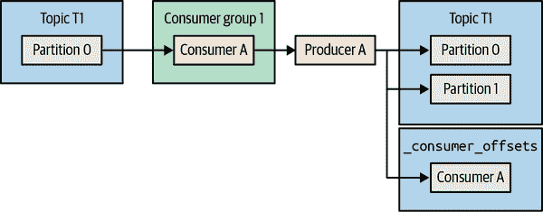
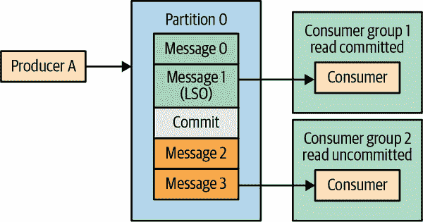

# 第八章：精确一次语义

在第七章中，我们讨论了配置参数和最佳实践，使 Kafka 用户能够控制 Kafka 的可靠性保证。我们专注于至少一次交付——Kafka 不会丢失已确认提交的消息的保证。这仍然存在重复消息的可能性。

在简单的系统中，消息由各种应用程序生成和消费，重复是一个相当容易处理的烦恼。大多数现实世界的应用程序包含消费应用程序可以使用的唯一标识符来对消息进行去重。

当我们查看聚合事件的流处理应用程序时，情况变得更加复杂。当检查一个消费事件、计算平均值并产生结果的应用程序时，往往无法检测到结果不正确，因为在计算平均值时事件被处理了两次。在这些情况下，提供更强的保证——精确一次处理语义是很重要的。

在本章中，我们将讨论如何使用具有精确一次语义的 Kafka，推荐的用例以及限制。与至少一次保证一样，我们将深入一点，提供一些洞察力和直觉，以了解此保证是如何实现的。在首次阅读本章时，可以跳过这些细节，但在使用该功能之前理解这些细节将是有用的——它将有助于澄清不同配置和 API 的含义以及如何最好地使用它们。

Kafka 中的精确一次语义是两个关键特性的组合：幂等生产者，它有助于避免由生产者重试引起的重复，以及事务语义，它保证流处理应用程序中的精确一次处理。我们将从更简单和更普遍有用的幂等生产者开始讨论这两个特性。

# 幂等生产者

如果执行相同操作多次的结果与执行一次相同操作的结果相同，则称该服务为幂等。在数据库中，通常可以通过`UPDATE t SET x=x+1 where y=5`和`UPDATE t SET x=18 where y=5`之间的差异来演示。第一个例子不是幂等的；如果我们调用它三次，最终的结果将与我们只调用一次时的结果大不相同。第二个例子是幂等的——无论我们运行这个语句多少次，`x`都将等于 18。

这与 Kafka 生产者有什么关系？如果我们将生产者配置为具有至少一次语义而不是幂等语义，这意味着在不确定的情况下，生产者将重试发送消息，以便至少到达一次。这些重试可能导致重复。

经典案例是分区领导者从生产者接收记录，成功地将其复制到跟随者，然后领导者所在的代理在发送响应给生产者之前崩溃。生产者在一段时间内没有收到响应后，将重新发送消息。消息将到达新的领导者，他已经从先前的尝试中拥有了消息的副本——导致重复。

在某些应用中，重复并不重要，但在其他应用中，它们可能导致库存错误计数、糟糕的财务报表，或者向某人发送两把雨伞而不是他们订购的一把。

Kafka 的幂等生产者通过自动检测和解决这些重复来解决这个问题。

## 幂等生产者是如何工作的？

当我们启用幂等生产者时，每条消息将包括一个唯一的生产者 ID（PID）和一个序列号。这些，连同目标主题和分区一起，唯一标识每条消息。经纪人使用这些唯一标识来跟踪经纪人上每个分区产生的最后五条消息。为了限制必须跟踪每个分区的先前序列号的数量，我们还要求生产者使用`max.inflight.requests=5`或更低（默认为 5）。

当经纪人接收到它之前已经接受过的消息时，它将拒绝重复的消息并返回适当的错误。这个错误被生产者记录并反映在其指标中，但不会引起任何异常，也不应引起任何警报。在生产者客户端，它将被添加到`record-error-rate`指标中。在经纪人端，它将成为`RequestMetrics`类型的`ErrorsPerSec`指标的一部分，其中包括每种错误类型的单独计数。

如果经纪人收到一个意外高的序列号会怎么样？经纪人期望消息编号 2 后面是消息编号 3；如果经纪人收到的是消息编号 27 呢？在这种情况下，经纪人将以“顺序错误”错误响应，但如果我们使用幂等生产者而不使用事务，这个错误可以被忽略。

###### 警告

尽管生产者在遇到“顺序号错误”异常后将继续正常运行，但这种错误通常表明生产者和经纪人之间丢失了消息 - 如果经纪人接收到消息编号 2，然后是消息编号 27，那么消息 3 到 26 之间一定发生了什么。在日志中遇到这样的错误时，值得重新审视生产者和主题配置，并确保生产者配置了高可靠性的推荐值，并检查是否发生了不洁净的领导者选举。

与分布式系统一样，考虑幂等生产者在失败条件下的行为是很有趣的。考虑两种情况：生产者重新启动和经纪人失败。

### 生产者重新启动

当生产者失败时，通常会创建一个新的生产者来替代它 - 无论是人工重新启动机器，还是使用更复杂的框架如 Kubernetes 提供自动故障恢复。关键点在于，当生产者启动时，如果启用了幂等生产者，生产者将初始化并联系 Kafka 经纪人生成生产者 ID。每次初始化生产者都会导致一个全新的 ID（假设我们没有启用事务）。这意味着如果一个生产者失败，替换它的生产者发送了之前由旧生产者发送的消息，经纪人将不会检测到重复 - 两条消息将具有不同的生产者 ID 和不同的序列号，并将被视为两条不同的消息。请注意，如果旧生产者冻结然后在其替代品启动后恢复，情况也是如此 - 原始生产者不被识别为僵尸，因为我们有两个完全不同的具有不同 ID 的生产者。

### 经纪人失败

当经纪人失败时，控制器会为失败的经纪人上原本有领导者的分区选举新的领导者。假设我们有一个生产者向主题 A、分区 0 产生消息，该分区的领导副本在经纪人 5 上，跟随副本在经纪人 3 上。在经纪人 5 失败后，经纪人 3 成为新的领导者。生产者将通过元数据协议发现新的领导者是经纪人 3，并开始向其生产。但经纪人 3 如何知道哪些序列已经被生产，以拒绝重复的消息呢？

领导者每次生产新消息时都会更新其内存中的生产者状态的最后五个序列 ID。从属副本在每次从领导者复制新消息时都会更新自己的内存缓冲区。这意味着当从属副本成为领导者时，它已经在内存中具有最新的序列号，并且可以继续验证新生产的消息而不会出现任何问题或延迟。

但是当旧的 leader 回来时会发生什么？重新启动后，旧的内存中的生产者状态将不再存在于内存中。为了帮助恢复，当代理关闭或每次创建一个段时，代理将生产者状态的快照保存到文件中。代理启动时，它会从文件中读取最新状态。新重新启动的代理通过从当前 leader 进行复制来追赶，并在准备再次成为 leader 时，它在内存中具有最新的序列 ID。

如果代理崩溃且最后的快照未更新会发生什么？生产者 ID 和序列 ID 也是写入 Kafka 日志的消息格式的一部分。在崩溃恢复期间，将通过读取旧的快照和每个分区的最新段中的消息来恢复生产者状态。一旦恢复过程完成，将存储一个新的快照。

一个有趣的问题是如果没有消息会发生什么？想象一下某个主题有两个小时的保留时间，但在过去的两个小时内没有新消息到达——如果代理崩溃，将没有消息用于恢复状态。幸运的是，没有消息也意味着没有重复。我们将立即开始接受消息（同时记录有关状态缺失的警告），并从到达的新消息中创建生产者状态。

## 幂等生产者的限制

Kafka 的幂等生产者只能防止由生产者内部逻辑引起的重试情况中的重复。调用`producer.send()`两次发送相同的消息将创建重复消息，而幂等生产者无法阻止这种情况发生。这是因为生产者无法知道发送的两条记录实际上是相同的记录。最好使用生产者的内置重试机制，而不是捕获生产者异常并从应用程序本身重试；幂等生产者使这种模式更加吸引人——这是避免重试时重复的最简单方法。

还相当常见的是有多个实例或甚至一个实例有多个生产者的应用程序。如果这些生产者中的两个尝试发送相同的消息，幂等生产者将无法检测到重复。这种情况在从源获取数据的应用程序中非常常见——例如一个带有文件的目录，并将其生产到 Kafka。如果应用程序恰好有两个实例读取同一个文件并将记录生产到 Kafka，那么我们将在该文件中获得记录的多个副本。

###### 提示

幂等生产者只会防止由生产者自身的重试机制引起的重复，无论重试是由生产者、网络还是代理错误引起的。但其他情况不会。

## 如何使用 Kafka 幂等生产者？

这是简单的部分。将`enable.idempotence=true`添加到生产者配置中。如果生产者已经配置为`acks=all`，性能不会有任何差异。通过启用幂等生产者，以下事情将发生变化：

+   为了检索生产者 ID，生产者在启动时将进行一次额外的 API 调用。

+   每个发送的记录批次将包括生产者 ID 和批次中第一条消息的序列 ID（批次中每条消息的序列 ID 是从第一条消息的序列 ID 加上一个增量得到的）。这些新字段为每个记录批次增加了 96 位（生产者 ID 是一个长整型，序列是一个整数），对于大多数工作负载来说，这几乎没有任何开销。

+   代理将验证来自任何单个生产者实例的序列号，并保证没有重复消息。

+   将保证每个分区产生的消息顺序，即使`max.in.flight.requests.per.connection`设置为大于 1（5 是默认值，也是幂等生产者支持的最高值）。

###### 注意

幂等生产者逻辑和错误处理在 2.5 版本中得到了显着改进（生产者端和代理端都是如此），这是 KIP-360 的结果。在 2.5 版本发布之前，生产者状态并不总是维持足够长的时间，这导致在各种场景中出现致命的 UNKNOWN_PRODUCER_ID 错误（分区重新分配存在一个已知的边缘情况，即在特定生产者的任何写操作发生之前，新副本就成为了领导者，这意味着新领导者对该分区没有状态）。此外，以前的版本在某些错误场景下尝试重写序列 ID，这可能导致重复。在更新版本中，如果我们遇到记录批次的致命错误，这个批次和所有正在传输的批次都将被拒绝。编写应用程序的用户可以处理异常并决定是跳过这些记录还是重试并冒重复和重新排序的风险。

# 交易

正如我们在本章介绍中提到的，Kafka 添加了交易以确保使用 Kafka Streams 开发的应用程序的正确性。为了使流处理应用程序生成正确的结果，每个输入记录必须被精确处理一次，并且其处理结果将被精确反映一次，即使发生故障也是如此。Apache Kafka 中的交易允许流处理应用程序生成准确的结果。这反过来使开发人员能够在准确性是关键要求的用例中使用流处理应用程序。

重要的是要记住，Kafka 中的交易是专门为流处理应用程序开发的。因此，它们被构建为与形成流处理应用程序基础的“消费-处理-生产”模式一起工作。在这种情况下，使用交易可以保证一次性语义——每个输入记录的处理在应用程序的内部状态更新并成功产生到输出主题后被视为完成。在“交易解决不了哪些问题？”中，我们将探讨一些 Kafka 的一次性保证不适用的情况。

###### 注意

交易是底层机制的名称。一次性语义或一次性保证是流处理应用程序的行为。Kafka Streams 使用交易来实现其一次性保证。其他流处理框架，如 Spark Streaming 或 Flink，使用不同的机制来为其用户提供一次性语义。

## 交易使用案例

交易对于任何重视准确性的流处理应用程序都是有用的，特别是当流处理包括聚合和/或连接时。如果流处理应用程序只执行单个记录的转换和过滤，那么没有内部状态需要更新，即使在过程中引入了重复，也很容易将它们从输出流中过滤掉。当流处理应用程序将多个记录聚合为一个记录时，要检查结果记录是否错误要困难得多，因为某些输入记录被计算了多次；在不重新处理输入的情况下无法纠正结果。

金融应用程序是复杂流处理应用程序的典型例子，其中使用一次性能力来保证准确的聚合。然而，因为任何 Kafka Streams 应用程序都可以相当轻松地配置为提供一次性保证，我们已经看到它在更普通的用例中启用，包括例如聊天机器人。

## 事务解决了什么问题？

考虑一个简单的流处理应用程序：它从源主题中读取事件，可能对其进行处理，并将结果写入另一个主题。我们希望确保我们处理的每条消息的结果只被写入一次。可能会发生什么问题？

事实证明，有很多事情可能会出错。让我们看看两种情况。

### 由应用程序崩溃引起的重新处理

从源集群中消费一条消息并处理后，应用程序必须做两件事：将结果生成到输出主题，并提交我们消费的消息的偏移量。假设这两个独立的操作按照这个顺序发生。如果应用程序在生成输出后但在提交输入的偏移量之前崩溃会发生什么？

在第四章中，我们讨论了消费者崩溃时会发生什么。几秒钟后，缺少心跳将触发重新平衡，并且消费者正在消费的分区将重新分配给另一个消费者。该消费者将开始从这些分区中消费记录，从上次提交的偏移量开始。这意味着在上次提交的偏移量和崩溃之间应用程序处理的所有记录将被再次处理，并且结果将再次写入输出主题，导致重复。

### 由僵尸应用程序引起的重新处理

如果我们的应用程序刚刚从 Kafka 中消费了一批记录，然后在对这批记录进行任何其他操作之前冻结或失去与 Kafka 的连接，会发生什么？

就像在先前的情景中一样，如果错过了几次心跳，应用程序将被认为已经死亡，并且其分区将重新分配给消费者组中的另一个消费者。该消费者将重新读取该批记录，处理它，将结果生成到输出主题，并继续进行。

与此同时，第一个应用程序实例——冻结的那个——可能会恢复其活动：处理它最近消费的一批记录，并将结果生成到输出主题。它可以在轮询 Kafka 记录或发送心跳并发现自己应该死亡并且另一个实例现在拥有这些分区之前完成所有这些操作。

一个死亡但不知道自己已经死亡的消费者被称为僵尸。在这种情况下，我们可以看到，如果没有额外的保证，僵尸可能会向输出主题生成数据，并导致重复的结果。

## 事务如何保证一次性？

以我们的简单流处理应用程序为例。它从一个主题中读取数据，处理它，并将结果写入另一个主题。一次性处理意味着消费、处理和生成都是*原子*的。要么原始消息的偏移量被提交，结果被成功生成，要么这两件事都不会发生。我们需要确保部分结果——偏移量已提交但结果未生成，或者反之亦然——不会发生。

为了支持这种行为，Kafka 事务引入了*原子多分区写*的概念。这个想法是，提交偏移量和生成结果都涉及将消息写入分区。然而，结果被写入输出主题，偏移量被写入`_consumer_offsets`主题。如果我们可以开启一个事务，写入这两条消息，并且如果两者都成功写入则提交，或者中止以重试，我们将得到我们想要的一次性语义。

图 8-1 说明了一个简单的流处理应用程序，执行原子多分区写入到两个分区，同时提交了它消费的事件的偏移量。



###### 图 8-1：具有原子多分区写入的事务性生产者

要使用事务并执行原子多分区写入，我们使用*事务性生产者*。事务性生产者只是一个配置了`transactional.id`并使用`initTransactions()`进行初始化的 Kafka 生产者。与 Kafka 代理自动生成的`producer.id`不同，`transactional.id`是生产者配置的一部分，并且预期在重新启动之间持久存在。事实上，`transactional.id`的主要作用是在重新启动时标识相同的生产者。Kafka 代理维护`transactional.id`到`producer.id`的映射，因此如果使用现有的`transactional.id`再次调用`initTransactions()`，生产者将被分配相同的`producer.id`而不是一个新的随机数。

防止应用程序的僵尸实例创建重复需要一种*僵尸围栏*机制，或者防止应用程序的僵尸实例将结果写入输出流。这里使用的通常的围栏僵尸的方法是使用一个时代。当调用`initTransaction()`初始化事务性生产者时，Kafka 会增加与`transactional.id`关联的时代编号。具有相同`transactional.id`但较低时代的生产者的发送、提交和中止请求将被拒绝，并显示`FencedProducer`错误。旧的生产者将无法写入输出流，并将被强制`close()`，防止僵尸实例引入重复记录。在 Apache Kafka 2.5 及更高版本中，还有一个选项可以将消费者组元数据添加到事务元数据中。这些元数据也将用于围栏，这将允许具有不同事务 ID 的生产者写入相同的分区，同时仍然防止僵尸实例。

事务在很大程度上是生产者的一个特性——我们创建一个事务性生产者，开始事务，将记录写入多个分区，生成偏移量以标记记录已经被处理，并提交或中止事务。我们都是从生产者端完成的。然而，这还不够——即使是最终中止的事务中写入的记录，也会像任何其他记录一样写入分区。消费者需要配置正确的隔离保证，否则我们将无法获得预期的一次性保证。

我们通过设置`isolation.level`配置来控制事务写入的消息的消费。如果设置为`read_committed`，在订阅一组主题后调用`consumer.poll()`将返回成功提交事务的消息或非事务写入的消息；它不会返回已中止事务或仍处于打开状态的事务的消息。默认的`isolation.level`值`read_uncommitted`将返回所有记录，包括属于打开或中止事务的记录。配置`read_committed`模式并不保证应用程序将获得特定事务的所有消息。可能只订阅了事务的一部分主题，因此只会获得消息的一部分。此外，应用程序无法知道事务何时开始或结束，或者哪些消息属于哪个事务。

图 8-2 显示了以`read_committed`模式的消费者与默认的`read_uncommitted`模式的消费者相比可见的记录。



###### 图 8-2：以`read_committed`模式的消费者将落后于默认配置的消费者

为了保证消息按顺序读取，“read_committed”模式不会返回在第一个仍处于打开状态的事务开始之后产生的消息（称为最后稳定偏移量或 LSO）。这些消息将被保留，直到该事务由生产者提交或中止，或者直到它们达到“transaction.timeout.ms”（默认为 15 分钟）并被代理中止。保持事务长时间打开将通过延迟消费者引入更高的端到端延迟。

即使输入是非事务写入的，我们简单的流处理作业的输出也将具有一次性保证。原子多分区生产保证，如果输出记录已提交到输出主题，则输入记录的偏移量也已为该消费者提交，因此输入记录将不会再次被处理。

## 事务解决不了哪些问题？

正如前面解释的那样，Kafka 添加了事务以提供多分区原子写入（但不是读取）以及在流处理应用程序中隔离僵尸生产者。因此，当在消费-处理-生产流处理任务链中使用时，它们提供了一次性保证。在其他情况下，事务要么根本无法工作，要么需要额外的努力才能实现我们想要的保证。

两个主要错误是假设一次性保证适用于除向 Kafka 生产之外的其他操作，并且消费者始终读取整个事务并具有有关事务边界的信息。

以下是一些 Kafka 事务无法帮助实现一次性保证的情况。

### 流处理时的副作用

假设我们流处理应用程序中的记录处理步骤包括向用户发送电子邮件。在我们的应用程序中启用一次性语义将不会保证电子邮件只会发送一次。保证仅适用于写入 Kafka 的记录。使用序列号去重记录或使用标记来中止或取消事务在 Kafka 内部有效，但不会取消发送的电子邮件。对于在流处理应用程序中执行的具有外部影响的任何操作都是如此：调用 REST API，写入文件等。

### 从 Kafka 主题读取并写入数据库

在这种情况下，应用程序将写入外部数据库而不是 Kafka。在这种情况下，没有生产者参与——记录是使用数据库驱动程序（可能是 JDBC）写入数据库的，并且偏移量在消费者内部提交到 Kafka。没有机制允许在单个事务内将结果写入外部数据库并将偏移量提交到 Kafka。相反，我们可以在数据库中管理偏移量（如第四章中所述），并在单个事务中提交数据和偏移量到数据库——这将依赖于数据库的事务保证而不是 Kafka 的。

###### 注意

微服务通常需要在单个原子事务中更新数据库*并*发布消息到 Kafka，因此要么两者都会发生，要么两者都不会发生。正如我们在最后两个示例中所解释的，Kafka 事务无法做到这一点。

这个常见问题的常见解决方案被称为“outbox 模式”。微服务只将消息发布到 Kafka 主题（“outbox”），而单独的消息中继服务从 Kafka 读取事件并更新数据库。因为正如我们刚才看到的，Kafka 不会保证对数据库的一次性更新，因此重要的是确保更新是幂等的。

使用这种模式可以保证消息最终会到达 Kafka、主题消费者和数据库，或者一个都不会到达。

反向模式——其中数据库表用作发件箱，中继服务确保对表的更新也将作为消息到达 Kafka——也被使用。当内置的 RDBMS 约束，如唯一性和外键，是有用的时，这种模式是首选。Debezium 项目发布了一篇[关于发件箱模式的深入博客文章](https://oreil.ly/PB3Vb)，其中包含详细的示例。

### 从数据库中读取数据，写入 Kafka，然后从那里写入另一个数据库

很容易相信我们可以构建一个应用程序，从数据库中读取数据，识别数据库事务，将记录写入 Kafka，然后从那里将记录写入另一个数据库，仍然保持源数据库的原始事务。

不幸的是，Kafka 事务没有必要的功能来支持这些端到端的保证。除了在同一事务中提交记录和偏移量的问题外，还存在另一个困难：Kafka 消费者中的`read_committed`保证对于保留数据库事务来说太弱。是的，消费者不会看到未提交的记录。但它不能保证已经看到了事务中提交的所有记录，因为它可能在某些主题上滞后；它没有信息来识别事务边界，因此无法知道事务何时开始和结束，以及它是否已经看到了一些、没有或所有的记录。

### 从一个 Kafka 集群复制数据到另一个集群

这更加微妙——在从一个 Kafka 集群复制数据到另一个集群时，可以支持精确一次性保证。在 Kafka 改进提案中描述了如何在[镜像制造者 2.0 中添加精确一次性功能](https://oreil.ly/EoM6w)。在撰写本文时，该提案仍处于草案阶段，但算法已经清楚描述。该提案包括保证源集群中的每个记录将被精确地复制到目标集群中一次。

然而，这并不保证事务是原子的。如果一个应用程序以事务方式生成多个记录和偏移量，然后 MirrorMaker 2.0 将它们复制到另一个 Kafka 集群，事务属性和保证将在复制过程中丢失。当从 Kafka 复制数据到关系型数据库时，由于消费者从 Kafka 读取数据时无法知道或保证它是否获取了事务中的所有事件，同样的原因也会丢失。例如，如果只订阅了一部分主题，它可能会复制事务的一部分。

### 发布/订阅模式

这是一个稍微微妙的情况。我们已经讨论了在消费-处理-生产模式的上下文中的精确一次性，但发布/订阅模式是一个非常常见的用例。在发布/订阅用例中使用事务提供了一些保证：配置为`read_committed`模式的消费者不会看到作为中止事务的一部分发布的记录。但这些保证还不足以达到精确一次性。消费者可能会根据自己的偏移提交逻辑多次处理消息。

Kafka 在这种情况下提供的保证类似于 JMS 事务提供的保证，但依赖于`read_committed`模式的消费者来保证未提交的事务将保持不可见。JMS 代理会向所有消费者隐藏未提交的事务。

###### 警告

要避免的一个重要模式是发布消息，然后等待另一个应用程序在提交事务之前做出响应。在事务提交之后，其他应用程序将无法接收到消息，导致死锁。

## 我如何使用事务？

事务是代理功能和 Kafka 协议的一部分，因此有多个客户端支持事务。

在 Kafka Streams 中启用事务的最常见和最推荐的方法是实现精准一次的保证。这样，我们将根本不直接使用事务，而是 Kafka Streams 将在幕后使用它们为我们提供所需的保证。事务是为这种用例而设计的，因此通过 Kafka Streams 使用它们是最简单且最有可能按预期工作的方法。

要为 Kafka Streams 应用程序启用精确一次的保证，我们只需将`processing.guarantee`配置设置为`exactly_once`或`exactly_once_beta`。就是这样。

###### 注意

`exactly_once_beta`是一种稍微不同的处理应用实例崩溃或挂起的方法，它在发布 2.5 中引入到 Kafka 代理中，在发布 2.6 中引入到 Kafka Streams 中。这种方法的主要优点是能够使用单个事务性生产者处理多个分区，从而创建更可扩展的 Kafka Streams 应用程序。有关这些更改的更多信息，请参阅[Kafka 改进提案](https://oreil.ly/O3dSA)。

但是，如果我们想要在不使用 Kafka Streams 的情况下实现精确一次的保证呢？在这种情况下，我们将直接使用事务性 API。以下是一个显示这将如何工作的片段。在 Apache Kafka GitHub 中有一个完整的示例，其中包括一个[演示驱动程序](https://oreil.ly/45dE4)和一个[简单的精确一次处理器](https://oreil.ly/CrXHU)，它们在单独的线程中运行：

```java
Properties producerProps = new Properties();
producerProps.put(ProducerConfig.BOOTSTRAP_SERVERS_CONFIG, "localhost:9092");
producerProps.put(ProducerConfig.CLIENT_ID_CONFIG, "DemoProducer");
producerProps.put(ProducerConfig.TRANSACTIONAL_ID_CONFIG, transactionalId); ①

producer = new KafkaProducer<>(producerProps);

Properties consumerProps = new Properties();
consumerProps.put(ConsumerConfig.BOOTSTRAP_SERVERS_CONFIG, "localhost:9092");
consumerProps.put(ConsumerConfig.GROUP_ID_CONFIG, groupId);
props.put(ConsumerConfig.ENABLE_AUTO_COMMIT_CONFIG, "false"); ②
consumerProps.put(ConsumerConfig.ISOLATION_LEVEL_CONFIG, "read_committed"); ③

consumer = new KafkaConsumer<>(consumerProps);

producer.initTransactions(); ④

consumer.subscribe(Collections.singleton(inputTopic)); ⑤

while (true) {
  try {
    ConsumerRecords<Integer, String> records =
      consumer.poll(Duration.ofMillis(200));
    if (records.count() > 0) {
      producer.beginTransaction(); // ⑥
      for (ConsumerRecord<Integer, String> record : records) {
        ProducerRecord<Integer, String> customizedRecord = transform(record); // ⑦
        producer.send(customizedRecord);
      }
      Map<TopicPartition, OffsetAndMetadata> offsets = consumerOffsets();
      producer.sendOffsetsToTransaction(offsets, consumer.groupMetadata()); // ⑧
      producer.commitTransaction(); // ⑨
    }
  } catch (ProducerFencedException|InvalidProducerEpochException e) { // ⑩
    throw new KafkaException(String.format(
      "The transactional.id %s is used by another process", transactionalId));
  } catch (KafkaException e) {
    producer.abortTransaction(); // ⑪
    resetToLastCommittedPositions(consumer);
  }}
```

① (#co_exactly_once_semantics_CO1-1)

使用`transactional.id`配置生产者使其成为能够生成原子多分区写入的事务性生产者。事务 ID 必须是唯一且长期存在的。它本质上定义了应用程序的一个实例。

② (#co_exactly_once_semantics_CO1-2)

作为事务的一部分的消费者不提交自己的偏移量——生产者在事务的一部分写入偏移量。因此，偏移提交应该被禁用。

③ (#co_exactly_once_semantics_CO1-3)

在这个例子中，消费者从一个输入主题中读取。我们将假设输入主题中的记录也是由一个事务性生产者写入的（只是为了好玩——对于输入并没有这样的要求）。为了干净地读取事务（即忽略正在进行中和已中止的事务），我们将把消费者隔离级别设置为`read_committed`。请注意，消费者仍然会读取非事务性写入，除了读取已提交的事务。

④ (#co_exactly_once_semantics_CO1-4)

事务性生产者必须做的第一件事是初始化。这会注册事务 ID，增加时代以保证具有相同 ID 的其他生产者将被视为僵尸，并中止来自相同事务 ID 的旧的正在进行中的事务。

⑤ (#co_exactly_once_semantics_CO1-5)

在这里，我们使用`subscribe`消费者 API，这意味着分配给应用程序实例的分区可能会因重新平衡而在任何时候发生变化。在发布 2.5 之前，这是更具挑战性的。事务性生产者必须静态地分配一组分区，因为事务围栏机制依赖于相同的事务 ID 用于相同的分区（如果事务 ID 更改，则没有僵尸围栏保护）。KIP-447 添加了新的 API，用于此示例中，它将消费者组信息附加到事务中，并且此信息用于围栏。使用此方法时，当相关分区被撤销时，提交事务也是有意义的。

// ⑥ (#co_exactly_once_semantics_CO1-6)

我们消费了记录，现在我们想要处理它们并产生结果。这种方法保证了从调用它的时间开始，直到事务被提交或中止，产生的所有内容都是作为单个原子事务的一部分。

// ⑦

这是我们处理记录的地方——所有的业务逻辑都在这里。

// ⑧

正如我们在本章前面解释的那样，将偏移量作为事务的一部分进行提交非常重要。这可以确保如果我们未能产生结果，我们不会提交那些实际上未被处理的记录的偏移量。这种方法将偏移量作为事务的一部分进行提交。请注意，重要的是不要以任何其他方式提交偏移量——禁用偏移自动提交，并且不要调用任何消费者提交 API。通过任何其他方法提交偏移量都无法提供事务性保证。

// ⑨

我们产生了我们需要的一切，我们将偏移量作为事务的一部分进行了提交，现在是时候提交事务并敲定交易了。一旦这个方法成功返回，整个事务就完成了，我们可以继续读取和处理下一批事件。

// ⑩

如果我们遇到了这个异常，这意味着我们是僵尸。不知何故，我们的应用程序冻结或断开连接，而有一个具有我们事务 ID 的新应用程序实例正在运行。很可能我们启动的事务已经被中止，其他人正在处理这些记录。除了优雅地死去外，没有别的办法。

// ⑪

如果在写入事务时出现错误，我们可以中止事务，将消费者位置设置回去，然后重试。

## 事务 ID 和围栏

为生产者选择事务 ID 非常重要，比看起来更具挑战性。错误地分配事务 ID 可能导致应用程序错误或丢失精确一次性保证。关键要求是事务 ID 在应用程序的相同实例之间重启时保持一致，并且对于应用程序的不同实例是不同的，否则代理将无法将僵尸实例围栏起来。

在 2.5 版本之前，保证围栏的唯一方法是将事务 ID 静态映射到分区。这可以保证每个分区始终使用相同的事务 ID 进行消费。如果具有事务 ID A 的生产者处理了来自主题 T 的消息并丢失了连接，替换它的新生产者具有事务 ID B，稍后生产者 A 作为僵尸回来，僵尸 A 将不会被围栏，因为 ID 与新生产者 B 不匹配。我们希望生产者 A 始终被生产者 A 替换，新的生产者 A 将具有更高的时代编号，僵尸 A 将被正确地围栏。在这些版本中，先前的示例将是不正确的——事务 ID 会随机分配给线程，而不会确保始终使用相同的事务 ID 写入同一分区。

在 Apache Kafka 2.5 中，KIP-447 引入了基于消费者组元数据的围栏的第二种方法，用于除了事务 ID 之外的围栏。我们使用生产者偏移量提交方法，并将消费者组元数据作为参数传递，而不仅仅是消费者组 ID。

假设我们有一个名为 T1 的主题，有两个分区 t-0 和 t-1。每个分区都由同一组中的不同消费者消费；每个消费者将记录传递给匹配的事务性生产者——一个具有事务 ID A，另一个具有事务 ID B；它们分别将输出写入到主题 T2 的分区 0 和 1。图 8-3 说明了这种情况。


###### 图 8-3：事务记录处理器

如图 8-4 所示，如果具有消费者 A 和生产者 A 的应用实例变成僵尸，消费者 B 将开始处理来自两个分区的记录。如果我们想要保证没有僵尸写入分区 0，消费者 B 不能只是开始从分区 0 读取并使用事务 ID B 写入分区 0。相反，应用程序将需要实例化一个新的生产者，使用事务 ID A，以安全地写入分区 0 并隔离旧的事务 ID A。这是浪费的。相反，我们在事务中包括消费者组信息。来自生产者 B 的事务将显示它们来自消费者组的新一代，因此它们将通过，而来自现在僵尸的生产者 A 的事务将显示消费者组的旧一代，并将被隔离。


###### 图 8-4：重新平衡后的事务记录处理器

## 事务如何工作

我们可以通过调用 API 来使用事务，而无需了解它们的工作原理。但是，对于不符合预期行为的应用程序，了解底层发生的事情会有助于我们进行故障排除。

Kafka 中事务的基本算法受到了 Chandy-Lamport 快照的启发，其中“标记”控制消息被发送到通信通道中，并且基于标记的到达确定一致状态。Kafka 事务使用标记消息来指示跨多个分区的事务是已提交还是已中止——当生产者决定提交事务时，它向事务协调者发送一个“提交”消息，然后事务协调者将提交标记写入涉及事务的所有分区。但是，如果生产者在仅向部分分区写入提交消息后崩溃会发生什么？Kafka 事务通过使用两阶段提交和事务日志来解决这个问题。在高层次上，该算法将：

1.  记录正在进行的事务的存在，包括涉及的分区

1.  记录提交或中止的意图——一旦记录了这一点，我们注定要最终提交或中止

1.  将所有事务标记写入所有分区

1.  记录事务的完成

为了实现这个基本算法，Kafka 需要一个事务日志。我们使用一个名为`__transaction_state`的内部主题。

通过查看我们在前面的代码片段中使用的事务 API 调用的内部工作，让我们看看这个算法是如何在实践中工作的。

在开始第一个事务之前，生产者需要通过调用`initTransaction()`来注册为事务性。这个请求被发送到一个代理，这个代理将是这个事务性生产者的*事务协调者*。每个代理都是一组生产者的事务协调者的一部分，就像每个代理都是一组消费者的消费者组协调者的一部分一样。每个事务 ID 的事务协调者是事务日志的分区的领导者。

`initTransaction()` API 向协调者注册一个新的事务 ID，或者增加现有事务 ID 的时代，以隔离可能已经变成僵尸的先前生产者。当时代增加时，挂起的事务将被中止。

生产者的下一步是调用`beginTransaction()`。这个 API 调用不是协议的一部分——它只是告诉生产者现在有一个正在进行的事务。代理端的事务协调者仍然不知道事务已经开始。然而，一旦生产者开始发送记录，每次生产者检测到自己正在向一个新的分区发送记录时，它还会向代理发送`Add​Par⁠titionsToTxnRequest`，通知它这个生产者正在进行一个事务，并且额外的分区是事务的一部分。这些信息将被记录在事务日志中。

当我们完成生成结果并准备提交时，我们首先要为此事务中已处理的记录提交偏移量。可以在任何时候提交偏移量，但必须在提交事务之前完成。调用`sendOffsetsToTransaction()`将向事务协调器发送一个请求，其中包括偏移量和消费者组 ID。事务协调器将使用消费者组 ID 来查找组协调器，并像消费者组一样提交偏移量。

现在是时候提交或中止了。调用`commitTransaction()`或`abortTransaction()`将向事务协调器发送一个`EndTransactionRequest`。事务协调器将提交或中止意图记录到事务日志中。一旦此步骤成功，事务协调器就有责任完成提交（或中止）过程。它会向涉及事务的所有分区写入提交标记，然后写入事务日志，表明提交已成功完成。请注意，如果事务协调器在记录提交意图后关闭或崩溃，将会选举新的事务协调器，从事务日志中获取提交意图，并完成该过程。

如果在`transaction.timeout.ms`内未提交或中止事务，事务协调器将自动中止它。

###### 警告

每个从事事务性或幂等性生产者接收记录的经纪人都会将生产者/事务性 ID 与生产者发送的最后五个批次的相关状态一起存储在内存中：序列号、偏移量等。在生产者停止活动后（默认为七天），此状态将存储`transactional.id.expiration.ms`毫秒。这允许生产者在不遇到“UNKNOWN_PRODUCER_ID”错误的情况下恢复活动。通过以非常高的速率创建新的幂等性生产者或新的事务性 ID 但从不重用它们，可能会导致经纪人出现类似内存泄漏的情况。在一周的时间内累积每秒三个新的幂等性生产者，将导致 180 万个生产者状态条目，总共存储了 900 万个批次元数据，占用大约 5GB 的 RAM。这可能会导致经纪人出现内存不足或严重的垃圾回收问题。我们建议在应用程序启动时初始化一些长期存在的生产者，然后在应用程序的整个生命周期内重复使用它们。如果这不可能（作为服务的功能会使这变得困难），我们建议降低`transactional.id.expiration.ms`，以便 ID 会更快地过期，因此永远不会被重用的旧状态不会占用经纪人内存的重要部分。

# 交易的性能

事务会给生产者增加适度的开销。在生产者生命周期中，注册事务 ID 的请求只会发生一次。作为事务的一部分注册分区的额外调用最多每个分区一次，然后每个事务发送一个提交请求，这会导致在每个分区上写入额外的提交标记。事务初始化和事务提交请求是同步的，因此在它们成功完成、失败或超时之前不会发送任何数据，这会进一步增加开销。

请注意，生产者的事务开销与事务中的消息数量无关。因此，每个事务中的消息数量增加会减少相对开销，并减少同步停止的次数，从而提高整体吞吐量。

在消费者方面，阅读提交标记涉及一些开销。事务对消费者性能的主要影响是由于“读取提交”模式下的消费者不会返回属于未提交事务的记录。事务提交之间的长时间间隔意味着消费者需要等待更长时间才能返回消息，结果端到端的延迟会增加。

然而，需要注意的是，消费者不需要缓冲属于未提交事务的消息。代理不会在响应消费者的抓取请求时返回这些消息。由于消费者在读取事务时没有额外的工作，因此吞吐量也不会减少。

# 总结

在 Kafka 中的确切一次语义与国际象棋相反：它很难理解，但易于使用。

本章涵盖了在 Kafka 中提供确切一次保证的两个关键机制：幂等生产者，它避免了重试机制引起的重复，以及事务，它构成了 Kafka Streams 中确切一次语义的基础。

两者可以在单个配置中启用，并允许我们将 Kafka 用于需要更少重复和更强正确性保证的应用程序。

我们深入讨论了特定场景和用例，展示了预期的行为，甚至查看了一些实现细节。当故障排除应用程序或直接使用事务 API 时，这些细节是重要的。

通过了解 Kafka 在哪些用例中确切的一次语义保证，我们可以设计应用程序在必要时使用确切一次。应用程序行为不应该令人惊讶，本章中的信息将帮助我们避免意外。
