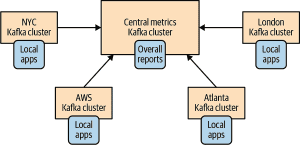
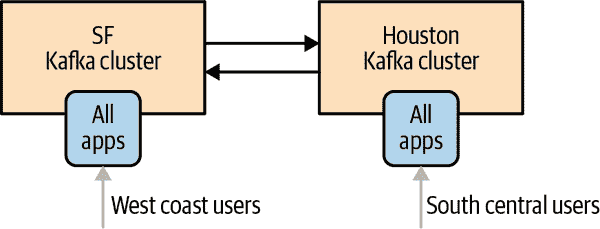
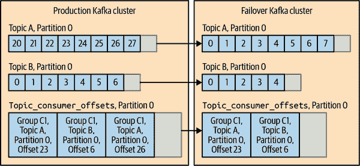
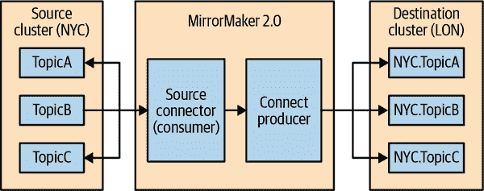

# 第十章 跨集群数据镜像

在大部分的书中，我们讨论了单个 Kafka 集群的设置、维护和使用。然而，有一些情况下，架构可能需要不止一个集群。

在某些情况下，集群是完全分离的。它们属于不同的部门或不同的用例，没有理由将数据从一个集群复制到另一个集群。有时，不同的 SLA 或工作负载使得很难调整单个集群以服务多个用例。其他时候，存在不同的安全要求。这些用例相当容易——管理多个不同的集群与多次运行单个集群是一样的。

在其他用例中，不同的集群是相互依存的，管理员需要在集群之间持续复制数据。在大多数数据库中，不断地在数据库服务器之间复制数据被称为*复制*。由于我们已经使用复制来描述 Kafka 节点之间的数据移动，我们将称在 Kafka 集群之间复制数据为*镜像*。Apache Kafka 内置的跨集群复制器称为*MirrorMaker*。

在本章中，我们将讨论所有或部分数据的跨集群镜像。我们将首先讨论一些跨集群镜像的常见用例。然后，我们将展示用于实现这些用例的一些架构，并讨论每种架构模式的优缺点。然后我们将讨论 MirrorMaker 本身以及如何使用它。我们将分享操作提示，包括部署和性能调优。最后，我们将讨论一些 MirrorMaker 的替代方案。

# 跨集群镜像的用例

以下是跨集群镜像将被使用的一些示例列表：

区域和中央集群

在某些情况下，公司在不同的地理区域、城市或大陆拥有一个或多个数据中心。每个数据中心都有自己的 Kafka 集群。一些应用程序可以通过与本地集群通信来工作，但有些应用程序需要来自多个数据中心的数据（否则，您不会寻找跨数据中心复制解决方案）。有许多情况下这是一个要求，但经典的例子是一家根据供需情况调整价格的公司。这家公司可以在其存在的每个城市都有一个数据中心，收集有关当地供需情况的信息，并相应地调整价格。然后所有这些信息将被镜像到一个中央集群，业务分析师可以在其收入上运行公司范围的报告。

高可用性（HA）和灾难恢复（DR）

应用程序仅在一个 Kafka 集群上运行，不需要来自其他位置的数据，但您担心由于某种原因整个集群可能变得不可用。为了冗余，您希望有第二个 Kafka 集群，其中包含第一个集群中存在的所有数据，以便在紧急情况下，您可以将应用程序指向第二个集群并继续正常运行。

监管合规性

在不同国家运营的公司可能需要使用不同的配置和政策，以符合每个国家的法律和监管要求。例如，一些数据集可能存储在具有严格访问控制的单独集群中，其中数据子集被复制到其他具有更广泛访问权限的集群。为了遵守各个地区规定的保留期限的监管政策，数据集可能存储在具有不同配置的不同地区的集群中。

云迁移

如今，许多公司在自己的数据中心和云服务提供商中运行业务。通常，应用程序在云服务提供商的多个区域运行，以实现冗余，有时会使用多个云服务提供商。在这些情况下，通常每个自有数据中心和每个云区域至少有一个 Kafka 集群。这些 Kafka 集群被每个数据中心和区域的应用程序用来在数据中心之间高效地传输数据。例如，如果在云中部署了一个新应用程序，但需要一些由在自有数据中心运行并存储在自有数据库中的应用程序更新的数据，您可以使用 Kafka Connect 捕获数据库更改并将这些更改镜像到云 Kafka 集群，新应用程序可以使用这些更改。这有助于控制跨数据中心流量的成本，以及改善流量的治理和安全性。

边缘集群数据聚合

包括零售、电信、交通运输和医疗保健在内的几个行业从具有有限连接性的小型设备生成数据。可以使用具有高可用性的聚合集群来支持来自大量边缘集群的数据的分析和其他用例。这减少了对低占地面积的边缘集群的连接性、可用性和耐久性要求，例如在物联网用例中。高可用的聚合集群即使在边缘集群离线时也提供业务连续性，并简化了不必直接处理大量具有不稳定网络的边缘集群的应用程序的开发。

# 多集群架构

既然我们已经看到了一些需要多个 Kafka 集群的用例，让我们来看一些我们在实现这些用例时成功使用的常见架构模式。在我们讨论架构之前，我们将简要概述跨数据中心通信的现实情况。我们将讨论的解决方案可能在特定网络条件下代表了权衡，因此可能看起来过于复杂。

## 跨数据中心通信的一些现实情况

以下是在跨数据中心通信时需要考虑的一些事项：

高延迟

两个 Kafka 集群之间的通信延迟随着两个集群之间的距离和网络跳数的增加而增加。

有限的带宽

广域网（WAN）通常比单个数据中心内的可用带宽要低得多，可用带宽可能会每分钟都有所变化。此外，更高的延迟使得更具挑战性地利用所有可用带宽。

更高的成本

无论您是在本地运行 Kafka 还是在云中运行 Kafka，跨集群通信的成本都更高。这部分是因为带宽有限，增加带宽可能成本过高，另一部分是因为供应商对数据中心、区域和云之间的数据传输收费。

Apache Kafka 的代理和客户端是在单个数据中心内设计、开发、测试和调整的。我们假设代理和客户端之间的延迟低，带宽高。这在默认超时和各种缓冲区的大小中是显而易见的。因此，不建议（除非在特定情况下，我们稍后会讨论）在一个数据中心安装一些 Kafka 代理，而在另一个数据中心安装其他 Kafka 代理。

在大多数情况下，最好避免向远程数据中心生成数据，如果必须这样做，需要考虑更高的延迟和更多网络错误的可能性。您可以通过增加生产者重试的次数来处理错误，并通过增加保存记录的缓冲区的大小来处理更高的延迟，以便在尝试发送记录时进行处理。

如果我们需要在集群之间进行任何形式的复制，并且排除了经纪人之间的通信和生产者-经纪人之间的通信，那么我们必须允许经纪人-消费者之间的通信。事实上，这是跨集群通信中最安全的形式，因为在阻止消费者读取数据的网络分区事件发生时，记录仍然安全地保存在 Kafka 经纪人中，直到通信恢复并且消费者可以读取它们。由于网络带宽有限，如果一个数据中心中有多个应用程序需要从另一个数据中心的 Kafka 经纪人读取数据，我们更倾向于在每个数据中心安装一个 Kafka 集群，并在它们之间镜像必要的数据，而不是让多个应用程序通过广域网消费相同的数据。

我们将更多地讨论调整 Kafka 以进行跨数据中心通信，但以下原则将指导我们将讨论的大多数架构：

+   每个数据中心至少有一个集群。

+   在每对数据中心之间精确复制每个事件一次（除了由于错误而重试）。

+   在可能的情况下，从远程数据中心消费，而不是向远程数据中心生产。

## 集线器和辐射架构

这种架构适用于存在多个本地 Kafka 集群和一个中央 Kafka 集群的情况。参见图 10-1。



###### 图 10-1：集线器和辐射架构

还有一种更简单的变体，只有两个集群：一个领导者和一个追随者。参见图 10-2。


###### 图 10-2：集线器和辐射架构的简化版本

当数据在多个数据中心产生并且一些消费者需要访问整个数据集时，使用这种架构。该架构还允许每个数据中心的应用程序仅处理特定数据中心的本地数据。但它不允许每个数据中心从整个数据集中获取数据。

这种架构的主要好处是数据始终产生在本地数据中心，并且每个数据中心的事件只被镜像一次 - 到中央数据中心。从单个数据中心处理数据的应用程序可以位于该数据中心。需要从多个数据中心处理数据的应用程序将位于所有事件都被镜像的中央数据中心。由于复制始终是单向的，并且每个消费者始终从同一集群中读取，因此这种架构易于部署、配置和监视。

这种架构的主要缺点直接源于其好处和简单性。一个区域数据中心的处理器无法访问另一个数据中心的数据。为了更好地理解这是一个限制，让我们看一个这种架构的例子。

假设我们是一家大型银行，在多个城市设有分支机构。假设我们决定将用户配置文件和其账户历史存储在每个城市的 Kafka 集群中。我们将所有这些信息复制到一个用于运行银行业务分析的中央集群。当用户连接到银行网站或访问他们的本地分支机构时，他们被路由到发送事件到他们的本地集群并从同一本地集群读取事件。然而，假设用户访问另一个城市的分支机构。因为用户信息不存在于他们正在访问的城市，分支机构将被迫与远程集群交互（不建议）或无法访问用户的信息（非常尴尬）。因此，通常仅将此模式用于可以在区域数据中心之间完全分离的数据集的部分。

在实施这种架构时，对于每个区域数据中心，您至少需要一个在中央数据中心的镜像过程。此过程将从每个远程区域集群中获取数据并将其生成到中央集群。如果在多个数据中心中存在相同的主题，您可以将此主题的所有事件写入到中央集群中具有相同名称的一个主题中，或者将每个数据中心的事件写入到一个单独的主题中。

## 主动-主动架构

当两个或更多个数据中心共享部分或全部数据，并且每个数据中心都能够生成和消费事件时，将使用此架构。参见图 10-3。



###### 图 10-3：主动-主动架构模型

这种架构的主要优点是能够从附近的数据中心为用户提供服务，这通常具有性能优势，而不会因数据的有限可用性（正如我们在集线器和辐射架构中看到的那样）而牺牲功能。第二个好处是冗余和弹性。由于每个数据中心都具有所有功能，因此如果一个数据中心不可用，您可以将用户引导到剩余的数据中心。这种故障转移只需要对用户进行网络重定向，通常是最简单和最透明的故障转移类型。

这种架构的主要缺点是在数据在多个位置异步读取和更新时避免冲突的挑战。这包括在镜像事件方面的技术挑战，例如，我们如何确保相同的事件不会无休止地来回镜像？但更重要的是，在两个数据中心之间保持数据一致性将是困难的。以下是您将遇到的一些困难的几个例子：

+   如果用户将事件发送到一个数据中心，并从另一个数据中心读取事件，那么他们写入的事件可能尚未到达第二个数据中心。对用户来说，看起来就像他们刚刚将一本书添加到愿望清单并单击了愿望清单，但书并不在那里。因此，当使用这种架构时，开发人员通常会找到一种方法来将每个用户“粘附”到特定的数据中心，并确保他们大部分时间使用相同的集群（除非他们从远程位置连接或数据中心不可用）。

+   一个数据中心的事件表示用户订购了书 A，第二个数据中心在更多或更少相同的时间内的事件表示同一用户订购了书 B。在镜像之后，两个数据中心都有了这两个事件，因此我们可以说每个数据中心都有两个冲突的事件。两个数据中心上的应用程序需要知道如何处理这种情况。我们选择一个事件作为“正确”的事件吗？如果是这样，我们需要一致的规则来选择一个事件，这样两个数据中心上的应用程序将得出相同的结论。我们决定两者都是真实的，只是给用户发送两本书，并让另一个部门处理退货？亚马逊过去是以这种方式解决冲突的，但是处理股票交易等问题的组织不能这样做。最小化冲突和处理冲突发生时的具体方法是特定于每个用例的。重要的是要记住，如果您使用这种架构，您*将*会有冲突，并且需要处理它们。

如果您找到了处理从多个位置异步读取和写入相同数据集的挑战的方法，那么强烈推荐使用这种架构。这是我们所知道的最具可扩展性、有弹性、灵活和经济有效的选择。因此，值得努力找出避免复制周期、使用户大部分时间保持在同一个数据中心，并在发生冲突时处理冲突的解决方案。

主动-主备镜像的挑战之一，特别是在有两个以上的数据中心时，是您将需要为每对数据中心和每个方向设置镜像任务。如今许多镜像工具可以共享进程，例如使用相同的进程进行所有镜像到目标集群。

此外，您将希望避免同一事件在不同数据中心之间无休止地来回镜像。您可以通过为每个“逻辑主题”在每个数据中心分配一个单独的主题，并确保避免复制源自远程数据中心的主题来实现这一点。例如，逻辑主题*用户*在一个数据中心将是*SF.users*，在另一个数据中心将是*NYC.users*。镜像过程将从 SF 到 NYC 镜像主题*SF.users*，从 NYC 到 SF 镜像主题*NYC.users*。因此，每个事件只会被镜像一次，但每个数据中心将包含*SF.users*和*NYC.users*，这意味着每个数据中心都将包含所有用户的信息。消费者需要从**.users*中消费事件，如果他们希望消费所有用户事件。另一种思考这种设置的方式是将其视为每个数据中心的单独命名空间，其中包含特定数据中心的所有主题。在我们的例子中，我们将有 NYC 和 SF 命名空间。一些镜像工具如 MirrorMaker 使用类似的命名约定来防止复制循环。

Apache Kafka 0.11.0 版本引入的记录头使事件可以被标记其来源数据中心。头信息也可以用于避免无休止的镜像循环，并允许分别处理来自不同数据中心的事件。您还可以通过使用结构化数据格式（Avro 是我们最喜欢的例子）来实现此功能，并将标签和头信息包含在事件本身中。然而，这需要在镜像时额外的工作，因为没有现有的镜像工具会支持您的特定头格式。

## 主备架构

在某些情况下，多个集群的唯一要求是支持某种灾难情景。也许您在同一个数据中心中有两个集群。您使用一个集群来运行所有应用程序，但您希望有第二个集群包含（几乎）原始集群中的所有事件，以便在原始集群完全不可用时使用。或者您可能需要地理弹性。您的整个业务都是从加利福尼亚州的一个数据中心运行的，但您需要德克萨斯州的第二个数据中心，通常不做太多事情，以防发生地震时使用。德克萨斯数据中心可能会有所有应用程序的非活动（“冷”）副本，管理员可以在紧急情况下启动，并且将使用第二个集群（图 10-4）。这通常是法律要求，而不是业务实际计划要做的事情，但您仍然需要做好准备。


###### 图 10-4\. 主备架构

这种设置的好处是设置简单，并且几乎可以用于任何用例。您只需安装第二个集群，并设置一个镜像过程，将所有事件从一个集群流式传输到另一个集群。无需担心数据访问、处理冲突和其他架构复杂性。

缺点是浪费一个好的集群，并且 Kafka 集群之间的故障转移实际上比看起来要困难得多。最重要的是，目前在 Kafka 中执行集群故障转移时要么会丢失数据，要么会有重复事件。通常两者都有。您可以将它们最小化，但永远无法完全消除。

显而易见的是，一个除了等待灾难之外什么也不做的集群是资源的浪费。由于灾难是（或应该是）罕见的，大部分时间我们看到的是一组机器的集群根本什么也不做。一些组织试图通过拥有比生产集群小得多的 DR（灾难恢复）集群来解决这个问题。但这是一个冒险的决定，因为您无法确定这个尺寸最小的集群在紧急情况下是否能够支撑住。其他组织更喜欢在非灾难期间使集群有用，通过将一些只读工作负载转移到 DR 集群上运行，这意味着他们实际上正在运行一个带有单个辐条的小型版本的集线器和辐条架构。

更严重的问题是，如何在 Apache Kafka 中切换到 DR 集群？

首先，毋庸置疑，无论选择哪种故障切换方法，您的 SRE 团队都必须定期进行实践。今天有效的计划可能在升级后停止工作，或者新的用例使现有的工具过时。每季度通常是故障切换实践的最低要求。强大的 SRE 团队经常进行实践。Netflix 著名的混沌猴（Chaos Monkey）是极端的例子 - 任何一天都可能成为故障切换实践的日子。

现在，让我们来看看故障切换涉及哪些内容。

### 灾难恢复规划

在灾难恢复规划时，重要的是考虑两个关键指标。恢复时间目标（RTO）定义了灾难后所有服务必须恢复的最长时间。恢复点目标（RPO）定义了可能丢失数据的最长时间。RTO 越低，避免手动流程和应用程序重新启动就越重要，因为只有通过自动故障切换才能实现非常低的 RTO。低 RPO 需要低延迟的实时镜像，`RPO=0`需要同步复制。

### 未经计划的故障切换中的数据丢失和不一致性

因为 Kafka 的各种镜像解决方案都是异步的（我们将在下一节讨论同步解决方案），DR 集群将不会拥有来自主要集群的最新消息。您应始终监视 DR 集群的落后程度，并且永远不要让它落后太远。但在繁忙的系统中，您应该预期 DR 集群落后主要集群几百甚至几千条消息。如果您的 Kafka 集群每秒处理 100 万条消息，并且主要集群和 DR 集群之间的滞后时间为 5 毫秒，那么在最佳情况下，您的 DR 集群将落后于主要集群 5,000 条消息。因此，准备好未经计划的故障切换包括一些数据丢失。在计划的故障切换中，您可以停止主要集群，并等待镜像过程在故障切换应用程序到 DR 集群之前镜像剩余的消息，从而避免这种数据丢失。当发生未经计划的故障切换并丢失了几千条消息时，请注意，镜像解决方案目前不支持事务，这意味着如果多个主题中的某些事件相关（例如销售和行项目），您可以在故障切换时有一些事件及时到达 DR 站点，而其他事件则没有。您的应用程序需要能够处理故障切换到 DR 集群后没有相应销售的行项目。

### 故障切换后应用程序的起始偏移

在切换到另一个集群时，一个具有挑战性的任务是确保应用程序知道从何处开始消费数据。有几种常见的方法。有些方法简单，但可能会导致额外的数据丢失或重复处理；其他方法更复杂，但可以最小化额外的数据丢失和重新处理。让我们来看看其中的一些：

自动偏移重置

Apache Kafka 消费者有一个配置，用于在它们没有先前提交的偏移量时如何行为——它们要么从分区的开头开始读取，要么从分区的末尾开始读取。如果您没有将这些偏移量作为 DR 计划的一部分进行镜像，您需要选择其中一种选项。要么从可用数据的开头开始读取并处理大量重复，要么跳到结尾并错过未知（希望是少量）事件。如果您的应用程序可以处理重复而没有问题，或者丢失一些数据不是什么大问题，那么这个选项是最简单的。在故障转移时简单地跳到主题的末尾是一种受欢迎的故障转移方法，因为它简单易行。

复制偏移量主题

如果您使用的是 0.9.0 版本及更高版本的 Kafka 消费者，消费者将会将它们的偏移量提交到一个特殊的主题：“__consumer_offsets”。如果您将这个主题镜像到 DR 集群，当消费者开始从 DR 集群消费时，它们将能够恢复其旧的偏移量，并从上次离开的地方继续。这很简单，但涉及到一长串注意事项。

首先，不能保证主集群中的偏移量与辅助集群中的偏移量匹配。假设您只在主集群中存储数据三天，而且在创建主题一周后开始镜像。在这种情况下，主集群中可用的第一个偏移量可能是偏移量 57,000,000（较早的事件来自前 4 天，已经被删除），但 DR 集群中的第一个偏移量将为 0。因此，试图从 DR 集群读取偏移量 57,000,003（因为这是它要读取的下一个事件）的消费者将无法做到这一点。

其次，即使在主题创建时立即开始镜像，并且主题和 DR 主题都从 0 开始，生产者重试可能导致偏移量发散。我们将在本章末讨论一种替代的镜像解决方案，该解决方案在主 DR 集群之间保留偏移量。

第三，即使偏移量完全保留，由于主 DR 集群之间的滞后以及镜像解决方案目前不支持事务，Kafka 消费者提交的偏移量可能会比具有此偏移量的记录提前或滞后到达。进行故障转移的消费者可能会发现已提交的偏移量没有匹配的记录。或者可能发现 DR 站点上的最新提交的偏移量比主站点上的最新提交的偏移量旧。参见图 10-5。



###### 图 10-5：故障转移导致已提交的偏移量没有匹配的记录

在这些情况下，如果 DR 站点上的最新提交的偏移量比主站点上的偏移量旧，或者由于重试而导致 DR 站点中的记录偏移量超过主站点，您需要接受一些重复。您还需要想办法处理 DR 站点上最新提交的偏移量没有匹配记录的情况——您是从主题的开头开始处理，还是跳到结尾？

正如您所看到的，这种方法有其局限性。不过，与其他方法相比，这个选项让您能够在故障转移到另一个 DR 时，出现的重复或丢失事件数量减少，同时实现起来也很简单。

基于时间的故障转移

从 0.10.0 版本开始，每条消息都包括一个时间戳，指示消息发送到 Kafka 的时间。从 0.10.1.0 版本开始，代理包括一个索引和一个用于按时间戳查找偏移的 API。因此，如果您切换到 DR 集群，并且知道您的问题是在凌晨 4:05 开始的，您可以告诉消费者从凌晨 4:03 开始处理数据。这两分钟内会有一些重复，但这可能比其他选择更好，并且行为更容易向公司中的每个人解释——“我们回滚到了凌晨 4:03”听起来比“我们回滚到可能是最新提交的偏移”好。因此，这通常是一个很好的折衷方案。唯一的问题是：我们如何告诉消费者从凌晨 4:03 开始处理数据？

一种选择是将其直接嵌入到您的应用程序中。具有用户可配置选项来指定应用程序的启动时间。如果配置了这个选项，应用程序可以使用新的 API 来按时间获取偏移，寻找到那个时间，并从正确的位置开始消费，像往常一样提交偏移。

如果您事先没有编写所有应用程序，这个选项就很好。Apache Kafka 提供了 `kafka-consumer-groups` 工具，根据一系列选项重置偏移，包括在 0.11.0 版本中添加的基于时间戳的重置。在运行此类型的工具时，应该停止消费者组，并在之后立即启动。例如，以下命令将为属于特定组的所有主题重置消费者偏移到特定时间：

```java
bin/kafka-consumer-groups.sh --bootstrap-server localhost:9092 --reset-offsets --all-topics --group my-group --to-datetime 2021-03-31T04:03:00.000 --execute
```

这个选项建议在需要保证故障切换的确定性的部署中使用。

偏移翻译

在讨论镜像偏移主题时，最大的挑战之一是主要和 DR 集群中的偏移可能会发散。过去，一些组织选择使用外部数据存储，如 Apache Cassandra，来存储从一个集群到另一个集群的偏移映射。每当事件被生产到 DR 集群时，当偏移发散时，镜像工具会将两个偏移发送到外部数据存储。如今，包括 MirrorMaker 在内的镜像解决方案使用 Kafka 主题来存储偏移翻译元数据。偏移存储在两个偏移之间的差异发生变化时。例如，如果主要偏移 495 映射到 DR 集群的偏移 500，我们将在外部存储或偏移翻译主题中记录(495,500)。如果由于重复而导致差异发生变化，偏移 596 映射到 600，那么我们将记录新的映射(596,600)。我们不需要存储 495 到 596 之间的所有偏移映射；我们只是假设差异保持不变，因此主要集群中的偏移 550 将映射到 DR 中的偏移 555。然后当发生故障切换时，我们不是将时间戳（始终有点不准确）映射到偏移，而是将主要偏移映射到 DR 偏移并使用它们。之前列出的两种技术之一可以用于强制消费者开始使用映射的新偏移。这仍然存在偏移提交的问题，这些提交在记录本身之前到达，并且偏移提交未及时镜像到 DR，但它涵盖了一些情况。

### 故障切换后

假设故障切换成功了。 DR 集群上的一切都运行正常。现在我们需要对主要集群做些什么。也许把它变成一个 DR。

简单地修改镜像进程以颠倒其方向并从新的主要集群开始镜像到旧的主要集群是很诱人的。然而，这引发了两个重要问题：

+   我们如何知道从哪里开始镜像？我们需要解决与镜像应用程序本身的所有消费者相同的问题。请记住，我们所有的解决方案都有可能导致重复或丢失数据的情况——有时两者都有。

+   此外，出于我们之前讨论的原因，你原始的主集群可能会有 DR 集群没有的事件。如果你只是开始镜像新数据回来，额外的历史将保留下来，两个集群将不一致。

因此，对于一些关键的一致性和顺序保证的场景，最简单的解决方案是首先清除原始集群-删除所有数据和已提交的偏移量-然后从新的主集群开始镜像到现在的新 DR 集群。这给了你一个与新主集群相同的干净的基础。

### 关于集群发现的几句话

在规划备用集群时需要考虑的一个重要点是，如果发生故障转移，你的应用程序将需要知道如何开始与故障转移集群通信。如果你在生产者和消费者属性中硬编码了主集群经纪人的主机名，这将是具有挑战性的。大多数组织都会简化并创建一个通常指向主经纪人的 DNS 名称。在紧急情况下，DNS 名称可以指向备用集群。发现服务（DNS 或其他）不需要包括所有经纪人-Kafka 客户端只需要成功访问一个经纪人，以获取有关集群的元数据并发现其他经纪人。因此，通常只包括三个经纪人就可以了。无论发现方法如何，大多数故障转移场景都需要在故障转移后重新启动消费者应用程序，以便它们可以找到需要开始消费的新偏移量。为了实现非常低的 RTO 而进行自动故障转移而无需应用程序重新启动，故障转移逻辑应该内置到客户端应用程序中。

## 拉伸集群

主备架构用于通过将应用程序移动到另一个集群来保护业务免受 Kafka 集群故障的影响。拉伸集群旨在在数据中心宕机期间保护 Kafka 集群免受故障的影响。这是通过在多个数据中心安装单个 Kafka 集群来实现的。

拉伸集群与其他多数据中心场景有根本的不同。首先，它们不是多集群-它只是一个集群。因此，我们不需要镜像过程来保持两个集群同步。正常情况下，Kafka 的复制机制被使用来保持集群中所有经纪人的同步。这种设置可以包括同步复制。生产者通常在成功写入 Kafka 后从 Kafka 经纪人那里收到确认。在拉伸集群的情况下，我们可以配置确认在消息成功写入两个数据中心的 Kafka 经纪人后发送。这涉及使用机架定义来确保每个分区在多个数据中心中都有副本，并使用`min.insync.replicas`和`acks=all`来确保每次写入都从至少两个数据中心得到确认。从 2.4.0 版本开始，经纪人还可以配置为启用消费者使用机架定义从最近的副本获取数据。经纪人将其机架与消费者的机架匹配，以找到最新的本地副本，如果适当的本地副本不可用，则返回到领导者。从本地数据中心获取数据的消费者通过减少跨数据中心的流量实现更高的吞吐量，更低的延迟和更低的成本。

这种架构的优势在于同步复制-一些类型的业务简单地要求他们的 DR 站点始终与主站点 100%同步。这通常是法律要求，并适用于公司内的任何数据存储-Kafka 也包括在内。另一个优势是使用了两个数据中心和集群中的所有经纪人。没有像我们在主备架构中看到的浪费。

这种架构在其保护的灾难类型方面存在局限性。它只能保护数据中心的故障，而不能保护任何类型的应用程序或 Kafka 故障。操作复杂性也受到限制。这种架构需要物理基础设施，而并非所有公司都能提供。

如果您的公司拥有三栋建筑位于同一条街上，或者更常见的是，在云服务提供商的一个区域内使用三个可用区，那么在至少三个数据中心中安装 Kafka（和 ZooKeeper）是可行的，且它们之间具有高带宽和低延迟。

三个数据中心之所以重要，是因为 ZooKeeper 在集群中需要一个不均匀数量的节点，并且如果大多数节点可用，它将保持可用。有了两个数据中心和不均匀数量的节点，一个数据中心将始终包含大多数节点，这意味着如果这个数据中心不可用，ZooKeeper 就不可用，Kafka 也不可用。有了三个数据中心，您可以轻松地分配节点，以便没有一个单一的数据中心拥有大多数节点。因此，如果一个数据中心不可用，大多数节点存在于其他两个数据中心中，ZooKeeper 集群将保持可用。因此，Kafka 集群也将保持可用。

# 2.5 DC 架构

一个流行的拉伸集群模型是 2.5 DC（数据中心）架构，其中 Kafka 和 ZooKeeper 都在两个数据中心运行，并且第三个“0.5”数据中心有一个 ZooKeeper 节点，以提供如果一个数据中心失败的话，提供法定人数。

可以在两个数据中心中运行 ZooKeeper 和 Kafka，使用 ZooKeeper 组配置允许在两个数据中心之间进行手动故障转移。然而，这种设置并不常见。

# Apache Kafka 的 MirrorMaker

Apache Kafka 包含一个名为 MirrorMaker 的工具，用于在两个数据中心之间镜像数据。早期版本的 MirrorMaker 使用了一个消费者组的集合，这些消费者是消费者组的成员，用于从一组源主题中读取数据，并且每个 MirrorMaker 进程中都有一个共享的 Kafka 生产者，用于将这些事件发送到目标集群。虽然这足以在某些情况下在集群之间镜像数据，但它存在一些问题，特别是随着配置更改和新主题的添加导致的延迟峰值，会导致停止世界的重新平衡。MirrorMaker 2.0 是基于 Kafka Connect 框架的下一代多集群镜像解决方案，克服了其前身的许多缺点。可以轻松配置复杂的拓扑结构，以支持灾难恢复、备份、迁移和数据聚合等各种用例。

# 关于 MirrorMaker 的更多信息

MirrorMaker 听起来很简单，但因为我们试图非常高效并且非常接近精确一次交付，所以正确实现它变得棘手。MirrorMaker 已经被多次重写。这里的描述和以下部分的细节适用于 MirrorMaker 2.0，该版本在 2.4.0 中引入。

MirrorMaker 使用源连接器从另一个 Kafka 集群中消费数据，而不是从数据库中。使用 Kafka Connect 框架可以最大程度地减少繁忙企业 IT 部门的管理开销。如果您还记得第九章中的 Kafka Connect 架构，您会记得每个连接器将工作分配给可配置数量的任务。在 MirrorMaker 中，每个任务都是一个消费者和一个生产者对。Connect 框架根据需要将这些任务分配给不同的 Connect 工作节点——因此您可以在一个服务器上拥有多个任务，或者将任务分散到多个服务器上。这取代了手动计算每个实例应运行多少 MirrorMaker 流以及每台机器上应运行多少实例的工作。Connect 还具有 REST API 来集中管理连接器和任务的配置。如果我们假设大多数 Kafka 部署都包括 Kafka Connect 出于其他原因（将数据库更改事件发送到 Kafka 是一个非常受欢迎的用例），那么通过在 Connect 中运行 MirrorMaker，我们可以减少需要管理的集群数量。

MirrorMaker 均匀分配分区给任务，而不使用 Kafka 的消费者组管理协议，以避免由于添加新主题或分区而导致的重新平衡而产生的延迟峰值。源集群中每个分区的事件都被镜像到目标集群中的相同分区，保留语义分区和维护每个分区的事件顺序。如果在源主题中添加了新分区，它们将自动创建在目标主题中。除了数据复制，MirrorMaker 还支持消费者偏移、主题配置和主题 ACL 的迁移，使其成为多集群部署的完整镜像解决方案。复制流定义了从源集群到目标集群的方向流的配置。可以为 MirrorMaker 定义多个复制流，以定义复杂的拓扑，包括我们之前讨论的架构模式，如集线器-辐射、主备和主-主架构。图 10-6 显示了在主备架构中使用 MirrorMaker 的情况。



###### 图 10-6：Kafka 中的 MirrorMaker 进程

## 配置 MirrorMaker

MirrorMaker 是高度可配置的。除了用于定义拓扑、Kafka Connect 和连接器设置的集群设置外，MirrorMaker 使用的底层生产者、消费者和管理客户端的每个配置属性都可以自定义。我们将在这里展示一些示例，并突出一些重要的配置选项，但是 MirrorMaker 的详尽文档不在我们的范围之内。

有了这个想法，让我们来看一个 MirrorMaker 的例子。以下命令使用属性文件中指定的配置选项启动 MirrorMaker：

```java
bin/connect-mirror-maker.sh etc/kafka/connect-mirror-maker.properties
```

让我们来看一些 MirrorMaker 的配置选项：

复制流

以下示例显示了在纽约和伦敦两个数据中心之间设置主备复制流的配置选项：

```java
clusters = NYC, LON                                 ①
NYC.bootstrap.servers = kafka.nyc.example.com:9092  ②
LON.bootstrap.servers = kafka.lon.example.com:9092
NYC->LON.enabled = true                             ③
NYC->LON.topics = .*                                ④
```

①

为复制流中使用的集群定义别名。

②

为每个集群配置引导程序，使用集群别名作为前缀。

③

使用前缀`source​-⁠>target`在一对集群之间启用复制流。此流的所有配置选项都使用相同的前缀。

④

为此复制流配置要镜像的主题。

镜像主题

如示例所示，对于每个复制流，可以为将被镜像的主题名称指定一个正则表达式。在这个例子中，我们选择复制每个主题，但通常最好使用类似*prod.**的内容，并避免复制测试主题。还可以指定一个单独的主题排除列表，其中包含不需要镜像的主题名称或类似*test.**的模式。目标主题名称默认会自动添加源集群别名的前缀。例如，在主动-主动架构中，MirrorMaker 从 NYC 数据中心复制主题到 LON 数据中心，将会把 NYC 的*orders*主题镜像到 LON 的*NYC.orders*主题。这种默认命名策略可以防止复制循环，在主动-主动模式下，如果主题从 NYC 到 LON 以及从 LON 到 NYC 都进行了镜像，事件将在两个集群之间无休止地进行镜像。本地和远程主题之间的区别也支持聚合用例，因为消费者可以选择订阅模式，从而只消费来自本地区域的数据，或者订阅来自所有区域的主题，以获取完整的数据集。

MirrorMaker 定期检查源集群中的新主题，并在它们匹配配置的模式时自动开始镜像这些主题。如果源主题添加了更多的分区，相同数量的分区将自动添加到目标主题，确保源主题中的事件以相同的顺序出现在目标主题的相同分区中。

消费者偏移迁移

MirrorMaker 包含一个名为`RemoteClusterUtils`的实用类，以便消费者在从主集群故障转移时进行偏移转换，以便定位到 DR 集群中最后一次检查的偏移。在 2.7.0 中添加了对消费者偏移的定期迁移支持，以自动提交转换后的偏移到目标`__consumer_offsets`主题，以便切换到 DR 集群的消费者可以从主集群中离开的地方重新开始，而不会丢失数据并且最小化重复处理。可以自定义迁移偏移的消费者组，并且为了增加保护，MirrorMaker 不会覆盖偏移，如果目标集群上的消费者正在积极使用目标消费者组，从而避免任何意外冲突。

主题配置和 ACL 迁移

除了镜像数据记录，MirrorMaker 还可以配置为镜像主题配置和主题的访问控制列表（ACL），以保留镜像主题的相同行为。默认配置启用了合理的周期性刷新间隔，这在大多数情况下可能已经足够了。源主题的大多数主题配置设置都会应用到目标主题上，但像`min.insync.replicas`这样的一些设置默认情况下不会应用。排除配置的列表可以进行自定义。

只有与被镜像的主题匹配的文字主题 ACL 才会被迁移，因此如果您使用了前缀或通配符 ACL 或替代授权机制，您需要在目标集群上明确配置这些内容。`Topic:Write`的 ACL 不会被迁移，以确保只有 MirrorMaker 被允许写入目标主题。在故障转移时必须明确授予适当的访问权限，以确保应用程序能够与辅助集群一起工作。

连接器任务

配置选项`tasks.max`限制了与 MirrorMaker 关联的连接器可能使用的最大任务数。默认值为 1，但建议至少为 2。当复制大量主题分区时，如果可能的话应该使用更高的值以增加并行性。

配置前缀

MirrorMaker 支持对其所有组件（包括连接器、生产者、消费者和管理客户端）的配置选项进行自定义。Kafka Connect 和连接器配置可以在没有任何前缀的情况下指定。但由于 MirrorMaker 配置可以包括多个集群的配置，因此可以使用前缀来指定特定于集群的配置或特定复制流的配置。正如我们之前在示例中看到的那样，集群使用别名来标识，这些别名用作与该集群相关的选项的配置前缀。前缀可用于构建分层配置，具有更具体前缀的配置优先级高于不太具体或无前缀的配置。MirrorMaker 使用以下前缀：

+   {cluster}.{connector_config}

+   {cluster}.admin.{admin_config}

+   {source_cluster}.consumer.{consumer_config}

+   {target_cluster}.producer.{producer_config}

+   {source_cluster}->{target_cluster}.{replication_flow_config}

## 多集群复制拓扑

我们已经看到了一个简单的主动-备用复制流的 MirrorMaker 示例配置。现在让我们看一下如何扩展配置以支持其他常见的架构模式。

通过在两个方向上启用复制流，可以配置纽约和伦敦之间的主动-主动拓扑。在这种情况下，即使从 NYC 的所有主题都被镜像到 LON，反之亦然，MirrorMaker 确保相同的事件不会在一对集群之间不断地来回镜像，因为远程主题使用集群别名作为前缀。最佳做法是使用包含完整复制拓扑的相同配置文件来为不同的 MirrorMaker 进程进行配置，因为这样可以避免在目标数据中心使用内部配置主题共享配置时出现冲突。可以通过使用`--clusters`选项在目标数据中心启动 MirrorMaker 进程时使用共享配置文件来指定目标集群：

```java
clusters = NYC, LON
NYC.bootstrap.servers = kafka.nyc.example.com:9092
LON.bootstrap.servers = kafka.lon.example.com:9092
NYC->LON.enabled = true                             ①
NYC->LON.topics = .*                                ②
LON->NYC.enabled = true                             ③
LON->NYC.topics = .*                                ④
```

①

从纽约到伦敦启用复制。

②

指定从纽约到伦敦复制的主题。

③

从伦敦到纽约启用复制。

④

指定从伦敦到纽约复制的主题。

还可以向拓扑中添加具有额外源或目标集群的更多复制流。例如，可以通过为 SF 添加新的复制流来扩展配置，以支持从 NYC 到 SF 和 LON 的扇出：

```java
clusters = NYC, LON, SF
SF.bootstrap.servers = kafka.sf.example.com:9092
NYC->SF.enabled = true
NYC->SF.topics = .*
```

## 保护 MirrorMaker

对于生产集群，确保所有跨数据中心流量都是安全的非常重要。用于保护 Kafka 集群的选项在第十一章中有描述。MirrorMaker 必须配置为在源和目标集群中使用安全代理侦听器，并且必须为 MirrorMaker 配置每个集群的客户端端安全选项，以使其能够建立经过身份验证的连接。应使用 SSL 加密所有跨数据中心流量。例如，可以使用以下配置来配置 MirrorMaker 的凭据：

```java
NYC.security.protocol=SASL_SSL             ①
NYC.sasl.mechanism=PLAIN
NYC.sasl.jaas.config=org.apache.kafka.common.security.plain.PlainLoginModule \
    required username="MirrorMaker" password="MirrorMaker-password";     ②
```

①

安全协议应与为集群指定的引导服务器对应的代理侦听器的安全协议相匹配。建议使用`SSL`或`SASL_SSL`。

②

在这里使用 JAAS 配置指定了 MirrorMaker 的凭据，因为使用了 SASL。对于 SSL，如果启用了相互客户端身份验证，则应指定密钥库。

如果集群上启用了授权，则还必须为 MirrorMaker 关联的主体在源和目标集群上授予适当的权限。必须为 MirrorMaker 进程授予 ACL，以用于：

+   在源集群上使用`Topic:Read`从源主题消费；在目标集群上使用`Topic:Create`和`Topic:Write`创建和生产到目标主题。

+   在源集群上使用`Topic:DescribeConfigs`获取源主题配置；在目标集群上使用`Topic:AlterConfigs`更新目标主题配置。

+   在目标集群上使用`Topic:Alter`添加分区，如果检测到新的源分区。

+   在源集群上使用`Group:Describe`获取源消费者组元数据，包括偏移量；在目标集群上使用`Group:Read`提交这些消费者组在目标集群中的偏移量。

+   在源集群上使用`Cluster:Describe`获取源主题 ACL；在目标集群上使用`Cluster:Alter`更新目标主题 ACL。

+   在源和目标集群中为内部 MirrorMaker 主题授予`Topic:Create`和`Topic:Write`权限。

## 在生产环境中部署 MirrorMaker

在前面的示例中，我们在命令行上以专用模式启动了 MirrorMaker。您可以启动任意数量的这些进程，以形成一个可扩展和容错的专用 MirrorMaker 集群。向同一集群镜像的进程将自动找到彼此并在它们之间自动平衡负载。通常在生产环境中运行 MirrorMaker 时，您将希望将 MirrorMaker 作为服务运行，后台运行，并将其控制台输出重定向到日志文件。该工具还具有`-daemon`作为命令行选项，应该为您执行这些操作。大多数使用 MirrorMaker 的公司都有自己的启动脚本，其中还包括他们使用的配置参数。生产部署系统如 Ansible、Puppet、Chef 和 Salt 通常用于自动化部署和管理许多配置选项。MirrorMaker 也可以在 Docker 容器中运行。MirrorMaker 是完全无状态的，不需要任何磁盘存储（所有数据和状态都存储在 Kafka 本身）。

由于 MirrorMaker 基于 Kafka Connect，所有 Connect 的部署模式都可以与 MirrorMaker 一起使用。独立模式可用于 MirrorMaker 在单台机器上作为独立的 Connect 工作进程运行的开发和测试。MirrorMaker 也可以作为现有分布式 Connect 集群中的连接器运行，通过显式配置连接器。对于生产使用，我们建议以分布式模式运行 MirrorMaker，可以作为专用 MirrorMaker 集群或共享的分布式 Connect 集群。

如果可能的话，在目标数据中心运行 MirrorMaker。因此，如果你从纽约发送数据到旧金山，MirrorMaker 应该在旧金山运行，并从纽约跨越美国消费数据。这样做的原因是远程网络可能比数据中心内部的网络不太可靠。如果发生网络分区并且在数据中心之间失去连接，有一个无法连接到集群的消费者要比无法连接的生产者更安全。如果消费者无法连接，它就无法读取事件，但事件仍将存储在源 Kafka 集群中，并且可以在那里保留很长时间。不会有丢失事件的风险。另一方面，如果事件已经被消费并且 MirrorMaker 由于网络分区而无法生产它们，那么这些事件有可能会被 MirrorMaker 意外丢失。因此，远程消费比远程生产更安全。

何时必须在本地消费并远程生产？答案是当您需要在数据中心之间传输数据时加密数据，但您不需要在数据中心内加密数据时。消费者在使用 SSL 加密连接到 Kafka 时会受到显着的性能影响——比生产者更多。这是因为使用 SSL 需要复制数据进行加密，这意味着消费者不再享受通常的零拷贝优化的性能优势。这种性能影响也会影响 Kafka 代理本身。如果您的跨数据中心流量需要加密，但本地流量不需要，那么您可能最好将 MirrorMaker 放置在源数据中心，让它在本地消费未加密的数据，然后通过 SSL 加密连接将其生产到远程数据中心。这样，生产者使用 SSL 连接到 Kafka，但消费者不会受到太大的性能影响。如果您使用这种本地消费和远程生产的方法，请确保 MirrorMaker 的 Connect 生产者配置为通过配置`acks=all`和足够数量的重试来永远不会丢失事件。此外，当无法发送事件时，配置 MirrorMaker 使用`errors.tolerance=none`来快速失败，这通常比继续并冒着数据丢失的风险更安全。请注意，较新版本的 Java 具有显着提高的 SSL 性能，因此即使使用加密，本地生产和远程消费也可能是一个可行的选项。

另一个可能需要远程生产和本地消费的情况是混合场景，当从本地集群到云集群进行镜像时。安全的本地集群可能落后于不允许来自云端的传入连接的防火墙。在本地运行 MirrorMaker 允许所有连接都是从本地到云端。

在生产环境中部署 MirrorMaker 时，重要的是要记住要监视它如下：

Kafka Connect 监控

Kafka Connect 提供了广泛的指标来监控不同方面，如连接器指标用于监控连接器状态，源连接器指标用于监控吞吐量，工作器指标用于监控重新平衡延迟。Connect 还提供了一个 REST API 来查看和管理连接器。

MirrorMaker 指标监控

除了来自 Connect 的指标外，MirrorMaker 还添加了用于监控镜像吞吐量和复制延迟的指标。复制延迟指标`replication-latency-ms`显示记录时间戳和成功生产到目标集群的时间之间的时间间隔。这对于检测目标是否及时跟上源是很有用的。在高峰时段增加的延迟可能是可以接受的，如果有足够的容量来稍后赶上，但持续增加的延迟可能表明容量不足。其他指标，如`record-age-ms`（显示复制时记录的年龄）、`byte-rate`（显示复制吞吐量）和`checkpoint-latency-ms`（显示偏移迁移延迟）也可能非常有用。MirrorMaker 还默认定期发出心跳，可用于监视其健康状况。

滞后监控

您肯定会想知道目标集群是否落后于源集群。滞后是源 Kafka 集群中最新消息与目标集群中最新消息之间偏移量的差异。请参阅图 10-7。


###### 图 10-7：监控偏移量差异的滞后

在图 10-7 中，源集群中的最后偏移量为 7，目标集群中的最后偏移量为 5，意味着有 2 条消息的滞后。

有两种方法可以跟踪这种滞后，但都不是完美的：

+   检查 MirrorMaker 提交到源 Kafka 集群的最新偏移量。您可以使用`kafka-consumer-groups`工具来检查 MirrorMaker 正在读取的每个分区的偏移量 - 分区中最后一个事件的偏移量，MirrorMaker 提交的最后一个偏移量以及它们之间的滞后。这个指标并不是 100%准确，因为 MirrorMaker 并不总是提交偏移量。它默认每分钟提交一次偏移量，所以你会看到滞后在一分钟内增长，然后突然下降。在图表中，实际滞后是 2，但`kafka-consumer-groups`工具将报告滞后为 5，因为 MirrorMaker 尚未提交更近期的消息的偏移量。LinkedIn 的 Burrow 监视相同的信息，但有一种更复杂的方法来确定滞后是否代表真正的问题，因此您不会收到错误警报。

+   检查 MirrorMaker 读取的最新偏移量（即使没有提交）。MirrorMaker 嵌入的消费者在 JMX 中发布关键指标。其中之一是消费者的最大滞后（在它正在消费的所有分区上）。这个滞后也不是 100%准确，因为它是基于消费者读取的内容更新的，但并不考虑生产者是否成功将这些消息发送到目标 Kafka 集群以及它们是否被成功确认。在这个例子中，MirrorMaker 消费者将报告 1 条消息的滞后，而不是 2 条，因为它已经读取了消息 6 - 即使消息尚未被生产到目标。 

请注意，如果 MirrorMaker 跳过或丢弃消息，这两种方法都无法检测到问题，因为它们只跟踪最新的偏移量。[Confluent Control Center](https://oreil.ly/KnvVV)是一个商业工具，用于监视消息计数和校验和，并弥补了这一监控差距。

生产者和消费者指标监控

MirrorMaker 使用的 Kafka Connect 框架包含生产者和消费者。两者都有许多可用的指标，我们建议收集和跟踪它们。[Kafka 文档](http://bit.ly/2sMfZWf)列出了所有可用的指标。以下是一些有用于调整 MirrorMaker 性能的指标：

消费者

`fetch-size-avg`、`fetch-size-max`、`fetch-rate`、`fetch-throttle-time-avg`和`fetch-throttle-time-max`

生产者

`batch-size-avg`、`batch-size-max`、`requests-in-flight`和`record-retry-rate`

两者

`io-ratio`和`io-wait-ratio`

金丝雀

如果您监控其他所有内容，那么金丝雀并不是绝对必要的，但我们喜欢添加它以进行多层监控。它提供了一个进程，每分钟向源集群的一个特殊主题发送一个事件，并尝试从目标集群读取该事件。如果事件到达所需的时间超过可接受的时间，它还会向您发出警报。这可能意味着 MirrorMaker 滞后，或者根本不可用。

## 调整 MirrorMaker

MirrorMaker 是横向可扩展的。MirrorMaker 集群的大小取决于您需要的吞吐量和可以容忍的滞后。如果不能容忍任何滞后，您必须为 MirrorMaker 分配足够的容量，以跟上您的最高吞吐量。如果可以容忍一些滞后，您可以将 MirrorMaker 的大小设置为 95-99%的时间内使用 75-80%的利用率。然后，在达到最大吞吐量时，预计会出现一些滞后。因为 MirrorMaker 大部分时间都有多余的容量，一旦高峰过去，它就会赶上来。

然后，您需要测量使用不同数量的连接器任务（使用`tasks.max`参数配置）从 MirrorMaker 获得的吞吐量。这在很大程度上取决于您的硬件、数据中心或云提供商，因此您需要进行自己的测试。Kafka 附带了`kafka-performance-producer`工具。使用它在源集群上生成负载，然后连接 MirrorMaker 并开始镜像此负载。使用 1、2、4、8、16、24 和 32 个任务测试 MirrorMaker。观察性能何时下降，并将`tasks.max`设置为略低于此点。如果您正在消费或生产压缩事件（建议这样做，因为带宽是跨数据中心镜像的主要瓶颈），MirrorMaker 将不得不解压缩和重新压缩事件。这会消耗大量 CPU，因此随着任务数量的增加，要密切关注 CPU 利用率。使用此过程，您将找到单个 MirrorMaker 工作程序可以获得的最大吞吐量。如果不够，您需要尝试使用额外的工作程序。如果您在现有的 Connect 集群上运行 MirrorMaker，并且有其他连接器，请确保在调整集群大小时也考虑这些连接器的负载。

此外，您可能希望将敏感主题（绝对需要低延迟并且镜像必须尽可能接近源的主题）分开到一个单独的 MirrorMaker 集群。这将防止膨胀的主题或失控的生产者拖慢最敏感的数据管道。

这基本上是您可以对 MirrorMaker 本身进行的所有调整。但是，您仍然可以增加每个任务和每个 MirrorMaker 工作程序的吞吐量。

如果您在数据中心之间运行 MirrorMaker，则调整 TCP 堆栈可以帮助增加有效带宽。在第三章和第四章中，我们看到 TCP 缓冲区大小可以使用`send.buffer.bytes`和`receive.buffer.bytes`为生产者和消费者进行配置。同样，经纪人端的缓冲区大小可以使用经纪人上的`socket.send.buffer.bytes`和`socket.receive.buffer.bytes`进行配置。这些配置选项应与 Linux 中的网络配置优化相结合，如下所示：

+   增加 TCP 缓冲区大小（`net.core.rmem_default`，`net.core.rmem_max`，`net.core.wmem_default`，`net.core.wmem_max`和`net.core.optmem_max`）

+   启用自动窗口缩放（`sysctl –w net.ipv4.tcp_window_scaling=1`或将`net.ipv4.tcp_window_scaling=1`添加到`/etc/sysctl.conf`）

+   减少 TCP 慢启动时间（将`/proc/sys/net/ipv4/tcp_slow_start_after_idle`设置为`0`）

请注意，调整 Linux 网络是一个庞大且复杂的主题。要了解更多关于这些参数和其他参数的信息，我们建议阅读《Linux 服务器性能调优》（Sandra K. Johnson 等著，IBM Press）等网络调优指南。

此外，您可能希望调整 MirrorMaker 的基础生产者和消费者。首先，您需要决定生产者或消费者哪一个是瓶颈 - 生产者是否在等待消费者带来更多数据，还是反之亦然？决定的一种方法是查看您正在监控的生产者和消费者指标。如果一个进程处于空闲状态，而另一个进程被充分利用，您就知道哪个需要调整。另一种方法是进行几次线程转储（使用 jstack），看 MirrorMaker 线程是否大部分时间都在 poll 或 send 中度过 - 大部分时间花在 poll 上通常意味着消费者是瓶颈，而更多时间花在发送上则指向生产者。

如果您需要调整生产者，以下配置设置可能会有用：

`linger.ms`和`batch.size`

如果您的监控显示生产者持续发送部分空批次（即`batch-size-avg`和`batch-size-max`指标低于配置的`batch.size`），您可以通过引入一些延迟来增加吞吐量。增加`linger.ms`，生产者将等待几毫秒，直到批次填满后再发送它们。如果您正在发送完整的批次并且有可用内存，您可以增加`batch.size`并发送更大的批次。

最大飞行请求数量每个连接

限制每个连接的飞行请求数量为 1 目前是 MirrorMaker 保证消息顺序保持的唯一方法，如果一些消息在成功确认之前需要多次重试。但这意味着生产者发送的每个请求都必须在下一条消息发送之前由目标集群确认。这可能会限制吞吐量，特别是在代理确认消息之前存在显着的延迟的情况下。如果消息顺序对您的用例不重要，那么使用`max.in.flight.requests.per.connection`的默认值 5 可以显著提高吞吐量。

以下消费者配置可以增加消费者的吞吐量：

`fetch.max.bytes`

如果您收集的指标显示`fetch-size-avg`和`fetch-size-max`接近`fetch.max.bytes`的配置，那么消费者正在从代理中读取的数据量已经达到了允许的最大值。如果有可用内存，尝试增加`fetch.max.bytes`以允许消费者在每个请求中读取更多的数据。

`fetch.min.bytes`和`fetch.max.wait.ms`

如果您在消费者指标中看到`fetch-rate`很高，那么消费者向代理发送了太多的请求，而在每个请求中没有收到足够的数据。尝试增加`fetch.min.bytes`和`fetch.max.wait.ms`，这样消费者将在每个请求中接收更多的数据，而代理将等待足够的数据可用后再响应消费者的请求。

# 其他跨集群镜像解决方案

我们深入研究了 MirrorMaker，因为这种镜像软件作为 Apache Kafka 的一部分提供。然而，在实际使用中，MirrorMaker 也存在一些限制。值得看看一些替代 MirrorMaker 以及它们如何解决 MirrorMaker 的限制和复杂性的方法。我们描述了来自 Uber 和 LinkedIn 的一些开源解决方案，以及 Confluent 的商业解决方案。

## Uber uReplicator

Uber 在非常大规模上运行传统的 MirrorMaker，随着主题和分区数量的增加以及集群吞吐量的增加，它开始遇到了一些问题。正如我们之前所看到的，传统的 MirrorMaker 使用属于单个消费者组的消费者从源主题中消费。添加 MirrorMaker 线程，添加 MirrorMaker 实例，重启 MirrorMaker 实例，甚至添加与包含过滤器中使用的正则表达式匹配的新主题都会导致消费者重新平衡。正如我们在第四章中看到的那样，重新平衡会使所有消费者停止，直到可以将新分区分配给每个消费者为止。对于非常多的主题和分区，这可能需要一段时间。当像 Uber 一样使用旧的消费者时，情况尤其如此。在某些情况下，这导致 5-10 分钟的不活动时间，导致镜像落后并积累大量待镜像的事件，这需要很长时间才能恢复。这导致了消费者从目标集群中读取事件的非常高的延迟。为了避免在有人添加与主题包含过滤器匹配的主题时重新平衡，Uber 决定维护一个确切的要镜像的主题名称列表，而不是使用正则表达式过滤器。但是这很难维护，因为所有 MirrorMaker 实例都必须重新配置和重启以添加新主题。如果操作不正确，这可能导致无休止的重新平衡，因为消费者无法就他们订阅的主题达成一致。

考虑到这些问题，Uber 决定编写自己的 MirrorMaker 克隆版本，称为`uReplicator`。 Uber 决定使用 Apache Helix 作为中央（但高可用）控制器，以管理主题列表和分配给每个 uReplicator 实例的分区。管理员使用 REST API 将新主题添加到 Helix 的列表中，uReplicator 负责将分区分配给不同的消费者。为了实现这一点，Uber 用称为 Helix 消费者的 Kafka 消费者替换了 MirrorMaker 中使用的 Kafka 消费者。该消费者从 Apache Helix 控制器获取其分区分配，而不是根据消费者之间的协议达成的结果（有关在 Kafka 中如何完成此操作的详细信息，请参见第四章）。因此，Helix 消费者可以避免重新平衡，而是监听从 Helix 到达的分配分区的更改。

Uber 工程撰写了一篇[博客文章](https://oreil.ly/SGItx)，更详细地描述了架构并展示了他们所经历的改进。uReplicator 对 Apache Helix 的依赖引入了一个新的要学习和管理的组件，增加了任何部署的复杂性。正如我们之前所看到的，MirrorMaker 2.0 解决了许多传统 MirrorMaker 的可伸缩性和容错性问题，而没有任何外部依赖。

## 领英 Brooklin

与 Uber 一样，LinkedIn 也在使用传统的 MirrorMaker 在 Kafka 集群之间传输数据。随着数据规模的增长，它也遇到了类似的可伸缩性问题和操作挑战。因此，LinkedIn 在其数据流系统 Brooklin 之上构建了一个镜像解决方案。Brooklin 是一个分布式服务，可以在不同的异构数据源和目标系统之间流式传输数据，包括 Kafka。作为一个通用的数据摄取框架，可以用来构建数据管道，Brooklin 支持多种用例：

+   数据桥将数据从不同数据源传送到流处理系统

+   从不同数据存储中流式捕获（CDC）事件

+   Kafka 的跨集群镜像解决方案

Brooklin 是一个可伸缩的分布式系统，专为高可靠性而设计，并已经在规模上与 Kafka 进行了测试。它用于每天镜像数万亿条消息，并已经针对稳定性、性能和可操作性进行了优化。Brooklin 配备了用于管理操作的 REST API。它是一个共享服务，可以处理大量的数据管道，使同一服务能够在多个 Kafka 集群之间镜像数据。

## Confluent 跨数据中心镜像解决方案

与 Uber 同时开发其 uReplicator，Confluent 独立开发了 Confluent Replicator。尽管名称相似，但这两个项目几乎没有任何共同之处-它们是解决两组不同 MirrorMaker 问题的不同解决方案。与后来推出的 MirrorMaker 2.0 一样，Confluent 的 Replicator 基于 Kafka Connect 框架开发，旨在解决企业客户在使用传统 MirrorMaker 管理其多集群部署时遇到的问题。

对于使用拉伸集群以实现操作简便性和低 RTO 和 RPO 的客户，Confluent 将多区域集群（MRC）作为 Confluent Server 的内置功能添加到了 Confluent 平台的商业组件。 MRC 通过使用异步副本来限制对延迟和吞吐率的影响，扩展了 Kafka 对拉伸集群的支持。与拉伸集群一样，这适用于可用性区域或延迟低于 50 毫秒的区域之间的复制，并受益于透明客户端故障转移。对于网络不太可靠的远程集群，最近在 Confluent Server 中添加了一个名为 Cluster Linking 的新内置功能。Cluster Linking 将 Kafka 的保留偏移量的集群内复制协议扩展到集群之间镜像数据。

让我们看看每个解决方案支持的功能：

Confluent 复制器

Confluent Replicator 是一个类似于 MirrorMaker 的镜像工具，它依赖于 Kafka Connect 框架进行集群管理，并可以在现有的 Connect 集群上运行。两者都支持不同拓扑的数据复制，以及消费者偏移和主题配置的迁移。两者之间有一些功能上的差异。例如，MirrorMaker 支持 ACL 迁移和任何客户端的偏移量转换，但 Replicator 不迁移 ACL 并且仅支持 Java 客户端的偏移量转换（使用时间戳拦截器）。Replicator 没有像 MirrorMaker 那样的本地和远程主题的概念，但它支持聚合主题。与 MirrorMaker 一样，Replicator 也避免了复制循环，但是使用来源头来实现。Replicator 提供了一系列指标，如复制延迟，并可以使用其 REST API 或 Control Center UI 进行监控。它还支持集群之间的模式迁移，并可以执行模式转换。

多区域集群（MRC）

我们之前看到，拉伸集群为客户端提供了简单透明的故障转移和故障恢复，而无需进行偏移量转换或客户端重启。但是拉伸集群要求数据中心彼此靠近，并提供稳定的低延迟网络，以实现数据中心之间的同步复制。MRC 也仅适用于延迟在 50 毫秒内的数据中心，但它使用同步和异步复制的组合来限制对生产者性能的影响，并提供更高的网络容错性。

正如我们之前所看到的，Apache Kafka 支持从跟随者获取以使客户端能够基于机架 ID 从最近的代理获取数据，从而减少跨数据中心的流量。Confluent Server 还引入了*观察者*的概念，它们是异步副本，不加入 ISR，因此对使用`acks=all`的生产者没有影响，但能够将记录传递给消费者。运营商可以在区域内配置同步复制和区域间的异步复制，以同时获得低延迟和高耐久性的好处。Confluent Server 中的副本放置约束允许您使用机架 ID 指定每个区域的最小副本数量，以确保副本分布在各个区域，以保证耐久性。Confluent Platform 6.1 还增加了可配置标准的自动观察者晋升，实现快速故障转移而无需数据丢失。当`min.insync.replicas`低于配置的最小同步副本数量时，已追赶上的观察者将自动晋升，使它们能够加入 ISR，将 ISR 数量恢复到所需的最小值。晋升的观察者使用同步复制，可能会影响吞吐量，但即使一个区域失败，集群仍然可以正常运行而不会丢失数据。当失败的区域恢复时，观察者会自动降级，使集群恢复到正常的性能水平。

集群链接

集群链接是 Confluent Platform 6.0 中作为预览功能引入的，它直接将集群间复制内置到 Confluent Server 中。通过使用与集群内部的 broker 复制相同的协议，集群链接在集群之间执行保留偏移量的复制，实现了客户端的无缝迁移，无需进行偏移量转换。主题配置、分区、消费者偏移量和 ACL 在两个集群之间保持同步，以便在发生灾难时实现低 RTO 的故障切换。集群链接定义了从源集群到目标集群的方向流的配置。目标集群中的镜像分区的领导者代理从相应的源领导者获取分区数据，而目标中的跟随者则使用 Kafka 中的标准复制机制从其本地领导者复制。在目标中，镜像主题被标记为只读，以防止对这些主题进行本地生产，确保镜像主题在逻辑上与其源主题相同。

集群链接提供了操作上的简单性，无需像 Connect 集群那样使用单独的集群，并且比外部工具更高效，因为它在镜像过程中避免了解压缩和重新压缩。与 MRC 不同，没有同步复制的选项，客户端故障转移是一个需要客户端重新启动的手动过程。但是集群链接可以与不稳定的高延迟网络的远程数据中心一起使用，并通过在数据中心之间仅进行一次复制来减少跨数据中心的流量。它适用于集群迁移和主题共享的用例。

# 总结

我们首先描述了您可能需要管理多个 Kafka 集群的原因，然后描述了几种常见的多集群架构，从简单到非常复杂。我们详细介绍了为 Kafka 实现故障转移架构的细节，并比较了当前可用的不同选项。然后我们讨论了可用的工具。从 Apache Kafka 的 MirrorMaker 开始，我们详细介绍了在生产中使用它的许多细节。最后，我们回顾了解决 MirrorMaker 可能遇到的一些问题的替代选项。

无论您最终使用哪种架构和工具，都要记住，多集群配置和镜像管道应该像您投入生产的其他一切一样进行监控和测试。因为在 Kafka 中管理多集群可能比在关系型数据库中更容易，一些组织将其视为事后思考，并忽视了适当的设计、规划、测试、部署自动化、监控和维护。通过认真对待多集群管理，最好作为整个组织的灾难或地理多样性计划的一部分，涉及多个应用程序和数据存储，您将大大增加成功管理多个 Kafka 集群的机会。
