# 第七章：优化和调整 Spark 应用程序

在前一章中，我们详细说明了如何在 Java 和 Scala 中处理数据集。我们探讨了 Spark 如何管理内存以适应数据集构造作为其统一和高级 API 的一部分，以及考虑了使用数据集的成本及其如何减轻这些成本。

除了降低成本外，我们还希望考虑如何优化和调整 Spark。在本章中，我们将讨论一组启用优化的 Spark 配置，查看 Spark 的连接策略系列，并检查 Spark UI，寻找不良行为的线索。

# 优化和调整 Spark 的效率

虽然 Spark 有许多用于[调优](https://oreil.ly/c7Y2q)的配置，但本书只涵盖了一些最重要和常调整的配置。要获得按功能主题分组的全面列表，您可以查阅[文档](https://oreil.ly/mifI7)。

## 查看和设置 Apache Spark 配置

你可以通过三种方式获取和设置 Spark 的属性。首先是通过一组配置文件。在你部署的 `$SPARK_HOME` 目录（即你安装 Spark 的地方），有一些配置文件：*conf/spark-defaults.conf.template*、*conf/log4j.properties.template* 和 *conf/spark-env.sh.template*。修改这些文件中的默认值，并去掉 `.template` 后缀后保存，Spark 将使用这些新值。

###### 注意

在 *conf/spark-defaults.conf* 文件中的配置更改适用于 Spark 集群和提交到集群的所有 Spark 应用程序。

第二种方法是直接在 Spark 应用程序中或在使用 `spark-submit` 提交应用程序时的命令行中指定 Spark 配置，使用 `--conf` 标志：

```
spark-submit --conf spark.sql.shuffle.partitions=5 --conf
"spark.executor.memory=2g" --class main.scala.chapter7.SparkConfig_7_1 jars/main-
scala-chapter7_2.12-1.0.jar
```

下面是在 Spark 应用程序中如何操作：

```
// In Scala import org.apache.spark.sql.SparkSession

def printConfigs(session: SparkSession) = {
   // Get conf
   val mconf = session.conf.getAll
   // Print them
   for (k <- mconf.keySet) { println(s"`$`{k} -> `$`{mconf(k)}\n") }
}

def main(args: Array[String]) {
 // Create a session
 val spark = SparkSession.builder
   .config("spark.sql.shuffle.partitions", 5)
   .config("spark.executor.memory", "2g")
   .master("local[*]")
   .appName("SparkConfig")
   .getOrCreate()

 printConfigs(spark)
 spark.conf.set("spark.sql.shuffle.partitions",
   spark.sparkContext.defaultParallelism)
 println(" ****** Setting Shuffle Partitions to Default Parallelism")
 printConfigs(spark)
}

spark.driver.host -> 10.8.154.34
spark.driver.port -> 55243
spark.app.name -> SparkConfig
spark.executor.id -> driver
spark.master -> local[*]
spark.executor.memory -> 2g
spark.app.id -> local-1580162894307
spark.sql.shuffle.partitions -> 5
```

第三种选项是通过 Spark shell 的程序化接口。与 Spark 中的其他一切一样，API 是主要的交互方法。通过 `SparkSession` 对象，您可以访问大多数 Spark 配置设置。

例如，在 Spark REPL 中，以下 Scala 代码显示了在本地主机上以本地模式启动 Spark（有关可用的不同模式的详细信息，请参见 “部署模式” 在 第一章）时的 Spark 配置：

```
// In Scala
// mconf is a Map[String, String] 
scala> val mconf = spark.conf.getAll
...
scala> for (k <- mconf.keySet) { println(s"${k} -> ${mconf(k)}\n") }

spark.driver.host -> 10.13.200.101
spark.driver.port -> 65204
spark.repl.class.uri -> spark://10.13.200.101:65204/classes
spark.jars ->
spark.repl.class.outputDir -> /private/var/folders/jz/qg062ynx5v39wwmfxmph5nn...
spark.app.name -> Spark shell
spark.submit.pyFiles ->
spark.ui.showConsoleProgress -> true
spark.executor.id -> driver
spark.submit.deployMode -> client
spark.master -> local[*]
spark.home -> /Users/julesdamji/spark/spark-3.0.0-preview2-bin-hadoop2.7
spark.sql.catalogImplementation -> hive
spark.app.id -> local-1580144503745
```

你也可以查看仅限于 Spark SQL 的特定 Spark 配置：

```
// In Scala
spark.sql("SET -v").select("key", "value").show(5, false)
```

```
# In Python
spark.sql("SET -v").select("key", "value").show(n=5, truncate=False)

+------------------------------------------------------------+-----------+
|key                                                         |value      |
+------------------------------------------------------------+-----------+
|spark.sql.adaptive.enabled                                  |false      |
|spark.sql.adaptive.nonEmptyPartitionRatioForBroadcastJoin   |0.2        |
|spark.sql.adaptive.shuffle.fetchShuffleBlocksInBatch.enabled|true       |
|spark.sql.adaptive.shuffle.localShuffleReader.enabled       |true       |
|spark.sql.adaptive.shuffle.maxNumPostShufflePartitions      |<undefined>|
+------------------------------------------------------------+-----------+
only showing top 5 rows
```

或者，你可以通过 Spark UI 的环境标签页访问当前 Spark 的配置，我们将在本章后面讨论，这些值是只读的，如 图 7-1 所示。


###### 图 7-1\. Spark 3.0 UI 的环境标签页

要以编程方式设置或修改现有配置，首先检查属性是否可修改。`spark.conf.isModifiable("*<config_name>*")`将返回`true`或`false`。可以使用 API 将所有可修改的配置设置为新值：

```
// In Scala scala> `spark``.``conf``.``get``(``"spark.sql.shuffle.partitions"``)`
res26: String = 200
scala> `spark``.``conf``.``set``(``"spark.sql.shuffle.partitions"``,` `5``)`
scala> `spark``.``conf``.``get``(``"spark.sql.shuffle.partitions"``)`
res28: String = 5
```

```
# In Python
>>> `spark``.``conf``.``get``(``"``spark.sql.shuffle.partitions``"``)`
'200'
>>> `spark``.``conf``.``set``(``"``spark.sql.shuffle.partitions``"``,` `5``)`
>>> `spark``.``conf``.``get``(``"``spark.sql.shuffle.partitions``"``)`
'5'
```

在所有可以设置 Spark 属性的方式中，存在一个优先顺序确定哪些值将被采用。首先读取*spark-defaults.conf*中定义的所有值或标志，然后是使用`spark-submit`命令行提供的值，最后是通过 SparkSession 在 Spark 应用程序中设置的值。所有这些属性将被合并，重置在 Spark 应用程序中的重复属性将优先。同样地，通过命令行提供的值将覆盖配置文件中的设置，前提是它们未在应用程序本身中被覆盖。

调整或提供正确的配置有助于提高性能，这一点将在下一节中详细讨论。这里的建议来自社区从业者的观察，专注于如何最大化 Spark 集群资源利用率，以适应大规模工作负载。

## 为大规模工作负载扩展 Spark

大规模的 Spark 工作负载通常是批处理作业——有些在每晚运行，有些则在白天定期调度。无论哪种情况，这些作业可能处理数十 TB 甚至更多的数据。为了避免由于资源匮乏或性能逐渐下降而导致作业失败，有几个 Spark 配置可以启用或修改。这些配置影响三个 Spark 组件：Spark 驱动程序、执行器以及执行器上运行的洗牌服务。

Spark 驱动程序的责任是与集群管理器协调，在集群中启动执行器并调度 Spark 任务。在大型工作负载下，您可能会有数百个任务。本节解释了您可以调整或启用的一些配置，以优化资源利用率，并行化任务，避免大量任务的瓶颈。一些优化思路和见解来自像 Facebook 这样的大数据公司，在使用 Spark 处理 TB 级数据时分享给了 Spark 社区，并在 Spark + AI Summit 上进行了交流。¹

### 静态与动态资源分配

当您将计算资源作为命令行参数传递给`spark-submit`时，就像我们之前所做的那样，您限制了资源上限。这意味着，如果由于比预期更大的工作负载导致任务在驱动程序中排队，那么后续可能需要更多资源，Spark 将无法提供或分配额外的资源。

如果您使用 Spark 的[动态资源分配配置](https://oreil.ly/FX8wl)，Spark 驱动程序可以根据大型工作负载的需求请求更多或更少的计算资源。在您的工作负载动态变化的场景中，即它们在计算容量需求上有所变化时，使用动态分配有助于适应突发的高峰需求。

这种技术可以帮助的一个用例是流式处理，在这种情况下，数据流量可能是不均匀的。另一个用例是按需数据分析，在高峰时段可能会有大量的 SQL 查询。启用动态资源分配允许 Spark 更好地利用资源，当执行器空闲时释放它们，并在需要时获取新的执行器。

###### 注意

在处理大型或变化工作负载时，动态分配同样在[多租户环境](https://oreil.ly/Hqtip)中非常有用，此时 Spark 可能与 YARN、Mesos 或 Kubernetes 中的其他应用或服务一同部署。不过需要注意的是，Spark 的资源需求变化可能会影响同时需求资源的其他应用程序。

要启用和配置动态分配，您可以使用以下设置。请注意，这里的数字是任意的；适当的设置取决于您的工作负载的性质，并且应相应调整。某些配置不能在 Spark REPL 内设置，因此您必须通过编程方式设置：

```
spark.dynamicAllocation.enabled true
spark.dynamicAllocation.minExecutors 2
spark.dynamicAllocation.schedulerBacklogTimeout 1m
spark.dynamicAllocation.maxExecutors 20
spark.dynamicAllocation.executorIdleTimeout 2min
```

默认情况下，`spark.dynamicAllocation.enabled`被设置为`false`。启用后，Spark 驱动程序将请求集群管理器创建至少两个执行器作为起始值（`spark.dynamicAllocation.minExecutors`）。随着任务队列积压增加，每当积压超过超时时间（`spark.dynamicAllocation.schedulerBacklogTimeout`）时，将请求新的执行器。在本例中，每当有未安排超过 1 分钟的挂起任务时，驱动程序将请求启动新的执行器以安排积压任务，最多不超过 20 个（`spark.dynamicAllocation.maxExecutors`）。相反地，如果执行器完成任务并且在空闲 2 分钟后（`spark.dynamicAllocation.executorIdleTimeout`），Spark 驱动程序将终止它。

### 配置 Spark 执行器的内存和洗牌服务

仅仅启用动态资源分配是不够的。您还必须了解 Spark 如何配置和使用执行器内存，以确保执行器不会因为内存不足或 JVM 垃圾收集而出现问题。

每个执行器可用的内存量由`spark.executor.memory`控制。这被分为三部分，如图 7-2 所示：执行内存、存储内存和保留内存。默认分配为 60%用于执行内存和 40%用于存储内存，并且预留 300MB 用于保留内存，以防止 OOM 错误。Spark 的[文档](https://oreil.ly/ECABs)建议这适用于大多数情况，但您可以调整`spark.executor.memory`的哪一部分用作基线。当存储内存未被使用时，Spark 可以获取它用于执行内存的执行目的，反之亦然。

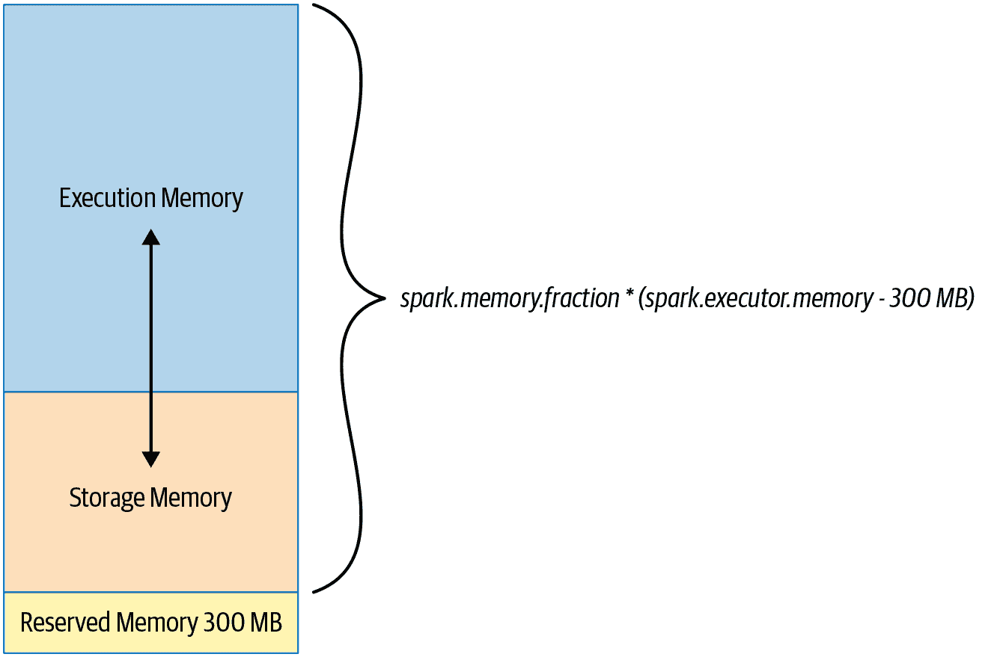

###### 图 7-2. 执行器内存布局

Spark 洗牌、连接、排序和聚合使用执行内存。由于不同的查询可能需要不同数量的内存，因此将可用内存的一部分（`spark.memory.fraction`默认为`0.6`）用于此目的可能有些棘手，但很容易进行调整。与之相反，存储内存主要用于缓存用户数据结构和从 DataFrame 派生的分区。

在映射和洗牌操作期间，Spark 会读写本地磁盘上的洗牌文件，因此会有大量的 I/O 活动。这可能导致瓶颈，因为默认配置对于大规模 Spark 作业来说并不是最优的。了解需要调整哪些配置可以在 Spark 作业的这个阶段缓解风险。

在表 7-1 中，我们列出了一些建议的配置，以便在这些操作期间进行的映射、溢出和合并过程不受低效的 I/O 影响，并在将最终的洗牌分区写入磁盘之前使用缓冲内存。调整每个执行器上运行的洗牌服务（[调整洗牌服务](https://oreil.ly/4o_pV)）也可以增强大规模 Spark 工作负载的整体性能。

表 7-1\. 调整 Spark 在映射和洗牌操作期间的 I/O 的配置

| 配置 | 默认值、推荐值和描述 |
| --- | --- |
| `spark.driver.memory` | 默认为`1g`（1 GB）。这是分配给 Spark 驱动程序的内存量，用于从执行器接收数据。在`spark-submit`时使用`--driver-memory`可以更改此值。只有在预期驱动程序将从`collect()`等操作中接收大量数据，或者当驱动程序内存不足时才需要更改此值。 |
| `spark.shuffle.file.buffer` | 默认为 32 KB。推荐为 1 MB。这使得 Spark 在最终写入磁盘之前能够进行更多的缓冲。 |
| `spark.file.transferTo` | 默认为`true`。将其设置为`false`会强制 Spark 在最终写入磁盘之前使用文件缓冲区传输文件，从而减少 I/O 活动。 |
| `spark.shuffle.unsafe.file.output.buffer` | 默认为 32 KB。这控制了在洗牌操作期间合并文件时可能的缓冲量。一般来说，对于较大的工作负载，较大的值（例如 1 MB）更合适，而默认值适用于较小的工作负载。 |
| `spark.io.compression.lz4.blockSize` | 默认为 32 KB。增加到 512 KB。通过增加块的压缩大小可以减小洗牌文件的大小。 |
| `spark.shuffle.service.index.cache.size` | 默认为 100m。缓存条目受限于指定的内存占用（以字节为单位）。 |
| `spark.shuffle.registration.timeout` | 默认为 5000 ms。增加到 120000 ms。 |
| `spark.shuffle.registration.maxAttempts` | 默认为 3。如有需要增加到 5。 |

###### 注意

此表中的建议并不适用于所有情况，但它们应该让您了解如何根据工作负载调整这些配置。与性能调整中的其他所有事物一样，您必须进行实验，直到找到适合的平衡点。

### 最大化 Spark 的并行性

Spark 的高效性很大程度上归因于其在规模化处理中能够并行运行多个任务的能力。要理解如何最大化并行性——即尽可能并行读取和处理数据——您必须深入了解 Spark 如何从存储中将数据读入内存，以及分区对 Spark 的意义。

在数据管理术语中，分区是一种将数据排列成可配置和可读块或连续数据的子集的方法。这些数据子集可以独立读取或并行处理，如果需要，可以由一个进程中的多个线程处理。这种独立性很重要，因为它允许数据处理的大规模并行性。

Spark 在并行处理任务方面表现出色。正如您在 第二章 中了解到的那样，对于大规模工作负载，一个 Spark 作业将包含许多阶段，在每个阶段中将有许多任务。Spark 最多会为每个核心的每个任务安排一个线程，并且每个任务将处理一个独立的分区。为了优化资源利用和最大化并行性，理想情况是每个执行器的核心数至少与分区数相同，如 图 7-3 所示。如果分区数超过每个执行器的核心数，所有核心都将保持忙碌状态。您可以将分区视为并行性的原子单位：在单个核心上运行的单个线程可以处理单个分区。

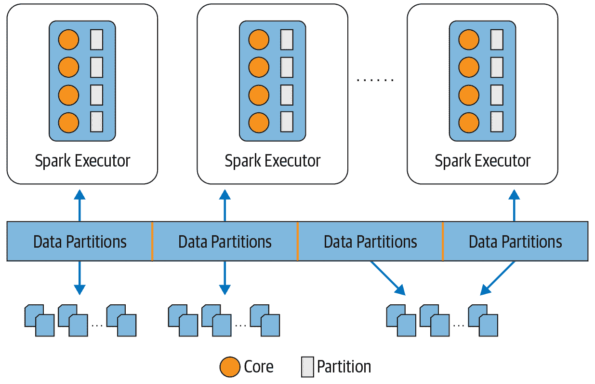

###### 图 7-3\. Spark 任务、核心、分区和并行性之间的关系

#### 如何创建分区

正如前面提到的，Spark 的任务将从磁盘读取的数据作为分区处理到内存中。磁盘上的数据根据存储的不同而以块或连续文件块的形式排列。默认情况下，数据存储上的文件块大小范围从 64 MB 到 128 MB 不等。例如，在 HDFS 和 S3 上，默认大小为 128 MB（这是可配置的）。这些块的连续集合构成一个分区。

在 Spark 中，分区的大小由 `spark.sql.files.maxPartitionBytes` 决定，默认为 128 MB。您可以减小这个大小，但这可能会导致所谓的“小文件问题”——许多小分区文件，由于文件系统操作（如打开、关闭和列出目录）而引入大量磁盘 I/O 和性能降低，特别是在分布式文件系统上可能会很慢。

当你明确使用 DataFrame API 的一些方法时，也会创建分区。例如，在创建大型 DataFrame 或从磁盘读取大型文件时，可以明确地指示 Spark 创建某个数量的分区：

```
// In Scala `val` `ds` `=` `spark``.``read``.``textFile``(``"../README.md"``)``.``repartition``(``16``)`
ds: org.apache.spark.sql.Dataset[String] = [value: string]

`ds``.``rdd``.``getNumPartitions`
res5: Int = 16

`val` `numDF` `=` `spark``.``range``(``1000L` `*` `1000` `*` `1000``)``.``repartition``(``16``)`
`numDF``.``rdd``.``getNumPartitions`

numDF: org.apache.spark.sql.Dataset[Long] = [id: bigint]
res12: Int = 16
```

最后，*shuffle partitions*是在 shuffle 阶段创建的。默认情况下，`spark.sql.shuffle.partitions`中 shuffle partitions 的数量设置为 200。可以根据数据集的大小调整这个数字，以减少通过网络发送到执行器任务的小分区的数量。

###### 注意

`spark.sql.shuffle.partitions`的默认值对于较小或流式工作负载来说太高；可能需要将其减少到更低的值，比如执行器核心数或更少。

在`groupBy()`或`join()`等操作期间创建的*shuffle partitions*，也被称为宽转换，消耗网络和磁盘 I/O 资源。在这些操作期间，shuffle 将结果溢出到执行器的本地磁盘，位置由`spark.local.directory`指定。对于这些操作，性能良好的 SSD 硬盘将提高性能。

为 shuffle 阶段设置 shuffle partitions 的数量没有一个神奇的公式；这个数字可能根据你的用例、数据集、核心数量以及可用的执行器内存量而变化——这是一个试错的过程。²

除了为了大型工作负载扩展 Spark 功能外，为了提高性能，你需要考虑缓存或持久化频繁访问的 DataFrame 或表。我们将在下一节中探讨各种缓存和持久化选项。

# 数据的缓存和持久化

缓存和持久化有什么区别？在 Spark 中，它们是同义词。两个 API 调用，`cache()`和`persist()`，提供了这些功能。后者在数据存储方面提供了更多的控制能力——可以在内存和磁盘上，序列化和非序列化存储数据。这两者都有助于提高频繁访问的 DataFrame 或表的性能。

## DataFrame.cache()

`cache()`将尽可能多地将读取的分区存储在 Spark 执行器的内存中（请参见 Figure 7-2）。虽然 DataFrame 可能只有部分缓存，但分区不能部分缓存（例如，如果有 8 个分区，但只有 4.5 个分区可以适合内存，那么只有 4 个分区会被缓存）。然而，如果没有缓存所有分区，当您再次访问数据时，没有被缓存的分区将需要重新计算，从而减慢 Spark 作业的速度。

让我们看一个例子，看看当缓存一个大型 DataFrame 时，如何提高访问一个 DataFrame 的性能：

```
// In Scala
// Create a DataFrame with 10M records
val df = spark.range(1 * 10000000).toDF("id").withColumn("square", $"id" * $"id")
df.cache() // Cache the data
df.count() // Materialize the cache

res3: Long = 10000000
Command took 5.11 seconds

df.count() // Now get it from the cache
res4: Long = 10000000
Command took 0.44 seconds
```

第一个`count()`方法实例化缓存，而第二个访问缓存，导致这个数据集接近 12 倍的快速访问时间。

###### 注意

当您使用`cache()`或`persist()`时，DataFrame 不会完全缓存，直到调用一个通过每条记录的动作（例如`count()`）为止。如果使用像`take(1)`这样的动作，只会缓存一个分区，因为 Catalyst 意识到您不需要计算所有分区就可以检索一条记录。

观察一个 DataFrame 如何在本地主机的一个执行器上存储，如图 7-4 所示，我们可以看到它们都适合于内存中（记住，DataFrames 在底层由 RDD 支持）。

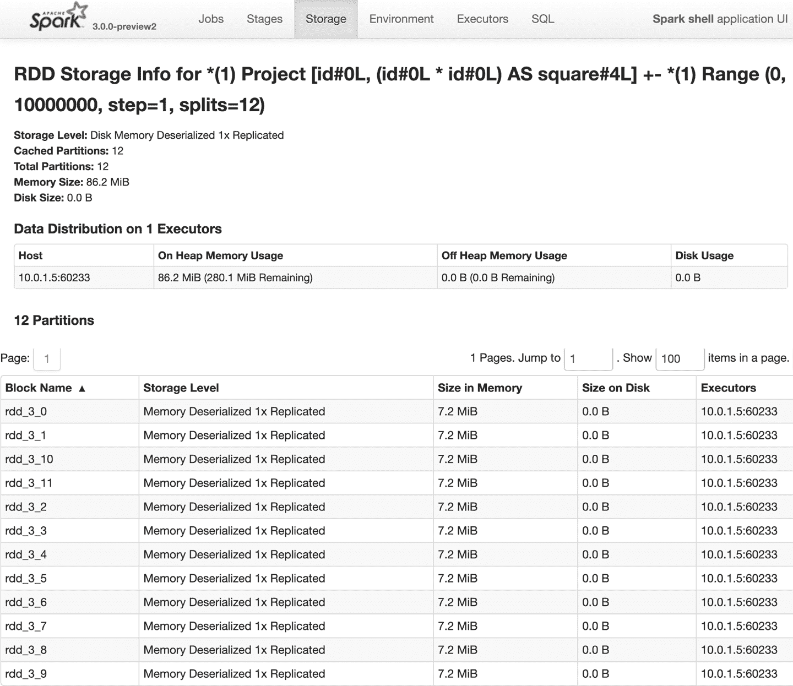

###### 图 7-4\. 缓存分布在执行器内存的 12 个分区

## DataFrame.persist()

`persist(StorageLevel.*LEVEL*)` 微妙地提供了对数据如何通过[`StorageLevel`](https://oreil.ly/gz6Bb)进行缓存的控制。表 7-2 总结了不同的存储级别。数据在磁盘上始终使用 Java 或 Kryo 序列化。

表 7-2\. 存储级别

| 存储级别 | 描述 |
| --- | --- |
| `MEMORY_ONLY` | 数据直接存储为对象并仅存储在内存中。 |
| `MEMORY_ONLY_SER` | 数据以紧凑的字节数组表示并仅存储在内存中。要使用它，必须进行反序列化，这会带来一定的成本。 |
| `MEMORY_AND_DISK` | 数据直接存储为对象在内存中，但如果内存不足，则其余部分将序列化并存储在磁盘上。 |
| `DISK_ONLY` | 数据进行序列化并存储在磁盘上。 |
| `OFF_HEAP` | 数据存储在堆外。在 Spark 中，堆外内存用于[存储和查询执行](https://oreil.ly/a69L0)，详见“配置 Spark 执行器内存和洗牌服务”。 |
| `MEMORY_AND_DISK_SER` | 类似于`MEMORY_AND_DISK`，但在存储在内存中时将数据序列化。（数据始终在存储在磁盘上时进行序列化。） |

###### 注意

每个`StorageLevel`（除了`OFF_HEAP`）都有一个相应的`LEVEL_NAME_2`，这意味着在两个不同的 Spark 执行器上复制两次：`MEMORY_ONLY_2`，`MEMORY_AND_DISK_SER_2`等。虽然这种选项很昂贵，但它允许在两个位置提供数据局部性，提供容错性，并给 Spark 提供在数据副本处调度任务的选项。

让我们看看与前一节相同的例子，但使用`persist()`方法：

```
// In Scala import org.apache.spark.storage.StorageLevel

// Create a DataFrame with 10M records val df = spark.range(1 * 10000000).toDF("id").withColumn("square", $"id" * $"id")
df.persist(StorageLevel.DISK_ONLY) // Serialize the data and cache it on disk df.count() // Materialize the cache

res2: Long = 10000000
Command took 2.08 seconds

df.count() // Now get it from the cache res3: Long = 10000000
Command took 0.38 seconds
```

如您从图 7-5 中看到的那样，数据存储在磁盘上，而不是内存中。要取消持久化缓存的数据，只需调用`DataFrame.unpersist()`。

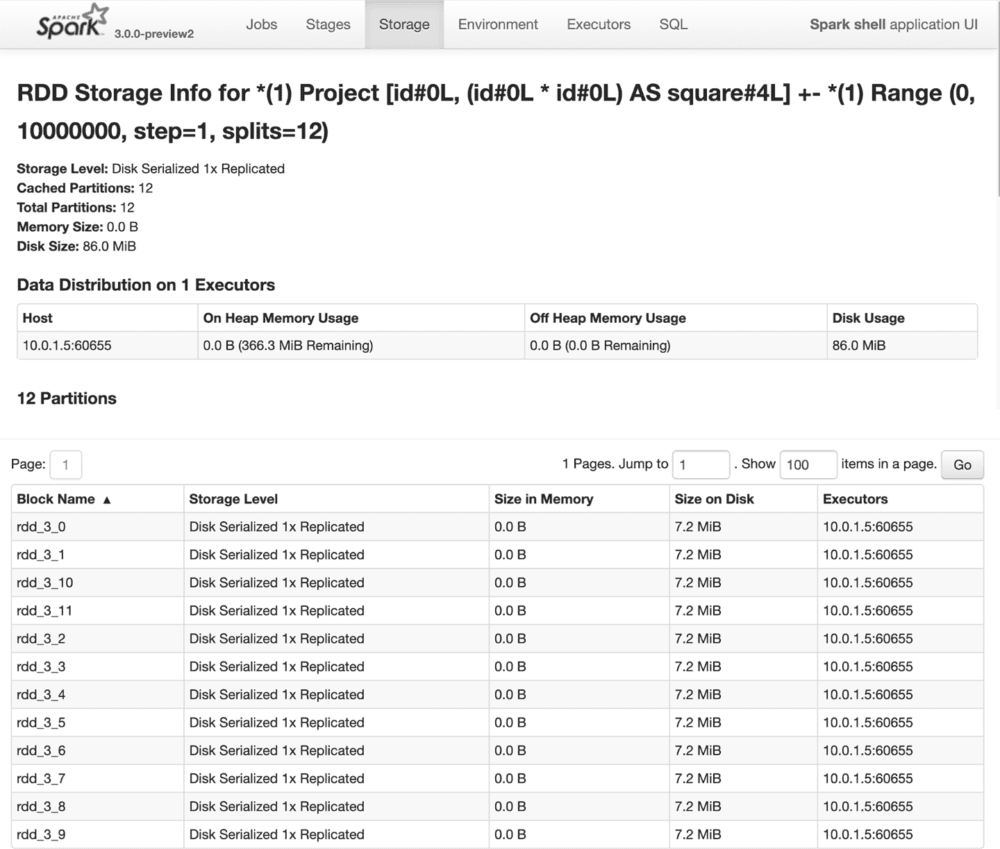

###### 图 7-5\. 缓存分布在执行器磁盘上的 12 个分区

最后，您不仅可以缓存 DataFrames，还可以缓存由 DataFrames 派生的表或视图。这使它们在 Spark UI 中具有更可读的名称。例如：

```
// In Scala
df.createOrReplaceTempView("dfTable")
spark.sql("CACHE TABLE dfTable")
spark.sql("SELECT count(*) FROM dfTable").show()

+--------+
|count(1)|
+--------+
|10000000|
+--------+

Command took 0.56 seconds
```

## 何时缓存和持久化

缓存的常见用例是需要重复访问大型数据集以进行查询或转换的情景。一些例子包括：

+   在迭代式机器学习训练期间常用的数据框

+   在 ETL 过程中或构建数据管道期间经常访问的数据框进行频繁转换

## 何时不要缓存和持久化

并非所有用例都需要缓存。一些可能不需要缓存您的数据框的情况包括：

+   无法完全放入内存的数据框

+   不需要频繁使用的数据框进行廉价转换，无论其大小如何

一般来说，您应该谨慎使用内存缓存，因为它可能会导致资源成本的增加，具体取决于使用的`StorageLevel`。

接下来，我们将转向讨论几种常见的 Spark 连接操作，这些操作会触发昂贵的数据移动，从集群中要求计算和网络资源，并且我们如何通过组织数据来减少这种移动。

# Spark 连接家族

在大数据分析中，连接操作是一种常见的转换类型，其中两个数据集（以表格或数据框的形式）通过共同匹配键合并。类似于关系数据库，Spark 数据框和数据集 API 以及 Spark SQL 提供一系列的连接转换：内连接、外连接、左连接、右连接等。所有这些操作都会触发大量数据在 Spark 执行器之间的移动。

这些转换的核心在于 Spark 如何计算要生成的数据、写入磁盘的键和相关数据以及如何将这些键和数据作为 `groupBy()`、`join()`、`agg()`、`sortBy()` 和 `reduceByKey()` 等操作的一部分传输到节点。这种移动通常称为*洗牌*。

Spark 有 [五种不同的连接策略](https://oreil.ly/q-KvH)，通过这些策略，在执行器之间交换、移动、排序、分组和合并数据：广播哈希连接（BHJ）、洗牌哈希连接（SHJ）、洗牌排序合并连接（SMJ）、广播嵌套循环连接（BNLJ）和洗牌与复制嵌套循环连接（又称笛卡尔积连接）。我们将仅关注其中的两种（BHJ 和 SMJ），因为它们是您最常遇到的。

## 广播哈希连接

也称为*仅地图侧连接*，广播哈希连接用于当两个数据集需要根据某些条件或列进行连接时，一个较小的数据集（适合驱动程序和执行器内存）和另一个足够大的数据集需要避免移动。使用 Spark [广播变量](https://oreil.ly/ersei)，驱动程序将较小的数据集广播到所有 Spark 执行器，如 图 7-6 所示，然后在每个执行器上与较大的数据集进行连接。该策略避免了大量的数据交换。

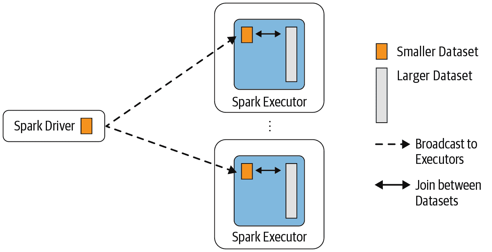

###### 图 7-6\. BHJ：较小的数据集广播到所有执行器

默认情况下，如果较小的数据集大小小于 10 MB，Spark 将使用广播连接。此配置在 `spark.sql.autoBroadcastJoinThreshold` 中设置；根据每个执行器和驱动程序中的内存量，您可以减少或增加大小。如果您确信您有足够的内存，即使对大于 10 MB 的 DataFrame，您也可以使用广播连接（甚至可达到 100 MB）。

一个常见的用例是当您有两个 DataFrame 之间的公共键集，一个持有比另一个少的信息，并且您需要一个合并视图。例如，考虑一个简单的情况，您有一个大数据集 `playersDF` 包含全球足球运动员的信息，以及一个较小的数据集 `clubsDF` 包含他们所属的足球俱乐部的信息，您希望根据一个共同的键将它们合并：

```
// In Scala 
import org.apache.spark.sql.functions.broadcast
val joinedDF = playersDF.join(broadcast(clubsDF), "key1 === key2")
```

###### 注意

在此代码中，我们强制 Spark 进行广播连接，但如果较小的数据集大小低于 `spark.sql.autoBroadcastJoinThreshold`，它将默认采用此类连接。

BHJ 是 Spark 提供的最简单和最快的连接，因为它不涉及数据集的任何洗牌；所有数据在广播后都可在执行器上本地使用。您只需确保 Spark 驱动程序和执行器的内存足够大，以将较小的数据集保存在内存中。

在操作之后的任何时间，您可以通过执行以下操作查看物理计划执行的连接操作：

```
joinedDF.explain(mode)
```

在 Spark 3.0 中，您可以使用 `joinedDF.explain('*mode*')` 来显示可读且易于理解的输出。模式包括 `'simple'`、`'extended'`、`'codegen'`、`'cost'` 和 `'formatted'`。

### 何时使用广播哈希连接

在以下条件下使用此类连接以获取最大效益：

+   当 Spark 将较小和较大的数据集内的每个键都哈希到同一个分区时

+   当一个数据集比另一个数据集小得多（并且在默认配置下小于 10 MB，如果有足够的内存则更多）

+   当您仅希望执行等值连接时，基于匹配的未排序键来组合两个数据集

+   当您不担心过多的网络带宽使用或内存溢出错误，因为较小的数据集将广播到所有 Spark 执行器

指定在 `spark.sql.autoBroadcastJoinThreshold` 中值为 `-1` 将导致 Spark 总是采用洗牌排序合并连接，这将在下一节中讨论。

## 洗牌排序合并连接

排序合并算法是合并两个大数据集的有效方法，这两个数据集具有可排序、唯一且可分配或存储在同一分区的公共键。从 Spark 的角度来看，这意味着具有相同键的每个数据集内的所有行都在相同执行器上的相同分区上进行哈希。显然，这意味着数据必须在执行器之间共享或交换。

正如名称所示，此连接方案有两个阶段：排序阶段和合并阶段。排序阶段根据每个数据集的所需连接键对数据集进行排序；合并阶段迭代每个数据集中的每个键，并在两个键匹配时合并行。

默认情况下，通过`spark.sql.join.preferSortMergeJoin`启用`SortMergeJoin`。以下是书籍的此章节中可用的独立应用程序笔记本的代码片段，位于其[GitHub 存储库](https://github.com/databricks/LearningSparkV2)。主要思想是使用两个拥有一百万条记录的大型 DataFrame，按两个共同的键`uid == users_id`进行连接。

此数据为合成数据，但说明了这一点：

```
// In Scala
import scala.util.Random
// Show preference over other joins for large data sets
// Disable broadcast join
// Generate data
...
spark.conf.set("spark.sql.autoBroadcastJoinThreshold", "-1")

// Generate some sample data for two data sets
var states = scala.collection.mutable.Map[Int, String]()
var items = scala.collection.mutable.Map[Int, String]()
val rnd = new scala.util.Random(42)

// Initialize states and items purchased
states += (0 -> "AZ", 1 -> "CO", 2-> "CA", 3-> "TX", 4 -> "NY", 5-> "MI")
items += (0 -> "SKU-0", 1 -> "SKU-1", 2-> "SKU-2", 3-> "SKU-3", 4 -> "SKU-4", 
    5-> "SKU-5")

// Create DataFrames
val usersDF = (0 to 1000000).map(id => (id, s"user_${id}",
    s"user_${id}@databricks.com", states(rnd.nextInt(5))))
    .toDF("uid", "login", "email", "user_state")
val ordersDF = (0 to 1000000)
    .map(r => (r, r, rnd.nextInt(10000), 10 * r* 0.2d,
    states(rnd.nextInt(5)), items(rnd.nextInt(5))))
    .toDF("transaction_id", "quantity", "users_id", "amount", "state", "items")

// Do the join 
val usersOrdersDF = ordersDF.join(usersDF, $"users_id" === $"uid")

// Show the joined results
usersOrdersDF.show(false)

+--------------+--------+--------+--------+-----+-----+---+---+----------+
|transaction_id|quantity|users_id|amount  |state|items|uid|...|user_state|
+--------------+--------+--------+--------+-----+-----+---+---+----------+
|3916          |3916    |148     |7832.0  |CA   |SKU-1|148|...|CO        |
|36384         |36384   |148     |72768.0 |NY   |SKU-2|148|...|CO        |
|41839         |41839   |148     |83678.0 |CA   |SKU-3|148|...|CO        |
|48212         |48212   |148     |96424.0 |CA   |SKU-4|148|...|CO        |
|48484         |48484   |148     |96968.0 |TX   |SKU-3|148|...|CO        |
|50514         |50514   |148     |101028.0|CO   |SKU-0|148|...|CO        |
|65694         |65694   |148     |131388.0|TX   |SKU-4|148|...|CO        |
|65723         |65723   |148     |131446.0|CA   |SKU-1|148|...|CO        |
|93125         |93125   |148     |186250.0|NY   |SKU-3|148|...|CO        |
|107097        |107097  |148     |214194.0|TX   |SKU-2|148|...|CO        |
|111297        |111297  |148     |222594.0|AZ   |SKU-3|148|...|CO        |
|117195        |117195  |148     |234390.0|TX   |SKU-4|148|...|CO        |
|253407        |253407  |148     |506814.0|NY   |SKU-4|148|...|CO        |
|267180        |267180  |148     |534360.0|AZ   |SKU-0|148|...|CO        |
|283187        |283187  |148     |566374.0|AZ   |SKU-3|148|...|CO        |
|289245        |289245  |148     |578490.0|AZ   |SKU-0|148|...|CO        |
|314077        |314077  |148     |628154.0|CO   |SKU-3|148|...|CO        |
|322170        |322170  |148     |644340.0|TX   |SKU-3|148|...|CO        |
|344627        |344627  |148     |689254.0|NY   |SKU-3|148|...|CO        |
|345611        |345611  |148     |691222.0|TX   |SKU-3|148|...|CO        |
+--------------+--------+--------+--------+-----+-----+---+---+----------+
only showing top 20 rows
```

检查我们的最终执行计划时，我们注意到 Spark 使用了预期的`SortMergeJoin`来连接这两个 DataFrame。如预期那样，`Exchange`操作是在每个执行器上的映射操作结果之间的洗牌：

```
usersOrdersDF.explain() 

== Physical Plan ==
InMemoryTableScan [transaction_id#40, quantity#41, users_id#42, amount#43,
state#44, items#45, uid#13, login#14, email#15, user_state#16]
   +- InMemoryRelation [transaction_id#40, quantity#41, users_id#42, amount#43,
state#44, items#45, uid#13, login#14, email#15, user_state#16], 
StorageLevel(disk, memory, deserialized, 1 replicas)
         +- *(3) **SortMergeJoin** [users_id#42], [uid#13], Inner
            :- *(1) Sort [users_id#42 ASC NULLS FIRST], false, 0
            :  +- Exchange hashpartitioning(users_id#42, 16), true, [id=#56]
            :     +- LocalTableScan [transaction_id#40, quantity#41, users_id#42,
amount#43, state#44, items#45]
            +- *(2) Sort [uid#13 ASC NULLS FIRST], false, 0
               +- **Exchange hashpartitioning**(uid#13, 16), true, [id=#57]
                  +- LocalTableScan [uid#13, login#14, email#15, user_state#16]
```

此外，Spark UI（我们将在下一节中讨论）显示整个作业的三个阶段：`Exchange`和`Sort`操作发生在最终阶段，随后合并结果，如图 7-7 和 7-8 所示。`Exchange`操作代价高昂，并要求分区在执行器之间通过网络进行洗牌。

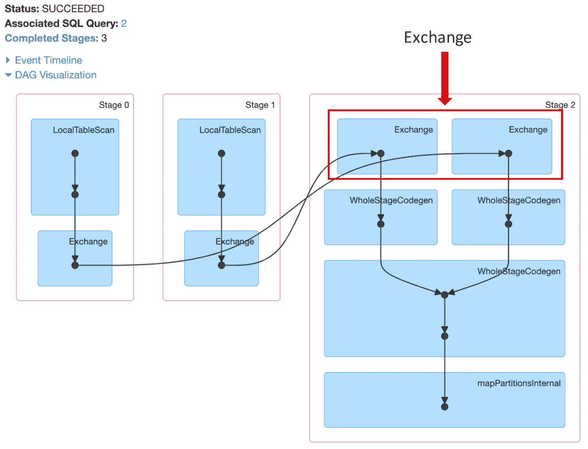

###### 图 7-7\. 桶前：Spark 的阶段


###### 图 7-8\. 桶前：需要交换

### 优化洗牌排序合并连接

如果我们为常见的排序键或要执行频繁等连接的列创建分区桶，我们可以从此方案中消除`Exchange`步骤。也就是说，我们可以创建显式数量的桶来存储特定排序列（每个桶一个键）。通过这种方式预排序和重新组织数据可提升性能，因为它允许我们跳过昂贵的`Exchange`操作并直接进入`WholeStageCodegen`。

在此章节的笔记本中的以下代码片段（在书籍的[GitHub 存储库](https://github.com/databricks/LearningSparkV2)中提供）中，我们按照将要连接的`users_id`和`uid`列进行排序和分桶，并将桶保存为 Parquet 格式的 Spark 托管表：

```
// In Scala
import org.apache.spark.sql.functions._
import org.apache.spark.sql.SaveMode

// Save as managed tables by bucketing them in Parquet format
usersDF.orderBy(asc("uid"))
  .write.format("parquet")
  .bucketBy(8, "uid")
  .mode(SaveMode.OverWrite)
  .saveAsTable("UsersTbl")

ordersDF.orderBy(asc("users_id"))
  .write.format("parquet")
  .bucketBy(8, "users_id")
  .mode(SaveMode.OverWrite)
  .saveAsTable("OrdersTbl")

// Cache the tables
spark.sql("CACHE TABLE UsersTbl")
spark.sql("CACHE TABLE OrdersTbl")

// Read them back in
val usersBucketDF = spark.table("UsersTbl")
val ordersBucketDF = spark.table("OrdersTbl")

// Do the join and show the results
val joinUsersOrdersBucketDF = ordersBucketDF
    .join(usersBucketDF, $"users_id" === $"uid")

joinUsersOrdersBucketDF.show(false)

+--------------+--------+--------+---------+-----+-----+---+---+----------+
|transaction_id|quantity|users_id|amount   |state|items|uid|...|user_state|
+--------------+--------+--------+---------+-----+-----+---+---+----------+
|144179        |144179  |22      |288358.0 |TX   |SKU-4|22 |...|CO        |
|145352        |145352  |22      |290704.0 |NY   |SKU-0|22 |...|CO        |
|168648        |168648  |22      |337296.0 |TX   |SKU-2|22 |...|CO        |
|173682        |173682  |22      |347364.0 |NY   |SKU-2|22 |...|CO        |
|397577        |397577  |22      |795154.0 |CA   |SKU-3|22 |...|CO        |
|403974        |403974  |22      |807948.0 |CO   |SKU-2|22 |...|CO        |
|405438        |405438  |22      |810876.0 |NY   |SKU-1|22 |...|CO        |
|417886        |417886  |22      |835772.0 |CA   |SKU-3|22 |...|CO        |
|420809        |420809  |22      |841618.0 |NY   |SKU-4|22 |...|CO        |
|659905        |659905  |22      |1319810.0|AZ   |SKU-1|22 |...|CO        |
|899422        |899422  |22      |1798844.0|TX   |SKU-4|22 |...|CO        |
|906616        |906616  |22      |1813232.0|CO   |SKU-2|22 |...|CO        |
|916292        |916292  |22      |1832584.0|TX   |SKU-0|22 |...|CO        |
|916827        |916827  |22      |1833654.0|TX   |SKU-1|22 |...|CO        |
|919106        |919106  |22      |1838212.0|TX   |SKU-1|22 |...|CO        |
|921921        |921921  |22      |1843842.0|AZ   |SKU-4|22 |...|CO        |
|926777        |926777  |22      |1853554.0|CO   |SKU-2|22 |...|CO        |
|124630        |124630  |22      |249260.0 |CO   |SKU-0|22 |...|CO        |
|129823        |129823  |22      |259646.0 |NY   |SKU-4|22 |...|CO        |
|132756        |132756  |22      |265512.0 |AZ   |SKU-2|22 |...|CO        |
+--------------+--------+--------+---------+-----+-----+---+---+----------+
only showing top 20 rows
```

连接输出按`uid`和`users_id`排序，因为我们保存的表按升序排序。因此，在`SortMergeJoin`期间不需要排序。查看 Spark UI（图 7-9），我们可以看到我们跳过了`Exchange`并直接进入了`WholeStageCodegen`。

物理计划还显示没有执行`Exchange`操作，与桶前的物理计划相比：

```
joinUsersOrdersBucketDF.explain()

== Physical Plan ==
*(3) SortMergeJoin [users_id#165], [uid#62], Inner
:- *(1) Sort [users_id#165 ASC NULLS FIRST], false, 0
:  +- *(1) Filter isnotnull(users_id#165)
:     +- Scan In-memory table `OrdersTbl` [transaction_id#163, quantity#164,
users_id#165, amount#166, state#167, items#168], [isnotnull(users_id#165)]
:           +- InMemoryRelation [transaction_id#163, quantity#164, users_id#165,
amount#166, state#167, items#168], StorageLevel(disk, memory, deserialized, 1
replicas)
:                 +- *(1) ColumnarToRow
:                    +- FileScan parquet 
...
```

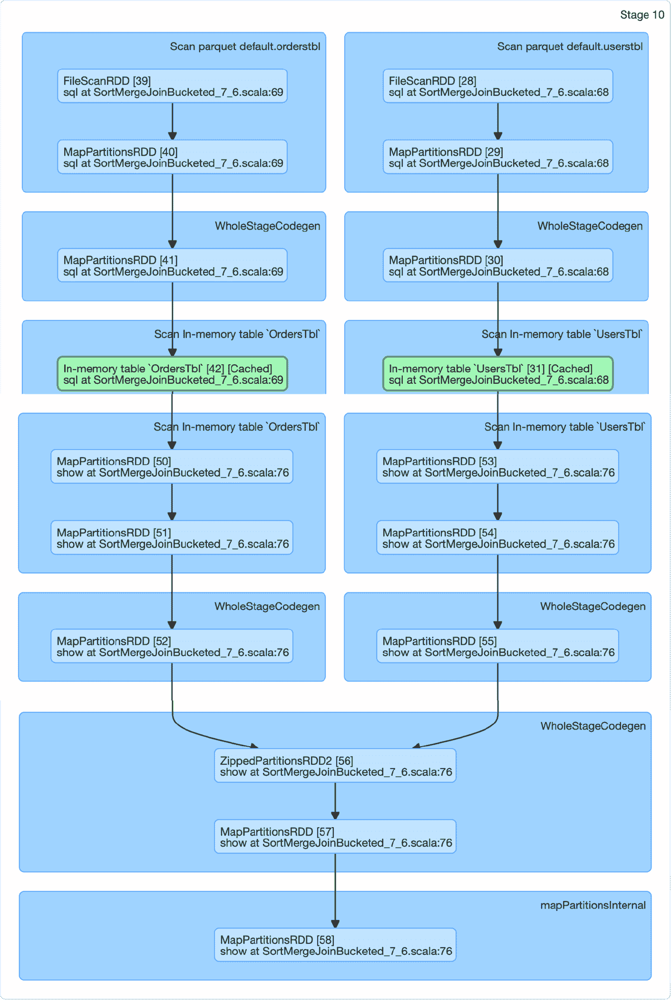

###### 图 7-9\. 桶后：不需要交换

### 何时使用洗牌排序合并连接

在以下条件下使用这种类型的连接以获得最大效益：

+   当 Spark 能够将两个大数据集中的每个键按排序和哈希方式分到同一分区时

+   当您希望仅执行基于匹配排序键的两个数据集的等连接以合并时

+   当您希望防止 `Exchange` 和 `Sort` 操作以节省跨网络的大型洗牌时

到目前为止，我们已经涵盖了与调整和优化 Spark 相关的操作方面，以及 Spark 在两种常见连接操作期间如何交换数据。我们还演示了如何通过使用分桶来避免大数据交换来提高 shuffle sort merge join 操作的性能。

正如您在前面的图表中所看到的，Spark UI 是可视化这些操作的有用方式。它显示收集的指标和程序的状态，揭示了大量关于可能性能瓶颈的信息和线索。在本章的最后一节中，我们将讨论在 Spark UI 中寻找什么。

# 检查 Spark UI

Spark 提供了一个精心设计的 Web UI，允许我们检查应用程序的各个组件。它提供有关内存使用情况、作业、阶段和任务的详细信息，以及事件时间线、日志和各种指标和统计信息，这些可以帮助您深入了解 Spark 应用程序在 Spark 驱动程序级别和单个执行器中的运行情况。

一个 `spark-submit` 作业将启动 Spark UI，您可以在本地主机上（在本地模式下）或通过 Spark 驱动程序（在其他模式下）连接到默认端口 4040。

## 通过 Spark UI 选项卡的旅程

Spark UI 有六个选项卡，如 图 7-10 所示，每个选项卡都提供了探索的机会。让我们看看每个选项卡向我们揭示了什么。


###### 图 7-10\. Spark UI 选项卡

这个讨论适用于 Spark 2.x 和 Spark 3.0。虽然 Spark 3.0 中的 UI 大部分相同，但它还增加了第七个选项卡，结构化流处理。这在 第十二章 中进行了预览。

### 作业与阶段

正如您在 第二章 中学到的，Spark 将应用程序分解为作业、阶段和任务。作业和阶段选项卡允许您浏览这些内容，并深入到细粒度级别以检查个别任务的详细信息。您可以查看它们的完成状态，并查看与 I/O、内存消耗、执行持续时间等相关的指标。

图 7-11 显示了作业选项卡及其扩展的事件时间轴，显示了执行者何时添加到或从集群中移除。它还提供了集群中所有已完成作业的表格列表。持续时间列显示了每个作业完成所需的时间（由第一列中的作业 ID 标识）。如果这段时间很长，则可能需要调查导致延迟的任务阶段。从此摘要页面，您还可以访问每个作业的详细页面，包括 DAG 可视化和已完成阶段列表。


###### 图 7-11\. 作业选项卡提供了事件时间轴视图和所有已完成作业的列表

阶段选项卡提供了应用程序中所有作业所有阶段当前状态的摘要。您还可以访问每个阶段的详细页面，其中包含 DAG 和任务的指标（图 7-12）。除了一些可选的统计信息外，您还可以查看每个任务的平均持续时间、GC 花费的时间以及洗牌字节/记录读取的数量。如果从远程执行者读取洗牌数据，则高 Shuffle Read Blocked Time 可能会提示 I/O 问题。高 GC 时间表明堆上有太多对象（可能是内存不足的执行者）。如果一个阶段的最大任务时间远大于中位数，则可能存在数据分区不均匀导致的数据倾斜问题。请留意这些显著迹象。

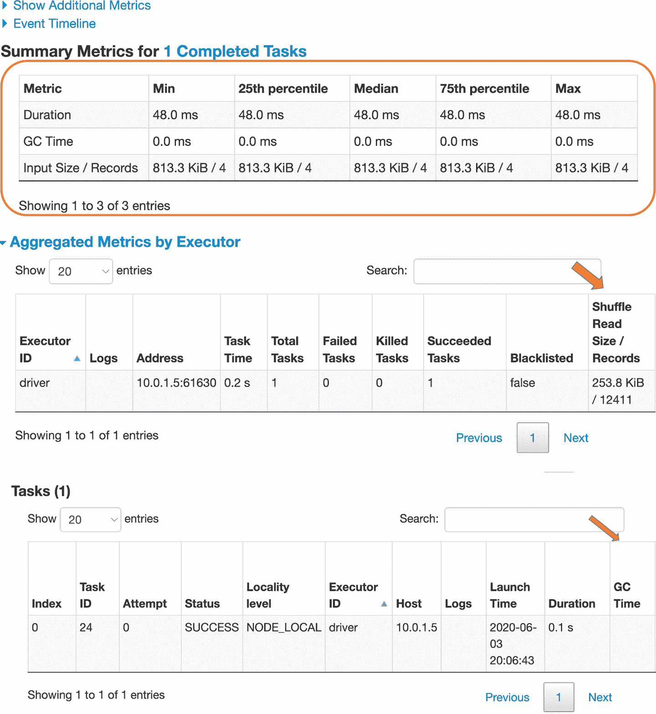

###### 图 7-12\. 阶段选项卡提供了有关阶段及其任务的详细信息

您还可以查看每个执行者的聚合指标以及此页面上各个任务的详细信息。

### 执行者

执行者选项卡提供了有关为应用程序创建的执行者的信息。正如您在 图 7-13 中所看到的，您可以深入了解有关资源使用情况（磁盘、内存、核心）、GC 时间、洗牌期间写入和读取的数据量等细节。

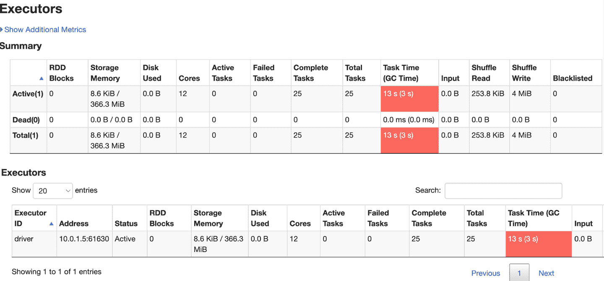

###### 图 7-13\. 执行者选项卡显示了 Spark 应用程序使用的执行者的详细统计数据和指标

除了摘要统计信息外，您还可以查看每个单独执行者的内存使用情况及其用途。当您在 DataFrame 或管理表上使用 `cache()` 或 `persist()` 方法时，这也有助于检查资源使用情况，接下来我们将讨论这些。

### 存储

在“Shuffle Sort Merge Join”中的 Spark 代码中，我们对桶分区后管理了两个表的缓存。在图 7-14 中显示的存储选项卡提供了有关该应用程序缓存的任何表或 DataFrame 的信息，这是由`cache()`或`persist()`方法的结果产生的。

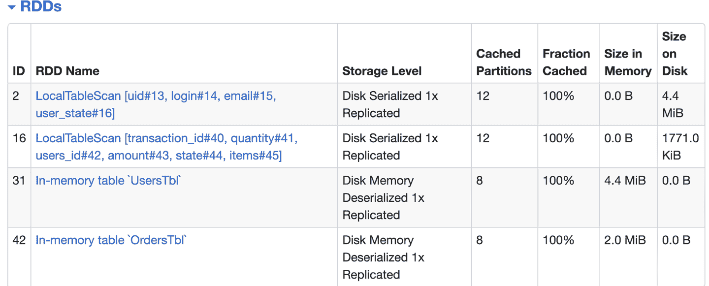

###### 图 7-14\. 存储选项卡显示内存使用情况的详细信息

点击链接“内存表`UsersTbl`”在图 7-14 中，可以进一步了解表在内存和磁盘上的缓存情况，以及在 1 个执行器和 8 个分区上的分布情况，这个数字对应我们为这个表创建的桶的数量（参见图 7-15）。

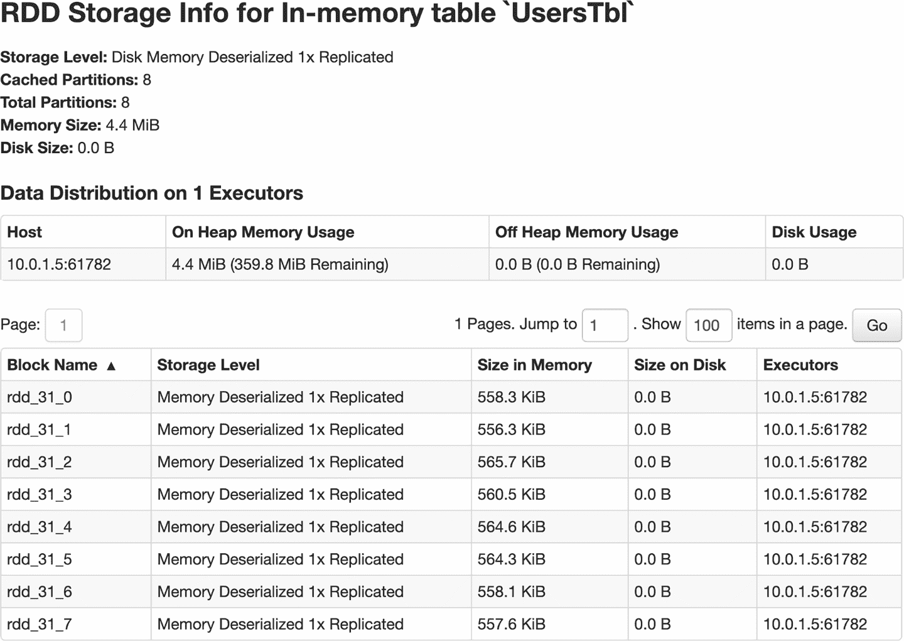

###### 图 7-15\. Spark UI 显示表在执行器内存中的缓存分布

### SQL

作为您的 Spark 应用程序执行的一部分执行的 Spark SQL 查询的影响可以通过 SQL 选项卡进行跟踪和查看。您可以看到查询何时执行以及由哪个作业执行，以及它们的持续时间。例如，在我们的`SortMergeJoin`示例中，我们执行了一些查询；所有这些都显示在图 7-16 中，并附带了进一步深入了解的链接。


###### 图 7-16\. SQL 选项卡显示已完成的 SQL 查询的详细信息

点击查询的描述会显示执行计划的细节，包括所有物理运算符，如图 7-17 所示。在计划的每个物理运算符下面—例如，在此处`扫描内存表`，`哈希聚合`和`Exchange`—都有 SQL 指标。

当我们想要检查物理运算符的细节并了解发生了什么时，这些指标就非常有用：有多少行被扫描了，写了多少洗牌字节等等。

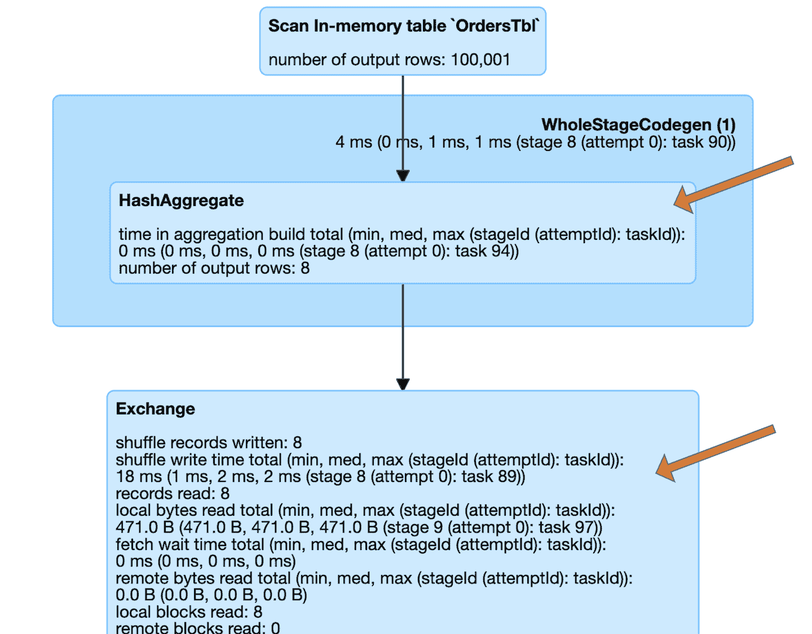

###### 图 7-17\. Spark UI 显示 SQL 查询的详细统计信息

### 环境

与其他选项卡一样，图 7-18 中显示的环境选项卡同样重要。了解您的 Spark 应用程序所在的环境可以揭示许多有用于故障排除的线索。事实上，了解已设置了哪些环境变量，包括了哪些 jar 包，设置了哪些 Spark 属性（及其相应的值，特别是如果您调整了“优化和调整 Spark 的效率”中提到的一些配置），设置了哪些系统属性，使用了哪个运行时环境（如 JVM 或 Java 版本）等等对于您在 Spark 应用程序中注意到任何异常行为时的调查工作非常有帮助。


###### 图 7-18\. 环境标签显示了你的 Spark 集群的运行时属性。

### 调试 Spark 应用程序

在本节中，我们已经浏览了 Spark UI 中的各种标签。正如你所见，UI 提供了大量信息，可用于调试和解决 Spark 应用程序的问题。除了我们在这里涵盖的内容之外，它还提供了访问驱动程序和执行器的 stdout/stderr 日志的方式，你可以在这里记录调试信息。

通过 UI 进行调试是与在你喜欢的 IDE 中逐步执行应用程序不同的过程 —— 更像是侦探，追随面包屑的线索 —— 虽然如果你喜欢那种方法，你也可以在本地主机上的 IDE（如 [IntelliJ IDEA](https://oreil.ly/HkbIv)）中调试 Spark 应用程序。

[Spark 3.0 UI 标签](https://oreil.ly/3X46q)展示了关于发生情况的见解性线索，以及访问驱动程序和执行器的 stdout/stderr 日志，你可能在这里记录了调试信息。

起初，这些大量的信息对新手来说可能是压倒性的。但随着时间的推移，你会逐渐理解每个标签中要寻找的内容，并且能够更快地检测和诊断异常。模式会变得清晰，通过频繁访问这些标签并在运行一些 Spark 示例后熟悉它们，你会习惯通过 UI 调优和检查你的 Spark 应用程序。

# 总结

在本章中，我们讨论了多种优化技术，用于调优你的 Spark 应用程序。正如你所见，通过调整一些默认的 Spark 配置，你可以改善大型工作负载的扩展性，增强并行性，并减少 Spark 执行器之间的内存饥饿。你还一瞥了如何使用缓存和持久化策略以适当的级别加速访问你经常使用的数据集，并且我们检查了 Spark 在复杂聚合过程中使用的两种常见连接方式，并演示了通过按排序键分桶 DataFrame 如何跳过昂贵的洗牌操作。

最后，通过 Spark UI，你可以从视觉角度看到性能的情况完整呈现出来。尽管 UI 提供了详细和丰富的信息，但它并不等同于在 IDE 中逐步调试；然而我们展示了如何通过检查和从半打 Spark UI 标签中获得的度量和统计信息、计算和内存使用数据以及 SQL 查询执行跟踪来成为 Spark 的侦探。

在下一章中，我们将深入讲解结构化流式处理，并向你展示在前几章学习过的结构化 API 如何让你连续编写流式和批处理应用程序，使你能够构建可靠的数据湖和管道。

¹ 参见 [“调整 Apache Spark 以应对大规模工作负载”](https://oreil.ly/cT8Az) 和 [“Apache Spark 中的 Hive 分桶”](https://oreil.ly/S2hTU)。

² 想要了解一些有关配置洗牌分区的技巧，请参见 [“调整 Apache Spark 以应对大规模工作负载”](https://oreil.ly/QpVyf)，[“Apache Spark 中的 Hive 分桶”](https://oreil.ly/RmiTd)，以及 [“为什么你应该关注文件系统中的数据布局”](https://oreil.ly/RQQFf)。
