# 第三章：Apache Flink 的架构

第二章 讨论了分布式流处理的重要概念，例如并行化、时间和状态。在本章中，我们对 Flink 的架构进行了高层次介绍，并描述了它如何解决我们早前讨论过的流处理方面的问题。特别是，我们解释了 Flink 的分布式架构，展示了它在流应用程序中如何处理时间和状态，并讨论了其容错机制。本章提供了成功实施和运行 Apache Flink 高级流处理应用程序所需的相关背景信息。它将帮助您理解 Flink 的内部机制，并推断流应用程序的性能和行为。

# 系统架构

Flink 是用于有状态并行数据流处理的分布式系统。一个 Flink 设置由多个进程组成，通常分布在多台机器上。分布式系统需要解决的常见挑战包括在集群中分配和管理计算资源、进程协调、持久且高可用的数据存储以及故障恢复。

Flink 并未自行实现所有这些功能。相反，它专注于其核心功能——分布式数据流处理，并利用现有的集群基础设施和服务。Flink 与集群资源管理器（如 Apache Mesos、YARN 和 Kubernetes）集成良好，但也可以配置为独立集群运行。Flink 不提供持久的分布式存储，而是利用诸如 HDFS 或对象存储（如 S3）的分布式文件系统。在高可用设置中的领导者选举方面，Flink 依赖于 Apache ZooKeeper。

在本节中，我们描述了 Flink 设置的不同组件以及它们如何相互作用来执行应用程序。我们讨论了部署 Flink 应用程序的两种不同方式，以及每种方式如何分发和执行任务。最后，我们解释了 Flink 的高可用模式的工作原理。

## Flink 设置的组件

一个 Flink 设置由四个不同的组件组成，它们共同工作以执行流应用程序。这些组件分别是 JobManager、ResourceManager、TaskManager 和 Dispatcher。由于 Flink 是用 Java 和 Scala 实现的，所有组件都在 Java 虚拟机（JVM）上运行。每个组件有以下责任：

+   *JobManager* 是控制单个应用程序执行的主进程 — 每个应用程序由不同的 JobManager 控制。JobManager 接收应用程序进行执行。应用程序包括所谓的 JobGraph，即逻辑数据流图（参见 “数据流编程简介”），以及一个捆绑了所有所需类、库和其他资源的 JAR 文件。JobManager 将 JobGraph 转换为称为 ExecutionGraph 的物理数据流图，其中包含可以并行执行的任务。JobManager 从 ResourceManager 请求必要的资源（TaskManager 槽位）来执行任务。一旦它收到足够的 TaskManager 槽位，就会将 ExecutionGraph 的任务分配给执行它们的 TaskManagers。在执行过程中，JobManager 负责所有需要中心协调的操作，比如协调检查点（参见 “检查点、保存点和状态恢复”）。

+   Flink 提供了多个 *ResourceManager* 用于不同的环境和资源提供程序，如 YARN、Mesos、Kubernetes 和独立部署。ResourceManager 负责管理 TaskManager 槽位，即 Flink 处理资源的单位。当一个 JobManager 请求 TaskManager 槽位时，ResourceManager 指示具有空闲槽位的 TaskManager 将其提供给 JobManager。如果 ResourceManager 没有足够的槽位来满足 JobManager 的请求，则 ResourceManager 可以与资源提供程序通信，以提供容器，在其中启动 TaskManager 进程。ResourceManager 还负责终止空闲 TaskManager 以释放计算资源。

+   *TaskManager* 是 Flink 的工作进程。通常，在 Flink 设置中会运行多个 TaskManager。每个 TaskManager 提供一定数量的槽位。槽位的数量限制了 TaskManager 可以执行的任务数。启动后，TaskManager 将其槽位注册给 ResourceManager。当 ResourceManager 指示时，TaskManager 将其一个或多个槽位提供给 JobManager。然后，JobManager 可以将任务分配给这些槽位以执行它们。在执行过程中，TaskManager 与运行同一应用程序任务的其他 TaskManagers 交换数据。任务的执行和槽位的概念在 “任务执行” 中讨论。

+   *Dispatcher* 负责跨作业执行并提供 REST 接口来提交应用程序以进行执行。一旦应用程序提交执行，它启动一个 JobManager 并将应用程序移交给它。REST 接口使得调度程序能够作为集群的 HTTP 入口点提供服务，尤其是在防火墙后面的集群中。调度程序还运行一个 web 仪表板，用于提供有关作业执行的信息。根据应用程序的执行方式（详见 “应用部署”），可能不需要调度程序。

图 3-1 展示了当提交应用程序进行执行时，Flink 组件如何相互交互。

###### 图 3-1\. 应用提交和组件交互

###### 注意

图 3-1 是一个高级草图，用于可视化应用程序组件的责任和交互。根据环境（如 YARN、Mesos、Kubernetes、独立集群），某些步骤可以省略，或者组件可以在同一个 JVM 进程中运行。例如，在独立设置中——没有资源提供者的设置中——ResourceManager 只能分发可用 TaskManager 的插槽，并且不能自行启动新的 TaskManager。在 “部署模式” 中，我们将讨论如何为不同环境设置和配置 Flink。

## 应用部署

Flink 应用程序可以以两种不同的方式部署。

框架样式

在这种模式下，Flink 应用程序被打包成 JAR 文件，并由客户端提交给运行中的服务。该服务可以是 Flink Dispatcher、Flink JobManager 或 YARN 的 ResourceManager。无论哪种情况，都有一个运行中的服务接受 Flink 应用程序并确保其执行。如果应用程序提交给了 JobManager，则立即开始执行应用程序。如果应用程序提交给了 Dispatcher 或 YARN 的 ResourceManager，则会启动一个 JobManager 并将应用程序移交给它，然后 JobManager 开始执行应用程序。

库样式

在这种模式下，Flink 应用程序打包在特定于应用程序的容器映像中，例如 Docker 映像。该映像还包括运行 JobManager 和 ResourceManager 的代码。当从映像启动容器时，它会自动启动 ResourceManager 和 JobManager，并提交打包的作业以供执行。第二个与作业无关的映像用于部署 TaskManager 容器。从该映像启动的容器会自动启动 TaskManager，并连接到 ResourceManager 并注册其插槽。通常，像 Kubernetes 这样的外部资源管理器负责启动映像，并确保在故障时重新启动容器。

框架样式遵循通过客户端将应用程序（或查询）提交给正在运行的服务的传统方法。在库样式中，没有 Flink 服务。相反，Flink 与应用程序捆绑在一个容器镜像中作为库一起提供。这种部署模式在微服务架构中很常见。我们在“运行和管理流处理应用程序”中更详细地讨论了应用程序部署的主题。

## 任务执行

一个 TaskManager 可以同时执行多个任务。这些任务可以是同一个运算符的子任务（数据并行）、不同运算符的任务（任务并行）甚至来自不同应用程序的任务（作业并行）。TaskManager 提供一定数量的处理槽位来控制其能够并发执行的任务数量。每个处理槽位可以执行一个应用程序的一个切片——每个运算符的一个并行任务。图 3-2 展示了 TaskManager、槽位、任务和运算符之间的关系。

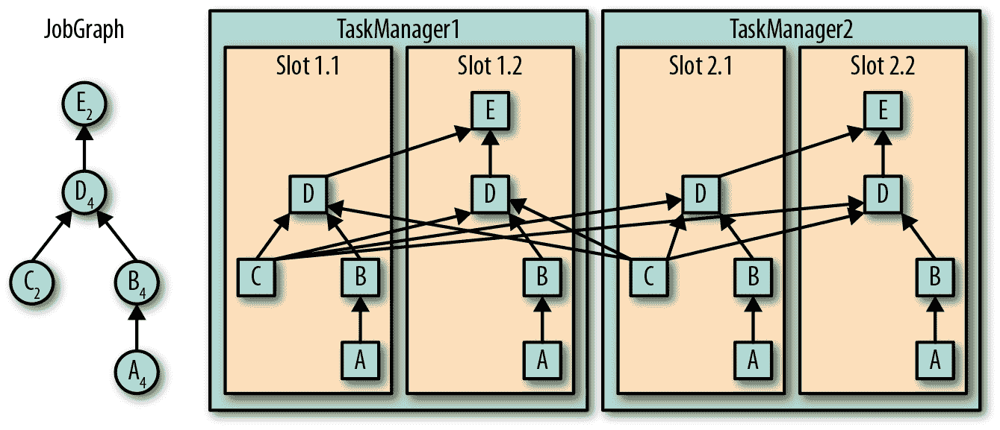

###### 图 3-2\. 运算符、任务和处理槽位

在图 3-2 的左侧，您可以看到一个作业图（JobGraph）——应用程序的非并行表示，由五个运算符组成。运算符 A 和 C 是源，运算符 E 是汇。运算符 C 和 E 的并行度为二。其他运算符的并行度为四。由于最大运算符并行度为四，该应用程序需要至少四个可用的处理槽位才能执行。考虑到每个具有两个处理槽位的两个 TaskManager，此需求得到满足。JobManager 将作业图拓展为执行图，并将任务分配给这四个可用槽位。具有并行度为四的运算符的任务被分配到每个槽位上。运算符 C 和 E 的两个任务分别分配到槽位 1.1 和 2.1，以及槽位 1.2 和 2.2。将任务作为切片调度到槽位的优势在于，许多任务被放置在同一个 TaskManager 上，这意味着它们可以在同一进程内有效地交换数据，而无需访问网络。然而，过多的共位任务也可能会使 TaskManager 过载，并导致性能不佳。在“控制任务调度”中，我们讨论了如何控制任务的调度。

TaskManager 在同一 JVM 进程中多线程执行其任务。线程比单独的进程更轻量，并具有较低的通信成本，但不能严格隔离任务。因此，单个表现不佳的任务可以终止整个 TaskManager 进程及其上运行的所有任务。通过配置每个 TaskManager 仅有一个槽位，可以在 TaskManagers 之间隔离应用程序。通过在 TaskManager 内利用线程并在每台主机上部署多个 TaskManager 进程，Flink 在部署应用程序时提供了灵活性来权衡性能和资源隔离。我们将在第九章详细讨论 Flink 集群的配置和设置。

## Highly Available Setup

流处理应用程序通常设计为 24/7 运行。因此，即使涉及的进程失败，其执行也不应停止。为从故障中恢复，系统首先需要重新启动失败的进程，其次重新启动应用程序并恢复其状态。在本节中，您将了解 Flink 如何重新启动失败的进程。应用程序状态的恢复描述在“从一致检查点恢复”中。

### TaskManager failures

如前所述，Flink 要求足够数量的处理槽位以执行应用程序的所有任务。假设有四个 TaskManager，每个提供两个槽位的 Flink 设置，流处理应用程序的最大并行性为八。如果其中一个 TaskManager 失败，则可用槽位数量降至六。在这种情况下，JobManager 将要求 ResourceManager 提供更多处理槽位。如果这不可能，例如因为应用程序在独立集群中运行，JobManager 将无法重新启动应用程序，直到足够的槽位变得可用。应用程序的重启策略决定了 JobManager 重新启动应用程序的频率以及重启尝试之间的等待时间。¹

### JobManager 故障

比 TaskManager 故障更具挑战性的问题是 JobManager 故障。JobManager 控制流处理应用程序的执行，并保留有关其执行的元数据，如指向完成检查点的指针。如果负责的 JobManager 进程消失，流处理应用程序将无法继续处理。这使得 JobManager 成为 Flink 中应用程序的单点故障。为解决此问题，Flink 支持高可用模式，该模式在原始 JobManager 消失时将作业的责任和元数据迁移到另一个 JobManager。

Flink 的高可用模式基于[Apache ZooKeeper](https://zookeeper.apache.org/)，这是一个用于需要协调和共识的分布式服务系统。Flink 使用 ZooKeeper 进行 Leader 选举，并作为高可用和持久化的数据存储。在高可用模式下，JobManager 将 JobGraph 和所有必需的元数据（如应用程序的 JAR 文件）写入远程持久存储系统。此外，JobManager 将存储位置的指针写入 ZooKeeper 的数据存储。在应用程序执行期间，JobManager 接收各个任务检查点的状态句柄（存储位置）。完成检查点时（当所有任务成功将其状态写入远程存储时），JobManager 将状态句柄写入远程存储，并将指向此位置的指针写入 ZooKeeper。因此，从 JobManager 故障中恢复所需的所有数据都存储在远程存储中，而 ZooKeeper 则保存了存储位置的指针。图 3-3（#fig_ha-setup）说明了这一设计。

###### 图 3-3. 高可用 Flink 设置

当 JobManager 失败时，其应用程序的所有任务都会自动取消。接管失败主节点工作的新 JobManager 执行以下步骤：

1.  它从 ZooKeeper 请求存储位置，以获取 JobGraph、JAR 文件以及应用程序上次检查点的状态句柄，这些都来自远程存储。

1.  它从 ResourceManager 请求处理插槽，以继续执行应用程序。

1.  它重新启动应用程序，并将其所有任务的状态重置为最后完成的检查点状态。

在容器环境（如 Kubernetes）中以库部署方式运行应用程序时，通常由容器编排服务自动重新启动失败的 JobManager 或 TaskManager 容器。在 YARN 或 Mesos 上运行时，Flink 的剩余进程会触发 JobManager 或 TaskManager 进程的重启。在独立集群中运行时，Flink 不提供重新启动失败进程的工具。因此，在此情况下运行备用 JobManagers 和 TaskManagers 以接管失败进程的工作可能非常有用。我们将在“高可用设置”中讨论高可用 Flink 设置的配置。

# Flink 中的数据传输

运行中应用程序的任务不断交换数据。TaskManagers 负责将数据从发送任务传输到接收任务。TaskManager 的网络组件在将记录发送之前将其收集到缓冲区中，即记录不是逐个发送而是批量发送到缓冲区。这种技术对有效利用网络资源和实现高吞吐量至关重要。该机制类似于网络或磁盘 I/O 协议中使用的缓冲技术。

###### 注意

请注意，将记录打包到缓冲区中意味着 Flink 的处理模型基于微批处理。

每个 TaskManager 都有一个网络缓冲池（默认大小为 32 KB）用于发送和接收数据。如果发送任务和接收任务在不同的 TaskManager 进程中运行，则它们通过操作系统的网络堆栈进行通信。流处理应用程序需要以流水线方式交换数据，每对 TaskManager 之间维护一个永久的 TCP 连接以交换数据。² 使用 shuffle 连接模式时，每个发送任务需要能够向每个接收任务发送数据。每个 TaskManager 需要为其任何任务需要向其发送数据的接收任务准备一个专用的网络缓冲区。图 3-4 展示了这种架构。

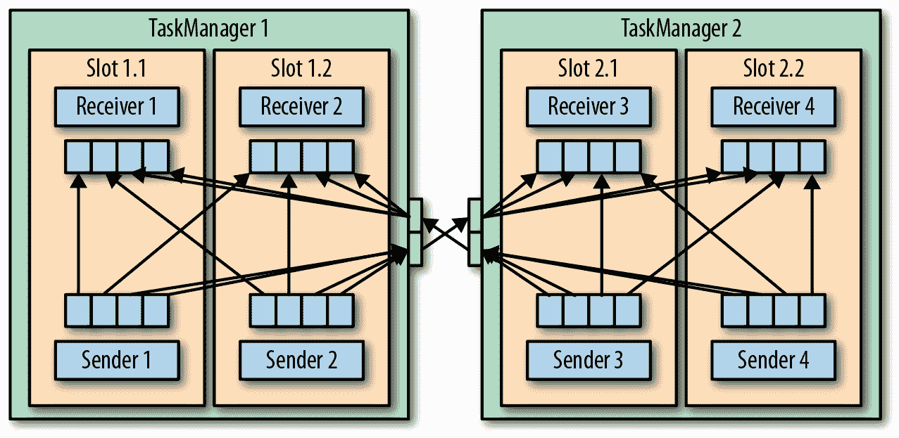

###### 图 3-4\. TaskManagers 之间的数据传输

如图 3-4 所示，每个发送任务至少需要四个网络缓冲区来向每个接收任务发送数据，每个接收任务需要至少四个缓冲区来接收数据。需要发送到其他 TaskManager 的缓冲区在同一网络连接上进行复用。为了实现平稳的流水线数据交换，一个 TaskManager 必须能够提供足够的缓冲区以同时服务所有的出站和入站连接。对于 shuffle 或 broadcast 连接，每个发送任务都需要为每个接收任务准备一个缓冲区；所需的缓冲区数量与涉及的运算符的任务数呈二次关系。对于小型到中型的设置，Flink 默认的网络缓冲区配置已经足够。对于更大的设置，需要根据“主内存和网络缓冲区”中描述的内容进行配置调整。

当发送任务和接收任务在同一个 TaskManager 进程中运行时，发送任务将输出的记录序列化为一个字节缓冲区，并在填充完毕后将缓冲区放入队列。接收任务从队列中获取缓冲区并反序列化传入的记录。因此，在同一 TaskManager 上运行的任务之间的数据传输不会导致网络通信。

Flink 提供了不同的技术来减少任务之间的通信成本。在接下来的章节中，我们将简要讨论基于信用的流量控制和任务链。

## 基于信用的流量控制

通过网络连接发送单独的记录效率低下且会导致显著的开销。需要缓冲以充分利用网络连接的带宽。在流处理的背景下，缓冲的一个缺点是增加了延迟，因为记录被收集到缓冲区而不是立即发送。

Flink 实现了一种基于信用的流量控制机制，工作原理如下。接收任务向发送任务授予一些信用，即为接收其数据保留的网络缓冲区数量。一旦发送方接收到信用通知，它就会发送被授予的缓冲区数量以及其积压大小——填充并准备发送的网络缓冲区数量。接收方使用保留的缓冲区处理接收到的数据，并利用发送方的积压大小为其连接的所有发送方优先分配下一次信用授予。

基于信用的流量控制通过在接收方有足够资源接受数据时发送方可以立即发送数据来减少延迟。此外，它还是分布网络资源的有效机制，特别是在数据分布不均匀的情况下，因为信用是基于发送方积压大小授予的。因此，基于信用的流量控制对于 Flink 实现高吞吐量和低延迟至关重要。

## 任务链条

Flink 提供了一种优化技术称为任务链条，在某些条件下减少了本地通信的开销。为了满足任务链条的要求，两个或多个操作符必须配置相同的并行度，并通过本地前向通道连接。如图 图 3-5 所示的操作流水线满足这些要求。它由三个操作符组成，所有操作符都配置为并行度为二，并通过本地前向连接连接起来。

###### 图 3-5\. 符合任务链条要求的操作流水线

图 3-6 描述了如何使用任务链条执行流水线。操作符的函数被融合成单个任务，由单个线程执行。一个函数产生的记录通过简单的方法调用传递给下一个函数。因此，在函数间传递记录几乎没有序列化和通信成本。

###### 图 3-6\. 使用单线程和方法调用传递数据执行链式任务

任务链条可以显著减少本地任务之间的通信成本，但在某些情况下，执行不使用链条的流水线也是有意义的。例如，可以合理地打破长的任务链或将链分成两个任务，以便将昂贵的函数安排到不同的插槽中执行。图 3-7 展示了同一流水线在没有任务链条的情况下的执行方式。所有函数都由各自运行在专用线程的单独任务评估。

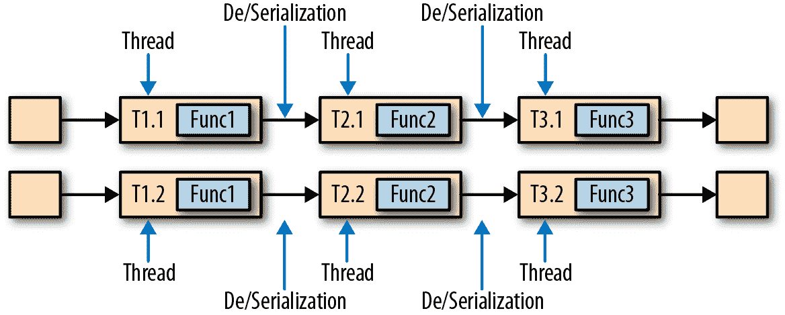

###### 图 3-7\. 使用专用线程进行非链式任务执行，数据通过缓冲通道和序列化进行传输。

Flink 默认启用任务链。在 “控制任务链” 中，我们展示了如何为应用程序禁用任务链以及如何控制各个操作符的链式行为。

# 事件时间处理

在 “时间语义” 中，我们强调了时间语义对流处理应用程序的重要性，并解释了处理时间和事件时间之间的差异。处理时间易于理解，因为它基于处理机器的本地时间，但它产生的结果有时是任意的、不一致的和不可重现的。相比之下，事件时间语义产生可重现且一致的结果，这对许多流处理用例是硬性要求。然而，与处理时间语义的应用程序相比，事件时间应用程序需要额外的配置。此外，支持事件时间的流处理器的内部比纯粹基于处理时间的系统更为复杂。

Flink 提供直观且易于使用的基本事件时间处理操作原语，同时还提供了表达丰富的 API，用于实现更高级的基于事件时间的应用程序，并支持自定义运算符。对于这类高级应用程序，了解 Flink 内部的时间处理机制通常是有帮助的，有时甚至是必需的。上一章介绍了 Flink 利用的两个概念，以提供事件时间语义：记录时间戳和水印。接下来我们将描述 Flink 如何在内部实现和处理时间戳和水印，以支持具有事件时间语义的流应用程序。

## 时间戳

所有由 Flink 事件时间流处理应用程序处理的记录都必须附带时间戳。时间戳将记录与特定时刻相关联，通常是表示记录事件发生时的时间点。但是，应用程序可以自由选择时间戳的含义，只要流记录的时间戳大致按照流的推进而升序即可。正如在 “时间语义” 中所见，基本上所有真实世界的用例中都存在一定程度的时间戳无序性。

当 Flink 在事件时间模式下处理数据流时，根据记录的时间戳评估基于时间的运算符。例如，时间窗口运算符根据其关联时间戳将记录分配到窗口中。Flink 将时间戳编码为 16 字节的 `Long` 值，并将其作为记录的元数据附加。其内置运算符将 `Long` 值解释为具有毫秒精度的 Unix 时间戳——自 1970-01-01-00:00:00.000 以来的毫秒数。然而，自定义运算符可以有自己的解释，并可能调整精度到微秒级别。

## 水印

除了记录时间戳外，Flink 事件时间应用程序还必须提供水印。水印用于在事件时间应用程序中的每个任务中推导当前事件时间。基于时间的运算符使用此时间触发计算并推进进度。例如，时间窗口任务在任务事件时间超过窗口结束边界时完成窗口计算并发出结果。

在 Flink 中，水印实现为包含 `Long` 值时间戳的特殊记录。水印以带有注释时间戳的常规记录流动，如图 3-8 所示。

###### 图 3-8\. 带有时间戳记录和水印的数据流

水印具有两个基本属性：

1.  为了确保任务的事件时间时钟进展而非后退，水印必须单调递增。

1.  它们与记录时间戳相关。具有时间戳 T 的水印表示所有后续记录的时间戳应 > T。

第二个属性用于处理具有无序记录时间戳的流，例如图 3-8 中时间戳为 3 和 5 的记录。基于时间的运算符的任务收集和处理具有可能无序时间戳的记录，并在其事件时间时钟（由接收到的水印推进）指示不再期望具有相关时间戳的记录时，完成计算。当任务接收到违反水印属性并且时间戳小于先前接收的水印的记录时，可能是其所属计算已经完成。这些记录称为延迟记录。Flink 提供了处理延迟记录的不同方法，详见“处理延迟数据”。

水印的一个有趣特性是它们允许应用程序控制结果的完整性和延迟。非常紧密的水印——接近记录时间戳——会导致低处理延迟，因为任务只会在更多记录到达之前短暂等待，然后完成计算。与此同时，结果的完整性可能会受到影响，因为相关记录可能不会包含在结果中，并被视为迟到的记录。相反，非常保守的水印会增加处理延迟，但提高结果的完整性。

## 水印传播与事件时间

在本节中，我们讨论操作符如何处理水印。Flink 将水印实现为操作符任务接收和发出的特殊记录。任务具有维护计时器的内部时间服务，并在接收水印时激活。任务可以在计时器服务中注册定时器，以在未来特定时间点执行计算。例如，窗口操作符为每个活动窗口注册一个定时器，当事件时间超过窗口结束时间时，清理窗口的状态。

当任务接收到水印时，会执行以下操作：

1.  任务根据水印的时间戳更新其内部事件时间时钟。

1.  任务的时间服务识别所有时间小于更新的事件时间的定时器。对于每个过期的定时器，任务调用一个回调函数，可以执行计算并发出记录。

1.  任务发出带有更新的事件时间的水印。

###### 注意

Flink 通过 DataStream API 限制了对时间戳或水印的访问。函数无法读取或修改记录的时间戳和水印，除了处理函数可以读取当前处理记录的时间戳，请求操作符的当前事件时间，并注册定时器。³ 没有一个函数公开的 API 可以设置发出记录的时间戳，操作任务的事件时间时钟，或者发出水印。相反，基于时间的 DataStream 操作符任务配置发出记录的时间戳，以确保它们与发出的水印正确对齐。例如，时间窗口操作符任务将窗口结束时间作为时间戳附加到窗口计算发出的所有记录之前，然后发出触发窗口计算的时间戳的水印。

现在让我们更详细地解释一个任务在接收新水印时如何发出水印并更新其事件时间时钟。正如您在“数据并行和任务并行”中看到的那样，Flink 将数据流拆分为分区，并通过单独的操作器任务并行处理每个分区。每个分区都是时间戳记录和水印的流。根据操作器与其前驱或后续操作器的连接方式，其任务可以从一个或多个输入分区接收记录和水印，并向一个或多个输出分区发出记录和水印。接下来，我们详细描述一个任务如何向多个输出任务发出水印，并从其接收的水印推进其事件时间时钟。

每个任务为每个输入分区维护一个分区水印。当它从分区接收到一个水印时，它会将相应的分区水印更新为接收到的值和当前值中的最大值。随后，任务将其事件时间时钟更新为所有分区水印的最小值。如果事件时间时钟前进，任务将处理所有触发的定时器，并最终通过向所有连接的输出分区发出相应的水印来向所有下游任务广播其新事件时间。

图 3-9 展示了一个具有四个输入分区和三个输出分区的任务如何接收水印，更新其分区水印和事件时间时钟，并发出水印。

###### 图 3-9\. 使用水印更新任务的事件时间

具有两个或更多输入流的操作符的任务（例如 `Union` 或 `CoFlatMap`，参见“多流转换”）也将其事件时间时钟计算为所有分区水印的最小值——它们不区分不同输入流的分区水印。因此，两个输入的记录基于相同的事件时间时钟进行处理。如果应用程序的各个输入流的事件时间不对齐，这种行为可能会导致问题。

Flink 的水印处理和传播算法确保操作任务发出正确对齐的时间戳记录和水印。但是，它依赖于所有分区持续提供递增的水印。一旦一个分区不再提升其水印或完全空闲且不发送任何记录或水印，任务的事件时间时钟将不会前进，并且任务的定时器不会触发。如果一个任务不定期地从所有输入任务接收新的水印，这种情况对于依赖于前进时钟执行计算和清理状态的基于时间的操作符可能会有问题。因此，如果任务不定期地从所有输入任务接收新的水印，时间基准操作符的处理延迟和状态大小可能会显著增加。

当两个输入流的水印显著分歧时，操作符也会出现类似的效果。具有两个输入流的任务的事件时间时钟将对应于较慢流的水印，通常情况下，较快流的记录或中间结果会在状态中缓冲，直到事件时间时钟允许处理它们。

## 时间戳分配和水印生成

到目前为止，我们已经解释了时间戳和水印是什么，以及它们如何在 Flink 中内部处理。然而，我们还没有讨论它们的来源。时间戳和水印通常在流被流处理应用摄取时分配和生成。由于时间戳的选择是特定于应用程序的，并且水印取决于流的时间戳和特性，因此应用程序必须显式分配时间戳并生成水印。Flink DataStream 应用程序可以通过以下三种方式为流分配时间戳并生成水印：

1.  -   在源处：时间戳和水印可以由 `SourceFunction` 在流摄入到应用程序时分配和生成。源函数会发出一系列记录流。记录可以与相关的时间戳一起发出，并且水印可以作为特殊记录在任何时间点发出。如果源函数（暂时）不再发出水印，它可以声明自己处于空闲状态。Flink 将排除由空闲源函数产生的流分区，不参与后续操作符的水印计算。源函数的空闲机制可用于解决前面讨论过的不推进水印的问题。源函数将在“实现自定义源函数”中详细讨论。

1.  -   周期性分配器：DataStream API 提供了一个名为 `AssignerWithPeriodicWatermarks` 的用户定义函数，它从每个记录中提取时间戳，并定期查询当前水印。提取的时间戳被分配给相应的记录，并将查询的水印摄取到流中。此功能将在“分配时间戳和生成水印”中讨论。

1.  -   中断分配器：`AssignerWithPunctuatedWatermarks` 是另一个用户定义的函数，它从每个记录中提取时间戳。它可用于生成编码在特殊输入记录中的水印。与 `AssignerWithPeriodicWatermarks` 函数相反，此函数可以从每个记录中提取水印，但不需要这样做。我们将在“分配时间戳和生成水印”中详细讨论此函数。

用户定义的时间戳分配函数通常尽可能接近源操作符应用，因为在操作符处理记录和它们的时间戳之后，理清记录的顺序和时间戳可能非常困难。这也是在流式应用程序中中途覆盖现有时间戳和水印不是一个好主意的原因，尽管这可以通过用户定义的函数实现。

# 状态管理

在第二章中，我们指出大多数流处理应用程序是有状态的。许多操作符持续读取和更新某种状态，例如在窗口中收集的记录、输入源的读取位置或自定义的应用程序特定操作符状态，如机器学习模型。Flink 将所有状态（无论是内置的还是用户定义的操作符）都视为相同。在本节中，我们讨论 Flink 支持的不同类型的状态。我们解释状态如何由状态后端存储和维护，以及如何通过重新分配状态来扩展具有状态的应用程序。

一般来说，由任务维护并用于计算函数结果的所有数据都属于任务的状态。您可以将状态视为任务业务逻辑访问的本地或实例变量。图 3-10（#fig_stateful-task）展示了任务与其状态之间的典型交互。

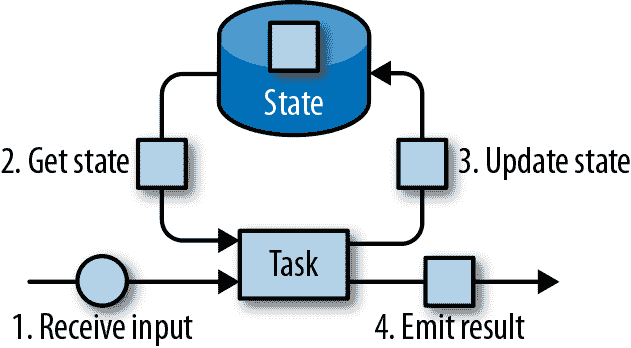

###### 图 3-10\. 一个有状态的流处理任务

任务接收一些输入数据。在处理数据时，任务可以读取和更新其状态，并根据其输入数据和状态计算其结果。一个简单的例子是一个任务，连续计算其接收的记录数。当任务接收到新的记录时，它访问状态以获取当前计数，增加计数，更新状态，并发出新的计数。

从状态读取和写入的应用逻辑通常很简单。但是，高效和可靠地管理状态更具挑战性。这包括处理可能超过内存的非常大的状态，并确保在发生故障时不会丢失任何状态。Flink 处理所有与状态一致性、故障处理以及高效存储和访问相关的问题，使开发人员可以专注于其应用程序的逻辑。

在 Flink 中，状态始终与特定的操作符相关联。为了让 Flink 运行时了解操作符的状态，操作符需要注册其状态。有两种类型的状态，*操作符状态* 和 *键控状态*，它们可以从不同的作用域访问，并在接下来的部分中讨论。

## 操作符状态

操作符状态作用域限定在操作符任务内部。这意味着同一并行任务处理的所有记录可以访问相同的状态。操作符状态无法被同一或不同操作符的另一个任务访问。图 3-11（#fig_operator-state）展示了任务如何访问操作符状态。

###### 图 3-11\. 具有操作符状态的任务

Flink 提供三种操作符状态基元：

列表状态

将状态表示为条目列表。

联合列表状态

也将状态表示为条目列表。但它与常规列表状态不同，因为在故障发生或从保存点启动应用程序时如何恢复会有所不同。我们将在本章后面讨论这种差异。

广播状态

设计用于操作符的每个任务的状态都相同的特殊情况。这种属性可以在检查点和重新调整操作符时利用。这两个方面将在本章后面讨论。

## 键控状态

键控状态是维护并访问操作符输入流记录中定义的键的状态。Flink 为每个键值维护一个状态实例，并将具有相同键的所有记录分区到维护此键状态的操作符任务。当任务处理记录时，自动将状态访问范围限定为当前记录的键。因此，具有相同键的所有记录访问相同的状态。图 3-12 显示任务如何与键控状态交互。

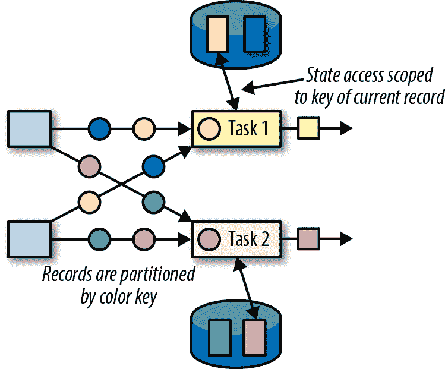

###### 图 3-12\. 具有键控状态的任务

您可以将键控状态视为按键分区（或分片）的键值映射。Flink 为键控状态提供不同的基元，这些基元确定存储在此分布式键值映射中每个键的值的类型。我们将简要讨论最常见的键控状态基元。

值状态

每个键存储任意类型的单个值。复杂数据结构也可以作为值状态存储。

列表状态

每个键存储一个值列表。列表条目可以是任意类型。

映射状态

每个键存储一个键值映射。映射的键和值可以是任意类型。

状态基元将状态的结构暴露给 Flink，并实现更高效的状态访问。它们将在“在 RuntimeContext 中声明键控状态”进一步讨论。

## 状态后端

具有状态的操作符任务通常为每个传入记录读取并更新其状态。由于高效的状态访问对于处理具有低延迟的记录至关重要，因此每个并行任务在本地维护其状态以确保快速状态访问。状态的存储、访问和维护方式由可插拔组件——状态后端决定。状态后端负责两件事：本地状态管理和将状态检查点保存到远程位置。

对于本地状态管理，状态后端存储所有键控状态，并确保所有访问正确地限定在当前键上。Flink 提供的状态后端将键控状态管理为存储在 JVM 堆上的内存数据结构中的对象。另一种状态后端将状态对象序列化并将它们放入 RocksDB，然后再写入到本地硬盘。第一种选择提供非常快速的状态访问，但受内存大小的限制。通过 RocksDB 状态后端存储的状态访问较慢，但其状态可以变得非常大。

状态检查点非常重要，因为 Flink 是一个分布式系统，并且状态仅在本地维护。任何时候，TaskManager 进程（及其上运行的所有任务）都可能失败。因此，必须考虑其存储是易失性的。状态后端负责将任务的状态检查点到远程和持久存储。用于检查点的远程存储可以是分布式文件系统或数据库系统。状态后端在检查点状态的方式上有所不同。例如，RocksDB 状态后端支持增量检查点，可以显著减少非常大的状态大小的检查点开销。

我们将在“选择状态后端”中更详细地讨论不同状态后端及其优缺点。

## 缩放有状态操作符

流应用程序的一个常见需求是根据输入速率的增加或减少调整操作符的并行性。尽管缩放无状态操作符很简单，但是调整有状态操作符的并行性要困难得多，因为它们的状态需要重新分区并分配给更多或更少的并行任务。Flink 支持四种缩放不同类型状态的模式。

具有键控状态的操作符通过将键重新分区到更少或更多的任务来进行缩放。然而，为了提高任务之间必要状态传输的效率，Flink 不会重新分布单个键。相反，Flink 将键组织在所谓的键组中。键组是键的分区，也是 Flink 分配键到任务的方式。 图 3-13 显示了如何在键组中重新分区键控状态。

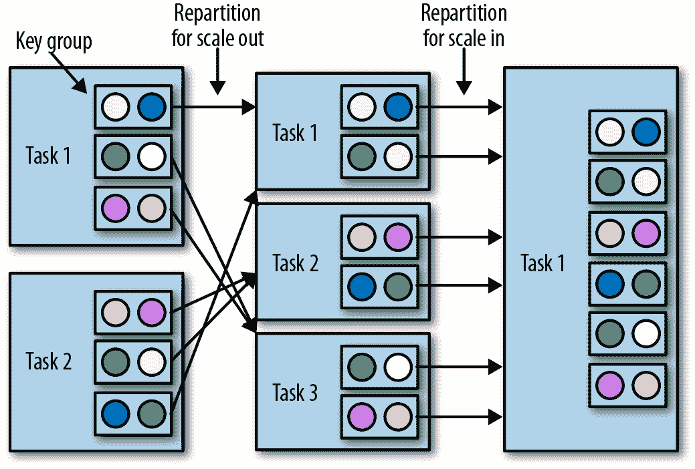

###### 图 3-13\. 缩放具有键控状态的操作符的内部和外部

具有操作符列表状态的操作符通过重新分配列表条目来进行缩放。从概念上讲，所有并行操作符任务的列表条目被收集并均匀重新分配到更少或更多的任务中。如果列表条目少于操作符的新并行性，则某些任务将以空状态启动。 图 3-14 显示了操作符列表状态的重新分配。

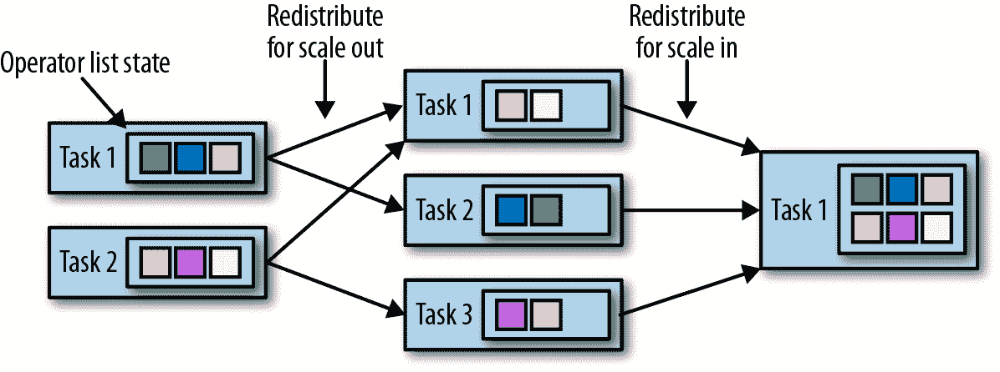

###### 图 3-14\. 缩放具有操作符列表状态的操作符的内部和外部

使用运算符联合列表状态的操作员通过向每个任务广播完整的状态条目列表来扩展。然后任务可以选择使用哪些条目并丢弃哪些条目。图 3-15 显示了运算符联合列表状态的重新分配过程。

###### 图 3-15\. 使用运算符联合列表状态扩展运算符

使用运算符广播状态的操作员通过将状态复制到新任务来进行扩展。这有效的原因是广播状态可以确保所有任务具有相同的状态。在缩减规模时，多余的任务简单地被取消，因为状态已经被复制，不会丢失。图 3-16 显示了运算符广播状态的重新分配过程。

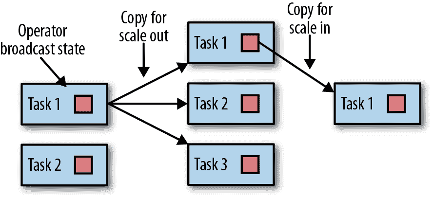

###### 图 3-16\. 使用运算符广播状态扩展运算符

# Checkpoints, Savepoints, and State Recovery

Flink 是一个分布式数据处理系统，因此必须处理如进程被杀死、机器故障和网络连接中断等故障。由于任务在本地维护其状态，Flink 必须确保在故障发生时不会丢失状态，并保持一致性。

在本节中，我们介绍了 Flink 的检查点和恢复机制，以保证状态一致性。我们还讨论了 Flink 独特的保存点特性，这是一种类似于“瑞士军刀”的工具，用于解决流处理应用的许多挑战。

## 一致性检查点

Flink 的恢复机制基于应用状态的一致检查点。一个有状态的流处理应用的一致检查点是在所有任务处理完全相同输入时复制每个任务状态的副本。这可以通过查看采用一致检查点应用的简单算法的步骤来解释。这个简单算法的步骤包括：

1.  暂停所有输入流的摄入。

1.  等待所有正在传输的数据被完全处理，即所有任务都已处理完其所有输入数据。

1.  通过将每个任务的状态复制到远程持久存储来进行检查点。当所有任务完成其副本时，检查点才算完成。

1.  恢复所有流的摄入。

注意，Flink 不实现这种简单的机制。我们将在本节后面介绍 Flink 更复杂的检查点算法。

图 3-17 显示了一个简单应用的一致检查点。

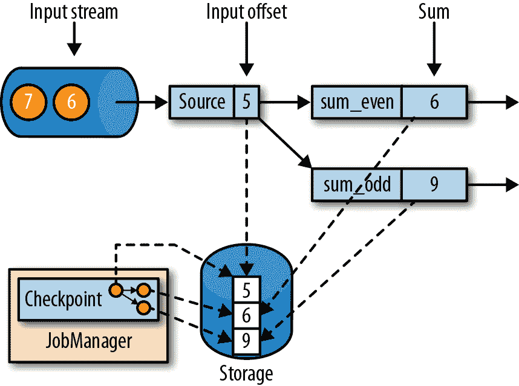

###### 图 3-17\. 流应用的一致检查点

应用程序有一个单源任务，消费递增数字流——1、2、3 等。数字流被分成偶数和奇数流。两个求和运算符任务计算所有偶数和奇数的累积和。源任务存储其输入流的当前偏移量作为状态。求和任务将当前和值作为状态持久化。在图 3-17 中，当输入偏移量为 5 时，Flink 进行了检查点，并且和分别为 6 和 9。

## 从一致检查点恢复

在流式应用程序执行期间，Flink 定期获取应用程序状态的一致检查点。在发生故障时，Flink 使用最新的检查点来恢复应用程序状态并重新启动处理。图 3-18 展示了恢复过程。

###### 图 3-18\. 从检查点恢复应用程序

应用程序恢复分为三个步骤：

1.  重新启动整个应用程序。

1.  将所有有状态任务的状态重置为最新的检查点。

1.  恢复所有任务的处理。

此检查点和恢复机制可以为应用程序状态提供精确一次一致性，前提是所有运算符都能检查点和恢复其所有状态，并且所有输入流都被重置到在进行检查点时消费的位置。数据源能否重置其输入流取决于其实现以及从中获取流的外部系统或接口。例如，像 Apache Kafka 这样的事件日志可以提供从流的先前偏移量读取的记录。相反，从套接字消费的流无法重置，因为套接字一旦消费数据就会丢弃它。因此，只有当所有输入流都由可重置数据源消费时，应用程序才能在精确一次状态一致性下运行。

在从检查点重新启动应用程序后，其内部状态与检查点创建时完全相同。然后开始处理检查点和故障之间处理的所有数据。尽管这意味着 Flink 处理一些消息两次（故障前后各一次），但机制仍然实现了*精确一次状态一致性*，因为所有运算符的状态都被重置到尚未看到这些数据的点。

Flink 的检查点和恢复机制仅重置流式应用程序的*内部状态*。根据应用程序的汇聚操作符，一些结果记录在恢复期间可能会被多次发送到下游系统，如事件日志、文件系统或数据库。对于某些存储系统，Flink 提供了具备精准一次性输出的汇聚函数，例如在检查点完成时提交已发送的记录。另一种适用于许多存储系统的方法是幂等更新。有关端到端精准一次性应用程序及其解决方法的挑战，详细讨论见《应用程序一致性保证》。

## Flink 的检查点算法

Flink 的恢复机制基于一致的应用程序检查点。对于流式应用程序进行简单的检查点（暂停、检查点、恢复）的天真方法对于具有中等延迟要求的应用程序并不实用，因为其“停止世界”的行为。因此，Flink 实现了基于 Chandy-Lamport 算法的检查点，用于分布式快照。该算法不会暂停整个应用程序，而是将检查点与处理分离，以便一些任务继续处理，而其他任务持久化其状态。接下来，我们将详细解释该算法的工作原理。

Flink 的检查点算法使用一种称为*检查点障碍*的特殊记录类型。类似于水印，检查点障碍由源操作符注入到常规记录流中，并且不能被其他记录超越或超越。检查点障碍携带检查点 ID，用于标识其所属的检查点，并逻辑上将流分为两部分。所有由障碍之前的记录导致的状态修改均包括在障碍的检查点中，所有由障碍之后的记录导致的状态修改均包括在稍后的检查点中。

我们使用一个简单流式应用程序的示例来逐步解释该算法。该应用程序包括两个源任务，每个任务消费一个递增数字流。源任务的输出被分区为偶数和奇数数字流。每个分区由一个任务处理，计算接收到的所有数字的总和，并将更新的总和转发到一个汇聚。应用程序如图 Figure 3-19 所示。

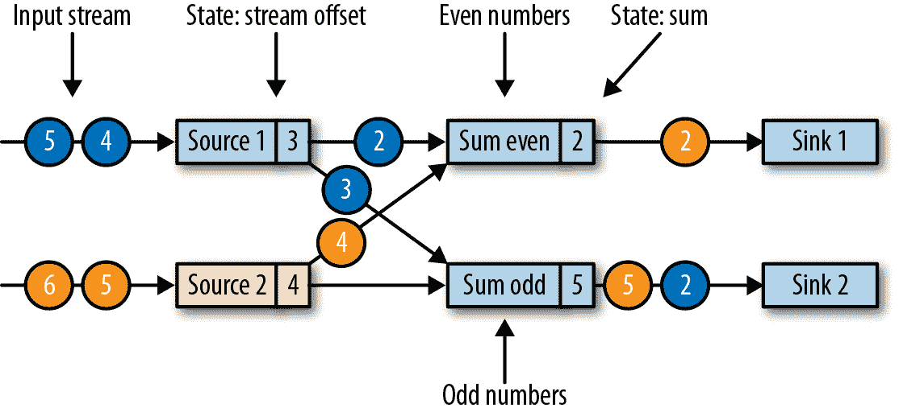

###### 图 3-19\. 带有两个有状态源、两个有状态任务和两个无状态汇聚的流式应用程序

通过将新的检查点 ID 的消息发送给每个数据源任务，作业管理器启动检查点，如图 Figure 3-20 所示。

###### 图 3-20\. JobManager 通过向所有源发送消息启动检查点。

当数据源任务接收到消息时，它会暂停发出记录，触发本地状态在状态后端的检查点，并通过所有输出流分区广播带有检查点 ID 的检查点障碍。状态后端在完成任务状态检查点并且任务在 JobManager 上确认检查点后通知任务。在所有障碍都发送完毕后，数据源继续其常规操作。通过将障碍注入其输出流，数据源函数定义了检查点的流位置。图 3-21 显示了在两个源任务检查点其本地状态并发出检查点障碍后的流处理应用程序。

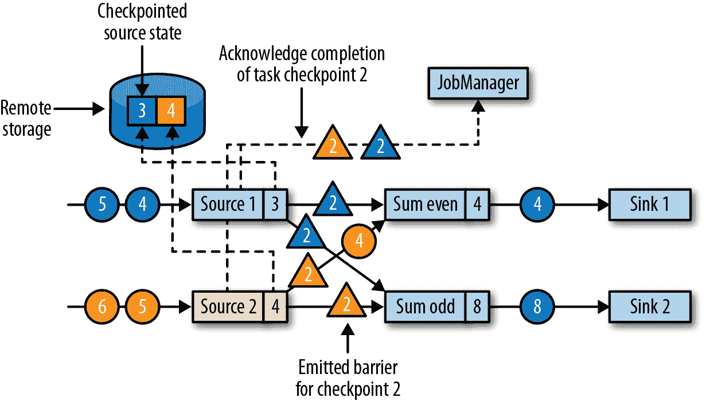

###### 图 3-21\. 源任务检查点其状态并发出检查点障碍。

源任务发出的检查点障碍被发送到连接的任务。与水印类似，检查点障碍被广播到所有连接的并行任务，以确保每个任务从其每个输入流接收到障碍。当任务接收到新检查点的障碍时，它会等待该检查点的所有输入分区的障碍到达。在等待期间，它会继续处理尚未提供障碍的流分区上的记录。已经转发了障碍的分区上到达的记录无法被处理，会被缓冲。等待所有障碍到达的过程称为*障碍对齐*，在图 3-22 中有所描述。

###### 图 3-22\. 任务在每个输入分区等待障碍的到来；对于已经到达障碍的输入流记录进行缓冲；所有其他记录按照正常方式处理。

一旦任务从其所有输入分区接收到障碍，它会在状态后端发起检查点并向其所有下游连接任务广播检查点障碍，如图 3-23 所示。

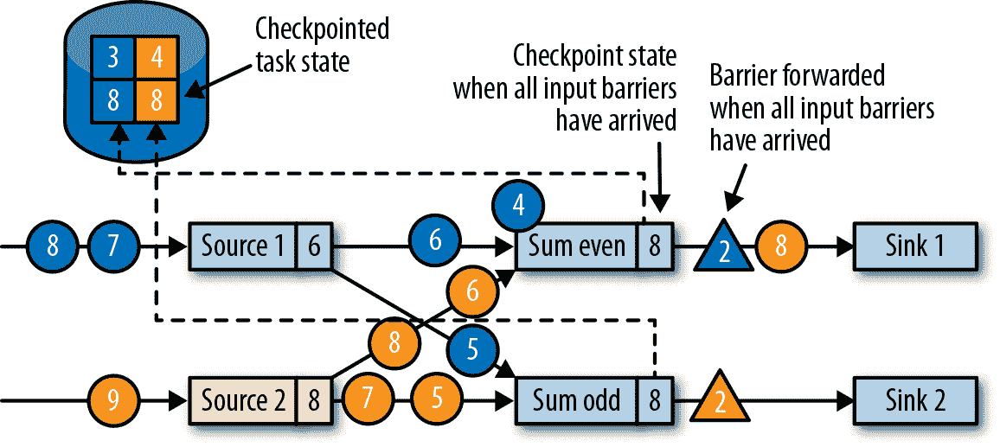

###### 图 3-23\. 任务在接收到所有障碍后检查它们的状态，然后将检查点障碍转发。

一旦所有检查点障碍被发出，任务开始处理缓冲记录。在所有缓冲记录被发出后，任务继续处理其输入流。图 3-24 在此时显示了应用程序的状态。

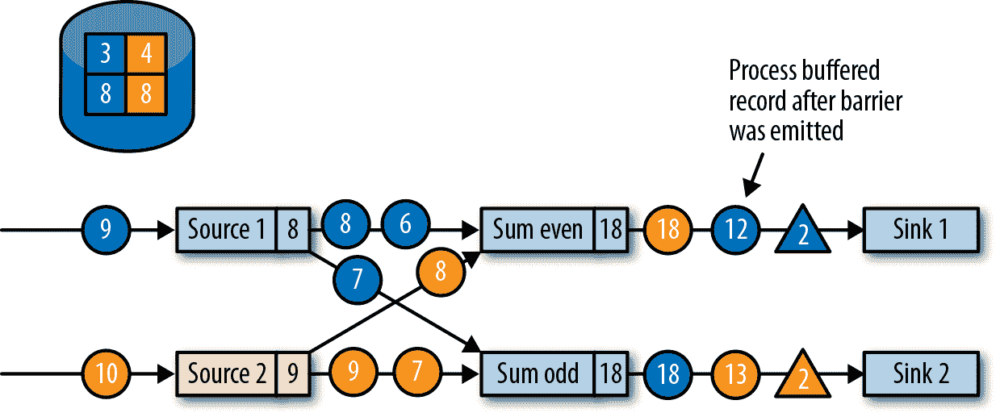

###### 图 3-24\. 在转发检查点障碍后，任务继续常规处理

最终，检查点障碍到达汇聚器任务。当汇聚器任务接收到障碍时，它执行障碍对齐，检查其自身状态，并向作业管理器确认接收障碍。作业管理器一旦从应用程序的所有任务收到检查点确认，就会记录应用程序的检查点为已完成。图 3-25 显示了检查点算法的最后步骤。完成的检查点可用于根据之前描述的方式从故障中恢复应用程序。

###### 图 3-25\. 汇聚器向作业管理器确认接收检查点障碍，并且当所有任务确认其状态成功检查点化时，检查点完成。

## 检查点的性能影响

Flink 的检查点算法从流应用程序中生成一致的分布式检查点，而无需停止整个应用程序。然而，它可能会增加应用程序的处理延迟。在某些条件下，Flink 实现了一些调整来减轻性能影响。

当任务检查其状态时，它会被阻塞，并且其输入会被缓冲。由于状态可能会变得相当大，并且检查点需要通过网络将数据写入远程存储系统，因此检查点可能需要几秒到几分钟的时间——这对于延迟敏感的应用程序来说太长了。在 Flink 的设计中，状态后端负责执行检查点。任务的状态如何复制取决于状态后端的实现方式。例如，FileSystem 状态后端和 RocksDB 状态后端支持*异步*检查点。当触发检查点时，状态后端创建状态的本地副本。完成本地副本后，任务继续其常规处理。后台线程异步将本地快照复制到远程存储，并在完成检查点后通知任务。异步检查点显著减少了任务继续处理数据的时间。此外，RocksDB 状态后端还支持*增量*检查点，从而减少了需要传输的数据量。

减少处理延迟对检查点算法影响的另一种技术是调整屏障对齐步骤。对于需要非常低延迟且能够容忍至少一次状态保证的应用程序，可以配置 Flink 在缓冲对齐期间处理所有到达的记录，而不是缓冲那些屏障已经到达的记录。一旦检查点的所有屏障都到达，操作员将检查点的状态，这可能还包括由通常属于下一个检查点的记录引起的修改。在故障的情况下，这些记录将被再次处理，这意味着检查点提供至少一次而不是精确一次的一致性保证。

## Savepoints

Flink 的恢复算法基于状态检查点。定期采取检查点并根据可配置的策略自动丢弃检查点。由于检查点的目的是确保在发生故障时可以重新启动应用程序，因此当应用程序明确取消时，它们将被删除。⁴ 然而，应用程序状态的一致快照可以用于更多目的，而不仅仅是故障恢复。

Flink 最有价值和独特的功能之一是保存点。原则上，保存点使用与检查点相同的算法创建，因此基本上是带有一些额外元数据的检查点。Flink 不会自动创建保存点，因此用户（或外部调度程序）必须显式触发其创建。Flink 也不会自动清理保存点。第十章描述了如何触发和处理保存点。

### 使用保存点

给定一个应用程序和兼容的保存点，您可以从保存点开始应用程序。这将初始化应用程序的状态到保存点的状态，并从保存点采取的点运行应用程序。虽然这种行为看起来与使用检查点从故障中恢复应用程序完全相同，但故障恢复实际上只是一种特殊情况。它在相同的集群上以相同的配置启动相同的应用程序。从保存点启动应用程序可以让您做更多事情。

+   您可以从保存点开始一个*不同但兼容*的应用程序。因此，您可以修复应用程序逻辑中的错误，并重新处理您的流源能够提供的尽可能多的事件，以修复您的结果。修改后的应用程序还可以用于运行具有不同业务逻辑的 A/B 测试或假设情景。请注意，应用程序和保存点必须兼容——应用程序必须能够加载保存点的状态。

+   您可以以*不同的并行性*启动相同的应用程序，并扩展或缩减应用程序。

+   您可以在*不同的集群*上启动相同的应用程序。这使您可以将应用程序迁移到更新的 Flink 版本或不同的集群或数据中心。

+   您可以使用保存点*暂停*应用程序，稍后*恢复*它。这使得可以释放集群资源以供更高优先级的应用程序使用，或者当输入数据不连续生成时。

+   您还可以仅仅获取保存点以*版本化*和*归档*应用程序的状态。

由于保存点是如此强大的功能，许多用户定期创建保存点以便能够回溯。我们在实际中看到的最有趣的保存点应用之一是持续将流式应用迁移到提供最低实例价格的数据中心。

### 从保存点启动应用程序

所有之前提到的保存点用例都遵循相同的模式。首先，需要获取运行中应用程序的保存点，然后使用它来恢复起始应用程序的状态。在本节中，我们描述了 Flink 如何初始化从保存点启动的应用程序的状态。

一个应用程序由多个操作符组成。每个操作符可以定义一个或多个键控和操作符状态。操作符通过一个或多个操作符任务并行执行。因此，典型的应用程序由分布在多个操作符任务上的多个状态组成，这些任务可以运行在不同的 TaskManager 进程上。

图 3-26 显示了一个具有三个操作符的应用程序，每个操作符都有两个任务在运行。一个操作符（OP-1）有一个操作符状态（OS-1），另一个操作符（OP-2）有两个键控状态（KS-1 和 KS-2）。当获取保存点时，所有任务的状态都被复制到持久存储位置。

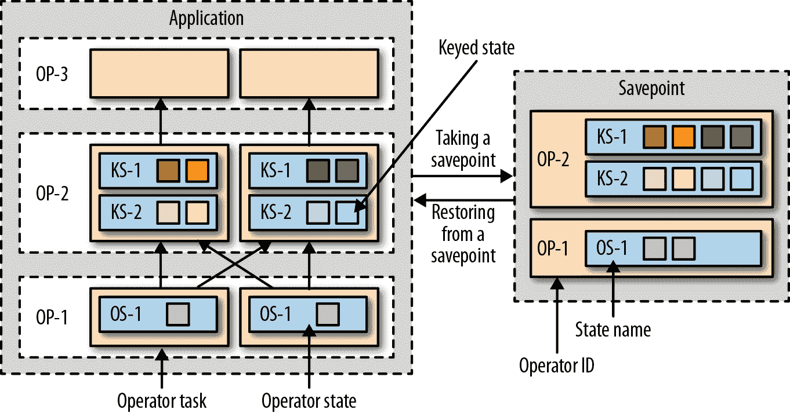

###### 图 3-26\. 从应用程序获取保存点并从保存点恢复应用程序

保存点中的状态副本按操作符标识符和状态名称进行组织。操作符标识符和状态名称是必需的，以便能够将保存点的状态数据映射到启动应用程序的操作符状态。当从保存点启动应用程序时，Flink 将保存点数据重新分发到相应操作符的任务中。

###### 注意

注意，保存点不包含操作符任务的信息。这是因为当使用不同并行度启动应用程序时，任务数量可能会发生变化。我们在本节早些时候讨论了 Flink 缩放有状态操作符的策略。

如果从保存点启动修改后的应用程序，则只有保存点中包含具有相应标识符和状态名称的运算符时，才能将其映射到应用程序。默认情况下，Flink 分配唯一的运算符标识符。然而，运算符的标识符是根据其前驱运算符的标识符确定性地生成的。因此，当其前驱运算符之一更改时（例如添加或删除运算符），运算符的标识符也会更改。因此，默认运算符标识符的应用程序在不丢失状态的情况下如何演变非常有限。因此，我们强烈建议手动为运算符分配唯一标识符，而不依赖于 Flink 的默认分配。我们在 “指定唯一运算符标识符” 中详细描述了如何分配运算符标识符。

# 概要

在本章中，我们讨论了 Flink 的高级架构及其网络堆栈、事件时间处理模式、状态管理和故障恢复机制的内部工作原理。在设计高级流处理应用程序、设置和配置集群、操作流处理应用程序以及评估其性能时，这些信息将非常有用。

¹ 重新启动策略在 第十章 中有更详细的讨论。

² 除了流水线通信外，批处理应用程序还可以通过在发送方收集传出数据来交换数据。一旦发送方任务完成，数据将通过临时 TCP 连接作为批次发送到接收方。

³ 进程函数在 第六章 中有更详细的讨论。

⁴ 也可以在取消应用程序时配置其保留最后一个检查点。
