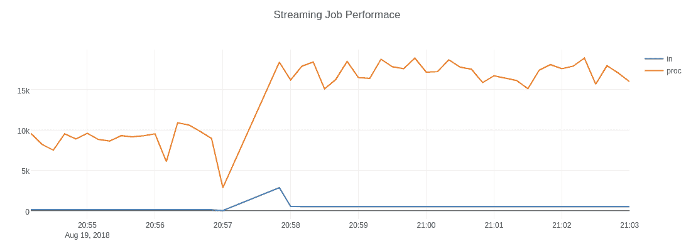

# 第十四章：监控结构化流应用程序

应用程序监控是任何稳健部署的重要组成部分。监控通过收集和处理量化应用程序性能不同方面的度量指标，如响应能力、资源使用和任务特定指标，为应用程序的性能特征提供了随时间变化的见解。

流式应用对响应时间和吞吐量有严格要求。在像 Spark 这样的分布式应用中，我们需要在应用程序的生命周期中考虑的变量数量，会因在一组机器上运行而复杂化。在集群环境中，我们需要监控不同主机上的资源使用情况，如 CPU、内存和辅助存储，从每个主机的角度来看，以及运行应用程序的综合视图。

例如，想象一个运行在 10 个不同执行器上的应用程序。总内存使用指标显示增加了 15%，这可能在预期容忍范围内，但我们注意到增加来自单个节点。这种不平衡需要调查，因为当该节点内存耗尽时可能会导致故障。这也意味着可能存在工作分配不平衡造成瓶颈。如果没有适当的监控，我们首先不会观察到这种行为。

结构化流的运行度量可以通过三种不同的通道公开：

+   Spark 度量子系统

+   `writeStream.start` 操作返回的 `StreamingQuery` 实例

+   `StreamingQueryListener` 接口

正如我们在接下来的章节中详细说明的那样，这些接口提供了不同级别的详细信息和曝光，以满足不同的监控需求。

# Spark 度量子系统

通过 Spark 核心引擎提供的 Spark 度量子系统，提供了一个可配置的度量收集和报告 API，具有可插拔的接收器接口，与本书前面讨论的流式接收器不同。Spark 自带多个这样的接收器，包括 HTTP、JMX 和逗号分隔值（CSV）文件。除此之外，还有一个 Ganglia 接收器，由于许可限制需要额外的编译标志。

HTTP 接收器默认启用。它由一个注册在与 Spark UI 相同端口的驱动程序主机上的端点的 servlet 实现。度量数据可通过 `/metrics/json` 端点访问。可以通过配置启用其他接收器。选择特定接收器由我们希望集成的监控基础设施驱动。例如，JMX 接收器是与 Kubernetes 集群调度程序中流行的度量收集器 Prometheus 集成的常见选项。

## 结构化流度量

要从结构化流作业获取指标，我们首先必须启用此类指标的内部报告。我们通过将配置标志`spark.sql.streaming.metricsEnabled`设置为`true`来实现，如此处所示：

```
// at session creation time
val spark = SparkSession
   .builder()
   .appName("SparkSessionExample")
   .config("spark.sql.streaming.metricsEnabled", true)
   .config(...)
   .getOrCreate()

// by setting the config value
spark.conf.set("spark.sql.streaming.metricsEnabled", "true")

// or by using the SQL configuration
spark.sql("SET spark.sql.streaming.metricsEnabled=true")
```

有了这个配置，报告的指标将包含每个在同一个`SparkSession`上下文中运行的流查询的三个额外指标：

inputRate-total

每个触发间隔摄入的消息总数

延迟

触发间隔的处理时间

processingRate-total

记录处理速度

# `StreamingQuery`实例

正如我们在前面的结构化流示例中看到的那样，启动*流查询*的调用会产生一个`StreamingQuery`结果。让我们深入研究来自示例 13-1 的`weatherEventsMovingAverage`：

```
val query = scoredStream.writeStream
        .format("memory")
        .queryName("memory_predictions")
        .start()

query: org.apache.spark.sql.streaming.StreamingQuery =
  org.apache.spark.sql.execution.streaming.StreamingQueryWrapper@7875ee2b
```

我们从`query`值的调用中获得的结果是一个`StreamingQuery`实例。`StreamingQuery`是实际在引擎中连续运行的流查询的处理程序。此处理程序包含用于检查查询执行和控制其生命周期的方法。一些有趣的方法包括：

`query.awaitTermination()`

阻止当前线程直到查询结束，无论是因为它停止了还是遇到了错误。此方法用于阻止`main`线程并防止其过早终止。

`query.stop()`

停止查询的执行。

`query.exception()`

检索查询执行中遇到的任何致命异常。当查询正常运行时，此方法返回`None`。查询停止后，检查此值可以告诉我们它是否失败以及失败的原因。

`query.status()`

显示查询当前正在执行的简要快照。

例如，检索运行查询的`query.status`会显示类似于以下结果：

```
$query.status
res: org.apache.spark.sql.streaming.StreamingQueryStatus =
{
  "message" : "Processing new data",
  "isDataAvailable" : true,
  "isTriggerActive" : false
}
```

即使在一切正常运行时，状态信息也不会透露太多信息，但在开发新作业时可能会有所帮助。当发生错误时，`query.start()`不会有任何提示。查看`query.status()`可能会显示存在问题，此时`query.exception`将返回导致问题的原因。

在示例 14-1 中，我们使用了错误的模式作为 Kafka sink 的输入。如果我们回忆起“Kafka Sink”，我们会发现 Kafka sink 需要输出流中的一个强制字段：`value`（甚至`key`是可选的）。在这种情况下，`query.status`提供了相关反馈来解决此问题。

##### 示例 14-1\. `query.status`显示流失败的原因

```
res: org.apache.spark.sql.streaming.StreamingQueryStatus =
{
  "message": "Terminated with exception: Required attribute 'value' not found",
  "isDataAvailable": false,
  "isTriggerActive": false
}
```

`StreamingQueryStatus`中的方法是*线程安全*的，这意味着可以从另一个线程并发调用它们而不会破坏查询状态。

## 获取带有`StreamingQueryProgress`的指标

出于监视目的，我们更感兴趣的是一组方法，它们提供有关查询执行指标的见解。`StreamingQuery`处理程序提供了两种这样的方法：

`query.lastProgress`

获取最近的`StreamingQueryProgress`报告。

`query.recentProgress`

检索最近的一系列`StreamingQueryProgress`报告。可以使用 Spark Session 中的配置参数`spark.sql.streaming.numRecentProgressUpdates`设置检索的*progress*对象的最大数量。如果未设置此配置，它将默认为最后 100 个报告。

正如我们可以在示例 14-2 中看到的，每个`StreamingQueryProgress`实例都提供了在每个触发器产生的查询性能全面快照。

##### 示例 14-2\. `StreamingQueryProgress` 示例

```
{
  "id": "639503f1-b6d0-49a5-89f2-402eb262ad26",
  "runId": "85d6c7d8-0d93-4cc0-bf3c-b84a4eda8b12",
  "name": "memory_predictions",
  "timestamp": "2018-08-19T14:40:10.033Z",
  "batchId": 34,
  "numInputRows": 37,
  "inputRowsPerSecond": 500.0,
  "processedRowsPerSecond": 627.1186440677966,
  "durationMs": {
    "addBatch": 31,
    "getBatch": 3,
    "getOffset": 1,
    "queryPlanning": 14,
    "triggerExecution": 59,
    "walCommit": 10
  },
  "stateOperators": [],
  "sources": [
    {
      "description": "KafkaSource[Subscribe[sensor-office-src]]",
      "startOffset": {
        "sensor-office-src": {
          "0": 606580
        }
      },
      "endOffset": {
        "sensor-office-src": {
          "0": 606617
        }
      },
      "numInputRows": 37,
      "inputRowsPerSecond": 500.0,
      "processedRowsPerSecond": 627.1186440677966
    }
  ],
  "sink": {
    "description": "MemorySink"
  }
}
```

从监控作业性能的角度来看，我们特别关注`numInputRows`、`inputRowsPerSecond`和`processedRowsPerSecond`。这些自描述字段提供了关于作业性能的关键指标。如果我们有比查询处理的数据更多的数据，`inputRowsPerSecond`在持续时间较长的时间内将高于`processedRowsPerSecond`。这可能表明，为了达到可持续的长期性能，应增加分配给此作业的集群资源。

# `StreamingQueryListener` 接口

监控是“Day 2 运维”关注的重点，我们需要自动收集性能指标以支持其他流程，例如容量管理、警报和运维支持。

我们在前一节看到的`StreamingQuery`处理程序提供的检查方法在我们在交互式环境中工作时非常有用，例如*Spark shell*或笔记本电脑，就像我们在本书的练习中使用的那样。在交互设置中，我们有机会手动取样`StreamingQueryProgress`的输出，以获取有关作业性能特征的初步想法。

然而，`StreamingQuery`方法并不友好于自动化。考虑到每次流触发器会产生一个新的进度记录，自动化从此接口收集信息的方法需要与流作业的内部调度耦合。

幸运的是，结构化流提供了`StreamingQueryListener`，这是一个基于监听器的接口，提供异步回调以报告流作业生命周期中的更新。

## 实现`StreamingQueryListener`

要连接到内部事件总线，我们必须提供`StreamingQueryListener`接口的实现，并将其注册到正在运行的`SparkSession`中。

`StreamingQueryListener`包含三种方法：

`onQueryStarted(event: QueryStartedEvent)`

当流查询启动时调用。`event`提供了查询的唯一`id`和一个`runId`，如果查询停止并重新启动，则`runId`会更改。此回调与查询的启动同步调用，不应阻塞。

`onQueryTerminated(event: QueryTerminatedEvent)`

当流查询停止时调用。`event`包含与启动事件相关联的`id`和`runId`字段。它还提供了一个`exception`字段，如果查询由于错误而失败，则包含一个`exception`。

`onQueryProgress(event: StreamingQueryProgress)`

在每次查询触发时调用。`event`包含一个`progress`字段，其中封装了一个我们已从“使用 StreamingQueryProgress 获取指标”中了解的`StreamingQueryProgress`实例。该回调提供了我们监视查询性能所需的事件。

示例 14-3 展示了这种监听器的简化版本实现。这个`chartListener`在笔记本中实例化时，绘制每秒的输入和处理速率。

##### 示例 14-3\. 绘制流作业性能

```
import org.apache.spark.sql.streaming.StreamingQueryListener
import org.apache.spark.sql.streaming.StreamingQueryListener._
val chartListener = new StreamingQueryListener() {
  val MaxDataPoints = 100
  // a mutable reference to an immutable container to buffer n data points
  var data: List[Metric] = Nil

  def onQueryStarted(event: QueryStartedEvent) = ()

  def onQueryTerminated(event: QueryTerminatedEvent) = ()

  def onQueryProgress(event: QueryProgressEvent) = {
    val queryProgress = event.progress
    // ignore zero-valued events
    if (queryProgress.numInputRows > 0) {
      val time = queryProgress.timestamp
      val input = Metric("in", time, event.progress.inputRowsPerSecond)
      val processed = Metric("proc", time, event.progress.processedRowsPerSecond)
      data = (input :: processed :: data).take(MaxDataPoints)
      chart.applyOn(data)
    }
  }
}
```

定义了一个监听器实例后，必须使用`SparkSession`中的`addListener`方法将其附加到事件总线：

```
sparkSession.streams.addListener(chartListener)
```

运行这个`chartListener`对本书在线资源中的任意一个笔记本后，我们可以可视化输入和处理速率，如图 14-1 所示。



###### 图 14-1\. 输入和处理流速率

类似的监听器实现可以用于将度量报告发送到流行的监控系统，如 Prometheus、Graphite 或可查询数据库如 InfluxDB，这些系统可以轻松集成到 Grafana 等仪表板应用中。
