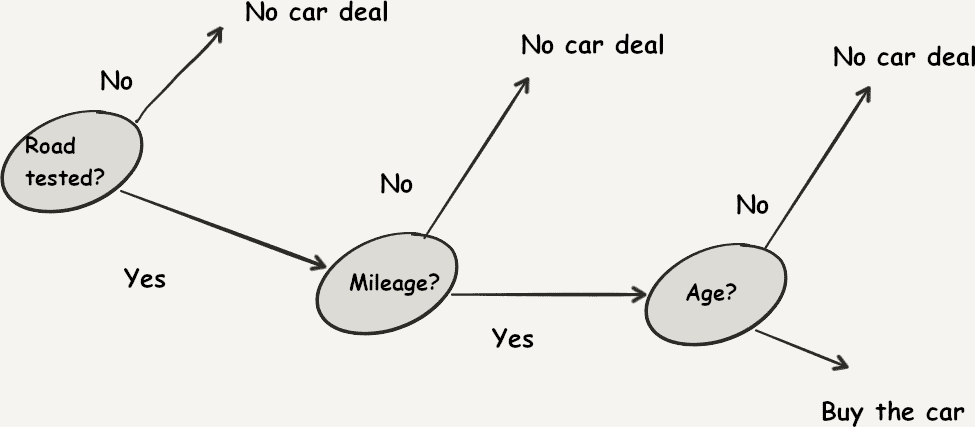
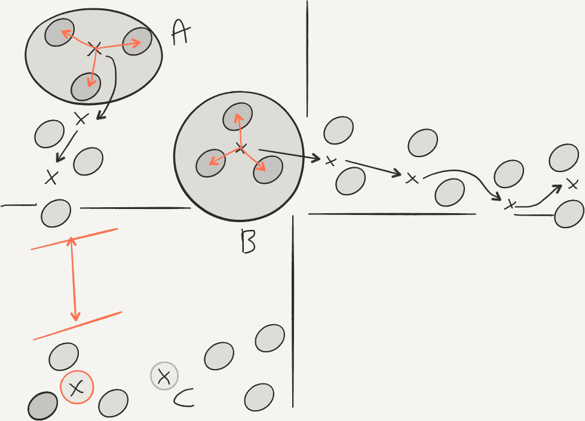

# 第二十八章：实时机器学习

在本章中，我们探讨了如何构建*在线*分类和聚类算法。所谓在线，意味着这些算法能够在接收到新数据时实时学习并生成最优的分类和聚类结果。

###### 注意

本章假设您对机器学习算法有基本的理解，包括监督学习和无监督学习的概念，以及分类与聚类算法的区别。如果您希望快速复习基本的机器学习概念，我们建议阅读[[Conway2012]](app04.xhtml#Conway2012)。

在接下来的几节中，我们将解释几种以在线方式执行的机器学习算法的训练过程，这些数据来自流式数据。在此之前，让我们承认，大多数行业中机器学习模型的实现已经有一个在线组件：它们以批处理方式进行训练（数据处于静止状态），并将其与在线推理连接起来，例如从数据流中读取示例并使用先前训练过的模型对流式数据进行评分（或预测）。

从这个意义上讲，大多数机器学习算法已经在流式处理环境中部署，并且 Spark 提供了使这一任务更加简单的功能，无论是 Spark 的批处理和流处理 API 之间的简单兼容性（我们在前几章中已经讨论过），还是旨在简化部署的外部项目，例如[MLeap](http://bit.ly/2PLbGGz)。

让这种架构工作的挑战——批量训练后进行在线推理——主要依赖于在足够多的机器上部署模型的副本来处理请求的涌入。一般的横向扩展是一个重要的工程话题，但比本书关注的范围更广。我们更感兴趣的是在不允许或不鼓励批量训练模式的条件下训练机器学习模型的挑战。这可能出现的原因有几个：

+   数据量很大，批量训练只能以较低的频率进行。

+   数据的变化频繁，导致模型很快过时。

+   正如我们将在 Hoeffding 树中看到的那样，训练不需要看到所有数据就能产生准确的结果。

在本章中，我们探讨了两种在线分类算法和一种聚类算法。这些算法都有明确的批处理替代方案，因此很好地展示了从批处理到流式处理在机器学习训练中的转换方式。

我们首先接触的分类算法是多项式朴素贝叶斯。它是基本垃圾邮件过滤器最常用的分类器，也是当你想使用离散特征（例如文本分类的单词计数）时的适当分类器。

然后，我们研究了霍夫丁树，这是决策树的在线版本。决策树的逻辑依赖于通过反复决定最重要的特征来对数据集进行分类。但在在线环境中，我们应该能够学习到哪些最显著的输入特征来对数据集进行分类，尽管只是查看其片段。在本章中，我们演示了通过依赖强大的统计界限，算法如何经济快速地实现这一目标。

最后，我们看到了 *K*-Means 聚类算法的在线适应版，该算法在 Spark Streaming 中本地提供，将数据分桶为一组固定的群组。在线版本使用权重衰减来减少旧示例的影响，并采用修剪无关群组的技术，以确保始终在新数据上提供最相关的结果。

本章应该为您提供了强大的在线技术，这些技术应该作为在线学习背景下应用机器学习技术的初始点。

# 使用朴素贝叶斯进行流式分类

Naive Bayes 方法是一组基于贝叶斯定理并采用“朴素”独立性假设的监督学习算法。在本节中，我们详细研究了一个用于自然语言文档分类的分类器，使用了这种技术，并展示了如何实现一个不需要深入语言表示的高效分类器。

多项式朴素贝叶斯实现了多类分布数据的朴素贝叶斯算法。它是文本分类中使用的两种经典朴素贝叶斯变体之一，另一种是伯努利模型。

在我们探索多项式朴素贝叶斯时，我们使用了一个简单的表示法，其中数据表示为单词计数向量。这意味着文档被表示为单词的混合袋，其中一个袋子是一个允许重复元素的集合，仅反映了文档中出现的单词以及它们出现的次数，而忽略了单词的顺序。

让我们称这些文档的集合为 *D*，其类别由 *C* 给出。*C* 表示分类中的不同类别。例如，在电子邮件垃圾过滤的经典案例中，*C* 有两个类别：

+   S（垃圾邮件）和

+   H（正常邮件，非垃圾邮件）。

我们将 *D* 分类为具有最高后验概率 *P*(*C*|*D*) 的类别，这被理解为 *给定文档 D，类别 C 的概率*。我们可以使用贝叶斯定理重新表达这一点，你可以在 方程 28-1 中看到。

##### 方程 28-1\. 贝叶斯定理

<math alttext="upper P left-parenthesis upper C vertical-bar upper D right-parenthesis equals StartFraction upper P left-parenthesis upper D vertical-bar upper C right-parenthesis upper P left-parenthesis upper C right-parenthesis Over upper P left-parenthesis upper D right-parenthesis EndFraction" display="block"><mrow><mi>P</mi> <mrow><mo>(</mo> <mi>C</mi> <mo>|</mo> <mi>D</mi> <mo>)</mo></mrow> <mo>=</mo> <mfrac><mrow><mi>P</mi><mo>(</mo><mi>D</mi><mo>|</mo><mi>C</mi><mo>)</mo><mi>P</mi><mo>(</mo><mi>C</mi><mo>)</mo></mrow> <mrow><mi>P</mi><mo>(</mo><mi>D</mi><mo>)</mo></mrow></mfrac></mrow></math>

为了选择我们文档*D*的最佳类*C*，我们表达*P*(*C*|*D*)并尝试选择最大化这个表达式的类。应用贝叶斯定理，我们得到公式 28-1，它用<math alttext="upper P left-parenthesis upper D vertical-bar upper C right-parenthesis upper P left-parenthesis upper C right-parenthesis"><mrow><mi>P</mi> <mo>(</mo> <mi>D</mi> <mo>|</mo> <mi>C</mi> <mo>)</mo> <mi>P</mi> <mo>(</mo> <mi>C</mi> <mo>)</mo></mrow></math>表示为分数的形式。这是我们尝试寻找最大值的量，取决于*C*——因为当初始分数达到最大值时，它也达到最大值，所以我们可以去掉分母*P*(*D*)的常数。

我们的模型使用特征向量来表示文档，其组成部分对应于单词类型。如果我们有一个包含|*V*|个单词类型的词汇表*V*，那么特征向量的维度为 d = |V|。在多项式文档模型中，一个文档由具有整数元素的特征向量表示，其值为文档中该单词的频率。在这种意义上，将单词计数表示为<math alttext="x 1 ellipsis x Subscript n"><mrow><msub><mi>x</mi> <mn>1</mn></msub> <mo>...</mo> <msub><mi>x</mi> <mi>n</mi></msub></mrow></math>，我们想研究<math alttext="upper P left-parenthesis x Baseline 1 comma x Baseline 2 comma ellipsis comma x n vertical-bar c right-parenthesis"><mrow><mi>P</mi> <mo>(</mo> <mi>x</mi> <mn>1</mn> <mo>，</mo> <mi>x</mi> <mn>2</mn> <mo>，</mo> <mo>...</mo> <mo>，</mo> <mi>x</mi> <mi>n</mi> <mo>|</mo> <mi>c</mi> <mo>)</mo></mrow></math>。假设这些特征彼此独立，这只是计算每个<math alttext="upper P left-parenthesis x Subscript i Baseline vertical-bar c right-parenthesis"><mrow><mi>P</mi> <mo>(</mo> <msub><mi>x</mi> <mi>i</mi></msub> <mo>|</mo> <mi>c</mi> <mo>)</mo></mrow></math>。总之，我们试图找到达到<math alttext="upper P left-parenthesis c Subscript j Baseline right-parenthesis product upper P left-parenthesis x vertical-bar c Subscript j Baseline right-parenthesis"><mrow><mi>P</mi> <mrow><mo>(</mo> <msub><mi>c</mi> <mi>j</mi></msub> <mo>)</mo></mrow> <mo>∏</mo> <mi>P</mi> <mrow><mo>(</mo> <mi>x</mi> <mo>|</mo> <msub><mi>c</mi> <mi>j</mi></msub> <mo>)</mo></mrow></mrow></math>的最大值的类<math alttext="c Subscript j"><msub><mi>c</mi> <mi>j</mi></msub></math>。

对于每个类别，根据训练数据估算出现该类别时观察到单词的概率，方法是计算该类别文档集合中每个单词的相对频率。当然，如果我们对特定（单词，类别）对没有见过训练文档，就会出现问题。在这种情况下，我们使用称为*Laplace 平滑因子*的东西，它表示对于该单词的频率保证相对于词汇量的大小是最小的。分类器还需要先验概率，¹ 这些可以通过训练集中类别的频率直接估算出来。

## streamDM 简介

在我们讨论如何为分类训练贝叶斯模型之前，我们想先了解我们将用于此目的的 streamDM 库的结构。

在 streamDM 中，模型操作于标记的`Example`。换句话说，内部流表示为 Spark Streaming DStream，包含我们的内部实例数据结构`Example`。一个`Example`包括输入和输出`Instance`的元组以及一个权重；`Instance`可以根据流的输入格式包含不同的数据结构（例如，逗号分隔值[CSV]文本格式中的稠密实例，LibSVM 格式中的稀疏实例和文本实例）。

`Example`类包括以下内容：

+   `input: Instance(data, x_j)`

+   `output: Instance(labels, y_j)`

+   `weight: Double`

在我们的示例中，我们使用一个方便的函数`Example.fromArff()`创建`Example`，它设置默认权重（=1）并读取我们的 ARFF 格式文件。所有操作都在`Example`上进行；这允许进行任务设计，而无需模型实现者了解实例实现的详细信息。

# ARFF 文件格式

ARFF 是属性-关系文件格式的缩写。它是 CSV 文件格式的扩展，使用头部提供关于列中数据类型的元数据，并且是 Weka 机器学习软件套件的一个支柱。某些组织功能展示的方式受到它的启发。您可以在[Weka wiki](https://bit.ly/30HHh0A)上找到更多信息。

任务是一组通常有序的块的组合，就像任何学习过程设置中那样：

+   一个 `StreamReader`（读取和解析示例并创建流）

+   一个 `Learner`（从输入流提供`train`方法）

+   一个 `Model`（用于学习者的数据结构和方法集）

+   一个`Evaluator`（评估预测）

+   一个 `StreamWriter`（管理流的输出）

streamDM 将此流程打包成预定义任务，并通过*预序评估*方法连接，我们即将详细介绍它。

## 实践中的朴素贝叶斯

多项式朴素贝叶斯分类器实际上是一类密切相关的算法。我们将重点放在 streamDM 库中的一个发现²，这是[[McCallum1998]](app04.xhtml#McCallum1998)的一个实现。

它使用基于三步骤预顺序评估方法的 streamDM 实现。预顺序评估方法，或者交错的测试-训练方法，是传统批处理方法的替代方案，清晰地将训练、验证和评分阶段分开。

预顺序评估 Figure 28-1 是专门为流式设置设计的，每个样本的作用是两个目的，样本按到达顺序依次分析，并立即变得不可用。样本实际上只看一次。

这种方法包括使用每个样本来测试模型，这意味着进行预测，然后使用同一个样本来训练模型（部分拟合）。这样模型总是在它尚未见过的样本上进行测试。


###### 图 28-1\. 使用预顺序评估进行模型训练和评估

streamDM 集成了`FileReader`，用于从一个完整数据文件中读取数据，模拟数据流。它与 ARFF 文件兼容。

## 训练电影评论分类器

我们可以从[MEKA 项目](http://bit.ly/2VJJngU)下载 IMDB 电影评论数据集的带标签版本，按电影流派分类。

文件的开头列出了包括的属性，以二进制形式开始，接着是评论的词向量编码。

```
@relation 'IMDB: -C 28'

@attribute Sci-Fi {0,1}
@attribute Crime {0,1}
@attribute Romance {0,1}
@attribute Animation {0,1}
@attribute Music {0,1}
...
```

这里方括号内的名义规范对应于 IMDB 给电影的类别，然后是词向量模型。我们可以在文件的后面看到一个评论的实际表示：

```
{3 1,15 1,28 1,54 1,123 1,151 1,179 1,229 1,296 1,352 1,436 1,461 1,531 1,609
  1,712 1,907 1,909 1,915 1,968 1,1009 1,1018 1,1026 1}
```

这篇评论提供了电影分类的想法，接着是评论中关键词的词向量。

streamDM 带有一个命令行功能，连接任务中所有类别（我们之前详细介绍过）。它使得调用我们的`MultinomialNaiveBayes`模型变得简单，可以从编译检出的 streamDM 存储库中的`streamDM/scripts`启动：

```
./spark.sh "EvaluatePrequential
 -l (org.apache.spark.streamdm.classifiers.bayes.MultinomialNaiveBayes
 -c 28 -f 1001 -l 1)
 -s (FileReader -f /<dowload-path>/IMDB-F.arff -k 100 -d 60)" 2> /tmp/error.log
```

模型构造函数期望三个参数：

+   每个示例中的特征数量（默认为 3），选项为`-c`。

+   每个示例中的类别数量（默认为 2），选项为`-c`和

+   一个拉普拉斯平滑因子用于处理零频率问题，选项为`-l`。

模型输出了生成数据的混淆矩阵。在一个缩小的示例中，我们可以得到，例如：

```
2.159,0.573,0.510,0.241,0.328,0.589,104,100,327,469
2.326,0.633,0.759,0.456,0.570,0.574,243,77,290,390
2.837,0.719,NaN,0.000,NaN,0.719,0,0,281,719
3.834,0.490,0.688,0.021,0.041,0.487,11,5,505,479
4.838,0.567,0.571,0.018,0.036,0.567,8,6
```

# 引入决策树

在分类问题中，我们通常处理一组*N*个训练样本，其形式为（*x*, *y*），其中*y*是类别标签，*x*是属性向量（ <math><mrow><mi>x</mi> <mo>=</mo> <msub><mi>x</mi> <mn>1</mn></msub> <mo>,</mo> <msub><mi>x</mi> <mn>2</mn></msub> <mo>,</mo> <mo>.</mo> <mo>.</mo> <msub><mi>x</mi> <mi>n</mi></msub></mrow></math> ）。我们的目标是从这些样本中产生一个模型*y* = *f(x)*，该模型能够高精度地预测未来样本*x*的类别*y*。

最有效和广泛使用的分类方法之一是*决策树学习*。这种学习方式生成决策树模型，其中每个节点包含对属性的测试（*分割*），每个节点的分支对应于测试的可能结果，并且每个叶子包含一个类别预测。这样，算法产生一系列的分割，例如在图 28-2 中所示的那种。



###### 图 28-2\. 用于汽车交易的决策树

对于一个示例*x*，其标签*y* = *DT*(*x*)的结果来自将示例从根节点传递到叶节点，测试每个节点的适当属性，并跟随与示例中属性值对应的分支。决策树通过递归地将叶节点替换为测试节点来训练，从根节点开始。在给定节点测试的属性是通过比较所有可用属性并根据某些启发式度量（通常称为*信息增益*）选择最佳属性来确定的。

信息增益是一个统计指标，非正式地衡量我们在观察潜在决策变量（“输入电子邮件中是否包含*Viagra*？”）时学到的关于最终分类变量（“这封电子邮件是否为垃圾邮件？”）的信息。它捕捉到基于哪些变量做决策是最好的，首先是那些提供关于分类结果最多信息的变量。

Spark 实现的决策树依赖于*ID3 算法*（迭代分割器，Quinlan1986），并依赖于信息增益。

###### 提示

决策树分类器是机器学习中众所周知的决策算法。赫夫丁树是决策树的流式扩展，其在概率理论中有良好的基础。

如果你对决策树不熟悉，我们建议你查看《Spark 高级分析》的第四章（Laserson2017），该书对此进行了详尽的阐述。

这些学习者利用每个训练样本来选择每个分割中最好的属性，这种策略要求在整个训练过程中始终可用所有样本。这使得那些经典的决策树学习过程批处理算法不适用于仅以小增量提供数据的流式环境。

# 赫夫丁树

霍夫丁树³（[[多明戈斯 2000]](app04.xhtml#Domingos2000)）解决了这个问题，并能够在严格的时间和内存约束条件下从流数据中学习，而无需在内存中保存所有先前看到的数据。它们通过指出，在选择任何给定节点的分割属性时，仅使用数据流的一个小样本就足够了，从而实现了这一点。因此，在根节点选择分割属性时，只需使用数据流中最先到达的几个示例；随后的示例通过树的感应部分，直至它们达到叶子节点，然后在那里选择分割属性，并依此类推。

为了确定每个决策所需的示例数量，此算法使用称为霍夫丁界限的统计结果。关于*霍夫丁界限*的非正式描述是，如果你对*n*个随机变量上的一个函数进行重新取样时，函数的变化不大，那么该函数在接近其均值时将具有高概率。这个结果帮助我们精确地理解，在数据集中观察到的值样本的行为如何反映整个分布。

具体而言，这意味着我们逐个观察的值——流的样本——将反映整个流的情况：我们用估计器替换决策树的*频率计数器*。无需实例窗口，因为估计器分别保留足够的统计数据。特别是，某些特征的显著性从数据中显现出来，就像检查整个数据集时一样。

这意味着我们清楚地知道我们需要看到多少值才能自信地决定我们的决策树应该如何创建——它告诉我们，通过看到少量值就可以学习分类！

# [霍夫丁界限](https://wiki.example.org/hoeffding_bound)

对于实值随机变量*r*的*n*次独立观察，霍夫丁界限确保，在置信度 1 - δ下，*r*的真实均值至少为*V* - ε，其中*V*是样本的观察均值：

<math alttext="epsilon equals StartRoot StartFraction upper R squared ln left-parenthesis l slash delta right-parenthesis Over 2 n EndFraction EndRoot"><mrow><mi>ϵ</mi> <mo>=</mo> <msqrt><mfrac><mrow><msup><mi>R</mi> <mn>2</mn></msup> <mo form="prefix">ln</mo><mrow><mo>(</mo><mi>l</mi><mo>/</mo><mi>δ</mi><mo>)</mo></mrow></mrow> <mrow><mn>2</mn><mi>n</mi></mrow></mfrac></msqrt></mrow></math>

这个界限的有趣之处在于，这是真实的，不受生成观察的概率分布的限制，这使我们可以将其应用于任何流。这种广泛适用性的代价是，该界限比依赖于分布的界限更为保守（即，需要更多的观察才能达到相同的δ和ε）。⁴

与任何决策树一样，我们想决定是否应该“扩展”一个叶子节点，这决定了在这个叶子节点分割的请求子组。

让我们称*G(X_i)*为选择测试属性（例如信息增益）的启发式度量。在叶子看到*n*个样本后，*Xa*是具有最佳启发式度量的属性，*Xb*是具有第二最佳启发式度量的属性。让*∆G = G(Xa) - G(Xb)*成为观察到的启发式值之间差异的新随机变量。将 Hoeffding 界限应用于∆*G*，我们看到如果∆*G* > ε（使用我们选择的δ设置界限），我们可以自信地说*G(Xa)*和*G(Xb)*之间的差异大于零，并选择*Xa*作为新的分割属性。

算法草图随后通过将每个示例(*x*, *y*)使用临时决策树分类到叶子节点*l*。对于*x*中的每个值*x_i*，使得*X_i* ∈ *X_l*，然后增加这个特征和类别的示例计数器，并尝试使用到目前为止在*l*中看到的示例中的多数类别来标记叶子*l*。如果这些不全是同一类别，则尝试通过计算每个属性*X_i ∈ X_l*的分割启发式*G_l(X_i)*来进行分割。如果第一个和第二个属性之间的启发式结果差异大于使用 Hoeffding 界限计算的ε，则我们将*l*替换为在此第一个属性上分割的内部节点，并更新我们所使用的树。

这些计数是计算大多数启发式度量所需的充分统计量；这使得算法在内存使用上很节俭。

# Hoeffding Trees 启发法

该算法还实现了一些边缘启发法：

+   在内存压力下，Hoeffding Trees 会停用最不具有前景的叶子节点，以便为新叶子节点腾出空间；当数据容易获取时，可以稍后重新激活这些节点。

+   它还采用一种绑定机制，避免在选择实际差异微小的属性时花费过多时间。事实上，它在 ∆*G* < ε < τ（其中 τ 是用户提供的绑定阈值）时宣布平局，并选择*Xa*作为分割属性。

+   通过在每个节点考虑一个“null”属性*X_0*来进行预修剪，该属性表示不对节点进行分割。因此，只有在置信度为 1 - δ时，找到的最佳分割按*G*的标准优于不分割时，才会进行分割。

注意，对于到达叶子的每个*m*（用户提供的值）个示例，分割和平局测试仅执行一次。这是因为该过程不太可能在任何给定示例后做出决策，因此为每个示例执行这些计算是浪费的。这使得 Hoeffding Trees 特别适合于微批处理，正如在 Spark Streaming 中所做的那样。

## Hoeffding Trees 在 Spark 中的实际运用

在 Spark 中实现 Hoeffding Trees 的实现可以在 streamDM 库中找到。与朴素贝叶斯分类器类似，它对比通常的 Spark Streaming 处理 API 有稍微不同的回应。我们可以使用 streamDM 默认的任务设置，如朴素贝叶斯示例中所述。这样的模型评估设置在 streamDM 中是可用的，并在 [GitHub 上进行了文档化](https://huawei-noah.github.io/streamDM/docs/HDT.html)。这里，我们概述了算法训练的手动构建过程。

Hoeffding Tree 模型需要初始化实例的规范，称为 `ExampleSpecification`。`ExampleSpecification` 包含有关数据中输入和输出特征的信息。它包含一个指向输入 `InstanceSpecification` 和一个输出 `InstanceSpecification` 的引用。这些 `InstanceSpecification` 元素包含有关特征的信息，区分数值和分类特征。

这里呈现的 Hoeffding Tree 实现适用于 ARFF 文件格式。我们可以为著名的鸢尾花数据集创建特征，这是一个包含四个特征的鸢尾花物种分类数据集：鸢尾花样本的花瓣和萼片的长度和宽度：

```
val inputIS = new InstanceSpecification()
val columnNames = List(
  "sepal length", "sepal width",
  "petal length", "petal width")
for (part <- range(0, columnNames.length))
  inputIS.addInput(part, columnNames(part), new NumericSpecification)
val outputIS = new InstanceSpecification()
val classFeature = new NominalFeatureSpecification(
  Array("setosa", "versicolor", "virginica"))
outputIS.setFeatureSpecification(0, classFeature)
outputIS.setName(0, "class")
```

特征规范是通过将数值特征分隔来完成的，以帮助分割算法组织它应如何在这个变量上进行歧视。然后，算法的设置就更简单了：

```
val exampleSpec = new ExampleSpecification(inputIS, outputIS)

val hTree = new HoeffdingTree

hTree.init(exampleSpec)

hTree.trainIncremental(exampleStream: DStream[Example]): DStream[(Example, Double)]

hTree.predict(queryStream: DStream[Example]): DStream[(Example, Double)]
```

模型的训练首先进行。在用适当的示例训练完模型后，我们可以使用 `predict` 方法查询单个记录，该方法操作的是一个 `String`。从朴素贝叶斯的示例中记住，`Example` 是在 `Instance` 类层次结构之上的包装器。它包含一个输入 `Instance` 和一个输出 `Instance` 的引用，并为特征和标签提供设置器和获取器。

# 在线 K-Means 流式聚类

在机器学习中，聚类是在无监督方式下根据这些点之间的相似性概念来对集合元素进行分组的实践。最著名的聚类算法是 *K*-means，在本节中，我们研究其在线适应性。本节的其余部分将展示如何将无监督算法适应流式上下文。

## *K*-Means 聚类

*K*-means 聚类是一种参数化的无监督算法，用于将度量空间中的数据点分组成具有特定 *k* 个聚类，其中 *k* 是预定义的整数。每个聚类由一个*质心*（该度量空间中的一个点）标识，该质心具有质心是分配给它的数据点的*重心*⁵的属性。

它通过连续运行几个时期来运行，交替关注点与质心的附着关系一方面，以及重新定位质心另一方面。在第一阶段，将每个数据点与最接近它的质心关联起来，每个质心关联的数据点集形成*其聚类*。后续阶段包括选择并重新设置每个聚类的质心，通过选择该质心聚类中所有点的重心来进行。例如，如果我们有 100 个点和 10 个质心，我们可以最初在空间中随机设置这 10 个质心的位置。然后，我们将所有 100 个点分配给它们可能的 10 个最接近的质心之一，然后我们交替开始为每个组重新计算质心应该在哪里。这种重新计算是一个重心计算。

现在，最小化总体距离是*k*-均值算法的核心。如果我们希望收敛到理想的聚类，算法仅依赖于允许自己在获取错误度量和质心初始位置之前执行多少轮次。

## 在线数据和*K*-均值

在传统的*K*-均值算法中，我们在进行理想质心计算之前给定（并操作）整个数据集。另一方面，如果我们需要按顺序操作，逐点考虑并仅观察一次，则需要采用不同的方法。

例如，假设我们考虑每个 RDD 上出现的点作为我们数据集的一部分。我们有固定的*k*，以便知道我们真正想要将数据集分为，比如，10 个聚类。但是，我们仍然不希望精确理解最后一个 RDD 仅作为我们数据集的完整典范。我们对此进行调整的方式是，让最近的 RDD——即最新的数据批次——通过更强的重要性修改我们的质心分配和位置。我们将使用权重的概念定量化这种重要性数值化。

在线*K*-均值算法（Shindler2011）包括使用称为*遗忘性*的概念来调整*K*-均值。这意味着让我们在数据集中看到的最旧的点对质心位置的影响小于最近的点，反映了我们聚类应该是对最近传输的数据点的最佳聚类的准确快照。

在实际操作中，这意味着在质心下分配点的输出是我们看到的最后几批数据的新鲜表示。为此，我们引入了一个权重（*w* < 1）或衰减的概念，伴随着每一个单独的点。这非常重要，因为我们在*K*-means 的基本批量解释中看到的质心的计算自然延伸到加权计算。该权重反映了我们通过衰减因子将每个批次中的点相乘。因为我们在每个批次上都这样做，任何特定点的权重都会根据自从从数据源的线上读取该点以来经过的批次数以指数方式减少。

这个因素可以在 Spark 中通过将衰减因子表达为在线*K*-means 算法的浮点数来表达，或者可以表达为半衰期。半衰期表示一个点在降低数据集一半在算法视图中的批次之后应该存活多少批次。实际上，我们考虑的是每个点的权重在看到那个特定时间点的批次之后如何减半。

###### 小贴士

算法的参数化的另一种选择是*计算我们已经看到的点的数量*。事实上，Spark 为确定特定点的年龄（因此在算法中应用的衰减）所应用的批量概念，并不总是最合适的，因为我们知道吞吐量变化很大的流数据的简单数量和广泛性更好地指示结果的新近性，而不是事件到达的时间戳。

## 衰减簇的问题

无论如何，这种遗忘性让我们可以拥有质心，这些质心携带了越来越少点的重心。现在，由于我们对这些点有了分配，我们可以根据最近到达该簇的点重新定位质心。但是我们如何处理这样一个事实：在经过一定时间后，某些质心往往会完全被遗忘？例如，让我们考虑一个在笛卡尔有界平面上运行的数据流。如果在开始时，我们主要是在特定有界平面的*左上*象限或空间的特定区域中有大部分点，那么很早就会分配一个或多个质心给该区域。

过一段时间后，让我们假设数据流的点内容移动到空间的*右下*象限。在这种情况下，我们在线*K*-means 的演化意味着在新区域中放置质心，而不是在左上象限。随着给定聚类的点向下和向右移动，质心也会随之移动，但仍在同一聚类中。如果在任何给定的点上，我们创建了一个使点位置出现间隙的情况，我们无法将单个点分配给仍然位于左上象限的旧聚类。那么，这个聚类，虽然点数非常少，但仍然有“旧”点与之相关联。这是不理想的，因为它“消耗”了一个质心来聚合那些已经不相关于当前数据流的旧点。

解决此问题的方法是分析那些权重非常小以至于可以忽略不计的衰减聚类。在使用*K*-means 时，我们在问题的一般形式中有*K*个可能的质心。由于这个不变性，我们需要通过比较“死亡”（低权重）聚类的总权重与“最强”聚类中最大权重的总和来检查这些聚类。我们能够确定一个聚类是否“死亡”的依据是，比较点数乘以最轻质心的衰减因子的总权重与最重质心的总权重。如果这些质心之间的相对差异超过 1 千万⁶，Spark 将放弃衰减的质心，并将“最重”的质心分成两个质心。

在图 28-3 中，聚类 A 和 B 从左上角开始，逐渐向右下角移动，随着最近的点占据了大部分聚类的权重。然而，当新点到达的位置存在不连续的间隙（红色标记）时，新点会被分配到另一个不同的聚类 C，并开始扰乱其质心（灰色）。我们希望这些新点能够形成一个新的聚类在左下角，有红色的质心。但由于 A 仍然作为一个聚类存在，无论其聚合权重多小（由于衰减因子），这是不可能的。



###### 图 28-3\. “死亡”聚类的影响

此操作在每个微批次中发生，将帮助算法找到一个新的质心位置，更好地对应数据流中点的精确分配，而不管在数据流的历史中点是否发生了大的移动。相对差异不可配置，因此建议确保使用大的衰减因子，这将使得 Spark Streaming 能够在相对较长的数据流中找出它应该在杀死这些衰减的质心并将其移动时非常敏感。

###### 注意

在特定分配集群的测试上进行实践，删除一个“坏”聚类（根据某种优良性的概念），并将最大的聚类“分裂”成两个，这是将基本 *K*-means 想法增强为更强大算法的有效和系统的方法之一。

在这些改进中，我们可以提到 *G*-means 算法，它包括对一个候选的 *K*-means 聚类进行测试，使用高斯性测试检查聚类中点的位置是否服从高斯假设，这对各种类型的数据都有效。如果在数据中未达到高斯假设，*G*-means 认为正在寻找的聚类数目过低。然后，该算法分割此不良聚类并增加 *k*，即算法试图在数据中找到的聚类数目。

您可以在 [[Hammerly2003]](app04.xhtml#Hammerly2003) 找到更多参考资料，并在 SMILE 库中查看 [[Li2017]](app04.xhtml#Li2017) 的实现。

## 使用 Spark Streaming 的流式 *K*-Means

自 Spark 1.2 起，Spark Streaming 中提供了流式 *K*-means 模型。它使用两个数据流：一个用于训练，另一个用于预测。*K*-means 模型使用构建器模式初始化：

```
val trainingData = ...
val testData = ...

val model = new StreamingKMeans()
  .setK(3)
  .setDecayFactor(1.0)
  .setRandomCenters(5, 0.0)

model.trainOn(trainingData)
model.predictOnValues(testData.map(lp => (lp.label, lp.features))).print()
```

在这个例子中，我们设定了三个中心点，初始的加权随机中心点的权重为 0，并且数据是五维的（这是我们需要在数据中找到的一个维度）。衰减因子 1.0 表示了对之前质心的遗忘，标记了相对于旧数据而言分配给新数据的权重。默认情况下，这个值为 1 不会进行任何衰减——假设数据流中的值变化缓慢。我们也可以通过传递批次间隔的数量来设置，之后一批点的影响降至其值的一半，使用 `setHalfLife(batches: Double, durationUnit: String)` 方法。

训练数据应该包含每个点的格式化形式为[*x_1, _x_2, …, _xn*]，每个测试数据点应该格式化为(*y*, [*x_1, _x_2, …, _xn*])，其中*y*是这个点的标签。注意，`model.trainOn`并不会直接创建输出：实际上，这个过程会在没有其他说明的情况下改变`model`对象。这就是为什么我们在测试数据集上使用 Spark Streaming 的打印功能，这让我们能够在测试数据集更新时见证新的分类。注意，可以调用`StreamingKMeans`上的`latestModel()`函数来访问模型的最新版本。

¹ 在这个背景下，先验概率是指通过计算监督标签暗示的类别（例如，垃圾邮件，正常邮件）频率来表示的事件概率的更广义概念。

² `streamDM`很遗憾并没有作为一个包发布，考虑到它侵占了`org.apache.spark`的命名空间，在例子中我们可以看到这一点。

³ 有时也被称为非常快速决策树（VFDT），源自介绍它们的论文中使用的名称。

⁴ Hoeffding 界限也经常被称为*加法 Chernoff 界限*。注意它需要一定范围内的有界数值*R*。

⁵ 质心是在任何给定时刻注意力聚焦集群中每个点的距离最小化的点。

⁶ 这是当前 Streaming *K*-means 实现中的硬编码常量，不幸的是。
